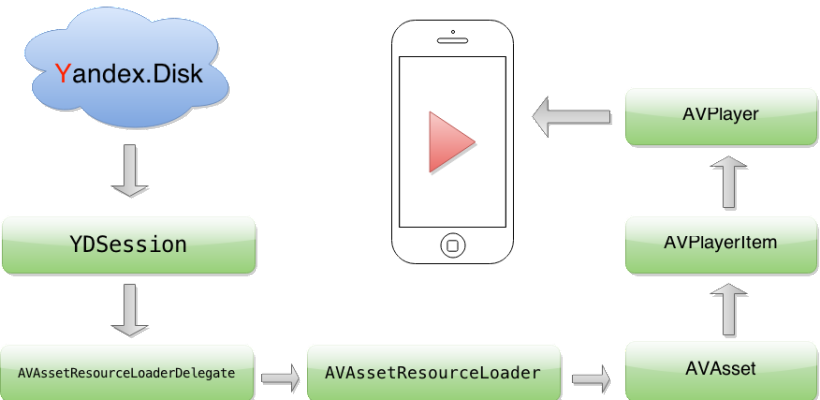

## Intro

Welcome to this tutorial where you'll learn how to harness the power of `AVAssetResourceLoaderDelegate` with a real-life example from our app, Evermusic 1.5. We recently introduced the ability to stream music from Yandex.Disk and Web Dav, in addition to Dropbox and Google Drive. If you're curious about how we implemented these services in Evermusic and how you can utilize `AVAssetResourceLoader` and `AVPlayer` in your own apps, read on.

## Understanding AVPlayer and Resource Loading

`AVPlayer` is a versatile tool for playing audio files from both local storage and remote hosts. To stream audio from a cloud service, you'd typically need a direct URL to the file and initialize `AVPlayer` with that URL. This method works for many cloud services like Dropbox, Box, and Google Drive. However, it falls short when playing audio from Yandex.Disk and Web Dav due to the authorization header required for GET requests. Unfortunately, `AVPlayer` doesn't offer a direct way to handle this.

So, we explored a solution and stumbled upon the `resourceLoader` object in `AVURLAsset`. This nifty API allows controlled access to remote files for `AVPlayer`, acting like a local HTTP proxy without the complexity.

The key insight here is that `AVPlayer` leverages `resourceLoader` when it doesn't know how to load a resource. We trick `AVPlayer` by changing the protocol, forcing it to delegate resource loading to our app. To achieve this, you'll need to implement two `AVAssetResourceLoaderDelegate` methods:

1. `resourceLoader:shouldWaitForLoadingOfRequestedResource:` — called when assistance is required to load a resource. Save `AVAssetResourceLoadingRequest` and start data loading operations.
2. `resourceLoader:didCancelLoadingRequest:` — called when a request is canceled or superseded.

## Creating Your Custom AVPlayer

Now, let's create a custom AVPlayer using a different scheme:

```objc
NSURL *url = [NSURL URLWithString:@"customscheme://host/audio.mp3"];
AVURLAsset *asset = [AVURLAsset URLAssetWithURL:url options:nil];
[asset.resourceLoader setDelegate:self queue:dispatch_get_main_queue()];
AVPlayerItem *item = [AVPlayerItem playerItemWithAsset:asset];
[self addObserversForPlayerItem:item];
self.player = [AVPlayer playerWithPlayerItem:item];
[self addObserversForPlayer];
```

These lines define a custom URL with your scheme, set up an AVURLAsset with a delegate on the main queue, create an AVPlayerItem from the asset, and finally, initialize an AVPlayer.

## Custom Resource Loader

Next, create a custom class, such as LSFilePlayerResourceLoader, responsible for loading data from the server and passing it back to AVURLAsset. This class should have two parameters in its init method: the requested file URL and an object (e.g., YDSession) responsible for fetching data from the cloud server.

You'll store LSFilePlayerResourceLoader objects in a dictionary, using the resource URL as the key. The AVAssetResourceLoaderDelegate implementation will look like this:

Create a class `LSFilePlayerResourceLoader` to handle data loading from the server and forward it to `AVURLAsset`.

```objc
- (BOOL)resourceLoader:(AVAssetResourceLoader *)resourceLoader shouldWaitForLoadingOfRequestedResource:(AVAssetResourceLoadingRequest *)loadingRequest {
    NSURL *resourceURL = [loadingRequest.request URL];
    if ([resourceURL.scheme isEqualToString:@"customscheme"]) {
        LSFilePlayerResourceLoader *loader = 
        [self resourceLoaderForRequest:loadingRequest];
        if (!loader) {
            loader = [[LSFilePlayerResourceLoader alloc] initWithResourceURL:resourceURL session:self.session];
            loader.delegate = self;
            [self.resourceLoaders setObject:loader forKey:[self keyForResourceLoaderWithURL:resourceURL]];
        }
        [loader addRequest:loadingRequest];
        return YES;
    }
    return NO;
}

- (void)resourceLoader:(AVAssetResourceLoader *)resourceLoader didCancelLoadingRequest:(AVAssetResourceLoadingRequest *)loadingRequest {
    LSFilePlayerResourceLoader *loader = [self resourceLoaderForRequest:loadingRequest];
    [loader removeRequest:loadingRequest];
}
```

These methods check the resourceURL scheme, get or create an LSFilePlayerResourceLoader, and add the loading request to the loader. If the scheme is not recognized, it returns NO.

## LSFilePlayerResourceLoader Interface

```objc
@interface LSFilePlayerResourceLoader : NSObject

@property (nonatomic, readonly, strong) NSURL *resourceURL;
@property (nonatomic, readonly) NSArray *requests;
@property (nonatomic, readonly, strong) YDSession *session;
@property (nonatomic, readonly, assign) BOOL isCancelled;
@property (nonatomic, weak) id<LSFilePlayerResourceLoaderDelegate> delegate;

- (instancetype)initWithResourceURL:(NSURL *)url session:(YDSession *)session;
- (void)addRequest:(AVAssetResourceLoadingRequest *)loadingRequest;
- (void)removeRequest:(AVAssetResourceLoadingRequest *)loadingRequest;
- (void)cancel;

@end

@protocol LSFilePlayerResourceLoaderDelegate <NSObject>

@optional
- (void)filePlayerResourceLoader:(LSFilePlayerResourceLoader *)resourceLoader didFailWithError:(NSError *)error;
- (void)filePlayerResourceLoader:(LSFilePlayerResourceLoader *)resourceLoader didLoadResource:(NSURL *)resourceURL;

@end
```

This interface provides methods for managing requests in the loader queue and defines delegate methods for handling resource loading status.

## Data Loading Operations

Now, when you add a loading request to the queue, it's saved in the pendingRequests array, and a data loading operation starts. This operation involves two steps: contentInfoOperation and dataOperation.

- **contentInfoOperation**: identifies content length, type, and range support.
- **dataOperation**: loads file data using `requestedOffset` from the request.

## Caching Strategy

Downloaded data is cached on disk using a temporary file. When requested, it's read from cache to fulfill future requests.

## Processing Requests

`processPendingRequests` handles filling `contentInformationRequest` and delivering cached data. Completed requests are removed from the queue.

## Final Thoughts

This should give you a solid foundation for implementing `AVAssetResourceLoaderDelegate` with your app, specifically for streaming audio from cloud services that require custom handling of authorization headers.

Please note that this is a complex and detailed topic, and this tutorial provides a high-level overview. The source code mentioned in the tutorial is available on [GitHub](http://github.com/leshkoapps/AVAssetResourceLoader) for further reference and exploration. 