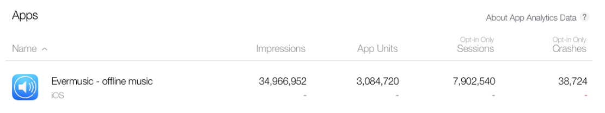

## A Major Milestone

We’re thrilled to announce that **Evermusic** has officially reached **3 million downloads worldwide**! 🎉

Every day, thousands of users rely on Evermusic to stream music from the cloud, manage audio files, and enjoy music offline. This milestone is a testament to your support, feedback, and dedication.

## A Big Thank You to Our Users

We wouldn’t be here without you — our incredible community! You’ve helped shape Evermusic into what it is today through:

- Bug reports
- Feature requests
- Real-world feedback

Nearly every major update has included features or improvements suggested by our users. From small tweaks to major capabilities, **you’ve helped us build a better app.**

## Why Millions Choose Evermusic

Evermusic is a full-featured cloud and offline music player for iOS and macOS that works across devices. Here’s why users around the world love it:

## Personal Cloud Streaming

**Create your own cloud music service.** Connect all your storage sources:

- Dropbox, Google Drive, OneDrive, Box, MEGA
- Yandex.Disk, MyDrive, pCloud, HiDrive
- SMB file shares, WebDAV servers
- External Wi-Fi drives or SD cards via Lightning reader

Stream or download music anytime — no need to store everything on your device.

## Audiobook and Music Player in One

- Save playback position automatically
- Add multiple **bookmarks**
- Control **playback speed** (0.5x to 2.0x)
- Use **sleep timers** (1 min – 24 hrs)
- Enjoy **repeat stop** playback
- Cast to **Chromecast** or **Apple TV**

## Download and Listen Offline

Download your music from cloud or local storage for offline use with:

- One-tap album or artist download
- Parallel download threads (up to 20 connections)
- Advanced cache and resume features

## 10-Band Equalizer + Presets

Fine-tune your audio using:

- 10-band EQ
- Custom and preset profiles
- Preamplifier gain control (0 to 2.0)

## Powerful File Manager

Evermusic lets you manage your entire audio file collection:

- Rename, move, delete, upload, and download files
- Organize folders inside any connected cloud storage
- Use the **Open In** feature for sharing files with other apps

## Built-In ID3 Tag Editor

Fix corrupted metadata or missing info with the built-in tag editor:

- Edit or auto-complete artist, album, genre, year
- Auto-fetch album covers
- Auto-detect and fix broken encoding

## Extend Storage with SD Cards

Don’t want to store files on your iPhone or iPad?

- Use external **Lightning SD/microSD readers**
- Store music on the card while streaming via the Evermusic app
- Free up device space for other apps and media

## Download the App

Evermusic is free on the App Store with optional premium features.

👉 [Download Evermusic](https://itunes.apple.com/us/app/evermusic-offline-music-player-cloud-streamer/id885367198?ls=1&mt=8)

## Final Thoughts

With a blend of **cloud integration**, **offline listening**, **audiobook features**, and **playlist control**, Evermusic helps you build your perfect personal music streaming platform.

Whether you're listening at home, on the go, or offline, Evermusic offers power and flexibility unmatched by most iOS music players.