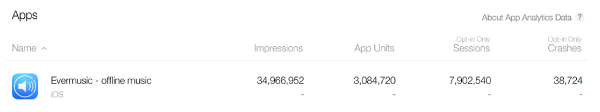



## 3 Million Downloads

**Evermusic** has reached **3 million downloads worldwide**. Thousands of users rely on it daily to stream music from cloud storage, manage audio files, and listen offline on iOS and macOS.

**TL;DR:** Evermusic is a cloud-connected music and audiobook player for iPhone, iPad, and Mac. It streams from Google Drive, Dropbox, OneDrive, NAS, and more. Features include offline downloads, a 10-band equalizer, ID3 tag editing, a file manager, and audiobook playback with bookmarks.

## Thank You to Our Users

User feedback has shaped nearly every major update. Bug reports, feature requests, and real-world testing have driven improvements from small UI tweaks to major new capabilities.

## Key Features That Set Evermusic Apart

### Personal Cloud Streaming

Build your own cloud music service by connecting all your storage sources:

- Dropbox, Google Drive, OneDrive, Box, MEGA
- Yandex.Disk, MyDrive, pCloud, HiDrive
- SMB file shares, WebDAV servers
- External Wi-Fi drives or SD cards via Lightning reader

Stream or download music anytime without storing everything on your device.

### Audiobook Player with Bookmarks

Evermusic doubles as an audiobook player with features designed for long-form listening:

- Automatic playback position saving
- Multiple **bookmarks** per file
- **Playback speed** control (0.5x to 2.0x)
- **Sleep timers** (1 min to 24 hrs)
- **Repeat stop** playback mode
- Casting to **Chromecast** or **Apple TV**

### Offline Downloads

Download music from cloud or local storage for offline use:

- One-tap album or artist download
- Up to 20 parallel download connections
- Advanced cache and resume support

### 10-Band Equalizer with Presets

Fine-tune your audio output:

- 10-band EQ with visual controls
- Custom and preset profiles
- Preamplifier gain control (0 to 2.0)

### Built-In File Manager

Manage your entire audio collection directly in the app:

- Rename, move, delete, upload, and download files
- Organize folders inside any connected cloud storage
- Share files with other apps using **Open In**

### ID3 Tag Editor

Fix metadata issues without leaving the app:

- Edit or auto-complete artist, album, genre, and year
- Auto-fetch album covers
- Auto-detect and fix broken text encoding

### External Storage via SD Cards

Free up device space by storing music externally:

- Use **Lightning SD/microSD readers** to access music on cards
- Stream directly from the card through Evermusic
- Keep your iPhone or iPad storage available for other content

## Download Evermusic

Evermusic is free on the App Store with optional premium features.

[Download Evermusic](https://itunes.apple.com/us/app/evermusic-offline-music-player-cloud-streamer/id885367198?ls=1&mt=8)

## Frequently Asked Questions

{}
Yes. Evermusic is free to download with core features available at no cost. Premium features like the equalizer and advanced cloud options are available through an optional upgrade.
{}

{}
Yes. Evermusic saves your playback position, supports bookmarks, adjustable playback speed (0.5x to 2.0x), and sleep timers — making it suitable for audiobooks and podcasts.
{}

{}
Dropbox, Google Drive, OneDrive, Box, MEGA, Yandex.Disk, MyDrive, pCloud, HiDrive, SMB file shares, and WebDAV servers.
{}

{}
Yes. Connect a Lightning or USB-C SD card reader to your iPhone or iPad and stream music directly from the card through Evermusic.
{}

{}
Yes. Evermusic is available for both iOS and macOS, with cloud streaming and offline playback on all platforms.
{}