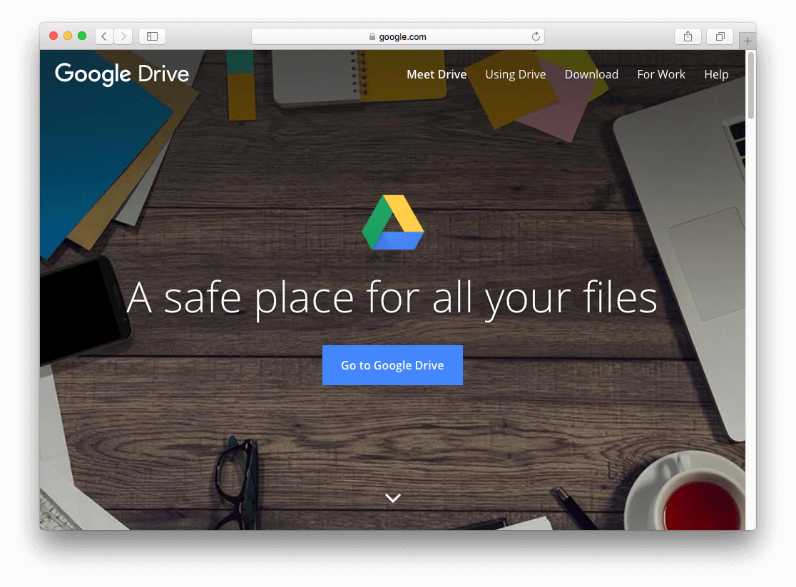

Is your iPhone storage constantly full because of your massive music collection? If your music library takes up 50GB and your iPhone only has 32GB of space, Evermusic has the perfect solution. With Evermusic, you can stream your music directly from cloud storage and free up valuable space on your device.

## Offline Listening, No Internet Required

Evermusic offers powerful offline functionality. Download your favorite albums, tracks, genres, artists, and playlists directly to your device. You can enjoy your music without needing an internet connection, whether you're traveling, commuting, or simply offline.

## Seamless Music Playback

Thanks to advanced buffering techniques, Evermusic provides fast track switching and continuous playback. Your experience is smooth whether you’re listening online or offline.

## No More iTunes Syncing

Forget the outdated iTunes sync process. Upload your audio files directly to your preferred cloud storage from your Mac or PC, and play them instantly with Evermusic.

## How to Play Music from Google Drive on Your iPhone

Even if you haven’t signed up for a cloud service yet, it’s easy to get started. Once you create a Google Drive (or other) account, follow these steps:

### 1. Connect Your Cloud Account

Evermusic supports major cloud services including Google Drive, Dropbox, Box, OneDrive, MediaFire, MEGA, Yandex.Disk, pCloud, HiDrive, MyDrive, SMB, and WebDAV.

### 2. Install the Cloud App on Your Computer

Download and install the appropriate cloud storage client on your Mac or PC.

### 3. Upload Your Music Files

Using the cloud app or web interface, upload your audio files to your cloud storage account.

### 4. Open Evermusic and Add Your Cloud Service

Launch the Evermusic app on your iPhone or iPad.

Go to the "Connections" tab and select "Connect a cloud service."

Log in to your cloud service. Evermusic only uses your credentials for connection and never accesses your files without permission.

### 5. Start Playing Your Music

Browse your connected cloud account, open a music folder, and tap on a file to play.

