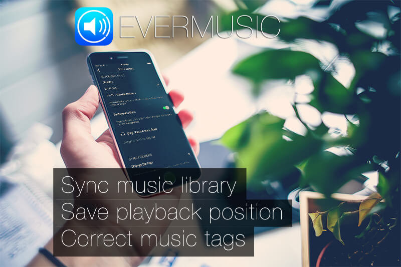
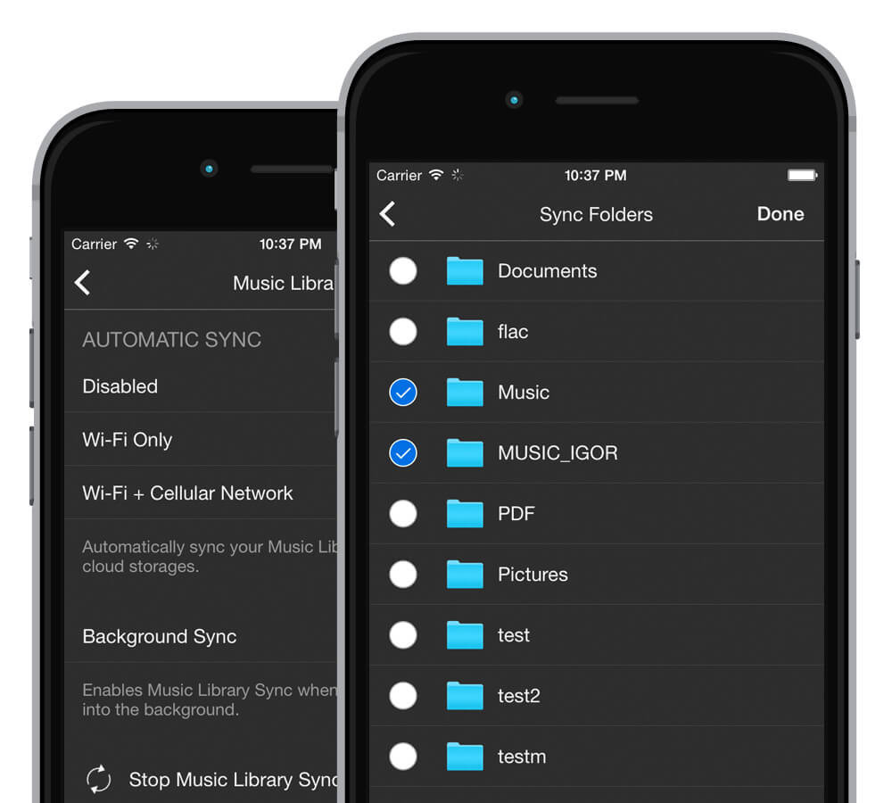
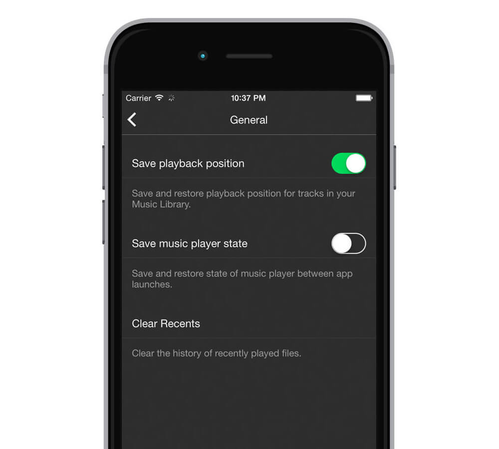
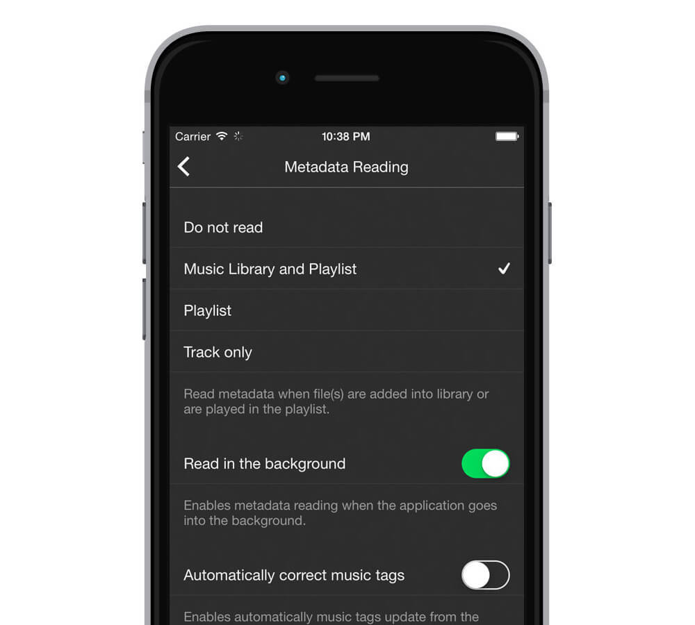
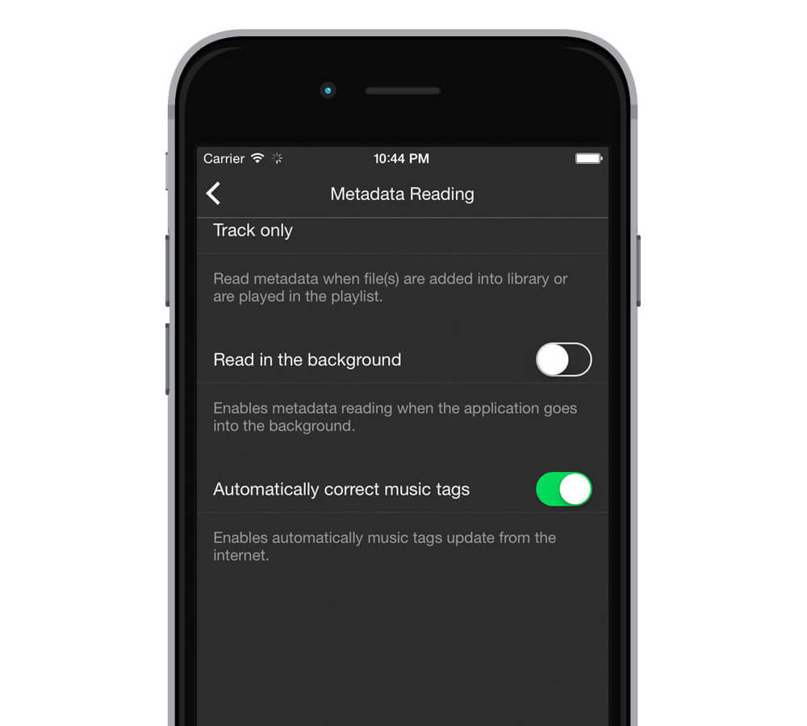



## What Evermusic 2.3 Brings to Your Music Library

**TL;DR:** Evermusic 2.3 introduces automatic cloud folder sync, playback position saving (ideal for audiobooks), background metadata reading, and automatic ID3 tag correction. Works with Dropbox, Google Drive, OneDrive, MEGA, WebDAV, and SMB.

Evermusic is a cloud music player for iOS and macOS that lets you stream or download audio from Dropbox, Google Drive, OneDrive, MEGA, WebDAV, and SMB servers. Version 2.3 adds four features that users have been requesting. If you have not tried Evermusic yet, [download it from the App Store](https://apps.apple.com/us/app/evermusic-cloud-music-player/id885367198).

## Automatic Music Library Sync

No more manual folder scanning. Evermusic 2.3 monitors your selected cloud folders and updates your music library automatically when files change. Set up the folders you want to track and the app handles the rest in the background.

This means:

- New uploads appear in your library without manual refresh
- Deleted files are removed from your library automatically
- Changes sync whether the app is in the foreground or background

## Save Playback Position for Audiobooks and Podcasts

Pause an audiobook or lecture and pick up exactly where you left off. When enabled, Evermusic remembers the playback position for each file automatically — no manual bookmarks needed.

Best for:

- Audiobooks
- Lectures and courses
- Podcasts
- Long-form recordings

Enable this in the app's audio settings.

## Background Metadata Reading

For large music collections, metadata reading now runs in the background. While you browse or listen, Evermusic scans your audio files and organizes them by Artist, Album, and Genre. This speeds up library browsing significantly for collections with thousands of tracks.

## Automatic ID3 Tag Correction

Evermusic detects and corrects invalid or incomplete ID3 tags using online databases. Files with messy, missing, or incorrect metadata get cleaned up automatically, keeping your library organized without manual editing.

---

[Download Evermusic](https://apps.apple.com/us/app/evermusic-cloud-music-player/id885367198) and try these features today.

## Frequently Asked Questions

{}
Yes. Automatic sync works with Dropbox, Google Drive, OneDrive, MEGA, WebDAV, and SMB. Select the folders you want monitored and Evermusic keeps your library current.
{}

{}
Yes. Enable playback position saving in audio settings. Evermusic remembers where you stopped for each file, so you can resume without manual bookmarks.
{}

{}
Evermusic reads ID3 tags and file metadata in the background while you use other features. It organizes your library by Artist, Album, and Genre automatically.
{}

{}
Yes. The automatic tag correction feature checks your files against online databases and fixes invalid, incomplete, or missing ID3 metadata.
{}

{}
Evermusic is free to download with optional premium features available via in-app purchase.
{}
