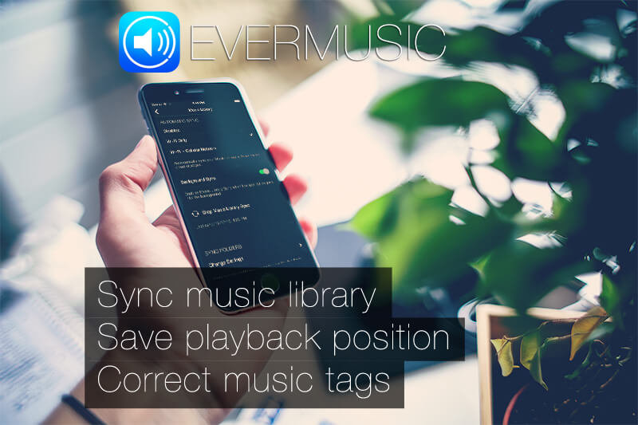
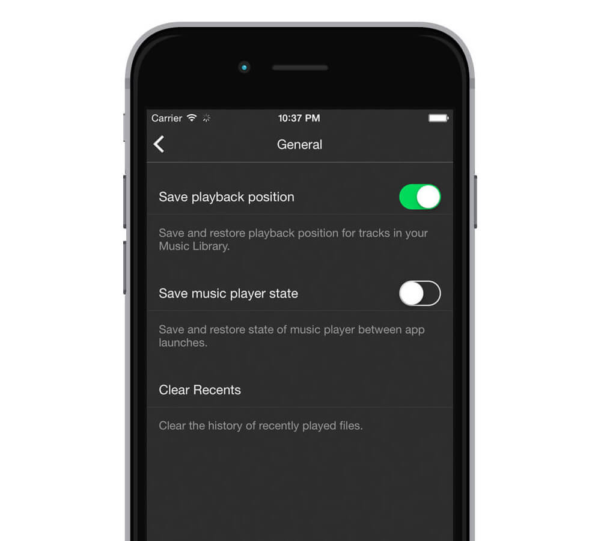

## Experience Evermusic's Massive Update – The Ultimate Cloud Music Player

Evermusic 2.3 is here, bringing a powerful new set of features designed to enhance your experience with the most versatile cloud music player for iOS and macOS. Whether you store your music on Dropbox, Google Drive, OneDrive, MEGA, WebDAV, or SMB, Evermusic lets you stream or download audio effortlessly. If you haven't tried Evermusic yet, you can [download it from the App Store](https://apps.apple.com/us/app/evermusic-cloud-music-player/id885367198).

Let’s explore what’s new in this release.

## Automatic Sync – Your Music, Your Way

This highly requested feature is now a reality. With automatic sync, you no longer need to manually scan folders every time your cloud content changes. Evermusic will track changes to selected folders and keep your Music Library updated in the background. Simply choose which folders to monitor and let Evermusic do the rest.

## Save Playback Position – Perfect for Audiobooks and Lectures

Now you can pause your audio and pick up right where you left off—automatically. This new option is ideal for audiobooks, lectures, podcasts, or long-form music. Enable it in the app’s audio settings to make Evermusic remember your media position without the need to create bookmarks manually.

## Read Metadata in the Background – Keep Your Library Organized

If you’ve got a large music collection, background metadata reading is a huge time-saver. While you use other features or let Evermusic run in the background, the app reads your audio file metadata to sort your music by Artist, Album, and Genre faster than ever before.

## Correct Audio Tags – Keep Your Music Tidy

Evermusic now helps keep your metadata clean and accurate. It automatically detects and corrects invalid tags using online databases. This ensures that your library remains consistent and organized, even if your files have incomplete or messy ID3 tags.

## Final Thoughts

This update reinforces Evermusic's mission to be the smartest and most flexible music player on iOS. With improved syncing, seamless playback memory, smarter metadata processing, and a built-in tag editor, Evermusic 2.3 is the essential upgrade for any music lover.

Update today and experience it yourself.