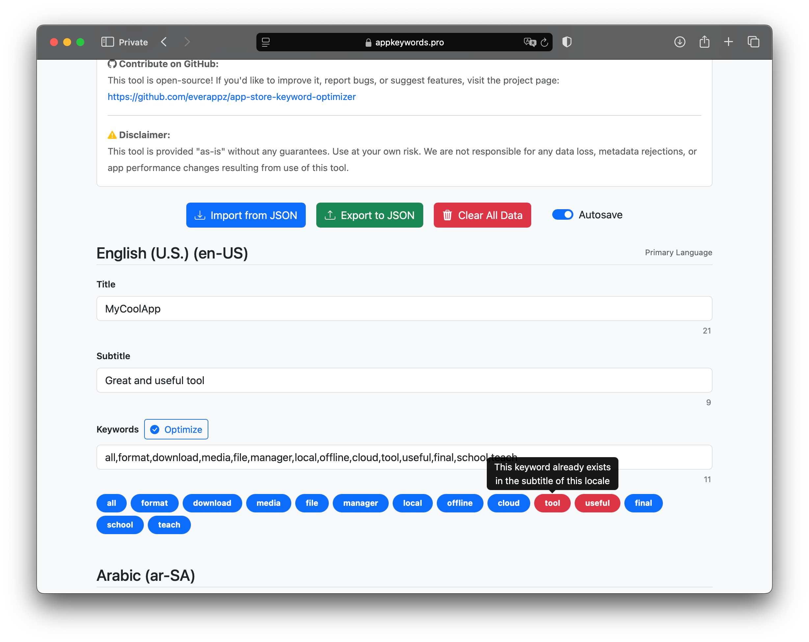

## Why Keyword Optimization is Critical for App Success

Every word in your App Store title, subtitle, and keyword field affects your search ranking. Optimized metadata means:

- Better visibility for your app
- More organic downloads
- Broader audience reach
- Improved ranking in multiple locales

But managing metadata manually — especially across several languages — can be a hassle. That’s where the [App Store Keyword Optimization Tool](https://appkeywords.pro) comes in.

## What Is the Free App Store Keyword Optimization Tool?

[AppKeywords.pro](https://appkeywords.pro) is a lightweight, browser-based tool built for indie developers, marketers, and teams. It lets you create and validate App Store metadata quickly — no signup, no tracking, no backend.

### Highlights:

- No login or data collection — 100% local in-browser
- Title, subtitle, and keyword fields with real-time character limits
- Instant keyword optimization and cleanup
- Duplicate detection and keyword bubble UI
- Autosaves your progress automatically in the browser
- Import/export JSON support for Fastlane workflows



## Step-by-Step: How to Use It

### 1. Enter Your Metadata

Each locale includes fields for:

- App **Title** (30 characters max)
- **Subtitle** (30 characters max)
- **Keywords** (100 characters max)

The character count updates live, so you never exceed Apple’s limits.

### 2. Optimize Keywords

Click the **Optimize** button to:

- Replace all spaces with commas
- Normalize international comma characters
- Trim excess commas and whitespace
- Detect duplicates from your title and subtitle
- Highlight keyword bubbles (blue = good, red = duplicated)

Click any bubble to remove the corresponding keyword.

### 3. Autosave and Local Privacy

All changes are autosaved in your browser (localStorage). No content is sent to a server. This means:

- No account required
- You can safely close the tab and continue later
- Fully private — your data never leaves your device

### 4. Import/Export JSON Metadata

Use the **Import** button to load a previously saved `.json` file.

Use **Export** to save your current metadata setup for future reuse or CI/CD integration.

### 5. Fastlane Script Integration

Inside the tool's GitHub repo, there are two helpful Bash scripts to support Fastlane:

```bash
meta_to_json_dict.sh       # Converts Fastlane metadata into JSON
json_dict_to_meta.sh       # Converts JSON back into Fastlane folders
```

These scripts help bridge the gap between your Fastlane setup and this optimization tool — making it easier to sync localized metadata during app deployment.

## ASO Tips for Better Rankings

- Use **unique, intent-based keywords** (avoid generic words like "app", "mobile", etc.)
- Don’t duplicate keywords across title, subtitle, and keywords
- Use **all 100 characters** in the keywords field
- Localize metadata for **every major market**
- Refresh keywords quarterly based on analytics and seasonality

## Conclusion

App Store Optimization doesn't have to be painful. With smart planning, clean metadata, and the right tools — like [appkeywords.pro](https://appkeywords.pro) — you can dramatically increase your app’s visibility and organic downloads.

Start optimizing smarter today. Your next user is one search away.

## Contribute to the Project

If you're passionate about improving ASO workflows or have ideas to enhance this tool, we'd love your input. Whether it's bug fixes, feature suggestions, or language improvements — your pull requests are welcome!


  


