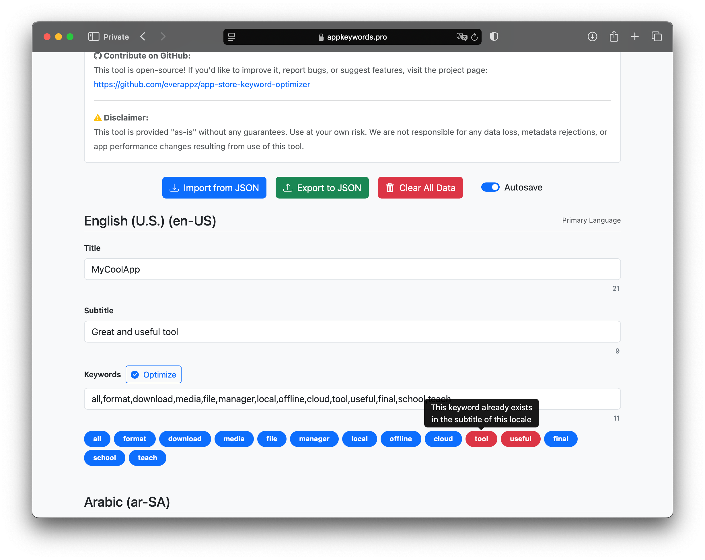

## Why App Store Keywords Determine Your Download Numbers

**TL;DR:** Every character in your App Store title, subtitle, and keyword field affects search ranking. This guide covers the rules for optimizing each field and introduces [AppKeywords.pro](https://appkeywords.pro) — a free, private, browser-based tool that validates metadata, detects duplicates, and exports JSON for Fastlane workflows.

Optimized metadata leads to:

- Higher search visibility
- More organic downloads
- Broader reach across locales
- Better ranking without paid ads

Managing this manually across multiple languages is tedious and error-prone. The [App Store Keyword Optimization Tool](https://appkeywords.pro) solves that.

## What Is AppKeywords.pro?

[AppKeywords.pro](https://appkeywords.pro) is a free, lightweight ASO tool that runs entirely in your browser. No signup, no tracking, no server-side processing.

### Key Features

- **100% local** — no login, no data collection, everything stays in your browser
- **Real-time character counts** for title (30 chars), subtitle (30 chars), and keywords (100 chars)
- **One-click optimization** — normalizes commas, trims whitespace, removes duplicates
- **Visual keyword bubbles** — blue for unique keywords, red for duplicates
- **Autosave** via localStorage — close the tab and resume later
- **JSON import/export** for Fastlane CI/CD integration



## How to Optimize Your App Store Metadata (Step by Step)

### 1. Enter Your Title, Subtitle, and Keywords

Each locale has three fields with Apple's character limits enforced in real time:

- **Title** — 30 characters max
- **Subtitle** — 30 characters max
- **Keywords** — 100 characters max

### 2. Run the Optimizer

Click **Optimize** to automatically:

- Replace spaces with commas
- Normalize international comma characters
- Trim excess commas and whitespace
- Detect keywords already present in your title or subtitle
- Display keyword bubbles (click any bubble to remove it)

### 3. Trust the Autosave

All changes persist in your browser's localStorage. No account needed, no data sent to any server. Close and reopen the tab — your work is still there.

### 4. Import and Export JSON

- **Import** a previously saved `.json` file to continue editing
- **Export** your metadata for backup or CI/CD pipelines

### 5. Integrate with Fastlane

The tool's GitHub repo includes two Bash scripts:

```bash
meta_to_json_dict.sh       # Converts Fastlane metadata into JSON
json_dict_to_meta.sh       # Converts JSON back into Fastlane folders
```

These scripts let you round-trip metadata between Fastlane's folder structure and the optimization tool during app deployment.

## ASO Best Practices for Higher Rankings

- **Use intent-based keywords** — avoid generic words like "app" or "mobile"
- **Never duplicate keywords** across title, subtitle, and keyword field (Apple ignores duplicates)
- **Fill all 100 characters** in the keywords field
- **Localize metadata** for every major market you target
- **Refresh keywords quarterly** based on search analytics and seasonal trends
- **Separate keywords with commas, no spaces** to maximize character usage

## Get Started

App Store Optimization does not require expensive tools. With smart planning and [AppKeywords.pro](https://appkeywords.pro), you can improve your app's visibility and organic downloads in minutes.

Try it now — your next user is one search away.

## Contribute to the Project

The tool is open source. Bug reports, feature suggestions, and pull requests are welcome.


  


---

## Frequently Asked Questions

{}
Yes. It is a fully open-source, browser-based tool with no signup, no ads, and no data collection. Your metadata never leaves your device.
{}

{}
Yes. You can add metadata for each locale independently, and the export includes all languages in a single JSON file compatible with Fastlane.
{}

{}
No. Apple already indexes words from your title and subtitle. Repeating them in the keyword field wastes characters.
{}

{}
Review and refresh your keywords at least once per quarter. Adjust sooner if you notice ranking drops or seasonal shifts in search behavior.
{}

{}
Yes. The GitHub repo includes shell scripts to convert between Fastlane's metadata folder structure and the JSON format used by AppKeywords.pro.
{}
