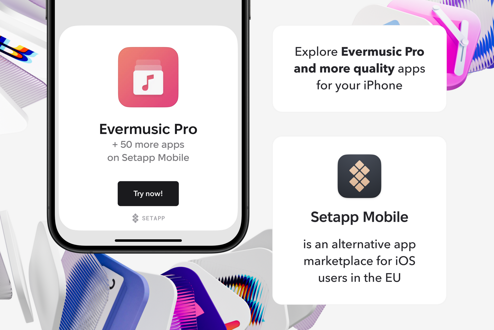

## Introduction

The mobile app ecosystem continues to evolve rapidly, offering more tools than ever to manage productivity, creativity, and entertainment. One of the most exciting developments is the launch of **[Setapp Mobile](https://go.setapp.com/stp435?_target=https://www.setapp.com/setapp-mobile&stc=mobile)** — a subscription platform bringing curated iOS apps to your iPhone and iPad.

Among the standout integrations is **Evermusic Pro**, a feature-rich cloud music player that transforms how you manage and enjoy your music library.

In this post, we'll explore how this integration empowers users to unlock a new level of convenience and functionality.

## What Is Setapp Mobile?

Setapp is a subscription service that provides unlimited access to over 240 premium Mac and iOS apps under a single plan. Instead of paying for individual apps or navigating in-app purchases, you get the full versions of powerful tools bundled together.

Setapp Mobile brings this same model to iPhone and iPad, including categories like productivity, security, creativity — and now, audio.

## Evermusic Pro: A Powerful Music Manager

Evermusic Pro is more than just a music player. It’s a full-featured tool that allows you to:

- Stream music directly from **cloud storage services** like Google Drive, Dropbox, OneDrive, iCloud, WebDAV, and NAS
- Download files for **offline listening**
- Edit **metadata and ID3 tags**
- Customize your playback with a **10-band equalizer and bass booster**
- Organize and sort your music library
- Support various formats including FLAC, MP3, AAC, WAV, ALAC, and OPUS

With a clean interface and support for both casual and advanced users, Evermusic Pro is built for flexibility and control.

## How the Setapp Integration Benefits You

By offering Evermusic Pro through Setapp Mobile, you gain:

### Unified Access With No In-App Purchases

Evermusic Pro is included in the Setapp Mobile subscription — no extra charges or hidden upgrade costs. It’s the full premium version, available instantly as part of your app suite.

### Streamlined Cloud Library Management

Connect all your favorite cloud services to a single app. With Evermusic Pro, you can access tracks from multiple providers without switching between apps.

### True Offline Listening

Perfect for flights, remote areas, or reducing mobile data usage — download albums, artists, or entire playlists for offline use.

### High-Quality Audio Control

The built-in equalizer and bass booster give audiophiles control over how music is rendered, enhancing both low and high frequencies.

### NAS and External Storage Access

Evermusic supports external sources like **NAS, SMB**, or **WebDAV servers**, giving you remote access to personal storage setups.

## Why It’s a Game Changer

The combination of Setapp and Evermusic Pro delivers:

- **Predictable Pricing**: One flat fee for dozens of apps, including a powerful music player.
- **All-in-One Music Hub**: Stream, download, and organize all your music across clouds and devices.
- **Audiophile Features**: Full format support, equalizer tuning, tag editing, and local/network access.

Whether you’re managing a massive FLAC library or looking for a simple streaming app that doesn’t eat up your storage, this setup is built for you.

## Conclusion

If you’re an iOS user looking for a cloud-friendly, fully-featured music player, the **Evermusic Pro + Setapp Mobile** integration offers incredible value. It combines convenience, power, and flexibility under one subscription — no ads, no gimmicks, just great music tools.

Explore Evermusic Pro through Setapp and elevate your music library today.


  
