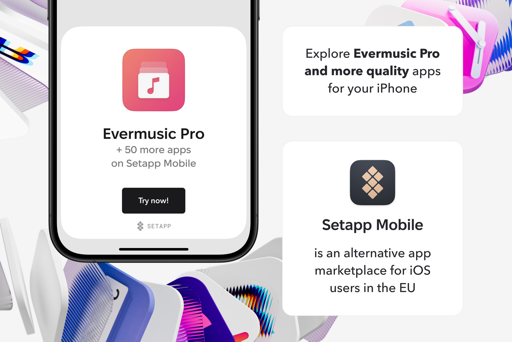

**TL;DR:** Evermusic Pro is available through Setapp Mobile, giving you a full-featured cloud music player for iPhone and iPad at no extra cost. Stream from Google Drive, Dropbox, OneDrive, NAS, and more. Download for offline listening. Fine-tune audio with a 10-band equalizer. All included in one Setapp subscription.

## What Is Setapp Mobile?

**[Setapp Mobile](https://go.setapp.com/stp435?_target=https://www.setapp.com/setapp-mobile&stc=mobile)** is a subscription service that provides access to over 240 premium Mac and iOS apps under a single plan. Instead of paying for individual apps or dealing with in-app purchases, you get full versions of curated tools bundled together.

Setapp Mobile brings this model to iPhone and iPad, covering productivity, security, creativity, and audio apps.

## What Evermusic Pro Offers

Evermusic Pro is a cloud-connected music player and file manager for iOS. Key features include:

- **Cloud streaming** from Google Drive, Dropbox, OneDrive, iCloud, WebDAV, and NAS
- **Offline downloads** for listening without internet
- **ID3 tag editing** to fix metadata and album art
- **10-band equalizer with bass booster** for precise audio control
- **Library organization** by album, artist, genre, and folder
- **Format support** for FLAC, MP3, AAC, WAV, ALAC, and OPUS

The app serves both casual listeners and audiophiles who want full control over their music.

## Benefits of Getting Evermusic Pro Through Setapp

### No In-App Purchases

Evermusic Pro is included in the Setapp Mobile subscription. You get the full premium version instantly, with no hidden costs.

### One App for All Your Cloud Music

Connect Google Drive, Dropbox, OneDrive, and other services in a single player. Access tracks from multiple providers without switching apps.

### Offline Listening Anywhere

Download albums, artists, or playlists for offline use. Ideal for flights, commutes, or areas with poor connectivity.

### Audiophile-Grade Playback

The built-in 10-band equalizer and bass booster let you shape audio output to match your headphones or speakers.

### NAS and Network Storage Access

Connect to **NAS, SMB shares**, and **WebDAV servers** to stream from your personal storage remotely.

## Why This Combination Works

- **One subscription, many apps**: Evermusic Pro plus dozens of other premium tools for a flat fee
- **All-in-one music hub**: Stream, download, and organize music across cloud services and devices
- **Pro audio features**: Full format support, EQ tuning, tag editing, and network storage access

Whether you manage a large FLAC library or need a simple cloud streaming app that saves device storage, Evermusic Pro on Setapp covers both.

Ready to try it? Get Evermusic Pro through Setapp Mobile and start streaming your cloud music library today.


  


## Frequently Asked Questions

{}
Yes. Evermusic Pro is included in the Setapp Mobile subscription at no additional cost. You get the full premium version with all features unlocked.
{}

{}
Evermusic Pro connects to Google Drive, Dropbox, OneDrive, iCloud, Box, MEGA, Yandex.Disk, pCloud, HiDrive, and WebDAV servers. It also supports SMB file shares and NAS devices.
{}

{}
Yes. You can download individual tracks, albums, artists, or entire playlists for offline playback directly within the app.
{}

{}
Evermusic Pro supports FLAC, MP3, AAC, WAV, ALAC, AIFF, OPUS, OGG, and many other formats. It handles both lossless and lossy audio files.
{}

{}
Setapp Mobile is available as part of the Setapp subscription plan that includes iOS apps. Check the Setapp website for current pricing and plan options.
{}