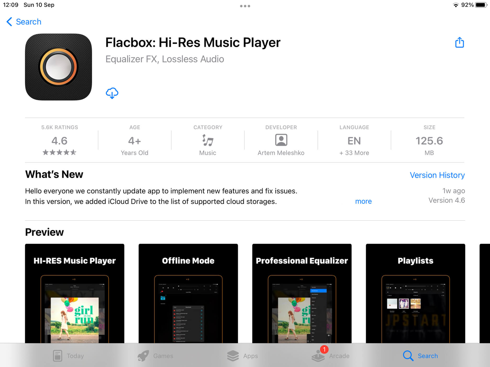
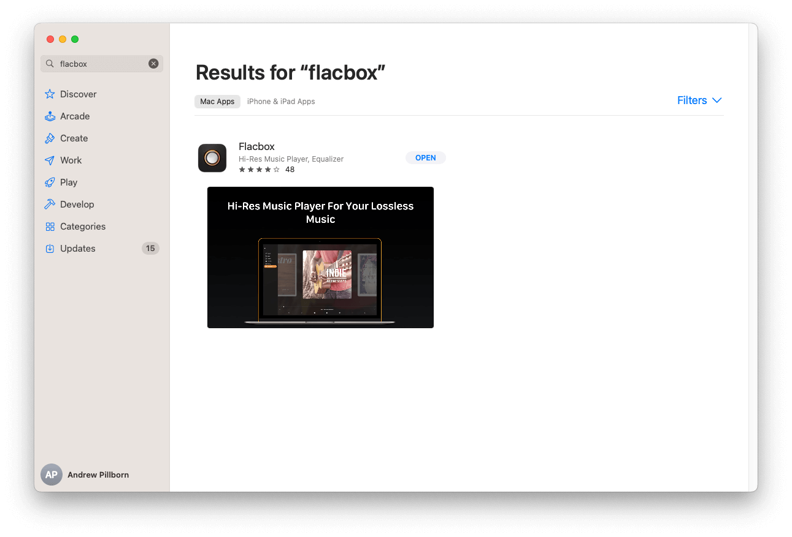
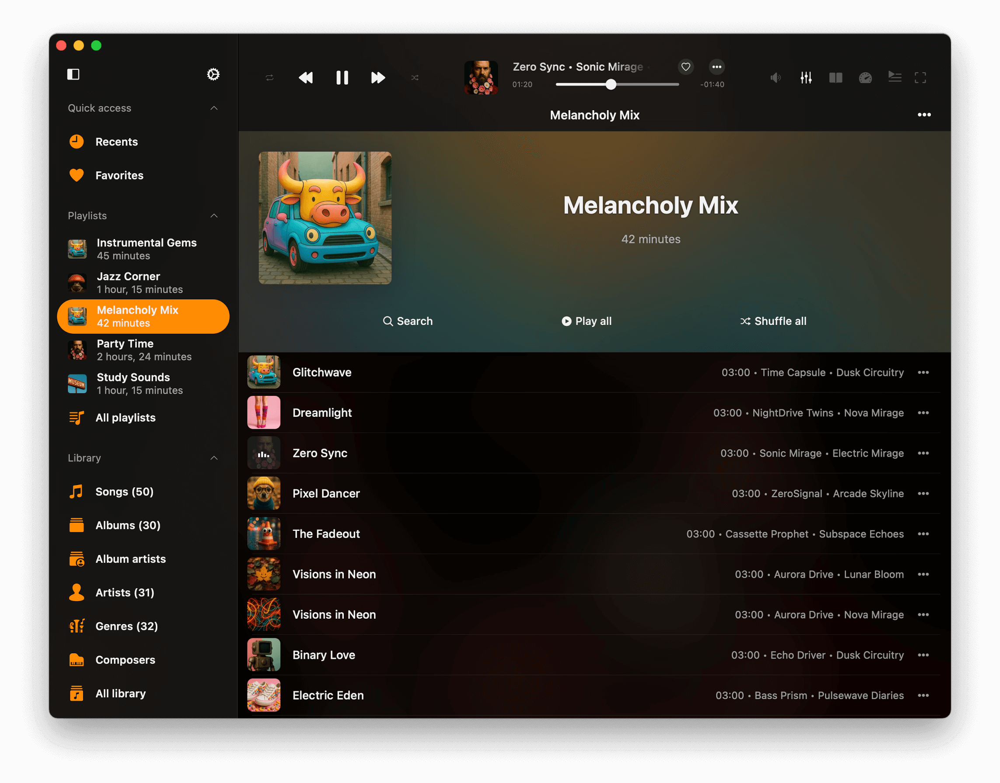

You can play lossless FLAC music on iPhone by installing Flacbox from the App Store and importing your audio files through iTunes File Sharing, Wi-Fi Drive, or a connected cloud service. Flacbox decodes FLAC and other lossless formats natively, delivering full studio-quality playback without any conversion step.

With over 1 million downloads and a 4.6-star rating on the App Store, Flacbox has established itself as one of the most trusted audio players in the Apple ecosystem. It supports more than 120 audio formats, giving listeners the freedom to enjoy virtually any music file they own. Whether you are a dedicated audiophile building a high-resolution library or a casual listener who simply wants better sound, Flacbox bridges the gap between professional audio fidelity and everyday convenience on both iPhone and Mac.

## What Is Lossless Audio and Why Does It Matter?

Lossless audio formats preserve every detail captured during the original studio recording. Unlike lossy codecs such as MP3 and AAC, which discard portions of the audio signal to reduce file size, lossless compression retains the complete waveform so that the decoded output is bit-for-bit identical to the source. This means wider dynamic range, more accurate stereo imaging, and subtle musical textures that compressed files simply cannot reproduce. Formats like FLAC and ALAC typically deliver CD-quality resolution at 16-bit/44.1 kHz, while high-resolution variants reach 24-bit/192 kHz and beyond. DSD recordings, originally developed for Super Audio CD, use a fundamentally different encoding method that captures audio at extremely high sample rates. If you value the nuance in acoustic instruments, vocal harmonics, or orchestral depth, lossless playback is essential for hearing music the way the artist intended.

## How Do You Play FLAC Files on iPhone?

Playing FLAC files on iPhone requires a dedicated player because the built-in Music app does not support the FLAC format natively. Flacbox solves this by providing a full-featured FLAC decoder that runs directly on your device. After downloading the app from the [App Store](https://apps.apple.com/us/app/flacbox-flac-player-music/id1097564256?mt=8), you can import files through iTunes File Sharing, the built-in Wi-Fi Drive, or by linking cloud storage services such as Google Drive, Dropbox, iCloud, and WebDAV servers. Flacbox automatically scans metadata and organizes your library by album, artist, and genre. You can also connect external drives using Lightning or USB-C adapters for direct access to large collections. The app caches tracks locally for offline playback, so your lossless library travels with you even when you have no internet connection.

## What Lossless Formats Does Flacbox Support?

Flacbox supports over 120 audio formats, covering both lossless and lossy codecs across every major standard. The table below highlights the most popular formats and their capabilities within the app.

| Format | Type     | Max Resolution       | Flacbox Support |
|--------|----------|----------------------|-----------------|
| FLAC   | Lossless | 32-bit / 384 kHz     | Yes             |
| DSD    | Lossless | DSD64 / DSD128 / DSD256 | Yes          |
| ALAC   | Lossless | 32-bit / 384 kHz     | Yes             |
| APE    | Lossless | 24-bit / 192 kHz     | Yes             |
| WAV    | Lossless | 32-bit / 384 kHz     | Yes             |
| AIFF   | Lossless | 32-bit / 384 kHz     | Yes             |
| OPUS   | Lossy    | 48 kHz               | Yes             |
| MP3    | Lossy    | 320 kbps / 48 kHz    | Yes             |
| AAC    | Lossy    | 320 kbps / 96 kHz    | Yes             |
| OGG    | Lossy    | 500 kbps / 192 kHz   | Yes             |

This broad compatibility means you never need to convert files before adding them to your library. Flacbox handles DSD64, DSD128, and DSD256 natively, making it one of the few mobile players capable of true DSD playback. Whether your collection consists of vintage vinyl rips in WAV, modern hi-res downloads in FLAC, or podcast episodes in OPUS, everything plays through a single unified interface without any extra software or plugins.

## How to Get Started with Flacbox on iOS

Setting up Flacbox on iPhone or iPad takes only a few minutes. First, download the app from the App Store and launch it. The main screen presents your music library, which will populate automatically as you add files. To import music, open the sources menu and choose your preferred method: iTunes File Sharing lets you drag files from your computer through Finder, Wi-Fi Drive creates a local server you can access from any browser on the same network, and cloud integration connects directly to Google Drive, Dropbox, OneDrive, pCloud, MEGA, and other services. Once files are imported, Flacbox reads embedded tags and cover art to build a browsable library organized by album, artist, genre, and folder structure. You can create custom playlists, edit metadata with the built-in tag editor, and mark favorite tracks for quick access later.

## How to Set Up Flacbox on Mac

The macOS version of Flacbox delivers the same high-fidelity playback experience on your desktop or laptop. Download Flacbox from the Mac App Store and open it to begin building your library. You can add local folders, external drives, or network locations, and Flacbox will index all supported audio files automatically. The app also connects to cloud storage and network shares via SMB, WebDAV, and DLNA, so you can stream lossless music from a NAS or home server without copying files to your Mac. The built-in metadata editor lets you correct tags, update album artwork, and organize your collection. Playback controls include a 10-band equalizer with customizable presets, gapless playback for live albums, and support for high-resolution output through external DACs connected via USB or Thunderbolt.

## What Makes Flacbox the Best Lossless Player for Apple Devices?

Several features set Flacbox apart from other audio players in the Apple ecosystem. The 10-band equalizer provides precise tonal control, letting you shape the sound to match your headphones, speakers, or personal preference. Native DSD64, DSD128, and DSD256 decoding eliminates the need for third-party conversion tools. Cross-platform sync between iOS and macOS keeps your playlists and settings consistent across devices. The app integrates with dozens of cloud services including iCloud, pCloud, HiDrive, MEGA, and Synology servers, and it supports DLNA and SMB streaming for home network setups. With over 1 million downloads and a 4.6-star rating, Flacbox has earned its reputation through consistent updates and community trust. The offline caching system ensures fast access to downloaded tracks, while the tag editor gives you full control over your library metadata.

## How to Optimize Your Lossless Listening Experience

Getting the best sound from lossless files requires attention to your entire audio chain, not just the software. Pair Flacbox with high-quality wired headphones or a dedicated external DAC to bypass the built-in converter in your iPhone or Mac. USB-C and Lightning DAC adapters are widely available and can significantly improve output quality. Within the app, use the 10-band equalizer to fine-tune the frequency response for your specific headphones or speakers. Keep your library organized by maintaining accurate metadata and consistent folder structures so you can find albums quickly. Download high-resolution tracks at 24-bit/96 kHz or higher for maximum detail. For streaming from a NAS, use a wired Ethernet connection or a strong Wi-Fi signal to avoid buffering during playback of large DSD or hi-res FLAC files.

## Frequently Asked Questions


Flacbox offers core playback functionality without a subscription. You can import and play FLAC, DSD, ALAC, and other lossless formats right after downloading the app. Some advanced features such as cloud streaming and additional customization options may require a premium upgrade, but basic lossless playback is available immediately.



Yes, Flacbox supports native DSD playback including DSD64, DSD128, and DSD256 formats. The app decodes DSD streams directly, preserving the unique sonic characteristics of the format. For the best results, pair your device with a DSD-compatible external DAC.



Flacbox provides several transfer options for large libraries. Wi-Fi Drive lets you upload files from any browser on your local network. You can also use iTunes File Sharing through Finder on Mac or connect cloud storage services like Google Drive or Dropbox. For the fastest transfer of very large collections, connect an external drive directly using a Lightning or USB-C adapter.



Both FLAC and ALAC are lossless codecs, meaning they produce identical audio output when decoded. The difference lies in compatibility and compression efficiency. FLAC is more widely used across platforms and generally achieves slightly better compression ratios, while ALAC is Apple's native lossless format. Flacbox handles both with equal fidelity.

