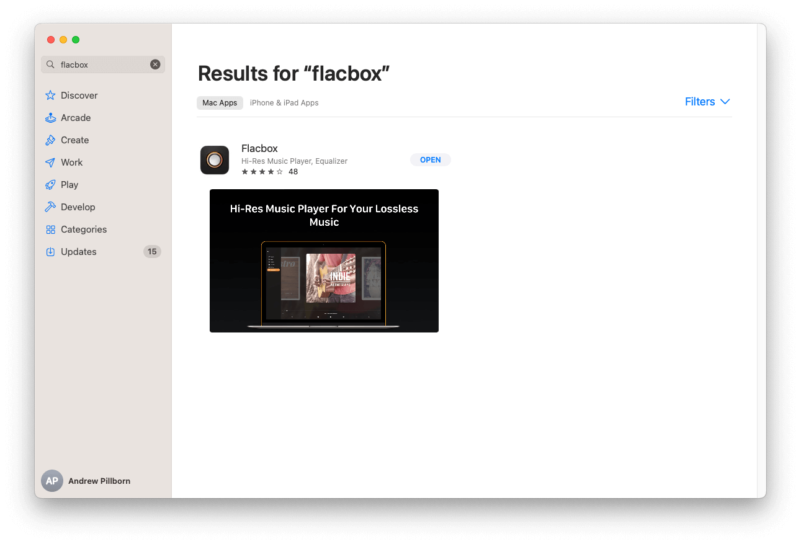

## Why Lossless Music Matters

Lossless audio formats like FLAC and DSD retain the full fidelity of studio recordings, preserving details, dynamic range, and nuance that are often lost in compressed formats. If you care about sound quality, lossless is the way to go — and Flacbox is the app to take you there.

## Getting Started with Flacbox

Flacbox is a full-featured music player and cloud streamer for both **iOS** and **macOS**. Here's how to start using it:

### On iPhone or iPad

1. **Download Flacbox** from the [App Store](https://apps.apple.com/us/app/flacbox-flac-player-music/id1097564256?mt=8).
2. **Import your music** using iTunes File Sharing, Wi-Fi Drive, or connect a cloud service like Google Drive, Dropbox, or WebDAV.
3. **Organize your library** by album, artist, or genre. Flacbox scans metadata automatically.

### On Mac

1. **Download Flacbox** from the Mac App Store.
2. **Add your local or external files**, or stream directly from cloud storage.
3. **Build playlists** and tag your music using the built-in metadata editor.

## Key Features for Audiophiles

Flacbox is optimized for high-fidelity playback and file flexibility:

- **Supports FLAC, DSD, ALAC, OPUS, APE, WAV, AIFF, and more**
- **10-band equalizer with custom presets**
- **Offline caching with fast access to downloaded tracks**
- **Tag editor** for ID3 and FLAC metadata
- **Cross-platform sync** between iOS and macOS
- **Streaming support** for SMB, WebDAV, DLNA, and popular clouds

## Optimizing the Listening Experience

To make the most of Flacbox:

- Use **high-quality headphones** or DAC-enabled speakers
- Keep your **library organized** using metadata and playlists
- Adjust **equalizer settings** to enhance low/high frequencies
- Download high-resolution audio tracks (24-bit, 96kHz+) for maximum quality

## Bonus: Cloud and External Support

Flacbox integrates with dozens of cloud services including iCloud, pCloud, MEGA, HiDrive, and Synology via SMB or WebDAV. You can even connect **external drives** using Lightning or USB-C adapters on iOS.

## Final Thoughts

Flacbox is your gateway to a professional-level music experience on iOS and macOS. Whether you’re streaming DSD from a NAS or importing FLAC from cloud storage, it delivers pristine audio playback and complete control over your music library.

If you're serious about sound, Flacbox is the tool that turns your iPhone or Mac into an audiophile-grade player.