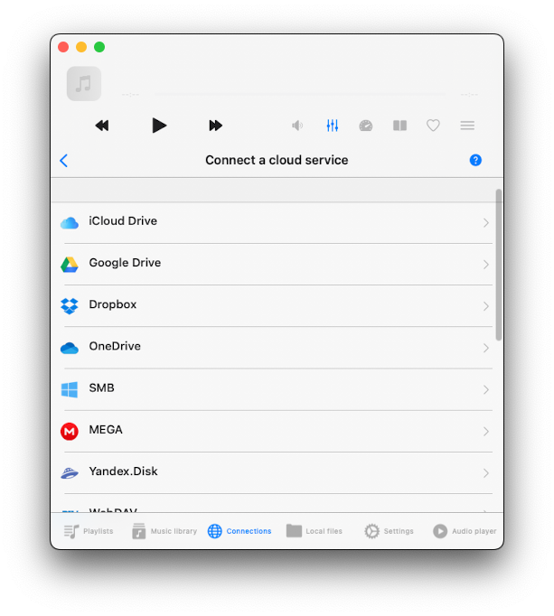
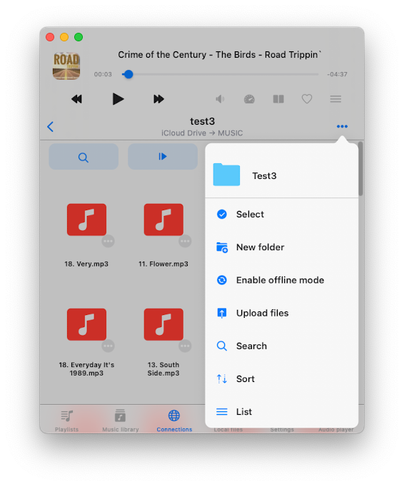

On this screen, you can connect various sources containing your music. You can integrate popular cloud services like Dropbox, Google Drive, and others, as well as connect your Mac or PC. Additionally, you have the option to import music from Apple Time Capsule, or WD Cloud Home.

## Connect to cloud storage

- Open the 'Connections' tab
- Select 'Connect to cloud storage' from the menu
- Choose cloud storage service from the list
- Enter your credentials, and tap 'Done.'

If you encounter any issues, be sure to check your internet connection and login/password.  
In the Premium version of the app, you can add an unlimited number of services.

## Supported cloud storage services

Currently, the application supports the most popular cloud storage services: iCloud Drive, Dropbox, OneDrive, Google Drive, MEGA, Synology Drive, SMB, WebDAV, DLNA, Yandex.Disk, Box, 阿里云盘, 百度网盘, pCloud, WD My Cloud Home, InfiniCLOUD, MediaFire, OpenDrive, HiDrive, Cloud Mail.ru, Put.io, MyDrive. The free and Premium versions of the app support different cloud services.

## Security and privacy

We use only official SDK and secure connection to interact with connected cloud services. Your login and password are not available for the application. All requests from the application to the cloud service are encrypted.

When you enter your login and password the application shows you the official authorization page that is provided by the cloud service provider and all authorization process is made outside the application. The cloud service provider sends an auth token to the application after successful authorization and that token is used to make API calls.

Auth-token is a digital key that allows third-party applications to interact with cloud storage. Auth-token is stored on your device in a secure system storage called Keychain. You can download your files from the connected cloud service to the device and those files will be placed in the app's "Documents" directory. You can remove those files anytime using the built-in file manager.

The application does not share any information from the connected cloud account. You can revoke access to your cloud account anytime by opening the account settings page on your web browser.

## Reject auth-token

Login to your account on the web browser and navigate to the settings page. There you can find all third-party apps that are connected to your cloud account and remove any of them if you don’t want to use that application anymore. Detailed instructions available [here](/docs/howto/how-to-disconnect-third-party-app-from-your-google-account).

You can also disconnect the connected cloud accounts in the application and the auth token will be also removed from your device. If you remove the application from your device all downloaded data and access tokens will be also removed.

## Disconnect a cloud storage or change configuration

- Access Cloud Storage Options: first, locate the cloud storage you wish to manage within the app's interface.
- Tap '...' Button: next to the service title, you'll see a '...' button. Tap on it to access additional options.
  - **Rename**: if you want to change the name of the cloud service as it appears in your list, select 'Rename.'
  - **Settings**: to modify the configuration or authentication data for the cloud service, choose 'Settings.' Sometimes, you may need to reauthorize the connected cloud service if the authorization token has expired.
  - **Disconnect**: if you wish to completely sever the connection between the app and the cloud service, select 'Disconnect.' Be aware that choosing this option will remove all songs associated with this cloud service from your app's music library, but they will remain on the server.

## Connect to Computer or NAS

You can also connect your computer, personal NAS, or other network devices using SMB, DLNA, or WebDAV protocol.

## Connect to computer using SMB

- Tap "Connect to cloud storage" → SMB.
- Enter the computer IP address and shared folder name in the URL field using the format smb://computer-ip-address/shared-folder-name
- Choose protocol version: Auto, SMB1, SMB2
- Enter login and password (if required)
- Tap "Done".

If your connection is successful you will see connected storage in the "Cloud storage" section.  
A full tutorial about how to connect your MAC or PC using SMB is available [here](/docs/howto/stream-your-music-from-mac-or-pc-to-iphone-using-smb/).

## Connect to NAS using WebDAV

All steps are the same instead of the URL field.  
URL should be in the format http://server-name, or https://server-name if the server supports SSL.
A full tutorial about how to connect NAS using WebDAV protocol is available [here](/docs/howto/how-to-connect-nas-storage-using-webdav-and-listen-to-music-on-your-iphone-or-mac).

## Connect to Computer or NAS using DLNA

You can also share a music library located on your Windows PC or personal NAS using the DLNA protocol and access that library in the app as described [here](/docs/howto/how-to-enable-dlna-media-server-on-windows-10-and-play-your-music-on-iphone). DLNA is a popular and widely used protocol, but it only allows you to play or download music. You can't upload files or create new folders on the server.

## Available devices

This section displays all devices within your local network that you can connect to through the application.  
To establish a connection with a device, follow these steps:

- Open the app and go to the "Available Devices" section.
- Tap the device you want to connect to from the list.
- If needed, enter your login details to complete the connection.

## Wi-Fi Drive 

Wi-Fi Drive is a convenient technology that enables wireless file transfers from your computer to your iOS device via a desktop browser.  
To use this feature effectively, ensure that your device and computer are connected to the same Wi-Fi network.   
Here's a step-by-step guide on how to use Wi-Fi Drive.

## Enable Wi-Fi Drive

- Open the application and go to the "Connections" tab.
- Select "Connect via Wi-Fi" to access the Wi-Fi Drive main screen.
- Tap "Start Wi-Fi Drive" to enable Wi-Fi Drive.

## Access Wi-Fi Drive on Your Computer

- On your computer (desktop or laptop), open a web browser (such as Chrome, Firefox, or Safari).
- In the browser's address bar, enter the URL provided by the application.

## Transfer Files Wirelessly

Once the web page corresponding to your iOS device opens in the browser, you can easily drag and drop files from your computer onto the web page.  
The files you drag and drop will begin transferring to your iOS device and will be accessible within the application.

Detailed instructions about how to transfer files wirelessly using WiFi-Drive is available [here](/docs/howto/how-to-transfer-files-wirelessly-from-a-computer-to-an-iphone-using-wifi-drive).

## iTunes File Sharing

iTunes File Sharing is another technology that allows you to transfer files from computer to device using the Finder app on your Mac and lightning cable.   
- Just connect a device to the computer using a cable and run the Finder app on your Mac. 
- Open the "Locations" → "Your Connected Device" → "Files" → and find the Evermusic app. 
- Tap on the app icon to see all shared folders. 
- Copy files from the computer to the shared folder on the device using drag-and-drop.   

Detailed instructions about how to use iTunes file sharing available [here](/docs/howto/how-to-play-local-itunes-files-on-my-iphone/).

## Connect a USB flashcard

If you have an SD card, you can connect it using a lightning card reader. The app currently supports Apple Certified card readers and iXpand Flash Drives. If you have iXpand Flash Drive - insert it into the lightning port and open the application. You'll see an 'External device connected' message and device information. Simply tap on the flash drive icon to access the music folder and tap on any audio file to start playing. We have detailed instructions about how to connect a USB flashcard to the iPhone and listen to music or manage files located on it which is available [here](/docs/howto/how-to-connect-a-usb-flashcard-to-the-iphone-and-listen-to-music-or-manage-files-located-on-it).

## File Manager

Once you’ve connected a cloud storage service, tap its icon to view all available files and folders. You can use the built-in file manager to work with these files — download, rename, move, and more. When you start a download, the file will appear in the transfer queue. To view the transfer queue, go to the "Local Files" tab and tap the spinning arrows in the top left corner. All downloaded files and folders are available in the "Local Files" section.

## Top Toolbar

The top toolbar, conveniently located under the navigation bar, offers several useful actions for easy access. You can show or hide this toolbar by using a simple swipe-down gesture. Here are the available actions:

- **Search**: This option allows you to perform a quick search within the current directory, making it effortless to locate specific files or folders.
- **Continue Playback**: If enabled in the application settings, this feature restores the audio player queue and the last media position for the current folder. It's a handy way to pick up where you left off in your music library.
- **Play All**: By selecting this action, the app will scan the current folder and its subfolders, adding all the found audio files to a new player queue. This is useful when you want to play all the music within a particular directory.
- **Shuffle All**: Similar to "Play All," this action scans the current folder and its subfolders but shuffles the files before adding them to the audio player queue. It's a great way to enjoy your music in a random order for a bit of variety.

## Folder Options

When you open a folder within the app, you'll find a handy set of actions available by tapping the "..." button in the top right corner of the screen.   
Here's a breakdown of these actions:

- **Select**: Activate file selection mode. This mode enables you to choose one or more files within the folder, making it easy to perform actions on selected items.
- **New Folder**: Create a new folder within the current folder. This feature allows you to organize your files and keep your library well-structured.
- **Enable Offline Mode**: Toggle on offline mode for the current folder. Offline mode goes beyond simple downloading; it actively monitors the folder for changes. If you add new files to the folder online, the app will automatically download these files to your device. This ensures that your local library stays up-to-date with changes on the server.
- **Upload Files**: Upload files from your device to the online folder. This action lets you transfer files to the cloud or server, making them accessible from anywhere.
- **Search**: Search for specific files within the current folder. This is especially useful for quickly locating specific items in a large collection.
- **Sort**: Sort files within the folder by criteria such as name, size, or date edited. The default sort mode typically mirrors the sorting order on the server, but you can change it to suit your preferences.
- **Grid/List View**: Switch between two viewing modes: table view and thumbnail view. The table view presents files in a list, while the thumbnail view displays visual representations of the files, making it easier to identify content at a glance.

## Edit Online Files

When you find the need to manage multiple files within your cloud storage on Evermusic, you can make use of the select mode to streamline your actions. Follow these steps for effective file management:

- **Activate Selection Mode**: Open the app on your device and navigate to the section containing your cloud storage. Look for the top right corner where you'll find the "..." (ellipsis) button. Tap on it and choose "Select" menu item to activate selection mode.
- **Choose Files**: You'll notice checkboxes appearing next to every file or folder listed. Choose one or multiple files or folders by simply tapping on the checkboxes next to them.
- **Perform Various Actions**: Once you've selected the files or folders you want to manage, you'll have access to several actions tailored to your needs:

## File actions

Near the title of the file, you'll notice an ellipsis symbol "..." (three dots) – this serves as the actions menu.  
Tap on it to reveal a list of available actions:

- **Play Next**: Opt for this action to insert the chosen file at the top of your player queue, ensuring it plays immediately after the currently playing item.
- **Play Later**: Selecting this option adds the file to the bottom of your player queue, ensuring it plays after the existing queue.
- **Add to Music Library**: This action lets you incorporate the file into your music library, making it easily accessible and neatly organized by artist, album, genre, or composer.
- **Add to a Playlist**: Use this action to add the file to an existing playlist or create a new one.
- **Edit Audio Tags**: By selecting this option, you can access Evermusic's built-in tags editor, allowing you to modify audio tags for the chosen file. The file will be temporarily downloaded to a temporary directory and then uploaded to the storage after you confirm the changes.
- **Add to Favorites**: This action adds the file to your list of favorite files for quick and convenient access.
- **Download**: Choose this action to download the file or folder to your device, making it accessible for offline use.
- **Rename**: This option permits you to rename the file directly on the remote storage, allowing for customized file naming.
- **Move**: Opt for this action to relocate the file to a different folder within your cloud storage, aiding in maintaining an organized file structure.
- **Open In**: Use this action to export the file to another compatible app. The file will be downloaded to your device, and then the Share dialog will appear for further sharing or interaction.
- **Delete**: Exercise caution with this action, as it permanently removes the file from your cloud storage. **This deletion cannot be undone**.

If the list of actions exceeds the available screen space, simply scroll down within the actions menu to access additional options.

## Folder actions

For each folder in your cloud storage, you have various actions available. To access these options, simply tap the ellipsis icon "..." located next to the folder title. If you don't see all the actions, scroll down to reveal more choices. Here are the available actions:

- **Play All**: Replace the current player queue with all the items from the selected folder.
- **Play Next**: Add the entire folder to the top of the player queue, right after the currently playing item.
- **Play Later**: Append the folder contents to the bottom of the player queue.
- **Add to Music Library**: This action seamlessly incorporates the folder's content into your music library, making it easily accessible and neatly organized by artist, album, genre, or composer.
- **Add to Playlist**: You can include the entire folder in a playlist. You also have the option to create a new playlist, and the folder's name will be automatically assigned.
- **Add to Favorites**: Use this action to add the folder to your list of favorite files for quick and convenient access.
- **Enable Offline Mode**: By enabling offline mode for a selected folder, the application goes beyond simple downloading. It continuously scans for changes, and if new files are added to the online folder, they will be automatically downloaded to the app.
- **Download**: Download all the contents of the folder to your device for offline access.
- **Rename**: Rename the folder directly on the remote storage.
- **Move**: Relocate the folder to a different location within your cloud storage.
- **Delete**: Be cautious with this action as it permanently removes the folder and its contents from your cloud storage. **This action cannot be undone**.

## Quick Access

The Quick Access section is located at the top of the screen. It gives you fast access to your favorite and recently opened files from connected cloud services.
Whenever you open a file or folder from the cloud, it’s added to the "Recently Opened" list. To clear this list, open "Recents," tap the "More Actions" button, and choose "Delete List." You can also mark deeply nested folders as **Favorites** to access them quickly without digging through the directory structure.

## Other Services

This section displays extra features that enhance your experience. Currently, the app supports **Last.fm scrobbling**. When connected, your playback stats are automatically sent to your Last.fm account. You can visit your Last.fm profile later to view listening analytics and get personalized music recommendations. Detailed setup instructions are available [here](/docs/howto/how-to-scrobble-your-music-history-from-evermusic-or-flacbox-to-last-fm).