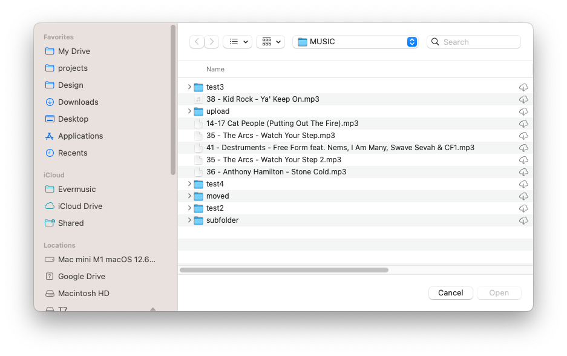

## Introduction

The Local Files section serves as a hub for managing files located in the application's "Documents" folder, as well as files added from your device, which are available for offline playback.

This built-in file manager allows you to edit files and offers various methods to import audio files into the app.

## Download files from cloud storage

You can add audio files to the app by downloading them from connected cloud storage services as described [here](https://www.everappz.com/post/how-to-upload-my-files-to-the-cloud-storage-and-connect-them-to-evermusic-flacbox-evertag).

## Offline mode

Automatically sync files for offline playback as described [here](https://www.everappz.com/post/play-offline-music-in-evermusic-flacbox-download-sync-from-cloud-to-local-files).

## Import files from your device

Easily import files from your device as described [here](https://www.everappz.com/post/how-to-play-local-music-stored-on-your-iphone-or-mac) or attached USB drive as described [here](https://www.everappz.com/post/how-to-connect-a-usb-flashcard-to-the-iphone-and-listen-to-music-or-manage-files-located-on-it).

## iTunes File Sharing

Transfer files using a cable connection as described [here](https://www.everappz.com/post/how-to-transfer-files-from-my-mac-to-iphone-or-ipad-using-finder).

## Wi-Fi Drive

Transfer files wirelessly as described [here](https://www.everappz.com/post/how-to-transfer-files-wirelessly-from-a-computer-to-an-iphone-using-wifi-drive).

## Transfers Queue

In the top left corner of the navigation bar, you'll find a 'Transfers' button. Tap it to access the transfers queue, where you can monitor and manage all your downloads and uploads. Additionally, you have the flexibility to adjust transfer queue speed and network type in the app settings.

## Quick Access Section

At the top of the screen, a quick access section provides convenient links to your recent and favorite files and folders.

## Recents

This section displays all recently opened files or folders.

## Favorites

You can mark files or folders as favorites and access them in this section. Moreover, you can add a folder located on your device to your favorites. To do this, open the favorites section, tap the three dots in the top right corner, and choose the "Add folder" menu item. Follow the prompts to add a folder from your device to your favorites for quick access.

## Top Toolbar

The top toolbar, located under the navigation bar, offers several actions:

- **Search:** Perform a search within the current folder.
- **Continue Playback:** If enabled in the application settings, this feature restores the audio player queue and the last media position for the current folder, allowing you to resume where you left off you last playback.
- **Play all:** Scan the current folder and its subfolders and add files to the player queue with the current sort order.
- **Shuffle All:** Similar to "Play all," but shuffles files before adding them to the audio player queue.

You can show or hide the top toolbar using a swipe-to-bottom gesture.

## Special Folders

Within the "Local files" screen, you'll encounter several special folders.

## Downloads

All files downloaded from cloud storage service will appear here by default. You can customize this behavior in the application settings.

## Audio Player

This is the audio player cache folder. By default, the audio player downloads some songs in the audio player queue to apply crossfade and optimize playback. You can disable the audio player cache in app settings or simply delete this folder from "Local files."

## iCloud

Place files in this folder, and they will sync across all your devices connected to the same iCloud account.

## Offline Folders

When you make a playlist, album, artist, or online folder available for offline use, all those files will be downloaded into this folder.  
If you need to disable offline mode for specific items, you can use the more actions menu or delete the corresponding folder located in "Offline folders."

## Two Distinct Sections

"Local Files" screen is organized into two distinct sections.

## Files in this Application

Shows files and folders stored in the app’s Documents directory and iCloud Drive.

## Files on this iPhone/iPad/Mac

Shows files located on your device but in different applications. You can import them into this application using the system file picker. To activate the picker, choose "Open files..." to select files or "Open folders..." to select folders. Detailed instructions on how to import local music stored on your iPhone or Mac are available [here](https://www.everappz.com/post/how-to-play-local-music-stored-on-your-iphone-or-mac). You can also connect a folder located on your device and have quick access to the folder's content. Use "Connect a folder" menu item and choose a folder located on your device. Tap "Done" and the app will create link to that folder with read/write access and you can manage files dicrectly from this app. To disconnect folder located on your device tap "More actions" button and choose "Disconnect".

## Import Files Located on Connected USB Flashcards

Detailed instructions on how to connect a USB flashcard to your iPhone and listen to music or manage files located on it are available [here](https://www.everappz.com/post/how-to-connect-a-usb-flashcard-to-the-iphone-and-listen-to-music-or-manage-files-located-on-it).

## More Actions

More actions menu for the currently opened folder located in the top right corner and provides access to various actions.

- **Select:** Switch to selection mode for files and folders.
- **New Folder:** Create a new folder within the current folder.
- **Search:** Activate the search function to find a specific file or folder.
- **Sort:** Organize files by name, size, date, or using metadata information.
- **List/Grid:** Change the content presentation from a table to a grid view.
- **Help:** Access help instructions.

## Selection Mode

If you need to edit several files, activate selection mode by tapping the more actions button "..." on the navigation bar in the top right corner and then choose the "Select" menu item. This will display checkboxes near each file. Select the desired files by tapping their checkboxes. You can perform the following actions on the selected files.

- **Play next:** Add selected files or folders to the top of the player queue with the current sort order.
- **Play later:** Add selected files or folders to the bottom of the player queue with the current sort order.
- **Add to Music Library:** Include selected files or folders in the music library.
- **Add to a Playlist:** Add selected files or folders to a playlist.
- **Copy:** Create a copy of the selected file or folder.
- **Upload:** Upload the selected file or folder to remote storage.
- **Move:** Relocate the selected file or folder to a different location on the device.
- **Rename:** Change the name of the selected file or folder.
- **Delete:** Remove the selected file or folder from the device. Please note that this action is irreversible.

## Options Menu

For every file or folder in the app, several actions are available, accessible by tapping the more button "..." If you don't see all actions, scroll down to view them:

- **Play all:** Replace the player queue with items from the selected folder.
- **Play next:** Add the file or folder to the top of the player queue.
- **Play later:** Add the file or folder to the bottom of the player queue.
- **Add to Music Library:** Include selected files or folders in the music library.
- **Add to a Playlist:** Add the file or folder to a playlist. If you create a playlist from a folder, a playlist name will be automatically assigned.
- **Add to Favorites:** Mark selected files or folders as favorites.
- **Edit Audio Tags:** Open the built-in tags editor to change audio tags for the selected file.
- **Rename:** Modify the name of the selected file or folder.
- **Move:** Relocate the selected file or folder to a different location on the device.
- **Copy:** Create a copy of the selected file or folder.
- **Upload:** Upload the selected file or folder to remote storage.
- **Show in Finder:** For files imported from your Mac, this action reveals the directory in Finder containing the file.
- **Open in:** Export the file to another app.
- **Delete:** Delete the file or folder from the device. **Please note that this action is irreversible** and you can not restore deleted files. 

## Offline Folders

Offline mode is a handy feature that lets you access your favorite music even when you're not connected to the internet. When you enable offline mode for any album, artist, playlist, genre, or remote folder, all the files within that collection will be automatically downloaded to your device for offline playback. You can conveniently access these files in the "Offline Folders" section of the app.

What's even more convenient is that when you add new files to the remote server in the folder you've marked for offline use, these new additions will also be automatically downloaded to your device. It ensures that you have the latest music ready for offline enjoyment.

If you ever need to synchronize an offline folder from your cloud service manually, here's how you can do it: Simply tap the three dots located in the top-right corner of the app, and select the "Synchronize" option. This allows you to update your offline collection with the latest tracks from the cloud service at your convenience.

For those who like to customize their experience further, you can adjust the synchronization timeout settings in the application settings to suit your preferences. This way, you have full control over when and how your offline collection is updated, ensuring you always have your favorite tunes available, even without an internet connection.

Detailed instructions about How to Play Offline Music in Evermusic & Flacbox: Download & Sync from Cloud to Local Files is available [here](https://www.everappz.com/post/play-offline-music-in-evermusic-flacbox-download-sync-from-cloud-to-local-files).

## Personalization

By opening the application Settings and going to Personalization, you can configure the Local Files screen style.  
Available options are

- **Plain menu:** Shows folders located in the app’s Documents directory.
- **Grouped menu:** Shows screen content grouped by categories.

