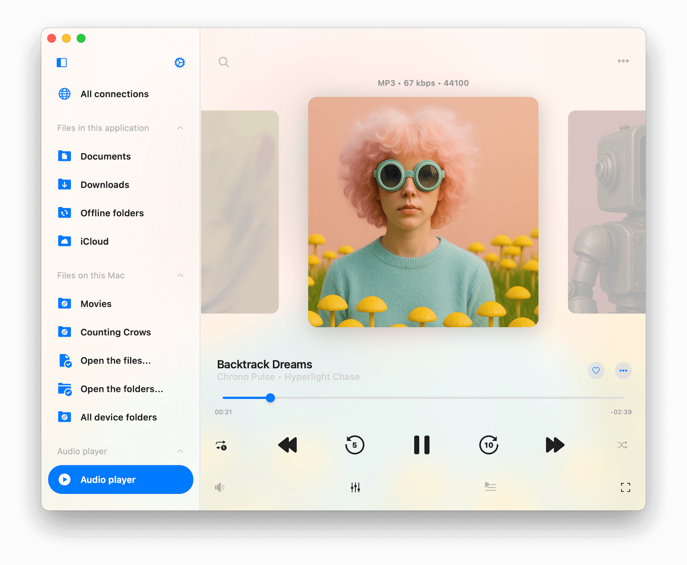
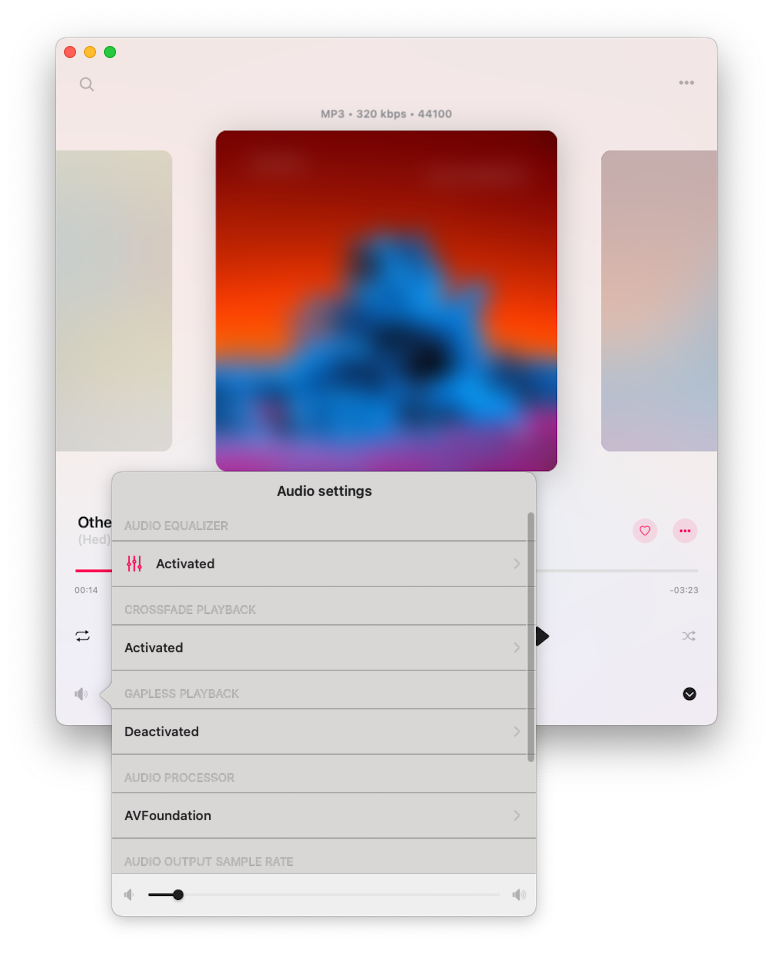
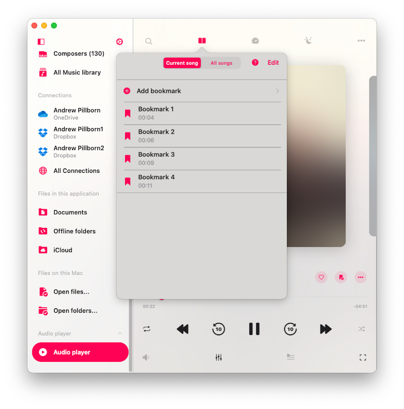
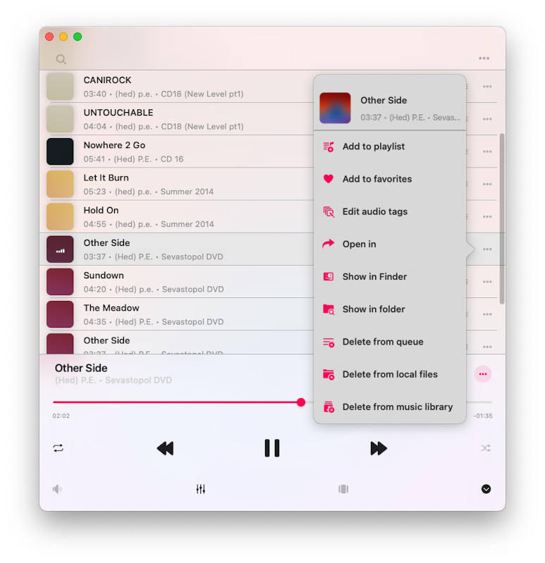

## Introduction

The Player is the main application screen where you can control the player queue and playback features such as the equalizer, sleep timer, audio bookmarks, and more. Let’s take a closer look at how to navigate and utilize these functions.

## Accessing the Player

You can access the full-screen player from the mini-player view. On your iPhone, you’ll find the mini player above the tab bar on the main screen. On your iPad or Mac, it’s accessible from the left menu. To tuck away the mini player, tap its icon and swipe downwards. To completely hide the full-screen player, simply tap the close button located at the bottom right corner.

## Supported Audio Formats

The most popular audio formats are supported: mpeg, aifc, 3gp, avi, aif, latm, 3gpp, m4a, loas, cdda, aac, m4p, m4b, ac3, pls, mp4v, m3u, m4r, aiff, xhe, mp1, snd, mp2, wav, qt, wave, m3u8, m4v, mp3, 3g2, caf, mp4, flac, au, w64, ec3, adts, amr, vtt, mpa, aa.

## Playback Controls

At the bottom of the player screen, you'll discover essential playback controls. These include buttons like "Play," "Pause," "Next Track," and "Previous Track." There are even some hidden by default controls like "Next 30 sec" and "Previous 30 sec," which can be uncovered in the app settings. To fast forward or rewind, use a tap-and-hold gesture with the Next/Previous Track buttons. When you want to jump to a specific part of the track, utilize the playback slider.

## Repeat and Shuffle

When you want to change the repeat mode, a simple tap on the repeat button will do the trick. You have several options:

- "Repeat all" – for looping all tracks in your player queue.
- "Repeat one" – for repeating only the current track.
- "Repeat Stop" – to pause playback when the current track ends.
- "Repeat None" – for letting your queue play through without repeating.

If you're in the mood for some randomness, the "Shuffle" option is your go-to. It shuffles the order of your tracks in the queue, giving you a fresh listening experience each time. You can easily switch between "Shuffle off" and "Shuffle on."

## Volume Control

Find the volume slider on the Audio Settings screen by tapping the sound icon under playback controls. You can change the volume using this slider or standard volume buttons on your device. Additionally, you'll find some handy streaming buttons:

- "Google Cast" lets you connect to Google Chromecast devices.
- "AirPlay" allows you to link up with devices using AirPlay technology.

## Google Cast

For those using Google Cast, you'll spot the Google Cast icon at the bottom of the audio player screen or on the Audio Settings screen. Simply tap it to reveal a list of available devices. Select the one you want to connect to and start streaming your audio content. Just ensure that your Google Cast device and your iPhone/iPad are on the same Wi-Fi network. Keep in mind that not all audio formats available in the app are supported by Google Cast devices, so some tracks may not be streamable.

## AirPlay

On the other hand, if you prefer AirPlay, look for the AirPlay button at the bottom of the audio player screen or on the Audio Settings screen, which you can access by tapping the volume button at the bottom of the screen. A quick tap on it allows you to choose the available device to which you'd like to stream your audio content. The application even supports AirPlay2 technology, enabling you to share audio content across multiple AirPlay devices simultaneously.

## Audio Equalizer

Evermusic comes packed with a 10-band equalizer, complete with iPod-style presets, a preamplifier, and manual equalizer settings. To activate the equalizer, simply tap the "Equalizer" button on the bottom toolbar and toggle the switch control in the top right corner. You can select from a range of predefined equalizer presets like "Acoustic", "Bass Booster", "Classical", and more. If you're a sound enthusiast, you'll appreciate the ability to fine-tune each frequency band using sliders. Feel free to create and save your very own audio equalizer presets. If a track isn't loud enough, you can also adjust the preamplifier gain. We have more detailed instructions about how to use equalizer [here](https://www.everappz.com/post/how-to-use-the-audio-equalizer-on-your-iphone-ipad-mac-with-evermusic-and-flacbox).

## Player Mode Toolbar

For a select few player screen styles such as "Antique" and "Classical," you'll find a player mode toolbar at the top of the player screen, right below the navigation bar. This handy toolbar houses three buttons:

- "Search" – Ideal for quickly locating a specific track in your player queue.
- "Playback speed control" – Adjust your playback speed anywhere from 0.02x to 3.00x. Perfect for those who enjoy audiobooks and lectures. To revert to the default speed settings, simply tap "Normal" speed.

## Audio Bookmarks

Here's where you can create multiple bookmarks for tracks in your music library. We have a full instruction on how to use bookmarks [here](https://www.everappz.com/post/how-to-listen-to-audiobooks-on-iphone-ipad-mac-using-evermusic).

## Player Queue

To access your player queue, simply tap the player queue button located on the bottom toolbar. To move a song in the queue, use the reorder indicator near the title.

## Comments / Lyrics

To view track comments and embedded lyrics, as well as LRC files, follow these steps:

1. Open Settings.
2. Go to Audio Player.
3. Select Personalization.
4. Tap Buttons on the main screen.
5. Enable Comments.

## Options Menu

Each song in your audio player queue has a menu with more actions, which you can access by tapping the three dots button near the song title. The available actions are:

- **Play next**: Adds the song to the top of the player queue.
- **Add to playlist**: Adds the song to a playlist, with the option to create a new playlist.
- **Add to favorites**: Marks the song as a favorite for quick access.
- **Download**: Saves the song to local files, appearing in the ‘Local Files’ tab and the ‘Offline Music’ section.
- **Edit audio tags**: Opens the built-in audio tags editor to fix missing metadata, modifying the song on your storage.
- **Show in folder**: Reveals the folder where the audio file is stored.
- **Show in Finder**: For files imported from your Mac, this action reveals the folder where the audio file is located on your Mac.
- **Open in**: Exports the audio file to another app.
- **Delete from queue**: Removes the selected song from the audio player queue.
- **Delete from cloud service**: Deletes the song from both the music library and cloud storage (please note that this action is irreversible).
- **Delete from local files**: Deletes the song from both the music library and local storage (please note that this action is irreversible).
- **Delete from music library**: Deletes the song from your music library, while keeping the file in storage.

## Additional Player Actions

Tap the more actions button "..." on the left side of the currently played song title to see additional actions.

## Audio Player Settings

To access audio player settings, tap the More button on the audio player screen and select "Settings" from the drop-down menu. Here, you'll find various sections:

## Audio Player Cache

Songs in the audio player queue will be downloaded automatically for smooth playback. If you download audio files manually, you can disable this option to avoid duplicates. You can also configure the audio player cache size here.

