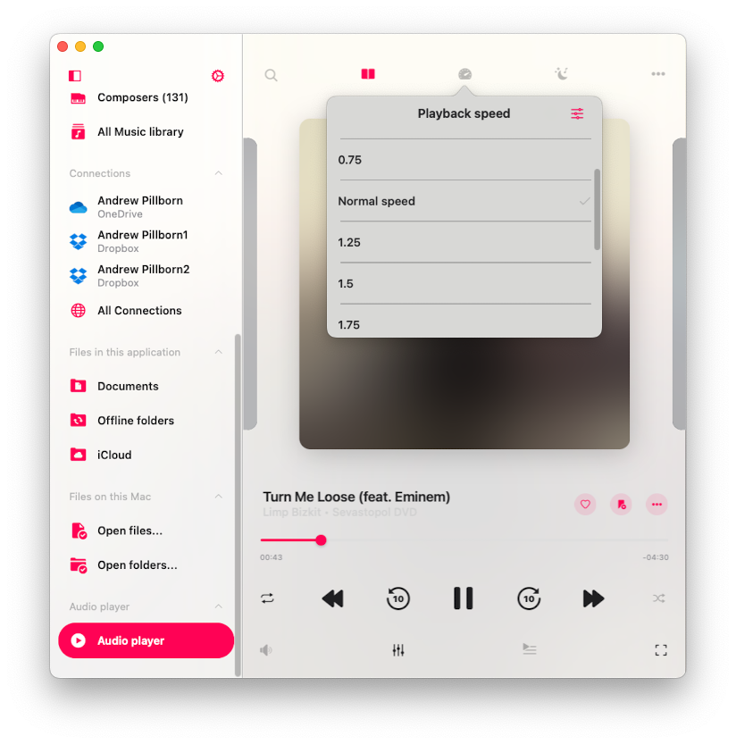
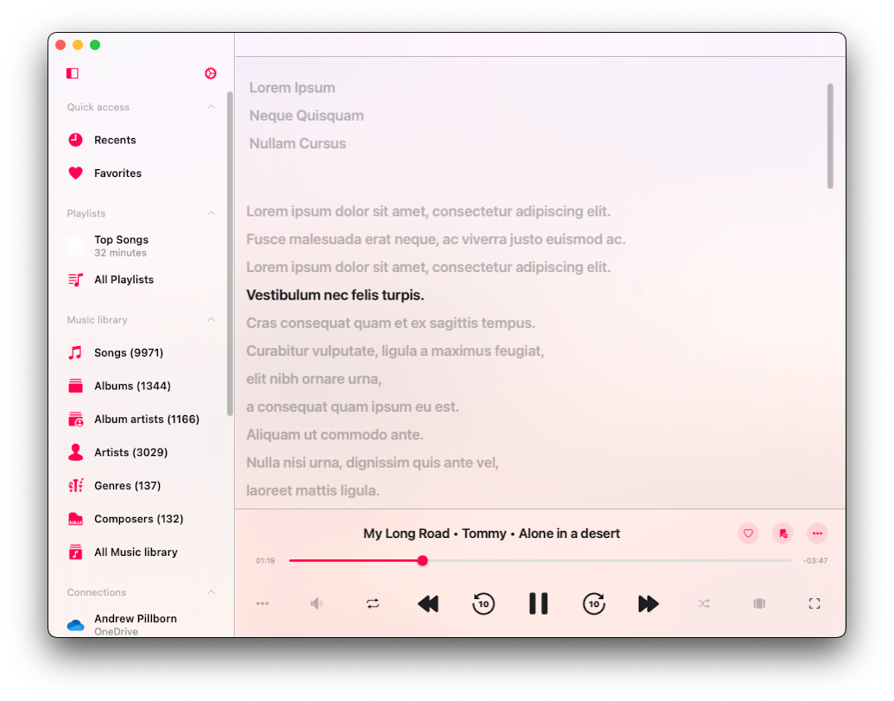
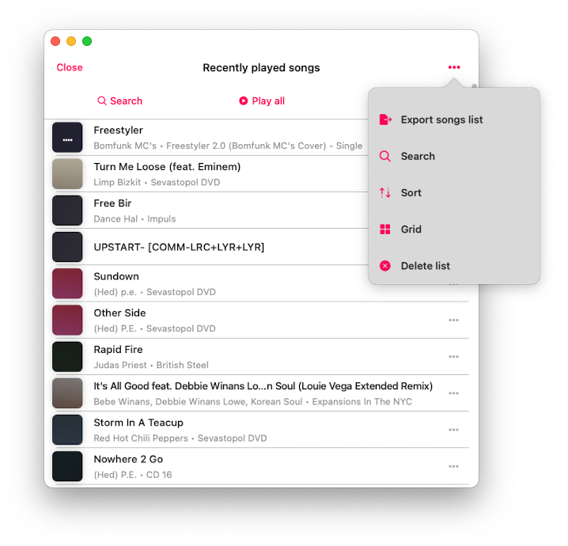
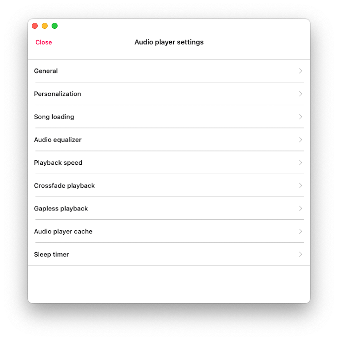

## Introduction

The Player is the main application screen where you can control the player queue and playback features such as the equalizer, sleep timer, audio bookmarks, and more. Let’s take a closer look at how to navigate and utilize these functions.

## Accessing the Player

You can access the full-screen player from the mini-player view. On your iPhone, you’ll find the mini player above the tab bar on the main screen. On your iPad or Mac, it’s accessible from the left menu. To tuck away the mini player, tap its icon and swipe downwards. To completely hide the full-screen player, simply tap the close button located at the bottom right corner.

## Supported Audio Formats

The most popular audio formats are supported: mpeg, aifc, 3gp, avi, aif, latm, 3gpp, m4a, loas, cdda, aac, m4p, m4b, ac3, pls, mp4v, m3u, m4r, aiff, xhe, mp1, snd, mp2, wav, qt, wave, m3u8, m4v, mp3, 3g2, caf, mp4, flac, au, w64, ec3, adts, amr, vtt, mpa, aa.

## Playback Controls

At the bottom of the player screen, you'll discover playback controls. These include buttons like "Play," "Pause," "Next Track," and "Previous Track." There are even some hidden by default controls like "Next 30 sec" and "Previous 30 sec," which can be enabled in the app settings. To fast forward or rewind, use a tap-and-hold gesture with the Next/Previous Track buttons. When you want to jump to a specific part of the track, utilize the playback slider.

## Repeat and Shuffle

When you want to change the repeat mode, a simple tap on the repeat button will do the trick. You have several options:

- "Repeat all" – for looping all tracks in your player queue.
- "Repeat one" – for repeating only the current track.
- "Repeat Stop" – to pause playback when the current track ends.
- "Repeat None" – for letting your queue play through without repeating.

If you're in the mood for some randomness, the "Shuffle" option is your go-to. It shuffles the order of your tracks in the queue, giving you a fresh listening experience each time. You can easily switch between "Shuffle off" and "Shuffle on."

## Volume Control

Find the volume slider on the Audio Settings screen by tapping the sound icon under playback controls. You can change the volume using this slider or standard volume buttons on your device. Additionally, you'll find some handy streaming buttons:

- "Google Cast" lets you connect to Google Chromecast devices.
- "AirPlay" allows you to link up with devices using AirPlay technology.

## Google Cast

For those using Google Cast, you'll spot the Google Cast icon at the bottom of the audio player screen or on the Audio Settings screen. Simply tap it to reveal a list of available devices. Select the one you want to connect to and start streaming your audio content. Just ensure that your Google Cast device and your iPhone/iPad are on the same Wi-Fi network. Keep in mind that not all audio formats available in the app are supported by Google Cast devices, so some tracks may not be streamable.

## AirPlay

On the other hand, if you prefer AirPlay, look for the AirPlay button at the bottom of the audio player screen or on the Audio Settings screen, which you can access by tapping the volume button at the bottom of the screen. A quick tap on it allows you to choose the available device to which you'd like to stream your audio content. The application even supports AirPlay2 technology, enabling you to share audio content across multiple AirPlay devices simultaneously.

## Audio Equalizer

Evermusic comes packed with a 10-band equalizer, complete with iPod-style presets, a preamplifier, and manual equalizer settings. To activate the equalizer, simply tap the "Equalizer" button on the bottom toolbar and toggle the switch control in the top right corner. You can select from a range of predefined equalizer presets like "Acoustic", "Bass Booster", "Classical", and more. If you're a sound enthusiast, you'll appreciate the ability to fine-tune each frequency band using sliders. Feel free to create and save your very own audio equalizer presets. If a track isn't loud enough, you can also adjust the preamplifier gain. We have more detailed instructions about how to use equalizer [here](/docs/howto/how-to-use-the-audio-equalizer-on-your-iphone-ipad-mac-with-evermusic-and-flacbox).

## Player Mode Toolbar

For a select few player screen styles you'll find a player mode toolbar at the top of the player screen, right below the navigation bar. This handy toolbar houses three buttons.

- "Search" – Ideal for quickly locating a specific track in your player queue.
- "Playback speed control" – Adjust your playback speed anywhere from 0.02x to 3.00x. Perfect for those who enjoy audiobooks and lectures. To revert to the default speed settings, simply tap "Normal" speed.

## Audio Bookmarks

Here's where you can create multiple bookmarks for tracks in your music library. We have a full instruction on how to use bookmarks [here](/docs/howto/how-to-listen-to-audiobooks-on-iphone-ipad-mac-using-evermusic).

## Player Queue

To access your player queue, simply tap the player queue button located on the bottom toolbar. To move a song in the queue, use the reorder indicator near the title.

## Comments / Lyrics

To view track comments and embedded lyrics, as well as LRC files, follow these steps:

1. Open Settings.
2. Go to Audio Player.
3. Select Personalization.
4. Tap Buttons on the main screen.
5. Enable Comments.

We have a full instruction on how to view lyrics [here](/docs/howto/how-to-view-embedded-lyrics-comments-lrc-file-for-music-on-your-iphone-or-mac).

## Options Menu

Each song in your audio player queue has a menu with more actions, which you can access by tapping the three dots button near the song title. The available actions are:

- **Play next**: Adds the song to the top of the player queue.
- **Add to playlist**: Adds the song to a playlist, with the option to create a new playlist.
- **Add to favorites**: Marks the song as a favorite for quick access.
- **Download**: Saves the song to local files, appearing in the ‘Local Files’ tab and the ‘Offline Music’ section.
- **Edit audio tags**: Opens the built-in audio tags editor to fix missing metadata, modifying the song on your storage.
- **Show in folder**: Reveals the folder where the audio file is stored.
- **Show in Finder**: For files imported from your Mac, this action reveals the folder where the audio file is located on your Mac.
- **Open in**: Exports the audio file to another app.
- **Delete from queue**: Removes the selected song from the audio player queue.
- **Delete from cloud service**: Deletes the song from both the music library and cloud storage (please note that this action is irreversible).
- **Delete from local files**: Deletes the song from both the music library and local storage (please note that this action is irreversible).
- **Delete from music library**: Deletes the song from your music library, while keeping the file in storage.

## Additional Player Actions

Tap the more actions button "..." on the left side of the currently played song title to see additional actions.

- **Continue Playback**: Resume from where you left off, including queue and media position. This is particularly useful for audiobooks and can be activated in the app settings.
- **Search**: Quickly find a specific track in your audio player queue.
- **Bookmarks**: View your list of created audio bookmarks.
- **Comments**: View track comments and embedded lyrics, as well as LRC files.
- **Speed**: Adjust the playback speed to your liking.
- **Recents**: Access a list of recently played songs.
- **Favorites**: See your collection of favorited songs.
- **Audio Equalizer**: Activate the audio equalizer.
- **Sleep Timer**: Set a timer to stop playback after a specified interval. Great for those moments when you want to doze off to your tunes.
- **Save Queue to Playlist**: Allows you to save the current audio player queue to a playlist.
- **Delete Queue**: Clear your player queue and halt playback.
- **Settings**: Access audio player settings.
- **Help**: Find assistance and guidance.

## Recents and Favorites

On the player screen, you can access the ‘Recents’ and ‘Favorites’ sections by tapping the More Actions button ‘…’ and selecting the respective menu item. In both sections, you can search for songs, play all tracks, shuffle all tracks, export the list, and delete the list. We have detailed instructions on how to export song lists [here]  
favorites screen

## Mini Player Window (Mac Exclusive)

For Mac users, there's a handy mini-player window. To access it, simply move your cursor to the bottom-right edge of the app window and resize it to the smallest possible size. Then, tap the collapse button (depicted as a downward arrow) to activate the mini-player window. If you want to keep it on top of other windows, go to the top menu bar of your Mac, select 'Window,' and choose 'Show Window Always On Top.' This feature is especially convenient when you're listening to audio lectures and don't want any interruptions.  
mini player window mac

## Keyboard Shortcuts (Mac Exclusive)

For Mac users, there is a system playback menu available on the status bar with keyboard shortcuts. For example, to Play/Pause, just tap the spacebar on your keyboard. Shortcuts for Stop, Next Song, Previous Song, Skip Time, Repeat, Shuffle, and Playback Speed are available as shown in the screenshot.

## Audio Player Settings

To access audio player settings, tap the More button on the audio player screen and select "Settings" from the drop-down menu. Here, you'll find various sections:  
audio player settings menu

### General

Houses general audio player settings for playback queue, audio output, and state-saving.

**Available options:**

- **Repeat mode**: change repeat mode to specify audio player behaviour when track finished playback. You have several options:  
  - "Repeat all" – for looping all tracks in your player queue.  
  - "Repeat one" – for repeating only the current track.  
  - "Repeat Stop" – to pause playback when the current track ends.  
  - "Repeat None" – for letting your queue play through without repeating.

- **Shuffle mode**: change tracks order randomly. This action changes tracks order in the queue and tracks are played one by one with the new order. Available values: "Shuffle off", "Shuffle on".

- **Audio processor**: Possible values: AVFoundation and CoreAudio. By default, the AVFoundation audio processor is used. However, due to a known issue with the AVFoundation audio processor in iOS versions 17.0 to 17.6, the crossfade playback feature and the audio equalizer cannot be used simultaneously. To enjoy both crossfade playback and the audio equalizer on iOS 17.0-17.6, switch to the CoreAudio audio processor.

- **Audio output sample rate**: This lets you set the audio output sample rate from 8KHz to 384KHz. This feature is available if the CoreAudio audio processor is selected.

- **Audio output number of channels**: This lets you set the audio output number of channels. Possible values are MONO and STEREO. This feature is available if the CoreAudio audio processor is selected.

- **Audio pitch algorithm**: This lets you set the audio pitch algorithm that will be applied for pitch correction. Available values are ‘Time Domain,’ ‘Spectral,’ and ‘Varispeed.’ Useful if you need to increase playback speed.

- **Spatial audio**: Spatial audio uses psychoacoustic methods to create a more immersive audio experience. Possible values are: Deactivated, Mono and Stereo, Multichannel, Mono Stereo Multichannel.

- **Audio output mode**: (available on iOS only) lets you set audio output mixed mode so audio from this application will blend with other applications. [Instructions available here].

- **Save playback position**: ensures the application saves and restores playback position for songs in your music library.

- **Save audio player state**: saves your audio player state before closing the application.

Once you’ve enabled both of these features, open any folder, album, artist, or genre within Evermusic. You’ll notice a ‘Continue Playback’ button at the top of the screen. Tap to resume.

### Personalization

Allows you to customize the look of the audio player screen and configure skip time controls.

- **Audio Player Screen Style**: Choose components position on the main screen of the audio player.
- **Album Covers Scrolling Style**: Select the preferred album covers scrolling style.
- **Additional Elements**: Enable ‘Audio Format Info’ and ‘Audio Volume Slider’ to display them on the audio player screen.
- **Main Screen Actions**: Choose visible buttons like Repeat, Shuffle, Sleep Timer, Chromecast, AirPlay, Bookmarks, Speed, Lyrics etc.
- **Playback Controls on the Lock Screen**: Enable Skip Time, Add Bookmark, Add to Favorites and other controls on the lock screen.
- **Skip Time Buttons**: Select the time interval for skip buttons.

### Files Loading

- **Network type**: Choose between Wi-Fi or Wi-Fi and Cellular data.
- **Preloading time**: Set buffering interval.
- **Use direct URL**: Enable direct streaming if supported.
- **Optimize song loading**: Improve stability for AVFoundation audio processor.

### Audio Equalizer

Change configuration and presets for audio equalizer. You can read more [here](/docs/howto/how-to-use-the-audio-equalizer-on-your-iphone-ipad-mac-with-evermusic-and-flacbox).

### Playback Speed

This lets you adjust the audio player playback speed. If you need more precise adjustments, activate the precise slider by tapping the configuration icon in the top right corner.

### Crossfade playback

Crossfade allows the songs to flow seamlessly in a continuous mix. The next song begins playing a few seconds before the current one finishes. Please notice that crossfade is not available for AirPlay and Google Chromecast. On this screen, you can select the duration when the current song and next song are playing simultaneously. If you experience issues with crossfade playback and the audio equalizer simultaneously, consider changing the audio processor as described above.

### Gapless playback

 Gapless playback ensures that songs play without any interruptions or silence in between. It’s perfect for genres like classical music, live recordings, and concept albums. If you have issues with gapless playback, consider changing the audio processor as described above.

### Playback Cache

Songs in the audio player queue will be downloaded automatically for smooth playback. If you download audio files manually, you can disable this option to avoid duplicates. You can also configure the audio player cache size here.

### Sleep Timer

Lets you enable a timer to stop playback after a specified timeout. If you need more precise adjustments, activate the precise mode by tapping the configuration icon in the top right corner.

### Accessibility

Our app is fully accessible with VoiceOver technology, ensuring every component has a well-designed label and description. When VoiceOver is active, the app translates the user interface to text mode, displaying only accessible and useful elements to improve navigation speed and convenience. You can also activate text mode in Settings > Accessibility > Text Mode.

For adjusting sliders with VoiceOver:
1. Select the Slider: Swipe left or right until VoiceOver announces the slider.
2. Adjust the Value: Double-tap and hold the slider, then drag up or down to adjust the value more quickly. VoiceOver will announce the new value as you adjust it.

For adjusting track position in a list with VoiceOver
1. Tap the reorder indicator icon near the track title to give it focus.
2. Double-tap the reorder indicator icon quickly. On the second tap, do not release your finger—hold it until you hear a sound indicating the cell is ready to be moved.
3. Now, you can move the cell to a new position.

Other components work as expected, using system-provided VoiceOver patterns.