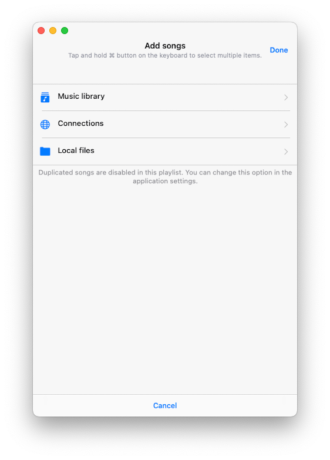
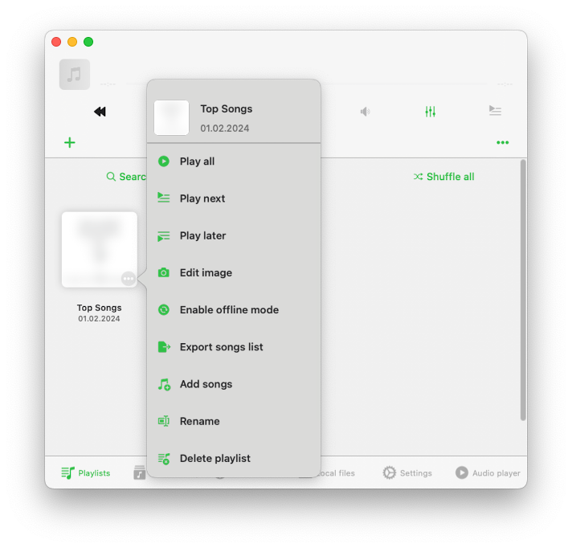
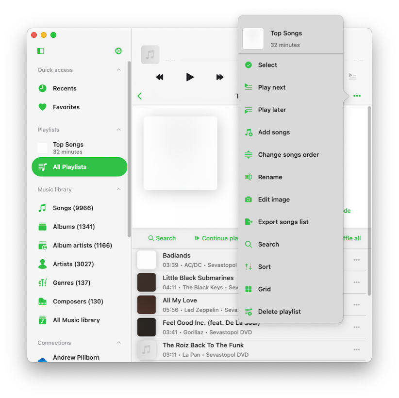
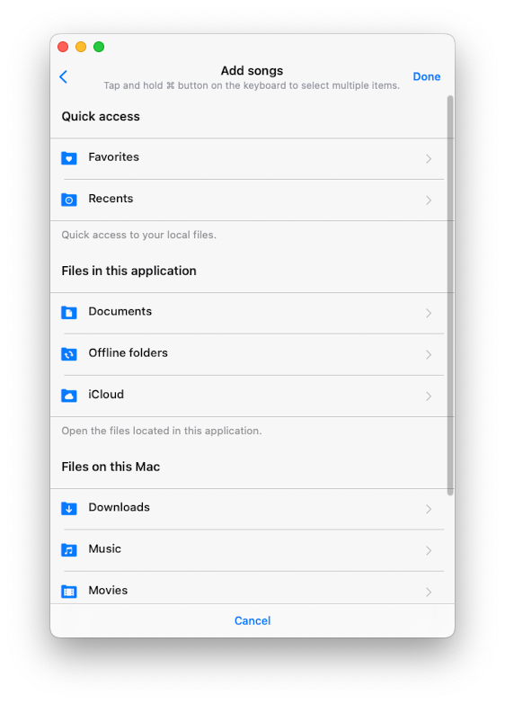
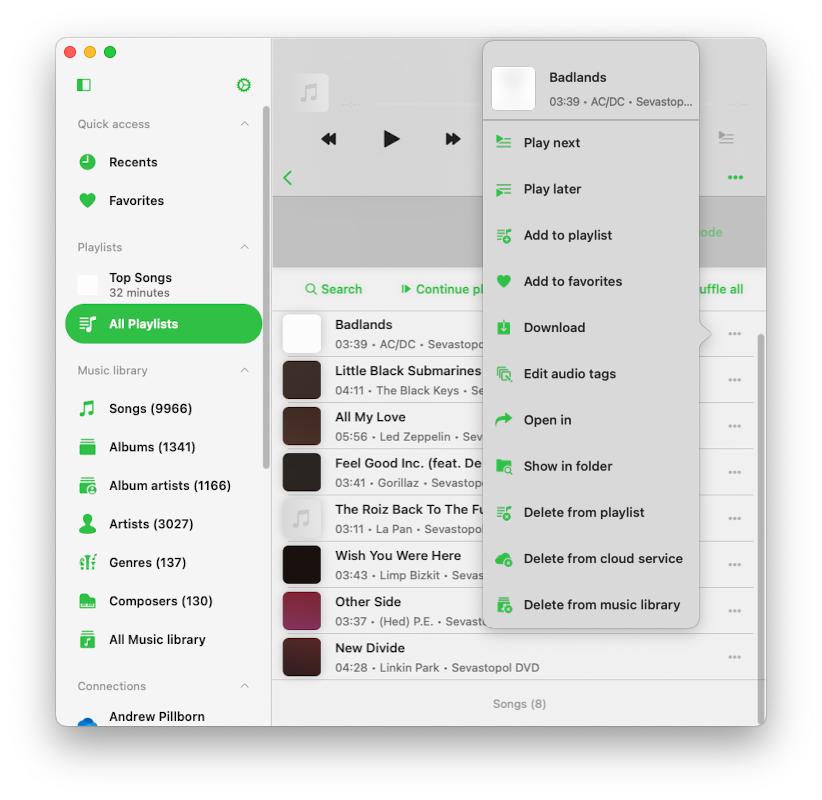

## Overview

The Playlists section provides you with the tools to organize your tracks into lists. It includes a content view showcasing all your created playlists, a "..." button in the navigation bar offering various playlist-related actions, and a navigation toolbar with "Search," "Play all," and "Shuffle all" buttons. Furthermore, each individual playlist itself features a "..." button near the playlist title, offering a range of actions specific to that playlist.

## Creating a Playlist

To create a new playlist, either tap the "+" button or the "..." button in the top right corner of the navigation bar, select "New playlist" and assign a name to your playlist. After naming it, tap "Save."

This prompts the "Add songs" dialog, where you can choose which tracks to add to the new playlist. Tracks are categorized by source type, and you have several options:

### Music library
- Tracks from your music library.

### Local files
- All audio files available for offline playback (you can add local files by downloading them from cloud storage, importing them from WiFi Drive, or using iTunes File Sharing).

### Connections
- All online files located in connected cloud services.

By default, you can add a track to a playlist only once. To allow duplicated songs in a playlist, enable this feature in the app Settings - Music library - Playlists - Duplicates in a playlist - Enable.

## Import Playlist

In Evermusic, we’ve added M3U file import functionality, so you don’t have to create playlists manually.

First, go to the ‘Playlists’ section. Then, tap the ‘More’ button in the top right corner. From the menu that appears, select the ‘Import Playlist’ option.

On the next screen, choose the file location. Supported options include:

- Connected cloud storage
- Files in the application
- Files on your device

Let’s select connected cloud storage and open the folder containing the playlist file. Supported playlist file extensions include M3U, M3U8, and CUE. Select the playlist file and tap ‘Done’ to confirm your selection.

The app will parse the playlist file, create a list of tracks, and locate those files on the storage to compile a final playlist, which will be imported into the music library. It’s crucial that your M3U/CUE file contains the correct paths for media files, and the files should be located at those paths on your storage. You can read more about playlist import [here](https://www.everappz.com/post/how-to-import-m3u-playlist-to-evermusic-and-flacbox).

## Playlist Detail Screen

When you open a playlist, the "Playlist detail screen" appears. On this screen, you'll find a "..." button in the top right corner with playlist options and three buttons under the artwork image: "Search," "Continue playback," "Play all," and "Shuffle all." Additionally, there's an "Offline mode" checkbox.

### Search
Perform a search within the current playlist.

### Play all
Add all tracks from the current playlist to the player queue.

### Shuffle All
Similar to "Play all," but shuffles the tracks before adding them to the audio player queue.

### Offline mode
Download all tracks from this playlist to local files. Any new items added to the playlist will be automatically downloaded.

## More Actions for Playlist in the Playlists Screen

You can access actions for a playlist by tapping the "..." button near the playlist title. Here are the available actions:

- **Play all:** Adds playlist tracks to the new player queue.
- **Play next:** Adds playlist tracks to the top of the existing player queue.
- **Play later:** Adds playlist tracks to the bottom of the existing player queue.
- **Enable offline mode:** Enables offline mode for the playlist. In this scenario, both existing and new tracks will be downloaded automatically.
- **Edit image:** Edit the playlist's artwork image.
- **Add songs:** Add more songs to the current playlist.
- **Rename:** Rename the playlist.
- **Delete playlist:** Delete the playlist from the Music library. Please note that this action cannot be undone.

## More Actions for Playlist in the Playlist Detail Screen

You can access actions for a playlist by tapping the "..." button in the top right corner. Here are the available actions:

- **Select:** Activates track selection mode, useful for deleting multiple tracks from the playlist or changing their order.
- **Play next:** Adds playlist tracks to the top of the existing player queue.
- **Play later:** Adds playlist tracks to the bottom of the existing player queue.
- **Sort:** Change the order of tracks in the playlist. Sorting options include "Song title," "Song number," "Album," "Artist," "Album artist," "Genre," "Composer," "Rating," "Year," "Beats per minute," "Duration," "File name," "File modification date," "File creation date," and "Manual." The "Manual" sort option allows manual reordering of songs using drag-and-drop.
- **Search:** Search for a specific song within the current playlist.
- **Add songs:** Add new songs to the playlist.
- **Export songs list:** Export this playlist to different formats. You can read more [here](https://www.everappz.com/post/export-tracks-collection-from-evermusic-flacbox-to-m3u-csv-txt).
- **Change songs order:** Manually change the order of songs in the playlist using drag-and-drop.
- **Edit image:** Edit the album artwork for the current playlist.
- **Rename:** Rename the current playlist.
- **Grid/List:** Change the screen layout presentation.
- **Delete playlist:** Delete the playlist from the Music library. Importantly, this action does not delete tracks from your storage, and it cannot be undone.

## Changing Song Order in a Playlist

To change the order of songs in a playlist, tap the "..." button in the top right corner and select "Select" to enter selection mode. Use the reorder control and drag-and-drop gestures near each track to move them up or down. Tapping on the reorder control will move the track to the top of the list. To exit selection mode and apply changes, tap "Done."

## Changing Playlist Cover Image

To change the cover image of a playlist, tap the "..." button in the top right corner and select "Edit image." Choose an image from the available sources and confirm the changes by tapping "Done."

## Adding Songs to a Playlist

Open the playlist and tap the "..." button in the top right corner, then select "Add songs" to open a dialog. Choose the tracks you want to add and confirm the changes by tapping "Done."

## Deleting Multiple Songs from a Playlist

Open the playlist, tap the "..." button in the top right corner, and select "Select" to enter selection mode. Choose the tracks you want to delete and tap the "Delete from playlist" button at the bottom of the screen. Confirm the changes by tapping "Done."

## Track Options

Each track in a playlist has a list of actions, accessible by tapping the "..." button. If you can't see all actions, scroll down to view them. You can delete the track from the playlist, download it, edit audio tags, and more.

- **Play next:** Adds the track to the top of the player queue.
- **Play later:** Appends the track to the bottom of the player queue.
- **Add to a playlist:** Adds the track to a playlist.
- **Add to favorites:** Marks the track as a favorite for quick access.
- **Download:** Makes the track available offline. It will appear in the transfer queue and the "Local Files" tab in the "Downloaded music" section of the Music library.
- **Edit audio tags:** Opens the built-in tags editor for changing track metadata.
- **Open in:** Exports the track and opens it in another app.
- **Show in folder:** Reveals the folder where the audio file is located.
- **Show in Finder:** For files imported from your Mac, this action reveals the folder where the audio file is located on your Mac computer.
- **Delete from playlist:** Deletes the track from the playlist.
- **Delete from cloud service:** Deletes the track from the playlist and the associated cloud service. Please note that this action cannot be undone.
- **Delete from music library:** Deletes the track from the music library, leaving the file on storage untouched.

## Accessibility

Our app is fully accessible with VoiceOver technology, ensuring every component has a well-designed label and description. When VoiceOver is active, the app translates the user interface to text mode, displaying only accessible and useful elements to improve navigation speed and convenience. You can also activate text mode in Settings > Accessibility > Text Mode.

For adjusting track position in a playlist with VoiceOver:

1. Open a playlist and tap the "More" button.
2. Select "Change Songs Order." The view will switch to editing mode.
3. Tap the reorder indicator icon near the track title to give it focus.
4. Double-tap the reorder indicator icon quickly. On the second tap, do not release your finger—hold it until you hear a sound indicating the cell is ready to be moved.
5. Now, you can move the cell to a new position.

Other components work as expected, using system-provided VoiceOver patterns.
