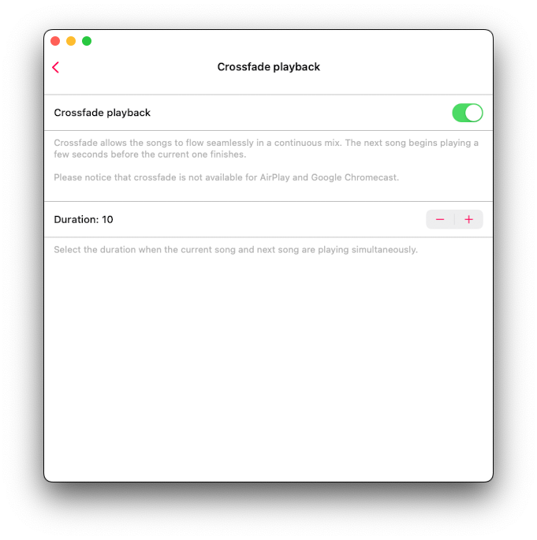
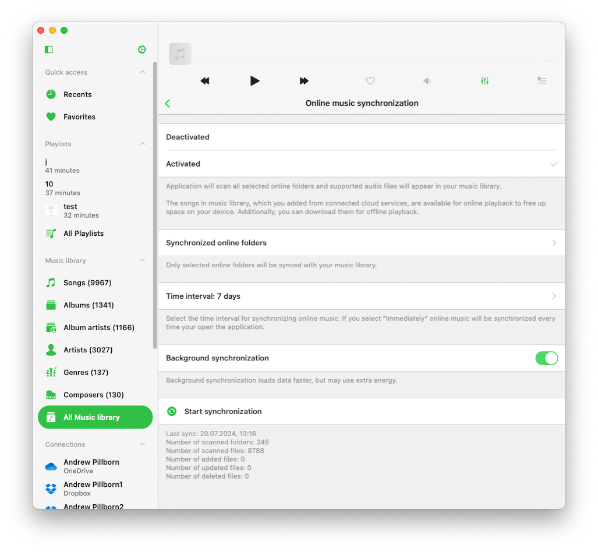
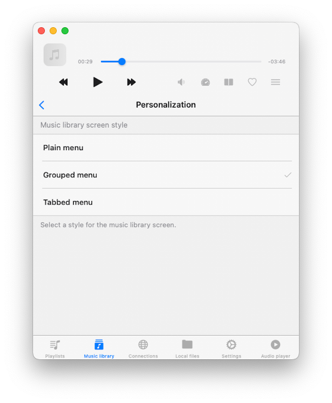
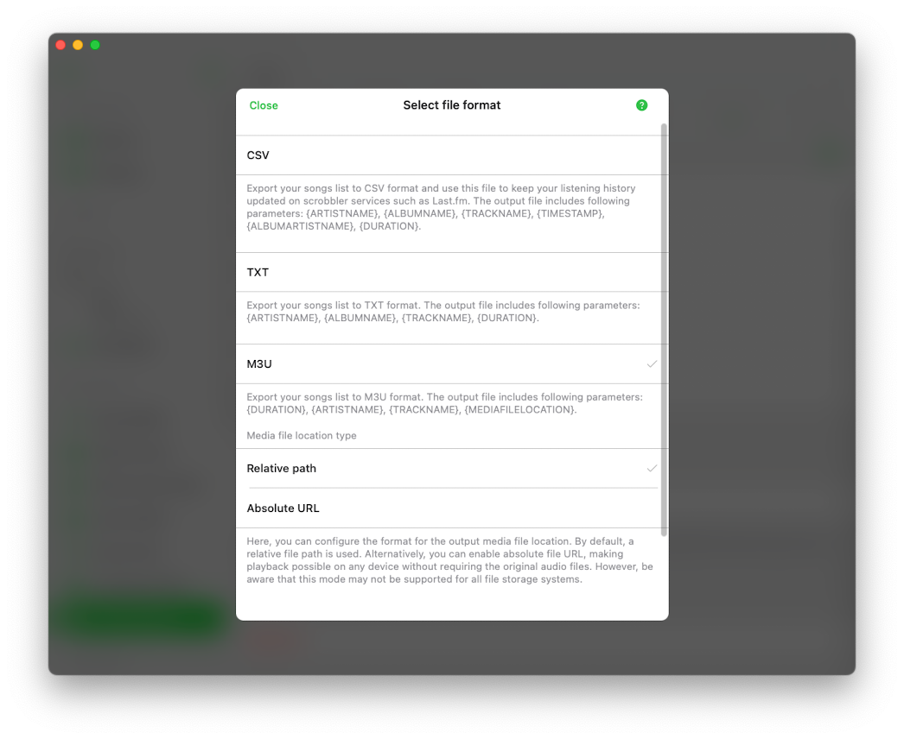

On this screen, you can access the application settings and upgrade it to the Premium version.

## Upgrade to Premium

Upgrade the application to the Premium version to remove all limits. The free version of the application offers one-lifetime in-app purchase and two subscription options that allow you to remove all restrictions and upgrade to the Premium version.  

Also, please keep in mind that **Family Sharing** is enabled for all purchases and plans, so you can share the Premium version with members of your family.  

You can read more about purchases and Premium version here: [What is the difference between Evermusic and Evermusic Premium](https://www.everappz.com/post/what-is-the-difference-between-evermusic-and-evermusic-premium).

## Sharing Purchases Between iOS and Mac

Please keep in mind that lifetime purchases and subscriptions are shared between iOS and Mac, using iCloud to sync this information. If you have the premium version on your iOS device, please ensure you have the latest version installed and that iCloud is enabled. Start the app on iOS and wait one minute for your purchase information to upload to iCloud.

You can also try pressing the "Restore Purchases" button in the app settings. Afterward, install the latest app version from the App Store on your Mac and start the app. Ensure you have an internet connection and are using the same iCloud and App Store account on your Mac that you used on your iOS device. Wait one minute for the app to download purchase info from iCloud. The premium version should activate on your Mac automatically.

## Restore purchases on a New Device

To restore your purchase on the new device just use the **Purchases -> Restore purchases** menu. You will see the list of your purchases. If you don't see all your purchases please check if the device is connected to the same iTunes account that was used to make purchases, and make sure iCloud is enabled.

## Try Premium for Free 

You can upgrade to the Premium version for free but for a limited time only using this menu. Just watch an advertisement or tell your friends about this app to get the Premium version for free.

## Purchases 

You can restore previous purchases from this menu. If you encounter activation errors, try enabling the “Restore Purchases at App Launch” option.

## What’s new 

This menu is available after new version released. You can see what is new in the updated application.

## Audio Player Settings

All audio player settings available in this section like equalizer, crossfade playback, audio player cache, song loading, and so on. They are all grouped by functionality.

### General 

This section contains general audio player settings for playback queue, audio output, and state-saving.

#### Repeat mode

Change the repeat mode to specify the audio player’s behavior when a track finishes playback. You have several options.

  - "Repeat all" – for looping all tracks in your player queue.
  - "Repeat one" – for repeating only the current track.
  - "Repeat Stop" – to pause playback when the current track ends.
  - "Repeat None" – for letting your queue play through without repeating.

#### Shuffle mode 

Change tracks order randomly. This action changes tracks order in the queue and tracks are played one by one with the new order. Available values: "Shuffle off", "Shuffle on".

#### Audio processor

Possible values: AVFoundation and CoreAudio. By default, the AVFoundation audio processor is used. However, due to a known issue with the AVFoundation audio processor in iOS versions 17.0 to 17.6, the crossfade playback feature and the audio equalizer cannot be used simultaneously. To enjoy both crossfade playback and the audio equalizer on iOS 17.0-17.6, switch to the CoreAudio audio processor.

Additionally, if you experience issues with gapless playback using the AVFoundation audio processor, try switching to the CoreAudio audio processor. The only limitations of the CoreAudio audio processor are internet streaming of some radio stations and certain audio formats, as it does not support all system audio formats like M4A and some others.

#### Audio output sample rate

This lets you set the audio output sample rate from 8KHz to 384KHz. This feature is available if the CoreAudio audio processor is selected.

#### Audio output number of channels

This lets you set the audio output number of channels. Possible values are MONO and STEREO. This feature is available if the CoreAudio audio processor is selected.

#### Audio pitch algorithm

This lets you set the audio pitch algorithm that will be applied for pitch correction. Available values are ‘Time Domain,’ ‘Spectral,’ and ‘Varispeed.’ Useful if you need to increase playback speed.

#### Spatial audio

Spatial audio uses psychoacoustic methods to create a more immersive audio experience when played on specialized headphones and speaker arrangements. This setting lets you configure the audio to apply the spatial audio effect. Possible values are: Deactivated, Mono and Stereo, Multichannel, Mono Stereo Multichannel.

#### Audio output mode

Available on iOS only. Lets you set audio output mixed mode so audio from this application will blend with other applications. You can find instructions about how to use mixed mode [here](https://www.everappz.com/post/how-to-record-video-while-playing-music-on-iphone).

#### Save playback position

Ensures the application saves and restores playback position for songs in your Music library.

#### Save audio player state

Saves your audio player state before closing the application, making it easy to resume from where you left off.

Once you’ve enabled both of these features, open any folder, album, artist, or genre within Evermusic. You’ll notice a **Continue Playback** action at the top of the screen, along with the last saved song playback position. To restore the playback progress, simply tap on the ‘Continue Playback’ button. If you want to restore playback for an individual file, tap on that specific file.

### Personalization

Allows you to customize the look of the audio player screen, change available controls on the main screen of the audio player, lock screen, and status bar during audio playback, and configure skip time controls.

#### Audio Player Screen Style

You can configure the positioning for toolbars and main controls on the main screen of audio player.

#### Album Covers Scrolling Style

You can configure the preferred album covers scrolling style on the main screen of audio player.

#### Additional Elements 

This allows you to enable additional elements on the audio player screen. Enabling ‘Audio Format Info’ will show the now-playing track’s audio info above the artwork picture. Enabling the ‘Audio Volume Slider’ will show the audio output slider below the playback controls on the main screen of the audio player.

#### Main Screen Actions

This allows you to configure which buttons should be visible on the main audio player screen by default. Possible values include Repeat and Shuffle Mode, Next and Previous Song, Skip Time, Sleep Timer, Google Chromecast, AirPlay and Bluetooth, Audio Equalizer, Search, Bookmarks, Speed, Add Bookmark, Add to Favorites, Comments, and others.

#### Playback Controls on the Lock Screen

You can set which controls should be enabled on the lock screen. Possible values are Skip Time, Add Bookmark, and Add to Favorites.

#### Skip Time Intervals

You can select the time interval for the ‘Skip Time’ buttons here.

### Files Loading

During the song loading process, you can change the network type that app uses to load songs. Available options - "Wi-Fi", "Wi-Fi and Cellular data".

#### Preloading time

Set buffering time interval. You may increase this value if you have a bad network connection.

#### Use direct URL

When this option is enabled a direct URL will be used to load the song if the server supports it. This can speed up song loading but may affect playback stability.

#### Optimize files loading 

When this option is enabled the system will optimize song loading for the AVFoundation audio processor. This can enhance playback stability. The app uses the technology described [here](https://www.everappz.com/post/audio-streaming-and-caching-in-ios-using-avassetresourceloader-and-avplayer).

### Audio Equalizer

This is where you can change the audio equalizer configuration. You can read more about configuring audio equalizer, presets, configurations [here](https://www.everappz.com/post/how-to-use-the-audio-equalizer-on-your-iphone-ipad-mac-with-evermusic-and-flacbox).

### Connect to a device

This is where you can connect to Airplay or Google Chromecast device (iOS only)

### Playback Speed

This lets you adjust the audio player playback speed. If you need more precise adjustments, activate the precise slider by tapping the configuration icon in the top right corner.

### Crossfade playback

Crossfade allows the songs to flow seamlessly in a continuous mix. The next song begins playing a few seconds before the current one finishes. Please notice that crossfade is not available for AirPlay and Google Chromecast. On this screen, you can select the duration when the current song and next song are playing simultaneously. If you experience issues with crossfade playback and the audio equalizer simultaneously, consider changing the audio processor as described above.

### Gapless playback

Gapless playback ensures that songs play without any interruptions or silence in between. It’s perfect for genres like classical music, live recordings, and concept albums. If you have issues with gapless playback, consider changing the audio processor as described above.

### Playback Cache

Songs in the audio player queue will be downloaded automatically for smooth playback. If you download audio files manually, you can disable this option to avoid duplicates. You can also configure the audio player cache size here. You can read more about offline mode and playback cache here: [Play Offline Music in Evermusic & Flacbox: Download & Sync from Cloud to Local Files](https://www.everappz.com/post/play-offline-music-in-evermusic-flacbox-download-sync-from-cloud-to-local-files) 

### Sleep timer

Lets you enable a timer to stop playback after a specified timeout. If you need more precise adjustments, activate the precise mode by tapping the configuration icon in the top right corner.

## Library

Your music library settings like automatic sync, metadata reading, loading of album artworks, playlists are located here.

### Metadata Reading

When you add tracks to the library, the metadata reader gets to work. This background process reads all metadata from your tracks and organizes them by Artist, Album, Genre, and Composer. You have the flexibility to adjust the speed of metadata reading to load data faster, but be aware that this may use more energy. You can also disable the metadata reader and display file names instead of tag information.

Importantly, the metadata reader only updates metadata in your music library and does not alter the files stored in your cloud account or local storage. If you wish to edit metadata for audio files, you can do so using the built-in tags editor, which you can activate from the corresponding action in the options menu.

When the **Metadata reading in the background** switch is on, the metadata reader works in background mode. However, please note that if the app consumes a lot of energy during audio playback, the iOS operating system may suspend it.

So, if you have a large music collection, it's advisable to use the desktop version of the application for metadata synchronization. You can then use the data backup and restore feature to transfer the synchronized music library from the desktop, which is available in app settings.

When the **Normalize metadata encoding** is enabled, the app will automatically normalize metadata encoding for all songs in the music library. This fixes issues where audio tags’ encoding is broken (such as after editing files on a Windows PC) and prevents incorrect information from displaying while a track is playing or added to the library.

The **Reload metadata** action will flag all files in your music library as having missing metadata, triggering the metadata reader to refresh the metadata for every file in your music library.

Tap the **Start Metadata Reading** action to start the metadata reader. The operation progress will be displayed below.

### Online Synchronization

Automatic online music sync allows you to add tracks from connected cloud services to the music library automatically. To activate this feature, head to music library settings and select sync folders.

With this option enabled, the application scans all selected folders, identifies supported audio files, and seamlessly integrates them into your library. You can start or stop synchronization by tapping on the corresponding menu action.

Online music synchronization operates exclusively when the app is in the foreground, which means synchronization may take some time. To speed up the process, leave your app open, connect it to a power source, and enable **'Screen' -> 'Always active'** option in application settings.

Alternatively, you can perform online music synchronization on the desktop version of the app and transfer the music library to the iOS version using the data backup restore feature.

You can also set how often you want to synchronize your online music library. If you set it to **"Immediately"**, online sync will start every time you open the application.

### Offline Synchronizationh

Here you can configure offline music synchronization.

#### Synchronized Offline Folders

When you make an online folder on your cloud server available offline (using the **More Actions** menu), this folder will appear here. The folder content will be downloaded to the **Local Files -> Offline Folders** section. When you change the online folder on the cloud server (adding, removing, or updating files), the app will check for changes and update the local copy of this folder on your device.

On this screen, you can manually start offline folder synchronization, show the offline folder in its enclosing folder, and disable offline mode for this folder. Disabling offline mode will remove all local copies of files from your device.

#### Time Interval

You can set the time interval for how often the app should check offline folders for modifications.

#### Start Local Folders Scanning

This option scans all local folders located in the application’s **Documents** directory to find supported audio files. All these local files are seamlessly added to your music library. Local files located on your device but outside of this application must be added to the music library manually, as the app does not have access to files outside the application Documents directory due to iOS/MacOS security restrictions.

**Important:** It is advisable to periodically initiate offline music synchronization to keep your music library updated with your local files.

### Personalization

In this section, you can configure the music library screen style to suit your preferences. Three options are available: Plain menu, Grouped menu, Tabbed menu. Also you can enable or disable showing album covers in album details screen.

### Album Covers

Here, you can enable the search for album covers within your music folders. You can also choose the quality of album covers stored on your device and manage your cached album covers. By default, the app will check for embedded album covers in your tracks and display them if available. If there are no embedded album artworks and the ‘Search in the folder’ option is enabled, the app will check the enclosing folder for JPEG or PNG images and use them as album artwork for all tracks in that folder.

### Playlists

You can enable the option to add the same song to a playlist twice. By default, this option is disabled.

### Recents

You can manage your recently played songs list.

- **Delete List:** You can delete the entire list of recently played songs.
- **Change List Size:** You can set the number of items that should appear in the list.
- **Export Songs List:** Use this action to export your recently played songs list in different formats: M3U, CSV, or TXT. Detailed instructions are available on our website [here](https://www.everappz.com/post/export-tracks-collection-from-evermusic-flacbox-to-m3u-csv-txt).

### Favorites

You can manage the list of your favorite songs.

- **Simultaneous Editing:** Enable this option to add a song to the favorites list in both the music library and the files section simultaneously.
- **Delete List:** You can delete the entire list of favorite songs.
- **Export Songs List:** Similar to the Recents section, you can export the list of your favorite tracks in different formats: M3U, CSV, or TXT.

### Delete music library

This action will erase the music library database, but it will leave your music files untouched.

## Passcode

Activates the password protection screen if you want to protect your application data.

## File manager

### File transfers

Choose your network preference when downloading files to your device.

#### Maximum number of parallel tasks

Set the number of parallel download threads. Choosing a higher number will speed up file downloads but may require extra battery power.

#### File transfer tasks

Displays currently active upload/download tasks.

#### Background transfers

You can enable downloads even when the app is running in the background. Please be aware that if this operation consumes a significant amount of energy, the operating system may suspend the app.

#### Save downloaded files to

Define your default downloads directory or opt to be prompted every time to choose where to save files.

#### Synchronized offline folders

Manage synchronization of selected offline folders. If you want to synchronize a folder for offline playback, tap the three dots button near the folder name and select ‘Available Offline Mode.’ All new files added to the cloud folder will be downloaded to your device automatically. You can read more about offline modes [here](https://www.everappz.com/post/play-offline-music-in-evermusic-flacbox-download-sync-from-cloud-to-local-files).

#### Time interval

Select the time interval for synchronizing offline folders. If you choose "Immediately," offline folders will be synchronized every time you open the application.

#### Show full filenames

Activate this option if you need to view complete filenames, including extensions, in the file manager.

#### Edit online files

You can disable online file editing and switch to a read-only mode for connected cloud services to prevent accidental file deletions. This action removes file editing operations from the user interface.

#### Copy files when opening

Specify how the app should handle imported files from other applications.

#### Thumbnails for files

Delete and manage generated file thumbnails to free up storage space.

#### Delete temporary files

Clear the application's cache folder to reclaim storage space.

## Audio tags editor

In this section, you can configure the built-in audio tags editor.

### Album cover scaling

Here you can select the scaling method for the album cover when saving it to audio tags.

### Update online files

You can enable this option, and the application will automatically update the file's metadata on a cloud server after you've finished editing it.

### Edit online files

You can choose whether the application should delete the downloaded file after you've finished editing the online file on a cloud server.

### Main screen buttons

You can choose which buttons should be available on the main screen of the audio tags editor.

## CarPlay

You can change CarPlay settings here. This menu also abailable in CarPlay interface allowing you to optimize it.

### Sort

You can change sort options here for all CarPlay screens.

### Content loading limit

You can select if the app should use pagination in CarPlay screen.

### Show images

You can disable images on CarPlay screen to optimize loading speed.

### Pause playback when connected

You can enable this to avoid sudden loud audio when you connect to CarPlay interface.

## WiFi-Drive

In this section, you can activate the WiFi Drive feature, which allows you to transfer files from your computer to this device using a desktop web browser. We have detailed instructions on how to use WiFi Drive [here](https://www.everappz.com/post/how-to-transfer-files-wirelessly-from-a-computer-to-an-iphone-using-wifi-drive).

## Personalization

In this section, you can customize the user interface settings to suit your preferences.

### Application icon

Select an application icon for your home screen, whether you want a fresh new look or something that matches your style.

### Color scheme

Customize the user interface theme and enable dark mode here. When the default option is selected, the application will adapt its color scheme based on your device's appearance settings.

### Background style

Modify the background style of the application. Currently, the only available option is "Blurred album cover." When enabled, a blurred album cover image will serve as the application's background.

### Appearance of items in the list

Here you can customize how items in the list are displayed, which is especially useful for devices with smaller screens. You can choose whether the app should automatically adjust the height based on the content or show smaller icons in list cells to provide more space for text.

### Content loading limit

By default, the application uses pagination to speed up content loading. However, you can opt to disable this feature, allowing the application to load all available data at once.

### Local files screen style

Change the presentation style for the "Local files" section to your preference.

### Music library screen style

Customize the style of the "Music library" screen to suit your taste.

### Audio player screen style

Configure the style of the "Audio player" screen to match your preferences.

### Context menu style

Select a style for the context menu that appears when you tap the 'More Actions' button.

## Screen

In this section, you have the option to customize whether the screen should stay active while you're using the application.

## Accessibility

In this section, you can activate text mode for the application, which hides all images. This feature is automatically enabled when VoiceOver is active.

## Language

In this section, you can change the application language and override the default system settings. Currently, the app supports following localizations: Afrikaans, Akan, Albanian, Amharic, Arabic, Armenian, Assamese, Aymara, Azerbaijani, Bambara, Bangla, Basque, Belarusian, Bosnian, Bulgarian, Burmese, Catalan, Cebuano, Chinese, Simplified, Chinese, Traditional, Corsican, Croatian, Czech, Danish, Dhivehi, Dogri, Dutch, English, Esperanto, Estonian, Ewe, Filipino, Finnish, French, Galician, Ganda, Georgian, German, Greek, Guarani, Gujarati, Haitian Creole, Hausa, Hawaiian, Hebrew, Hindi, Hmong, Hungarian, Icelandic, Igbo, Iloko, Indonesian, Irish, Italian, Japanese, Javanese, Kannada, Kazakh, Khmer, Kinyarwanda, Korean, Krio, Kurdish, Kurdish, Sorani, Kyrgyz, Lao, Latin, Latvian, Lingala, Lithuanian, Luxembourgish, Macedonian, Maithili, Malagasy, Malay, Malayalam, Maltese, Māori, Marathi, Mizo, Mongolian, Nepali, Northern Sotho, Norwegian Bokmål, Nyanja, Odia, Oromo, Pashto, Persian, Polish, Portuguese, Punjabi, Romanian, Russian, Samoan, Sanskrit, Scottish Gaelic, Serbian, Shona, Sindhi, Sinhala, Slovak, Slovenian, Somali, Southern Sotho, Spanish, Sundanese, Swahili, Swedish, Tajik, Tamil, Tatar, Telugu, Thai, Tsonga, Turkish, Turkmen, Ukrainian, Urdu, Uyghur, Uzbek, Vietnamese, Welsh, Xhosa, Yiddish, Yoruba, Zulu

## Backup & Restore

Use this feature to backup all your application data or migrate it to another device.

You can choose which data you want to migrate:

- **Database:** All your tracks in the music library, including playlists. Offline tracks will not backup to optimize backup file size.
- **Album Covers:** All your cached album covers.
- **Settings:** All your application settings.

To start the backup operation, just tap the **Backup Application Data** button. Application data will be backed up to a file, and you can use it in the future to restore the application state on a new device or after reinstalling the application.

If you need to restore application data on a new device, move the backup file from this device to the new device using a connected cloud service or iCloud and open it on the new device.

We have detailed instruction about how to use data backup and restore feature here: [How to Transfer Your Music Library Between Devices in Evermusic: Step-by-Step Guide](https://www.everappz.com/post/how-to-transfer-your-music-library-between-devices-in-evermusic-step-by-step-guide).

## Help

Access the application guide for assistance and guidance on using the app effectively.

## Frequently Asked Questions

Find answers to common questions in the FAQ section.

## Send Feedback

Have feedback or need assistance? Send your feedback to our support team.

## Share This App

Share this application with your friends and spread the word.

## Discover More Apps

Explore our other apps and discover more from our collection.

## Terms and Conditions

This section outlines the terms and conditions for using the application. Please read it before using the application.

## Privacy Policy

Visit the privacy policy page to understand our data handling practices. Please read it before using the application.

## Analytics and Data Collection

Here you can check what services are enabled for analytics and data collection and deactivate them if you need.

## Legal Notices

This section contains information about all the libraries and app version details used in the application.