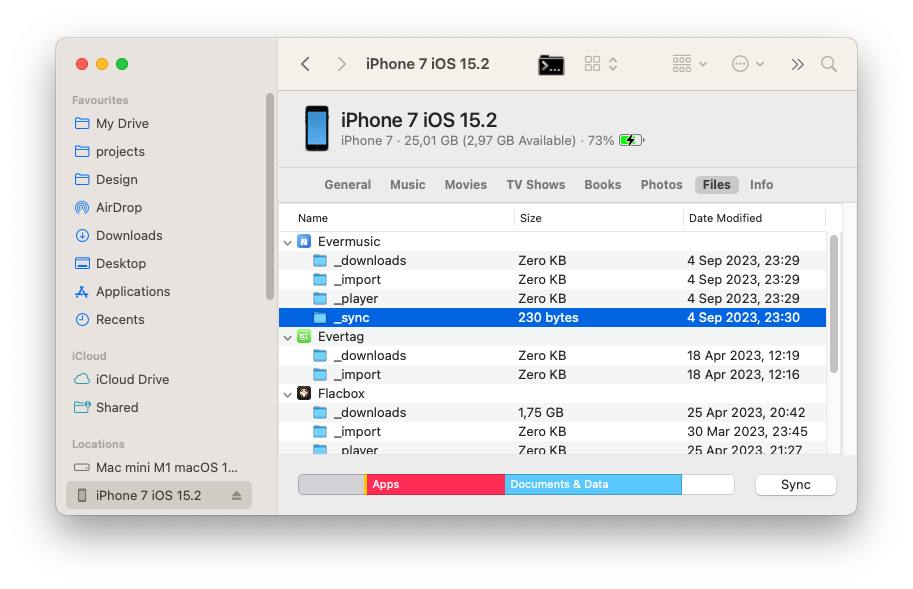

# Flacbox Guide: Connections

**Writer:** admin  
**Date:** Feb 1, 2020  
**Updated:** Dec 8, 2024  
**Read Time:** 11 min read

---

This screen is where you link up different sources for your music. You can bring in popular cloud services like iCloud Drive, Dropbox, Google Drive, OneDrive, or even connect your Mac or PC. Additionally, you can import music from Apple Time Capsule, NAS, Synology, or WD Cloud Mirror.

## To connect a cloud service:

- Go to the 'Connections' tab.
- Select 'Connect a cloud service' from the menu.
- Choose the cloud service you want from the list.
- Enter your login details, and tap 'Done.'

If you run into any issues, make sure your internet is working, and check your login and password. In the Premium version of the app, you can add as many services as you want.

### Supported cloud services:

Currently, the application supports the most popular cloud services: iCloud Drive, Google Drive, Dropbox, OneDrive, Box, MEGA, Yandex.Disk, WD MyCloud Home, DLNA, MediaFire, WebDAV, SMB, pCloud, HiDrive, 百度网盘, My Cloud Home, InfiniCLOUD, Cloud [Mail.ru](http://Mail.ru), [Put.io](http://Put.io), MyDrive.

## Security and privacy:

We prioritize your security and privacy. We only use official SDKs and secure connections to interact with connected cloud services. Your login and password are not accessible within the application. All requests from the app to the cloud service are encrypted.

When you enter your login and password, the app displays the official authorization page provided by the cloud service provider, and the authorization process occurs outside the app. After successful authorization, the cloud service provider sends an authentication token (auth-token) to the app, which is used to make API calls.

An auth token is a digital key that allows third-party applications to interact with cloud storage. It's stored securely on your device in a system storage called Keychain. You can download files from the connected cloud service to your device, and these files will be placed in the app's "Documents" directory. You can remove these files anytime using the built-in file manager.

The application does not share any information from your connected cloud account. You can revoke access to your cloud account anytime by opening the account settings page in your web browser.

### To reject auth-token:

Login to your account on the web browser and navigate to the settings page. There you can find all third-party apps which are connected to your cloud account and remove any of them if you don’t want to use that application anymore. Detailed instructions available [here](https://www.everappz.com/post/how-to-disconnect-third-party-app-from-your-google-account).

You can also disconnect the connected cloud account in the application and auth token will be also removed from your device. If you remove the application from your device all downloaded data and access tokens will be also removed.

## Disconnecting a Cloud Service or Changing Configuration:

To disconnect a cloud service or change its configuration:

- Locate the cloud service within the app's interface.
- Next to the service title, tap the '...' (ellipsis) button.

## Connecting a Computer or NAS:

You can also connect your computer, personal NAS, or other network devices using SMB, DLNA, or WebDAV protocols.

### To connect a computer using SMB protocol:

- Tap "Connect a cloud service" → "SMB".
- Enter the computer's IP address and shared folder name in the URL field using this format: smb://computer-ip-address/shared-folder-name.
- Choose the protocol version: Auto, SMB1, SMB2.
- Enter your login and password (if required).
- Tap "Done."

If the connection is successful, you'll see the connected storage in the "Cloud services" section. A full tutorial on how to connect your Mac or PC using SMB is available [here](https://www.everappz.com/single-post/Stream-your-music-from-MAC-or-PC-to-iPhone-using-SMB).

For **WebDAV** protocol, the steps are the same, except for the URL field. The URL should be in the format [http://server-name](http://server-name/) or [https://server-name](https://server-name/) if SSL is supported.

You can also share your music library using the **DLNA** protocol located on your Windows PC. Accessing that library in the app is described [here](https://www.everappz.com/post/how-to-enable-dlna-media-server-on-windows-10-and-play-your-music-on-iphone).

## Wi-Fi Drive:

Wi-Fi Drive is a handy technology that allows wireless file transfers from your computer to your iOS device via a desktop browser. To use this feature effectively, make sure your device and computer are on the same Wi-Fi network. Here's how to use Wi-Fi Drive:

### Enabling Wi-Fi Drive:

- Open the application and go to the "Connections" screen.
- Select "Connect using Wi-Fi" to access the Wi-Fi Drive settings.
- Toggle option to enable Wi-Fi Drive.

### Accessing Wi-Fi Drive on Your Computer:

- On your computer, open a web browser (like Chrome, Firefox, or Safari).
- In the browser's address bar, enter the URL provided by the application.

### Transferring Files Wirelessly:

Once the web page for your iOS device opens in the browser, you can simply drag and drop files from your computer onto the web page. The files you drag and drop will start transferring to your iOS device and will be accessible within the application. Detailed instructions on how to transfer files wirelessly using Wi-Fi Drive are available [here](https://www.everappz.com/post/how-to-transfer-files-wirelessly-from-a-computer-to-an-iphone-using-wifi-drive).

## iTunes File Sharing:

iTunes File Sharing is another method to transfer files from your computer to your device using the Finder app on your Mac and a lightning cable. Simply connect your device to the computer using the cable and open the Finder app on your Mac. Open "Locations" → "Your Connected Device" → "Files" → and find the Flacbox app. Tap on the app icon to see all shared folders. Copy files from the computer to the shared folder on the device using drag-and-drop. Detailed instructions on how to use iTunes file sharing are available [here](https://www.everappz.com/single-post/How-to-play-local-itunes-files-on-my-iPhone).

## To Connect a USB flashcard:

If you have an SD card, you can connect it using a lightning card reader. The app currently supports Apple Certified card readers and iXpand Flash Drives. If you have iXpand Flash Drive - insert it into the lightning port and open the application. You'll see an 'External device connected' message and device information. Simply tap on the flash drive icon to access the music folder and tap on any audio file to start playing. We have detailed instructions about how to connect a USB flashcard to the iPhone and listen to music or manage files located on it which is available [here](https://www.everappz.com/post/how-to-connect-a-usb-flashcard-to-the-iphone-and-listen-to-music-or-manage-files-located-on-it).

## File Manager:

Once you've connected to a cloud service, you can tap on it to see the list of available files. You can use the built-in file manager to edit files located in the cloud storage. You can download files and folders, rename them, move them, and more. When you start a download operation, the file will appear in the transfer queue. You can access the transfer manager in the "Local Files" tab. Tap the spinning arrows in the top left corner to access the transfer manager queue. You can find all downloaded files and folders in the "Local Files" section.

## Top Toolbar:

The top toolbar, located under the navigation bar, offers several useful actions for easy access. You can show or hide this toolbar with a simple swipe-down gesture. Here are the available actions:

- **Search:** Quickly search within the current directory to locate specific files or folders.
- **Continue Playback:** If enabled in the application settings, this feature restores the audio player queue and the last media position for the current folder, allowing you to pick up where you left off in your music library.
- **Play All:** This action scans the current folder and its subfolders, adding all the found audio files to a new player queue. Useful when you want to play all the music within a particular directory.
- **Shuffle All:** Similar to "Play All," this action scans the current folder and its subfolders but shuffles the files before adding them to the audio player queue. Great for enjoying your music in a random order for variety.

## Current Folder Options:

When you open a folder within the app, you'll find a set of handy actions available by tapping the '...' (ellipsis) button in the top right corner of the screen. Here's a breakdown of these actions:

- **Select:** Activate file selection mode, enabling you to choose one or more files within the folder for various actions.
- **New Folder:** Create a new folder within the current folder to help organize your files.
- **Enable Offline Mode:** Toggle on offline mode for the current folder. Offline mode goes beyond simple downloading; it actively monitors the folder for changes. If new files are added to the folder online, the app automatically downloads them to your device, ensuring your local library stays up-to-date.
- **Upload Files:** Transfer files from your device to the online folder, making them accessible from anywhere.
- **Search:** Quickly search for specific files within the current folder.
- **Sort:** Organize files within the folder by criteria such as name, size, or date edited. The default sort mode typically mirrors the sorting order on the server, but you can change it to suit your preferences.
- **Grid/List View:** Switch between two viewing modes: table view and thumbnail view. Table view presents files in a list, while thumbnail view displays visual representations of the files for easier identification.

## Editing Online Files:

When you need to manage multiple files within your cloud storage on Flacbox, you can use the select mode to streamline your actions. Here's how to do it:

- **Activate Select Mode:** Open the Flacbox app on your device and navigate to the section containing your cloud storage. Look for the '...' (ellipsis) button in the top right corner, and tap on it to activate select mode. Checkboxes will appear next to every file or folder listed.
- **Select Desired Files:** In this mode, you can choose one or multiple files or folders by tapping the checkboxes next to them. You can adjust your selection based on your preferences.
- **Perform Various Actions:** Once you've selected the files or folders you want to manage, you'll have access to several actions tailored to your needs. These actions include playing, adding to your music library, adding to playlists, downloading for offline use, moving, renaming, and deleting, among others.

## File actions:

For individual files, you can access various actions via the '...' (ellipsis) menu near the title of the file. These actions include playing the file next or later in the queue, adding it to your music library, adding it to a playlist, editing audio tags, downloading it, renaming it, moving it, opening it in another compatible app, or deleting it.

## Folder actions:

For folders within your cloud storage, you have multiple actions available. To access these options, tap the '...' (ellipsis) icon next to the folder title. Here are the available actions:

- **Play All:** Replace the current player queue with all the items from the selected folder.
- **Play Next:** Add the entire folder to the top of the player queue, right after the currently playing item.
- **Play Later:** Append the folder contents to the bottom of the player queue.
- **Add to Music Library:** This action seamlessly incorporates the folder's content into your music library, making it easily accessible and neatly organized by artist, album, genre, or composer.
- **Add to Playlist:** You can include the entire folder in a playlist. You also have the option to create a new playlist, and the folder's name will be automatically assigned.
- **Add to Favorites:** Use this action to add the folder to your list of favorite files for quick and convenient access.
- **Enable Offline Mode:** By enabling offline mode for a selected folder, the application goes beyond simple downloading. It continuously scans for changes, and if new files are added to the online folder, they will be automatically downloaded to the app.
- **Download:** Download all the contents of the folder to your device for offline access.
- **Rename:** Rename the folder directly on the remote storage.
- **Move:** Relocate the folder to a different location within your cloud storage.
- **Delete:** Be cautious with this action as it permanently removes the folder and its contents from your cloud storage. This action cannot be undone.

---

**Tags:** [guide](https://www.everappz.com/blog/tags/guide), [flacbox](https://www.everappz.com/blog/tags/flacbox), [connections](https://www.everappz.com/blog/tags/connections)  
**Category:** [Guide](https://www.everappz.com/blog/categories/guide)