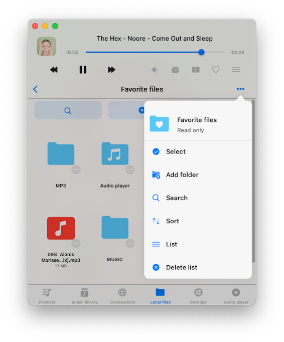
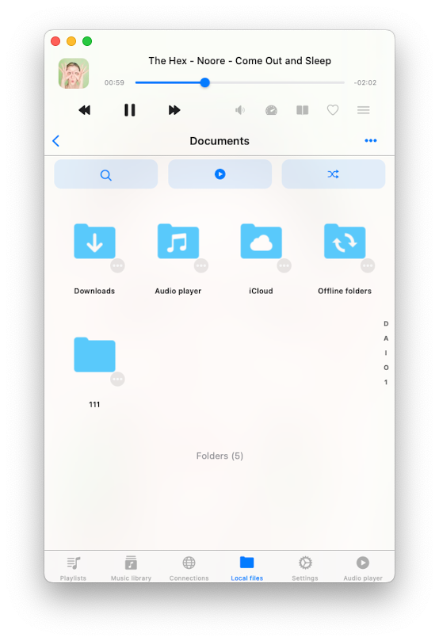

The Local Files section serves as a central hub for overseeing files located in the app's "Documents" folder and those added from your device, which are accessible for offline playback.

This built-in file manager provides you with the tools to edit files and offers various methods for importing audio files into the app:

### Downloading from Cloud Services:
You can seamlessly add audio files to the app by downloading them from connected cloud services, as explained [here](/docs/howto/how-to-upload-my-files-to-the-cloud-storage-and-connect-them-to-evermusic-flacbox-evertag).

### Offline mode:
Automatically sync files for offline playback as described [here](/docs/howto/play-offline-music-in-evermusic-flacbox-download-sync-from-cloud-to-local-files/).

### Importing from Your Device:
Effortlessly import files from your [device](/docs/howto/how-to-play-local-music-stored-on-your-iphone-or-mac) or attached USB [drive](/docs/howto/how-to-connect-a-usb-flashcard-to-the-iphone-and-listen-to-music-or-manage-files-located-on-it).

### iTunes File Sharing:
Transfer files via cable connection as detailed in this [how-to](/docs/howto/how-to-transfer-files-from-my-mac-to-iphone-or-ipad-using-finder).

### Wi-Fi Drive:
Wirelessly transfer files, as outlined [here](/docs/howto/how-to-transfer-files-wirelessly-from-a-computer-to-an-iphone-using-wifi-drive).

In the top left corner of the navigation bar, you'll find a 'Transfers' button. Tapping it grants access to the **transfers queue**, where you can monitor and manage all your downloads and uploads. Furthermore, you have the flexibility to adjust transfer queue speed and network type in the app settings.

### Quick Access Section
At the top of the "Local files" screen, a quick access section offers convenient links to your recent and favorite files and folders:

**Recents:** This section showcases all recently opened files or folders.

**Favorites:** You can designate files or folders as favorites and access them in this section. Additionally, you can add a folder from your device to your favorites by opening the favorites section, tapping the three dots in the top right corner, and selecting the "Add folder" menu item. Follow the prompts to swiftly add a folder to your favorites for easy access.

### Top Toolbar
Situated beneath the navigation bar, the top toolbar provides several actions:

**Search:** Conduct a search within the current folder.

**Continue Playback:** If enabled in the application settings, this feature restores the audio player queue and the last media position for the current folder, allowing you to resume playback from where you left off.

**Play all:** Scan the current folder and its subfolders, adding files to the player queue based on the current sort order.

**Shuffle All:** Similar to "Play all," but shuffles files before adding them to the audio player queue. You can show or hide the top toolbar using a swipe-to-bottom gesture.

### Special Folders
Within the "Local files" screen, you'll encounter several special folders:

**Downloads:** By default, all files downloaded from cloud services appear here. You can customize this behavior in the application settings.

**Audio Player:** This folder serves as the audio player cache. By default, the audio player downloads some songs in the audio player queue to apply crossfade and optimize playback. You can disable the audio player cache in app settings or simply remove the folder from "Local files."

**iCloud:** Files placed in this folder sync across all devices connected to the same iCloud account.

**Offline Folders:** When you make a playlist, album, artist, or online remote available for offline use, all those files will be downloaded to this folder. If you need to disable offline mode for specific items, you can use the more actions menu or remove the corresponding folder located in "Offline folders."

### Two Distinct Sections
In the "Local Files" section, the screen is organized into two distinct sections:

**Files in this Application:** Displays folders located within the current application.

**Files on this iPhone/iPad/Mac:** Shows files located on your device. You can import them into the application using the system file picker. To activate the picker, choose "Open files..." to select files or "Open folders..." to select folders. Detailed instructions on how to import local music stored on your iPhone or Mac are available [here](/docs/howto/how-to-play-local-music-stored-on-your-iphone-or-mac).

### Importing Files from Connected USB Flashcards
Detailed instructions on how to connect a USB flashcard to your iPhone and listen to music or manage files located on it are available [here](/docs/howto/how-to-connect-a-usb-flashcard-to-the-iphone-and-listen-to-music-or-manage-files-located-on-it).

### More Actions
Located in the top right corner of the "Local Files" screen, the more actions button "..." provides access to various actions:

**Select:** Switch to selection mode for files and folders.

**New Folder:** Create a new folder within the current folder.

**Search:** Activate the search function to find a specific file or folder.

**Sort:** Organize files by name, size, date, or using metadata information.

### File Editing
For efficient file editing, activate selection mode by tapping the more actions button "..." on the navigation bar in the top right corner and then select the "Select" menu item. This displays checkboxes near each file, allowing you to perform various actions on the selected files:

### Offline Folders
Offline mode is like having a superpower for your music. It lets you listen to your favorite tunes even when you're not connected to the internet. Here's how it works:

When you turn on offline mode for any album, artist, playlist, genre, or remote folder, all the songs in that collection magically download to your device. It's like having a secret stash of music ready to go whenever you want, even if you're in a Wi-Fi dead zone.

But here's the really cool part: Let's say you add new songs to the remote server in the folder you've marked for offline use. Those new songs will automatically appear on your device too. It's like your music collection is always up to date without you having to do anything.

Now, what if you want to make absolutely sure you've got the latest tracks from your cloud service? No problem. Just tap the three dots in the top-right corner of the app and choose "Synchronize." This fancy word just means you're telling the app to check for any new songs and grab them for you. Easy, right?

And for those of you who like to tweak things to your liking, you can adjust the synchronization timeout settings in the app's settings. This is like fine-tuning a musical instrument to play exactly the way you want it. With these settings, you can control when and how your offline music collection gets updated. So, no matter where you are, you'll always have your favorite songs with you, even if the internet is nowhere in sight.

By opening application Settings and going to Personalization, you can configure the Local Files screen style. Available options are:

- Plain menu: Shows folders located in the app’s Documents directory.
- Grouped menu: Shows screen content grouped by categories.

