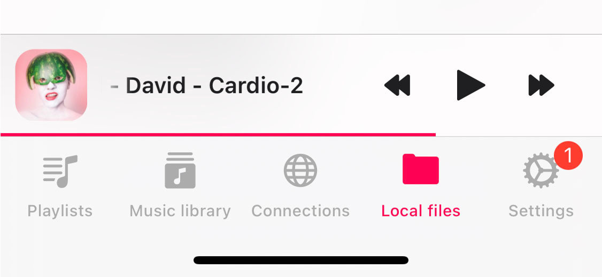
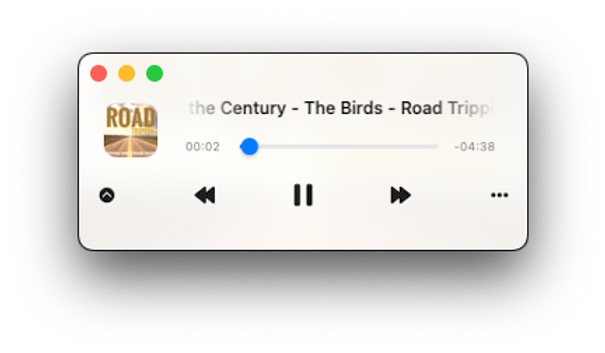

## Intro

Flacbox offers an intuitive user interface that closely resembles the native Music app. What sets it apart from many popular music apps is its built-in file manager, giving users the power to edit audio files and seamlessly transfer them to and from cloud storage.

Flacbox's functionality is thoughtfully divided into two distinct components: the Music Library, conveniently accessible through the "Music Library" and "Playlists" tabs, and the Files section, found under the "Connections" and "Local Files" tabs.

## Sections

Whether you're using an iPhone, iPad, or compact mode on a Mac, all app features are easily accessible through the tab bar at the bottom of the screen. For iPad and Mac users, the same menu can be found on the left side of the screen. This thoughtful organization categorizes all app features into easily accessible sections, ensuring a user-friendly and efficient experience.

**Connections:** You can effortlessly connect cloud storage services such as Google Drive, MEGA, OneDrive, and Dropbox, as well as your computer and personal NAS from this screen.

**Playlists:** Manage all your playlists here, where you can create, edit, remove, change song order, enable offline mode, and add songs to the player queue.

**Library:** This section neatly displays all available tracks, grouped by Artist, Genre, and Album. You can manually or automatically add songs to your music library, and it includes iPod tracks and downloaded music.

**Local Files:** Effortlessly locate and oversee your downloaded files, complete with control over the transfer queue. You can edit these local files using a range of file management actions. To access the transfer queue, tap the spinning arrows icon found at the top left corner of the "Local Files" screen.

The Local Files section is divided into two categories: **Files in this application**, displaying local files within the application's Documents directory, and **Files on this iPad/iPhone/Mac**, revealing local files located on the device but outside the application's Documents directory.

**Settings:** Modify application settings, including popular options like crossfade playback, music library sync, player cache, album artwork cache, user interface, and localization.

**Quick Access:** Seamlessly navigate to your favorite and recently played tracks and files. For Mac and iPad users, a dedicated section is available, while iPhone users can conveniently find them within the "Local Files," "Connections," and "Music Library" sections located at the top of the screen.

## Mini Player on iPhone

Activate the full-screen player by tapping the mini player icon and using a swipe-down gesture to hide it. On iPad and Mac, the mini player screen is located at the top of the screen and can be hidden when opening the full-screen player via the main menu.

## Mini Player Window (Mac Exclusive)

To access the mini player window on your Mac, simply move your cursor to the bottom-right edge of the app window and resize it to the smallest possible size. Then, tap the collapse button (depicted as a downward arrow) to activate the mini player window. To keep the mini player window always on top of other windows, navigate to the top menu bar of your Mac, select "Window," and then choose "Show Window Always On Top." This feature is useful for listening to audio lectures without interruptions.

## More Actions

Virtually every content item on the screen features a "More Actions" button. Tap it to access all available actions.

## Top Toolbar

The top toolbar, situated conveniently just beneath the navigation bar, provides quick access to several useful actions.  
You can easily reveal or conceal this toolbar with a straightforward swipe-down gesture. Here is a list of the actions:

- **Search:** Begin a search within the current context.  
- **Continue Playback:** Flacbox offers a seamless "Continue Playback" feature, designed to effortlessly restore the audio player's state for the current directory, album, artist, or playlist from the last saved position. This functionality is available if enabled in the application settings.  
- **Play All:** Easily add all tracks from the current page to the audio player queue, maintaining the current sort order.  
- **Shuffle All:** Add all tracks from the current page to the audio player queue, shuffling them before adding for a delightful listening experience.

## Context Menu

The context menu provides quick access to additional options and actions for seamless interaction across devices.

### Context Menu on iOS

**Tap and Hold:** Tap and hold on cells, the mini player, or the compact player to reveal the context menu.

### Context Menu on macOS

**Right Mouse Click:** Right-click on cells, the mini player, or the compact player to show the context menu.

## Accessibility

Our app is fully accessible with VoiceOver technology, ensuring every component has a well-designed label and description. When VoiceOver is active, the app translates the user interface to text mode, displaying only accessible and useful elements to improve navigation speed and convenience. You can also activate text mode in **Settings > Accessibility > Text Mode**.

### For Adjusting Sliders with VoiceOver

1. **Select the Slider:** Swipe left or right until VoiceOver announces the slider.  
2. **Adjust the Value:** Double-tap and hold the slider, then drag up or down to adjust the value more quickly. VoiceOver will announce the new value as you adjust it.

### For Adjusting Track Position in a Playlist with VoiceOver

1. Open a playlist and tap the "More" button.  
2. Select "Change Songs Order." The view will switch to editing mode.  
3. Tap the reorder indicator icon near the track title to give it focus.  
4. Double-tap the reorder indicator icon quickly. On the second tap, do not release your finger—hold it until you hear a sound indicating the cell is ready to be moved.  
5. Now, you can move the cell to a new position.

Other components work as expected, using system-provided VoiceOver patterns.