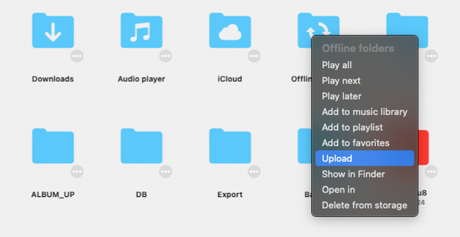

Flacbox stands out with its user-friendly interface, akin to the native Music app. What sets it apart is its built-in file manager, allowing audio file editing and seamless cloud storage transfers.

The app is thoughtfully organized into two components: the Music Library (in "Music Library" and "Playlists" tabs) and the Files section (under "Connections" and "Local Files" tabs).

For iPhone, iPad, or compact Mac users, all features are accessible via the bottom tab bar, while iPad and Mac users find the menu on the left side, making navigation a breeze.

## Connections

Easily link cloud services like iCloud Drive, Google Drive, MEGA, OneDrive, Dropbox, and your computer or personal NAS.

## Playlists

Manage playlists effortlessly. Create, edit, reorder, enable offline mode, and add songs to the queue.

## Music Library

The Music Library neatly displays tracks grouped by Artist, Genre, and Album. Add songs manually or automatically, including downloaded tracks.

## Local Files

Locate and oversee downloaded files, control the transfer queue, and edit local files. Access the transfer queue via the spinning arrows icon on the ‘Local Files’ screen on iPhone. On Mac and iPad, it’s split into ‘Files in this application’ and ‘Files on this iPad (Mac).’

## Settings

Customize settings, including crossfade playback, library sync, cache, UI, and localization.

## Quick Access

Find favorite and recently played tracks and files easily. Mac and iPad users have a dedicated section, while iPhone users can access them in the top sections.

## Mini Player

On iPhone, tap the mini player icon to activate the full-screen player and swipe down to hide it. On iPad and Mac, the mini player is at the top and can be toggled via the main menu.

## Mini Player Window (Mac Exclusive)

To access the mini player window on your Mac, move your cursor to the bottom-right edge of the app window and resize it to the smallest possible size. Then, tap the collapse button (depicted as a downward arrow) to activate the mini player window. To keep the mini player window always on top of other windows, navigate to the top menu bar of your Mac, select ‘Window,’ and then choose ‘Show Window Always On Top.’

## More Button

Virtually every content item on the screen features a "More Button." Tap it to access all available actions.

## Top Toolbar

The top toolbar, situated conveniently just beneath the navigation bar, provides quick access to several useful actions. You can easily reveal or conceal this toolbar with a straightforward swipe-down gesture.

Here is a list of the actions:

- **Search:** Begin a search within the current context.
- **Continue Playback:** The app offers a seamless 'Continue Playback' feature, designed to effortlessly restore the audio player's state for the current directory, album, artist, or playlist from the last saved position. This functionality is available if enabled in the application settings.
- **Play All:** Easily add all tracks from the current page to the audio player queue, maintaining the current sort order.
- **Shuffle All:** Add all tracks from the current page to the audio player queue, shuffling them before adding for a delightful listening experience.

## Context Menu

Provides quick access to additional options and actions for seamless interaction across devices.

### iOS:

- **Tap and Hold:** Tap and hold on cells, the mini player, or the compact player to reveal the context menu.

### Mac:

- **Right Mouse Click:** Right-click on cells, the mini player, or the compact player to show the context menu.

## Accessibility

Our app is fully accessible with VoiceOver technology, ensuring every component has a well-designed label and description. When VoiceOver is active, the app translates the user interface to text mode, displaying only accessible and useful elements to improve navigation speed and convenience. You can also activate text mode in Settings > Accessibility > Text Mode.

For adjusting sliders with VoiceOver:

1. **Select the Slider:** Swipe left or right until VoiceOver announces the slider.
2. **Adjust the Value:** Double-tap and hold the slider, then drag up or down to adjust the value more quickly. VoiceOver will announce the new value as you adjust it.

For adjusting track position in a playlist with VoiceOver:

1. Open a playlist and tap the "More" button.
2. Select "Change Songs Order." The view will switch to editing mode.
3. Tap the reorder indicator icon near the track title to give it focus.
4. Double-tap the reorder indicator icon quickly. On the second tap, do not release your finger—hold it until you hear a sound indicating the cell is ready to be moved.
5. Now, you can move the cell to a new position.

Other components work as expected, using system-provided VoiceOver patterns.