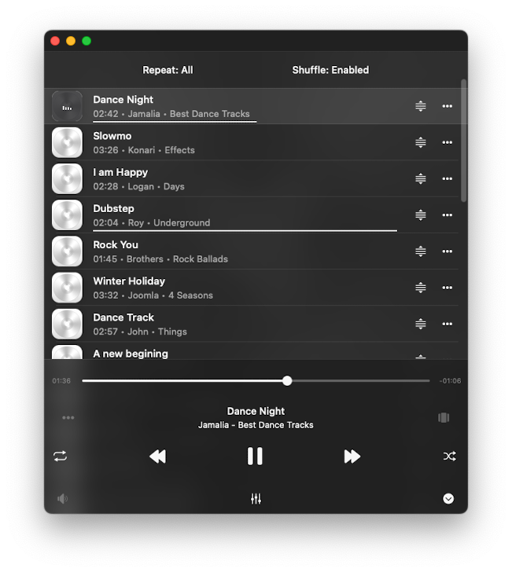
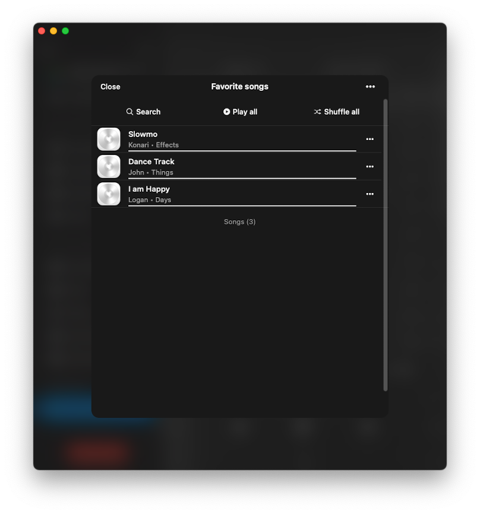
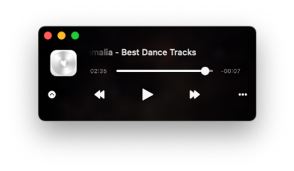
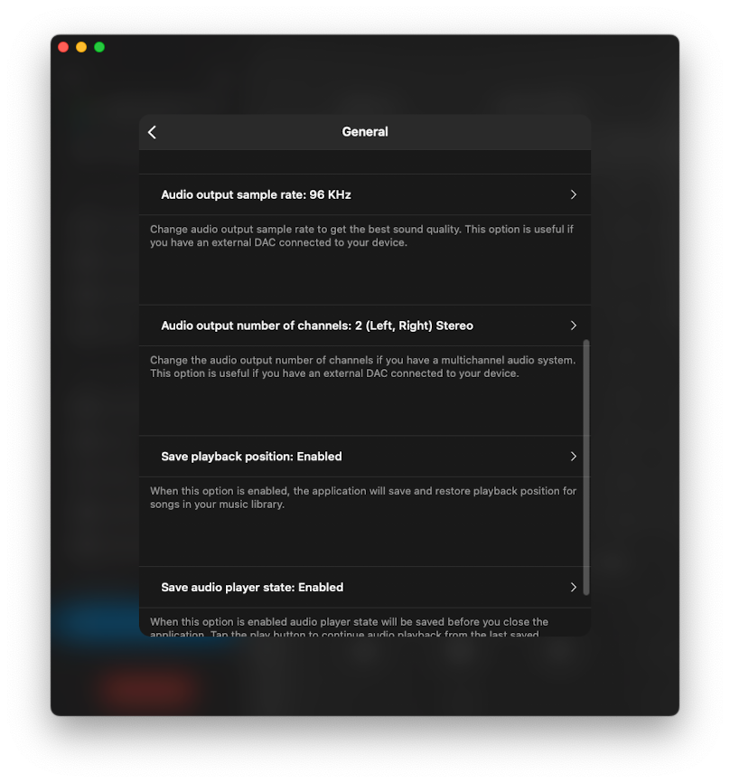
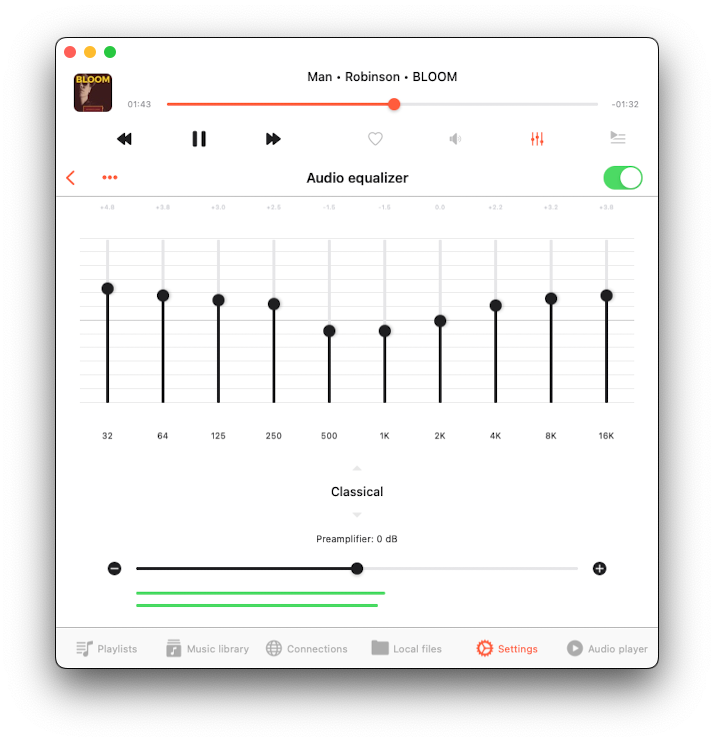
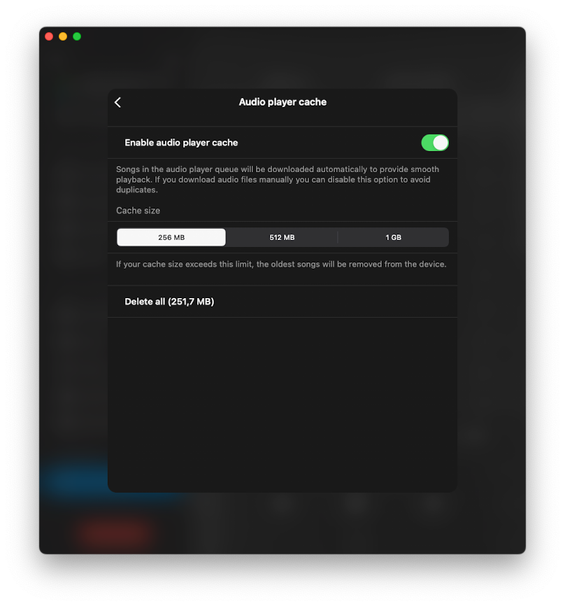
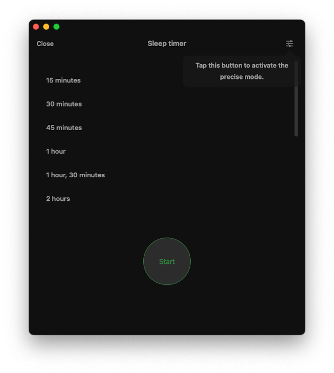

The Player is the main screen of the app where you control the music and other features. Let's explore how to use it.

## Accessing the Audio Player

You can get to the big player screen from the small one. On your iPhone, you'll find the small player at the top of the main screen. On your iPad or Mac, it's on the left side. To hide the small player, tap it and swipe down. To fully close the big player, tap the close button in the bottom right corner.

## Supported Audio Formats

The most popular audio formats are supported: 3g2, 3gp, 3gp2, 3gpp, 8svx, aa, aac, aax, ac3, act, adt, adts, aif, aifc, aiff, alac, amr, amv, ape, asf, au, avi, awb, caf, cavs, cdda, cue, dct, dff, drc, dsf, dss, dvf, dvr-ms, ec3, f4a, f4b, f4p, f4v, flac, flv, gif, gifv, gsm, gxf, h261, h263, h264, ifv, iklax, ivf, ivs, l16, latm, loas, m2t, m2ts, m2v, m3u, m3u8, m4a, m4b, m4p, m4r, m4v, mka, mkv, mmf, mng, mod, mogg, mov, mp1, mp2, mp3, mp4, mp4v, mpa, mpc, mpe, mpeg, mpg, mpv, msv, mts, mxf, nsf, nsv, nut, oga, ogg, ogv, opus, pcm, pls, qt, ra, raw, rm, rmvb, roq, rv, sln, snd, svi, tod, tta, vob, voc, vox, vtt, w64, wav, wave, webm, wma, wmv, wv, xhe, xmv, y4m, yuv.

## Playback Controls

At the bottom of the player screen, you'll see buttons for "Play," "Pause," "Next Track," and "Previous Track." There are also some secret buttons like "Next 30 sec" and "Previous 30 sec, which can be uncovered in the app settings. You can fast forward or rewind by holding down the Next/Previous buttons. To jump to a specific part of the song, use the slider.

## Repeat and Shuffle

Tap the repeat button to change the repeat mode. You can pick from:

- "Repeat all" – for looping all songs in your queue.
- "Repeat one" – for repeating just the current song.
- "Repeat Stop" – to pause when the current song ends.
- "Repeat None" – for no repeating.

For some randomness, use the "Shuffle" option to mix up your song order.

## Volume Control

Find the volume slider on the Audio Settings screen by tapping the sound icon under playback controls. You'll also find buttons for "Google Cast" and "AirPlay" to connect to other devices.

## Google Cast

For Google Cast users, you'll see the Google Cast icon at the bottom. Tap it to choose a device and start streaming. Make sure your device and Google Cast are on the same Wi-Fi. Not all audio formats work with Google Cast.

## AirPlay

If you prefer AirPlay, look for the AirPlay button at the bottom. Tap it to select a device for streaming. The app supports AirPlay2 for multiple devices.

## Audio Equalizer

The app has a 10-band equalizer. Tap "Equalizer" on the volume view, then switch it on in the top right corner. You can use presets like Acoustic, and Bass Booster, or adjust each frequency band with sliders. Make your own presets or boost the volume with the preamplifier. We have more detailed instructions about how to use equalizer [here](/docs/howto/how-to-use-the-audio-equalizer-on-your-iphone-ipad-mac-with-evermusic-and-flacbox).

## Player Mode Toolbar

For some player styles like "Antique" and "Classical," there's a toolbar at the top. This toolbar houses three buttons:

- "Search" – Ideal for quickly locating a specific track in your player queue.
- "Playback speed control" – Adjust your playback speed anywhere from 0.02x to 3.00x. Perfect for those who enjoy audiobooks and lectures. To revert to the default speed settings, simply tap "Normal" speed.
- "Audio bookmarks" – Here's where you can create multiple bookmarks for tracks in your music library. We have a full instruction on how to use bookmarks [here](/docs/howto/how-to-listen-to-audiobooks-on-iphone-ipad-mac-using-evermusic).

## Player Queue

To see your player queue, tap the player queue button on the right side of the current song. Each song has more actions when you tap the three dots. To move a song in the queue, use the reorder indicator near the title.

## Comments / Lyrics

To view track comments and embedded lyrics, as well as LRC files, follow these steps:

1. Open Settings.
2. Go to Audio Player.
3. Select Personalization.
4. Tap Buttons on the main screen.
5. Enable Comments.

After this, tap the player queue button at the bottom of the screen several times to switch from the artwork/player queue view to the comments view. On the Comments screen, scroll to the right to switch between comments, embedded lyrics, and the LRC file. Full instructions are available [here](/docs/howto/how-to-add-and-view-comments-to-your-audio-tracks-on-iphone-ipad-and-mac-with-evermusic-and-flacbox).

## Options Menu

Each song in your audio player queue has a menu with more actions, accessed by tapping the three dots button near the song title. Available actions for the options menu:

- **Play next:** Adds the song to the top of the player queue.
- **Add to playlist:** Includes the song in a playlist, with the option to create a new playlist.
- **Add to favorites:** Marks the song as a favorite for quick access.
- **Download:** Saves the song to local files, appearing in the "Local Files" tab and the "Offline music" section.
- **Edit audio tags:** Opens the built-in audio tags editor to fix missing metadata, modifying the song on your storage.
- **Show in folder:** Reveals the folder where the audio file is stored.
- **Show in Finder:** For files imported from your Mac, this action reveals the folder where the audio file is located on your Mac.
- **Open in:** Exports the audio file to another app.
- **Delete from queue:** Removes the selected song from the audio player queue.
- **Delete from cloud service:** Deletes the song from both the music library and cloud storage (please note that this action is irreversible).
- **Delete from local files:** Deletes the song from both the music library and local storage (please note that this action is irreversible).
- **Delete from music library:** Deletes the song from your music library, while keeping the file in storage.

The same options are available for the now playing item in the audio player queue, which you can access by tapping the More Actions icon near the track title.

## Additional Player Actions

Tap the more actions button "..." on the left side of the currently played song title to see additional actions.

- **Continue playback** – Resume from where you left off, including queue and media position. This is particularly useful for audiobooks and can be activated in the app settings.
- **Search** – Quickly find a specific track in your audio player queue.
- **Bookmarks** – View your list of created audio bookmarks.
- **Comments:** View track comments and embedded lyrics, as well as LRC files. Full instructions available [here](/docs/howto/how-to-add-and-view-comments-to-your-audio-tracks-on-iphone-ipad-and-mac-with-evermusic-and-flacbox).
- **Speed** – Adjust the playback speed to your liking.
- **Recents** – Access a list of recently played songs.
- **Favorites** – See your collection of favorited songs.
- **Audio equalizer** – Activate the audio equalizer.
- **Sleep timer** – Set a timer to stop playback after a specified interval. Great for those moments when you want to doze off to your tunes.
- **Save queue to playlist:** Allows you to save the current audio player queue to a playlist.
- **Delete queue** – Clear your player queue and halt playback.
- **Settings** – Access audio player settings.
- **Help** – Find assistance and guidance.

## Audio Bookmarks

This feature lets you create multiple bookmarks for tracks in your music library.

To create a new bookmark, follow these steps:

- Begin playing the desired song.
- Open the player screen.
- Tap the "Bookmarks" button on the player mode toolbar.
- Select "Add bookmark."
- Choose the bookmark time and tap "Done" in the top right corner.

Editing bookmarks for the current track is easy. Simply tap the "Edit" button in the top right corner to activate edit mode. In this mode, you can rearrange bookmarks, delete them, adjust bookmark time, and even change bookmark titles. This feature is particularly useful for audiobooks, lectures, or when you want to mark specific moments in a track. More detailed instructions about how to use audio bookmarks are available [here](/docs/howto/how-to-listen-to-audiobooks-on-iphone-ipad-mac-using-evermusic).

## Recents and Favorites

On the player screen, tap the three dots to access "Recents" and "Favorites." In both sections, you can search for songs, play all tracks, shuffle all tracks, export the list, and delete the list. We have detailed instructions on how to export song lists [here](/docs/howto/export-tracks-collection-from-evermusic-flacbox-to-m3u-csv-txt/).

## Mini Player Window (Mac Exclusive)

Mac users can use a mini player. Move your cursor to the bottom-right edge, resize the window, and tap the collapse button. Keep it on top by selecting 'Window' and 'Show Window Always On Top' in the menu bar.

## Keyboard Shortcuts (Mac Exclusive)

For Mac users, there is a system playback menu available on the status bar with keyboard shortcuts. For example, to Play/Pause, just tap the spacebar on your keyboard. Shortcuts for Stop, Next Song, Previous Song, Skip Time, Repeat, Shuffle, and Playback Speed are available as shown in the screenshot below.

## Audio Player Settings

To access settings, tap the "more" button on the player screen and choose "Settings." Here, you'll find various sections:

### General

These settings cover the fundamental aspects of the audio player, including the playback queue, audio output, and saving the player's state. Available options:

- **Repeat Mode:** This setting lets you choose how the audio player behaves when a track finishes playing. You can select from various options:
  - "Repeat all" – This replays all the tracks in your queue.
  - "Repeat one" – It repeats only the current track.
  - "Repeat Stop" – This pauses playback when the current track ends.
  - "Repeat None" – It allows your queue to play through without repeating.

- **Shuffle Mode:** This option randomizes the order of tracks in your queue, creating a new sequence for playback. You can turn it "Shuffle off" or "Shuffle on."

- **Audio Codec:** You can change the audio codec used for playing tracks in the application. Your choices include:
  - "System codec + FFMPEG" – This prioritizes the system's audio codec where possible, enhancing compatibility and stability during playback. Note that pitch correction and audio output sample rate adjustments may not be available.
  - "FFMPEG" – This forces the use of the FFMPEG codec for all audio files, allowing you to tweak pitch correction and audio output sample rate.

- **Audio Output Sample Rate:** Adjust the audio output sample rate to optimize sound quality. This feature is useful if you have an external DAC (Digital-to-Analog Converter) connected to your device. You can pick values like "44.1 KHz," "48 KHz," "64 KHz," "88.2 KHz," or "96 KHz."

- **Audio Output Number of Channels:** If you're using a multichannel audio system with an external DAC, this setting allows you to specify the number of channels. Options include "Mono," "Stereo," "Center, Left, Right," "Center, Left, Right, Surround," "ITU BS.775-1," "5.1 Surround," and "SDDS."

- **Audio Output Preferred IO Buffer Duration:** This option allows you to configure the input/output buffer duration for audio playback on your device. A typical value for input/output buffer duration to minimize latency while playing high-resolution audio is around 5 milliseconds (0.005 seconds). Keep in mind that the actual acceptable buffer size may vary depending on the specific hardware and software environment. It's essential to test different buffer durations on your target device and choose the one that provides the best compromise between low latency and stable audio playback without glitches.

- **Audio Output Mode (iOS Only):** This feature is exclusive to iOS and enables you to configure an audio output mixed mode. It allows audio from the app to blend seamlessly with other applications. Detailed instructions can be found [here](/docs/howto/how-to-record-video-while-playing-music-on-iphone).

- **Save Playback Position:** This option ensures that the application saves and restores the playback position for songs in your music library.

- **Save Audio Player State:** When enabled, this feature preserves your audio player's state before you close the app. This makes it easy to pick up where you left off. To continue playback, tap the "Continue Playback" button located at the top of the screen when you re-open the app. You can also restore playback for individual files by tapping on the specific track.

Once you’ve enabled both of these features, open any folder, album, artist, or genre within this app. You’ll notice a ‘Continue Playback’ button at the top of the screen, along with the last saved song playback position. To restore the playback progress, simply tap on the ‘Continue Playback’ button. If you want to restore playback for an individual file, tap on that specific file.

### Personalization

Personalization allows you to customize the look of the audio player screen, change the available controls on the main screen of the audio player, lock screen, and status bar during audio playback, and configure skip time controls.

- **Audio Player Screen Style:** You can configure the positioning of elements on the audio player screen.
  
- **Album Covers Scrolling Style:** You can configure the preferred album covers scrolling style on the audio player screen.

- **Additional Elements:** This allows you to enable additional elements on the audio player screen. Enabling ‘Audio Format Info’ will show the now-playing track’s audio info above the artwork picture. Enabling the ‘Audio Volume Slider’ will show the audio output slider below the playback controls on the main screen of the audio player.

- **Main Screen Actions:** This allows you to configure which buttons should be visible on the main audio player screen by default. Possible values include Repeat and Shuffle Mode, Next and Previous Song, Skip Time, Sleep Timer, Google Chromecast, AirPlay and Bluetooth, Audio Equalizer, Search, Bookmarks, Speed, Add Bookmark, Add to Favorites, Comments, and others.

- **Playback Controls on the Lock Screen:** You can set which controls should be enabled on the lock screen. Possible values are Skip Time, Add Bookmark, and Add to Favorites.

- **Skip Time Buttons:** You can select the time interval for the ‘Skip Time’ buttons here.

### File Loading

During the file loading process, you can change the network type that app uses to load songs. Available options - "Wi-Fi", "Wi-Fi and Cellular data".

- **Preloading time:** Set buffering time interval. You may increase this value if you have a bad network connection.

- **Use direct URL:** when this option is enabled a direct URL will be used to load the song if the server supports it. This can speed up song loading but may affect playback stability.

### Audio Equalizer

This section is where you can customize the audio equalizer settings. You can read more about configuring audio equalizer [here](/docs/howto/how-to-use-the-audio-equalizer-on-your-iphone-ipad-mac-with-evermusic-and-flacbox).

### Playback Speed

Adjust the playback speed of the audio player to your liking.

### Pitch Correction

Change pitch correction settings using the predefined values. You can also switch between predefined values and precise mode by tapping the button in the top right corner.

### Playback Cache

Songs in the audio player queue are automatically downloaded to ensure smooth playback. If you manually download audio files, you can disable this option to avoid duplicates. You can also configure the audio player cache size here.

### Sleep Timer

Activate a timer to automatically stop playback after a specified period. This feature can be handy when you want to listen to music as you fall asleep. If you need more precise adjustments, activate the precise mode by tapping the configuration icon in the top right corner.

## Accessibility

Our app is fully accessible with VoiceOver technology, ensuring every component has a well-designed label and description. When VoiceOver is active, the app translates the user interface to text mode, displaying only accessible and useful elements to improve navigation speed and convenience. You can also activate text mode in Settings > Accessibility > Text Mode.

For adjusting sliders with VoiceOver:

1. Select the Slider: Swipe left or right until VoiceOver announces the slider.
2. Adjust the Value: Double-tap and hold the slider, then drag up or down to adjust the value more quickly. VoiceOver will announce the new value as you adjust it.

For adjusting track position in a list with VoiceOver:

1. Tap the reorder indicator icon near the track title to give it focus.
2. Double-tap the reorder indicator icon quickly. On the second tap, do not release your finger—hold it until you hear a sound indicating the cell is ready to be moved.
3. Now, you can move the cell to a new position.

Other components work as expected, using system-provided VoiceOver patterns.