# Flacbox Guide: Playlists

**Writer:** admin  
**Date:** Feb 1, 2020  
**Updated:** Dec 8, 2024  
**Reading Time:** 6 min read

## Introduction

Within the Playlists section, you'll discover an array of tools to effectively manage your music collections. This area offers a visual showcase of all your curated playlists, complemented by a convenient "..." button located in the navigation bar, which provides access to a range of playlist-related functions. Additionally, a navigation toolbar graces the interface, offering you quick access to essential commands like "Search," "Play all," and "Shuffle all." Furthermore, each individual playlist comes equipped with its own "..." button adjacent to the playlist title, offering a unique set of actions tailored to that specific playlist.

## Creating a Playlist

Crafting a new playlist is a straightforward process. You have two options: either tap the "+" button or the "..." button situated in the upper-right corner of the navigation bar. Following this, select "New playlist" and give your playlist a meaningful name. Once you've provided a name, tap "Save."

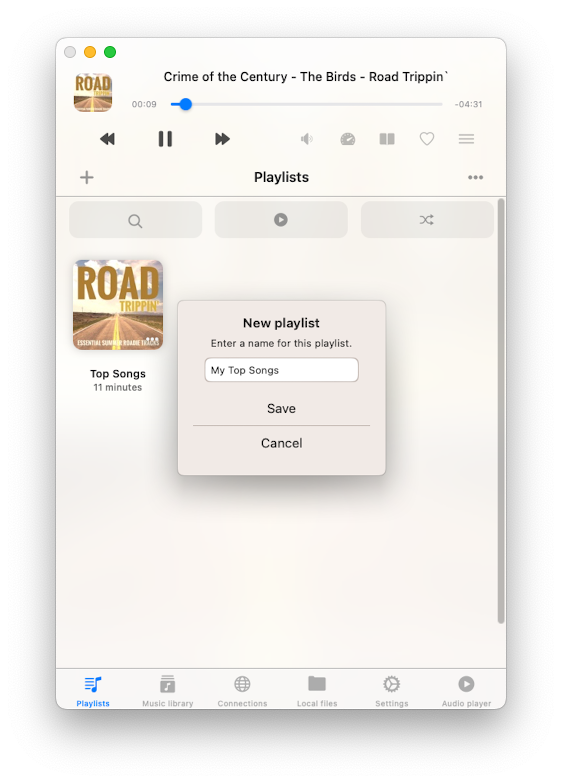

This action triggers the "Add songs" dialog, where you can meticulously handpick the tracks you wish to include in your freshly minted playlist. These tracks are conveniently categorized by their source type, providing you with several options:

- **Music library:** for tracks sourced from your music library.
- **Local files:** encompassing all audio files accessible for offline playback (these can be added via downloads from cloud storage, imports from WiFi Drive, or using iTunes File Sharing).
- **Connections:** containing online files located within your connected cloud services.

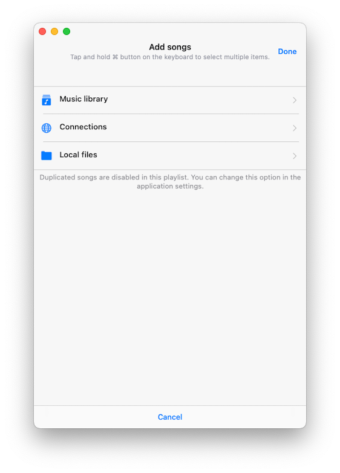

It's important to note that, by default, you can add a single track to a playlist just once. However, if you desire the ability to include duplicate songs within a playlist, you can activate this feature in the app Settings - Music library - Playlists - Duplicates in a playlist - Enable.

## Import Playlist

In Flacbox, we’ve added M3U/CUE file import functionality, so you don’t have to create playlists manually.

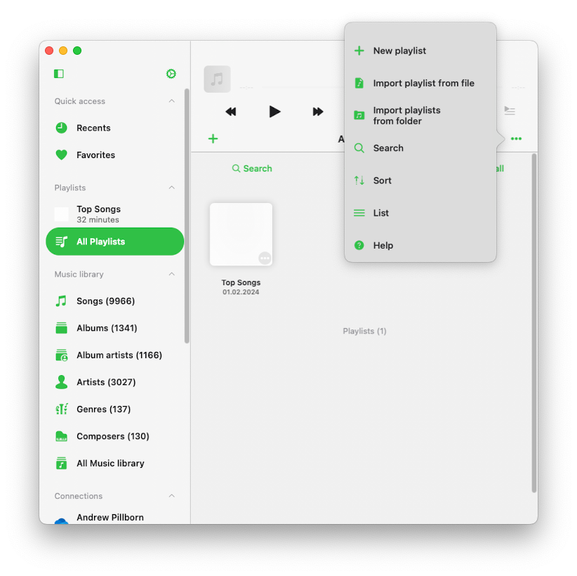

First, go to the ‘Playlists’ section. Then, tap the ‘More’ button in the top right corner. From the menu that appears, select the ‘Import Playlist’ option.

On the next screen, choose the file location. Supported options include:

- Connected cloud storage
- Files in the application
- Files on your device

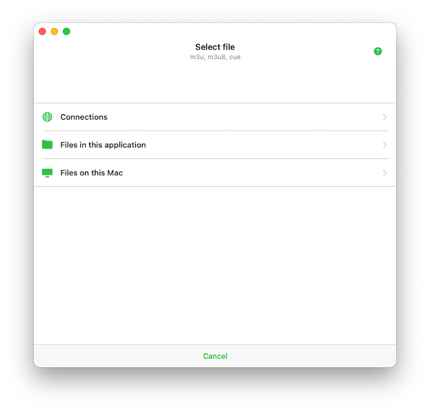

Let’s select connected cloud storage and open the folder containing the playlist file. Supported playlist file extensions include M3U, M3U8, and CUE. Select the playlist file and tap ‘Done’ to confirm your selection.

The app will parse the playlist file, create a list of tracks, and locate those files on the storage to compile a final playlist, which will be imported into the music library. It’s crucial that your M3U/CUE file contains the correct paths for media files, and the files should be located at those paths on your storage. You can read more about playlist import [here](https://www.everappz.com/post/how-to-import-m3u-playlist-to-evermusic-and-flacbox).

## Playlist Detail Screen

Upon accessing a playlist, you'll be greeted by the "Playlist detail screen." This interface offers an extensive array of options for managing your playlist efficiently. Here, you can:

- **Search:** execute a search exclusively within the current playlist.
- **Play all:** seamlessly add all tracks from the playlist to the player queue.
- **Shuffle all:** shuffle the entire tracklist before integrating it into the audio player queue.
- **Offline mode:** activate offline mode to download all playlist tracks to your local files. It's crucial to understand that any new items added to the playlist will be automatically fetched and downloaded.

## Expanded Actions for Playlist within the Playlists Screen

In the Playlists screen, you'll find additional actions tailored to your playlists. These actions are accessible by tapping the "..." button located adjacent to the playlist title. The available actions include:

- **Select:** activating the selection mode for songs within the playlist,
- **Play next, Play later:** introducing playlist tracks to the top or bottom of the existing player queue,
- **Enable offline mode:** enabling offline mode for the playlist (resulting in automatic downloads of both existing and new tracks),
- **Edit image:** editing the playlist's artwork image,
- **Add songs:** adding more songs to the current playlist,
- **Rename:** renaming the playlist,
- **Delete playlist:** ultimately, deleting it from the Music library. It's essential to exercise caution while performing the "Delete playlist" action, as it cannot be reversed.

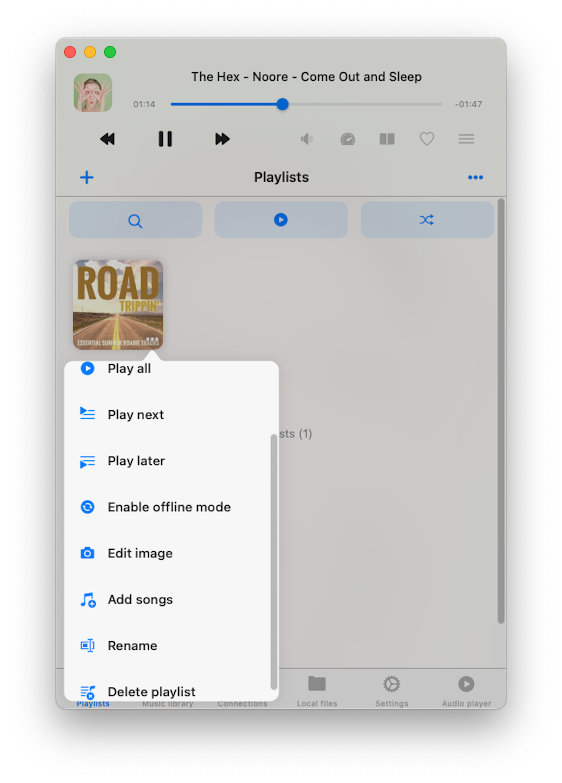

## Extended Actions for Playlist within the Playlist Detail Screen

When delving into the Playlist Detail screen, you'll encounter further actions at your disposal. These actions can be accessed by tapping the "..." button located in the upper-right corner. Here are the available actions:

- **Select:** Activate track selection mode, useful for deleting multiple tracks from the playlist or changing their order.
- **Play next:** Add playlist tracks to the top of the existing player queue.
- **Play later:** Add playlist tracks to the bottom of the existing player queue.
- **Sort:** Change the order of tracks in the playlist. Sorting options include "Song title," "Song number," "Album," "Artist," "Album artist," "Genre," "Composer," "Rating," "Year," "Beats per minute," "Duration," "File name," "File modification date," "File creation date," and "Manual." The "Manual" sort option allows manual reordering of songs using drag-and-drop.
- **Search:** Search for a specific song within the current playlist.
- **Add songs:** Add new songs to the playlist.
- **Change songs order:** Manually change the order of songs in the playlist using drag-and-drop.
- **Edit image:** Edit the album artwork for the current playlist.
- **Rename:** Rename the current playlist.
- **Delete playlist:** Delete the playlist from the Music library. It's imperative to note that when deleting a playlist, it will not affect the tracks stored in your device's storage, and this action is irreversible.

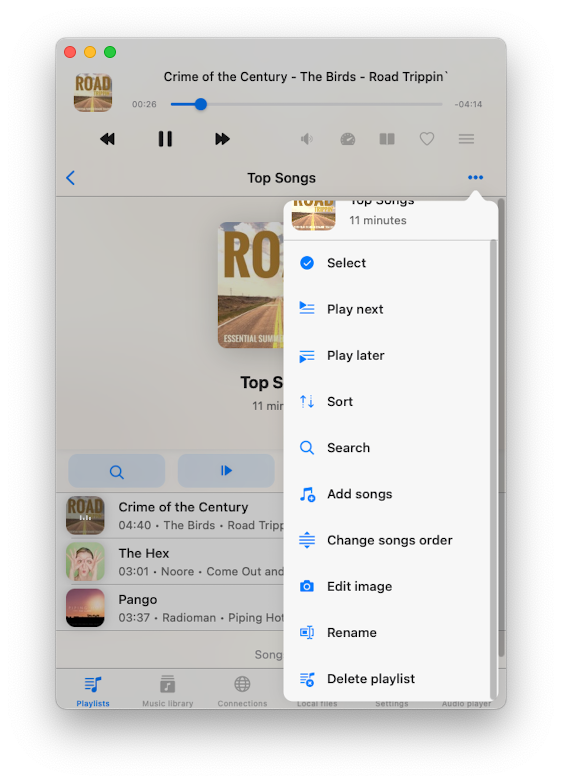

## Adjusting Song Order within a Playlist

Should you wish to reorganize the sequence of songs within a playlist, simply tap the "..." button located in the upper-right corner and select "Select" to initiate the selection mode. Subsequently, utilize the reorder control and drag-and-drop gestures situated near each track to reposition them as desired. A single tap on the reorder control will promptly elevate the selected track to the top of the list. To save your modifications, tap "Done" to exit the selection mode.

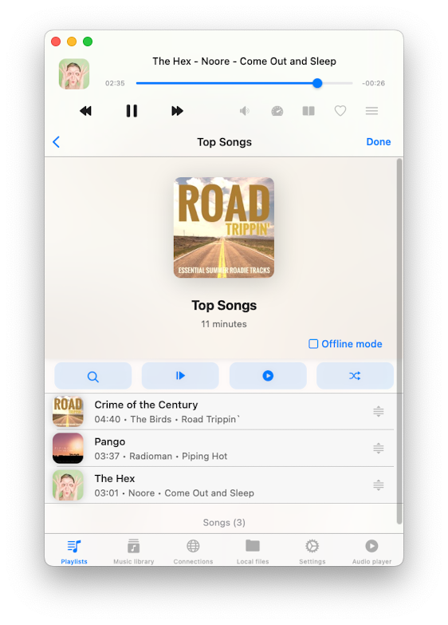

## Customizing Playlist Cover Art

Personalizing the cover image of a playlist is a straightforward process. Tap the "..." button located in the upper-right corner, and then select "Edit image." From there, choose an image from the available sources, and to confirm your alterations, tap "Done."

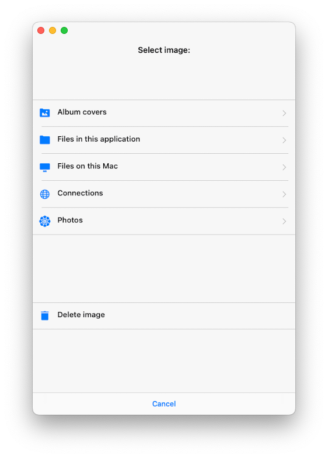

## Adding Tracks to a Playlist

To incorporate additional songs into a playlist, open the desired playlist and tap the "..." button positioned in the upper-right corner. Next, select "Add songs" to initiate a dialog. Within this dialog, meticulously select the tracks you wish to include and validate your choices by tapping "Done."

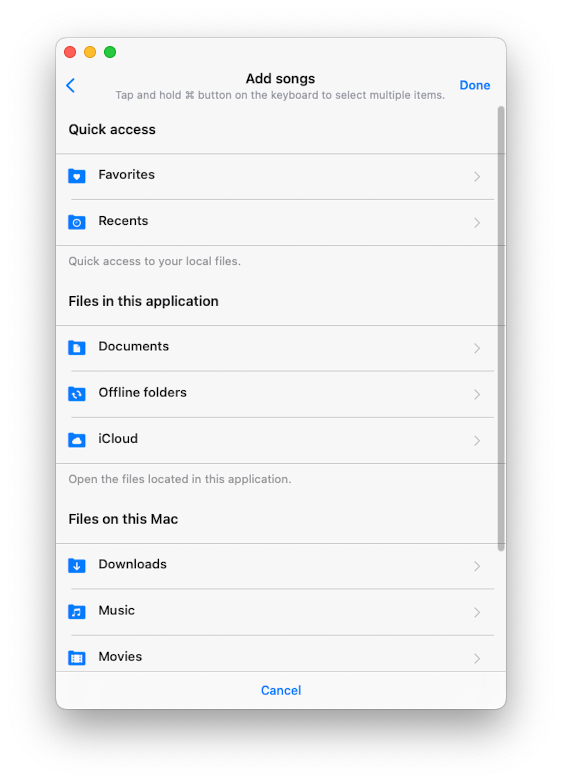

## Removing Multiple Songs from a Playlist

If the need arises to eliminate multiple songs from a playlist, commence by opening the playlist. Subsequently, tap the "..." button located in the upper-right corner, and select "Select" to engage the selection mode. Here, you can efficiently pick and choose the tracks you desire to remove. Finally, tap the "Delete from playlist" button positioned at the lower part of the screen to confirm your actions.

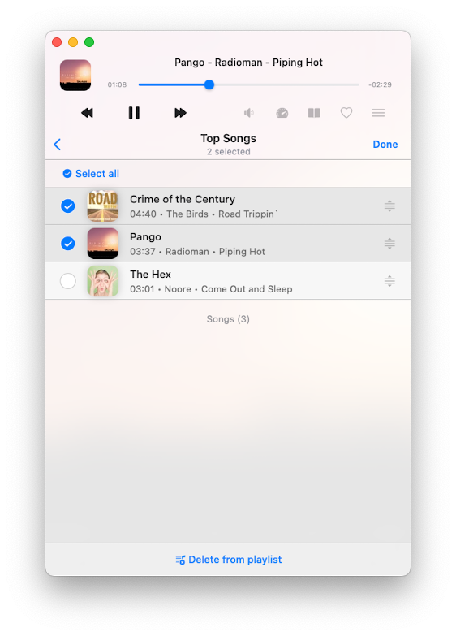

## Track Options

Every individual track within a playlist offers an extensive array of actions, easily accessible by tapping the "..." button. In case you cannot view all actions simultaneously, simply scroll down to access them.

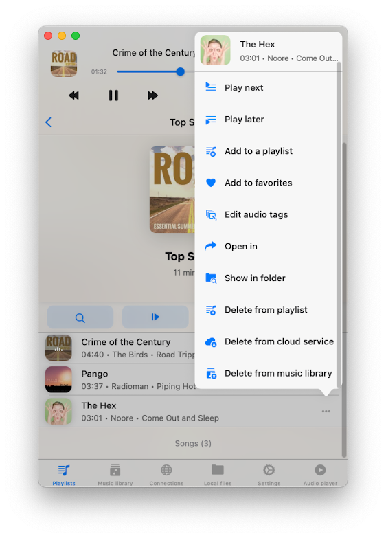

- **Play next:** Adds the track to the top of the player queue.
- **Play later:** Appends the track to the bottom of the player queue.
- **Add to a playlist:** Adds the track to a playlist.
- **Add to favorites:** Marks the track as a favorite for quick access.
- **Download:** Makes the track available offline. It will appear in the transfer queue and the "Local Files" tab in the "Downloaded music" section of the Music library.
- **Edit audio tags:** Opens the built-in tags editor for changing track metadata.
- **Open in:** Exports the track and opens it in another app.
- **Show in folder:** Reveals the folder where the audio file is located.
- **Show in Finder:** For files imported from your Mac, this action reveals the folder where the audio file is located on your Mac computer.
- **Delete from playlist:** Deletes the track from the playlist.
- **Delete from cloud service:** Deletes the track from the playlist and the associated cloud service. Please note that this action cannot be undone.
- **Delete from music library:** Deletes the track from the music library, leaving the file on storage untouched.

## Accessibility

Our app is fully accessible with VoiceOver technology, ensuring every component has a well-designed label and description. When VoiceOver is active, the app translates the user interface to text mode, displaying only accessible and useful elements to improve navigation speed and convenience. You can also activate text mode in Settings > Accessibility > Text Mode.

For adjusting track position in a playlist with VoiceOver:

1. Open a playlist and tap the "More" button.
2. Select "Change Songs Order." The view will switch to editing mode.
3. Tap the reorder indicator icon near the track title to give it focus.
4. Double-tap the reorder indicator icon quickly. On the second tap, do not release your finger—hold it until you hear a sound indicating the cell is ready to be moved.
5. Now, you can move the cell to a new position.

Other components work as expected, using system-provided VoiceOver patterns.

---

**Tags:** [guide](https://www.everappz.com/blog/tags/guide), [flacbox](https://www.everappz.com/blog/tags/flacbox), [playlists](https://www.everappz.com/blog/tags/playlists)  
**Category:** [Guide](https://www.everappz.com/blog/categories/guide)