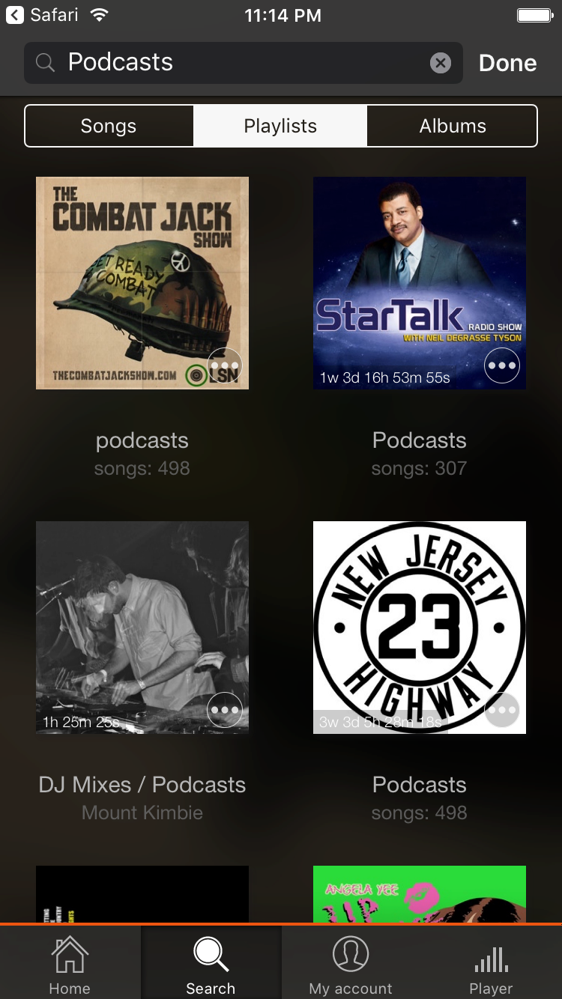
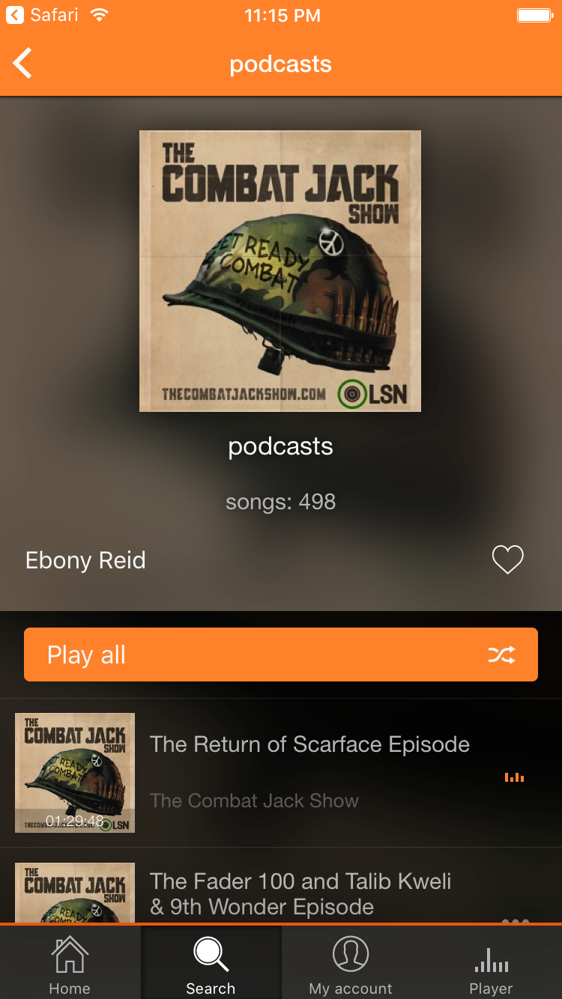
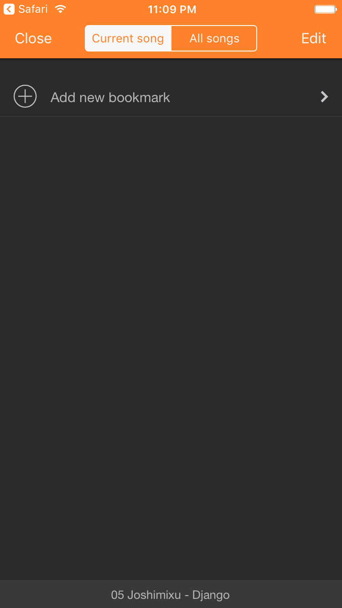
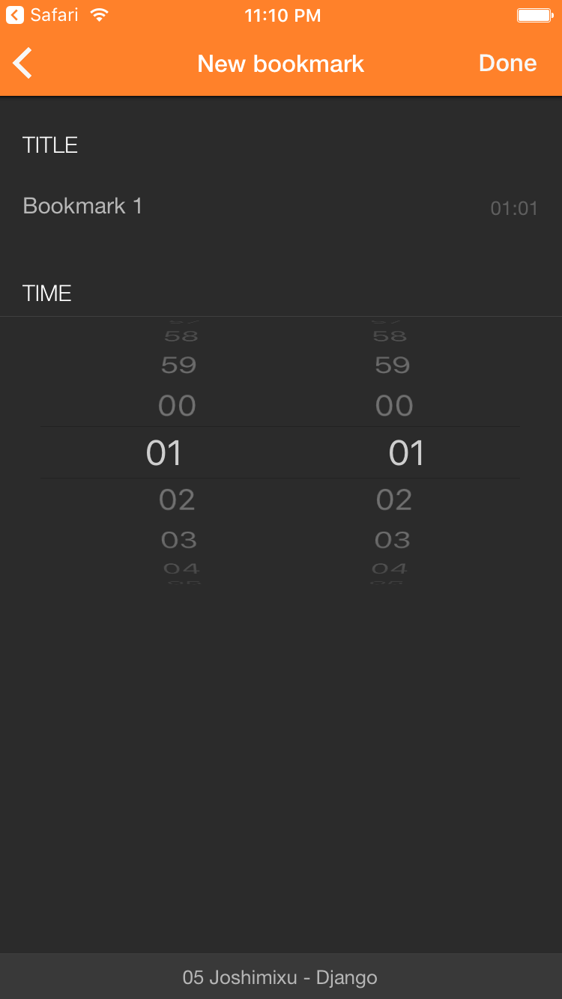
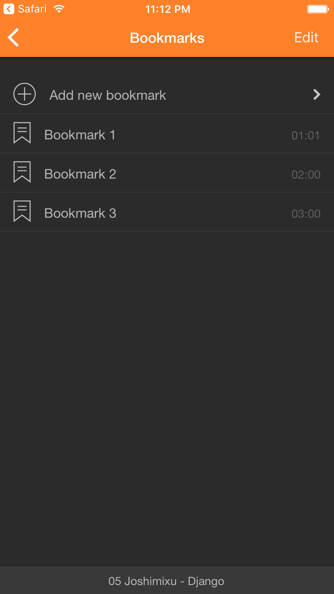
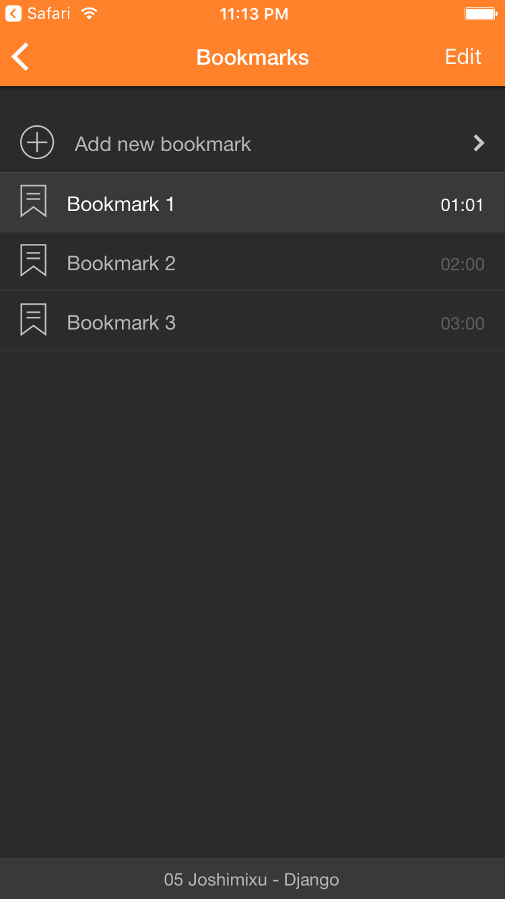

```markdown
# Audio Bookmarks for SoundCloud


With [Soundy](http://bit.ly/everappz_soundy) you can listen to your favorite audio books, lectures, podcasts from SoundCloud and create audio bookmarks.

To create an audio bookmark for SoundCloud, follow the steps below:

1. Find a podcast or audio track on the Search screen or My Account screen:

   

2. Tap on the track to start the player:

   

3. Open the Player screen and tap on the MORE button ('...') at the top left corner and select the 'Bookmarks' menu:

   

4. Tap 'Add new bookmark' and select the bookmark time. By default, a new bookmark is created with the current player time. If you want to change it, just use the time picker. You can also change the bookmark name by tapping on it:

   

5. Tap 'Done' and you will return to the previous screen with the created bookmark. With these simple steps, you can create several bookmarks for one song. It's very convenient for large audio books or podcasts:

   

6. If you want to jump to the created bookmark position, just tap on the bookmark title:

   

7. You can also find all tracks with bookmarks by tapping 'All songs' in the segmented control:

   

If you have any questions, just write your comments below.

## Tags:
- [audio](https://www.everappz.com/blog/tags/audio)
- [equalizer](https://www.everappz.com/blog/tags/equalizer)
- [soundy](https://www.everappz.com/blog/tags/soundy)
- [marks](https://www.everappz.com/blog/tags/marks)
- [soundcloud](https://www.everappz.com/blog/tags/soundcloud-1)

## Categories:
- [How To](https://www.everappz.com/blog/categories/how-to)
```