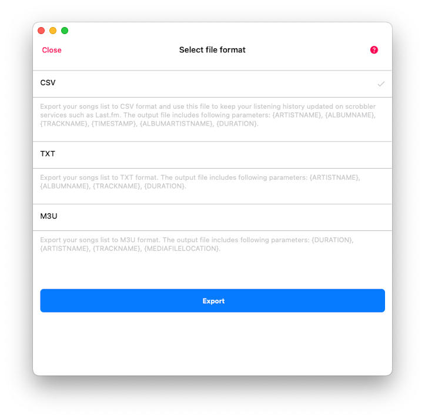

## Intro

Exporting your recents, favorites, albums, and playlists from the app to an external file can be incredibly useful. You can use these files to update your listening history on scrobbler services such as [Last.fm](http://Last.fm) or listen to your playlists on external devices. With Evermusic and Flacbox, this process is easy. Here, we'll show you how to export your recents to CSV/TXT and your playlists to M3U. However, this functionality is available for any tracks collection within the app.

## Choose Format

To export your recents open the 'Music library' section and select 'Recents' menu item.


On the next screen tap 'More' button in the top right corner and choose 'Export songs list'.


On the 'Select file format' screen you have several options - CSV, TXT, M3U.

- CSV

This stands for Comma-Separated Values, perfect for organizing your data into a neat table format. In the destination file, you'll find parameters like Artist Name, Album Name, Track Name, Timestamp (the time you listened to the tracks), Album Artist Name, and Track Duration. You can use that file later to update your listening history on scrobbler services such as [Last.fm](http://Last.fm) as described [here](/docs/howto/exporting-complete-listen-history-from-evermusic-flacbox-to-last-fm/).

- TXT

Here, we're talking about a plain text file. It's simple and straightforward, with parameters including Artist Name, Album Name, Track Name, and Duration. Useful if you just need a list of tracks in a text presentation.

- M3U

This format is essentially the go-to for creating playlists. It's great because you can export your song list and enjoy your tracks on any device, even if you don't have the original files (if you select the absolute URL for the media files option export). In the output file, you'll find parameters such as Duration, Artist Name, Track Name, and Media File Location.

## CSV Format

Now, let's select CSV and see what we'll receive. Simply choose CSV and hit the 'Export' button.



Once the export is completed, you will see an alert with two options. Tapping 'Show file' will reveal the resulting file in your documents directory.


Now you can send that file, open it in an external text editor, or use it to update your listening progress on [Last.fm](http://Last.fm).


The output CSV file will contain fields in the following format:

```
{ARTIST_NAME},{ALBUM_NAME},{TRACK_NAME},{TIMESTAMP yyyy-MM-dd HH:mm:ss},{ALBUM_ARTIST_NAME},{TRACK_DURATION HH:mm:ss}
```

For example:

```
The Everly Brothers,100 Greatest Feel Good,All I Have To Do Is Dream,2024-01-06 23:17:26,The Everly Brothers,00:02:23
```


## TXT Format

The output TXT file will contain fields in the following format:

```
{ORDER_NUMBER}. {ARTIST_NAME} - {ALBUM_NAME} - {TRACK_NAME} (DURATION HH:mm:ss)
```

For example:

```
22. Queen Omega - Reggae Hits Vol 30 - All For You (00:03:21)
```


## M3U Format

Next, we'll guide you through exporting your playlist to M3U format, which is the de facto standard for playlist files. The main precondition for successful playlist export is that all files in the playlist must be located on the same storage, whether it's in a cloud service like your Google Drive, local files, or files on your device. To begin the export process, open any playlist and tap the 'More' button in the top right corner, then choose the 'Export songs list' menu item.


On the next screen, select the 'M3U' file format, where you'll encounter two options for 'Media file location type':


1. If you choose 'Relative path', the playlist will be created with media file locations written relative to the playlist file. For example:

    ```
    my track name.mp3
    tracks/track1.mp3
    ../artist/album/track10.mp3
    ```

   In this case, avoid changing the M3U file location after export completion, as doing so will break the paths for media files. To begin playback of your playlist, simply tap on the exported playlist file, and the app will automatically locate the media files on your storage and initiate playback. Or even you can export your playlists to the storage and then import them again on your new device.

2. If you choose 'Absolute URL', the app will generate direct URLs for your media files. This allows you to play the playlist on any device/application without needing all media files to be located on the same storage as the playlist file. This option is supported only for cloud storage capable of generating direct file URLs. However, keep in mind that in some cases, the generated URLs may have a limited lifetime and can expire after some time. Here's the list of supported cloud services: iCloud Drive, pCloud, PanBaidu, MyCloudHome, DLNA, MediaFire, OneDrive, Box, Dropbox, GoogleDrive, WebDav (if in guest mode)  

The output media file URL will be something like:

```
https://uc2a69c7b75b6056be42091d92dd.dl.dropboxusercontent.com/cd/0/get/CMVQoDWSpnuUYxuIw0XSjXCzwawE6XnFbao7HggcPFNpHgeiYgVMesITUODm0xY3cbraGWG-ESBiYKmB9alP8W0IyvRqJzQGcjFm8JbnUdxbA3usnJnG0l78HuqUldCw9JnIsBVW3YyyTEDaxnKh9Ee_/file
```

Once you've selected the 'Media file location type', tap 'Export'. The app will prompt you to choose a destination folder for exporting the M3U file. Tap 'Done' to confirm your selection.


The app will generate an M3U file and upload/move it to the destination folder.


Once the export is completed, a system alert will appear with the option to 'Show file'.


Tapping on this will reveal the exported file in the app.


If you selected 'Relative path' as the 'Media file location type' in the previous step, the output file will be in the following format:

```
#EXTM3U
#EXTINF:199, Kenny Rogers & The First Edition - Just Dropped In (To See What Condition My Condition Was In)
080 - Kenny Rogers & The First Edition - Just Dropped In (To See What Condition My Condition Was In).mp3
```


For the 'Absolute URL' option the app will generate an M3U file in the format:

```
#EXTM3U
#EXTINF:151, DownsiiD - Mehia (Lullaby to a Lost Daughter)
https://cloud.com/dfgfdguh45tgkbfgr/filecontent
```


You can open that file on any device/application that supports M3U playlists.


## Final Thoughts

Exporting your tracks from Evermusic and Flacbox gives you complete control over your music data. Whether you’re backing up your listening history, scrobbling to Last.fm, or enjoying playlists on external devices, these export options: M3U, CSV, and TXT - are powerful tools tailored for flexibility and compatibility. Take advantage of these features to enhance how you organize, share, and revisit your music collection across platforms.