**UPD:** Automatic scrobbling is now available! Learn more here: [/docs/howto/how-to-scrobble-your-music-history-from-evermusic-or-flacbox-to-last-fm](/docs/howto/how-to-scrobble-your-music-history-from-evermusic-or-flacbox-to-last-fm)

Scrobbling is a simple way to automatically save basic details like the title and artist of the song you're currently playing to an online service. Later on, you can review your listening history.

[Last.fm](https://www.last.fm/home), powered by a music recommender system called "Audioscrobbler," offers this service for free. It creates a detailed profile of your musical taste by recording the tracks you listen to, whether from internet radio stations, your computer, or various portable music devices. You can visit the website later to receive recommendations for new artists or albums that match your music taste.

You can upload your listening history to [Last.fm](http://Last.fm) from Evermusic and Flacbox apps using a free tool, and we'll walk you through how to do this.

Open the 'Music Library' section of the application and scroll to the 'Quick access' section. Tap the 'Recents' menu item.

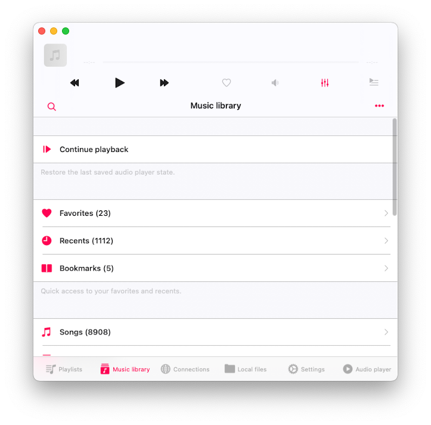

On the 'Recents' screen tap the 'More' button in the top right corner to activate the 'More actions' menu. Tap the 'Export songs list' menu item.

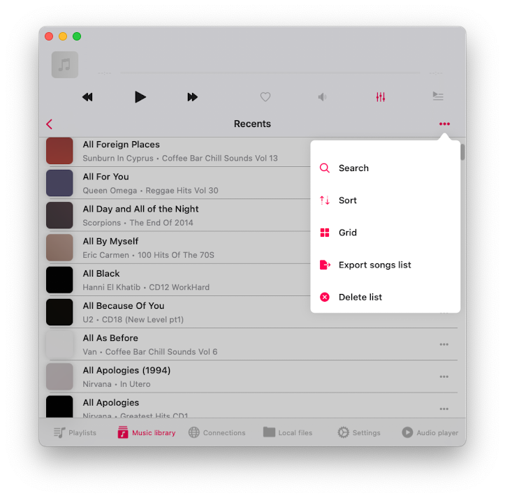

On the 'Select file format' screen you have the possibility to select the format of the destination file. Available options - CSV, TXT, M3U.

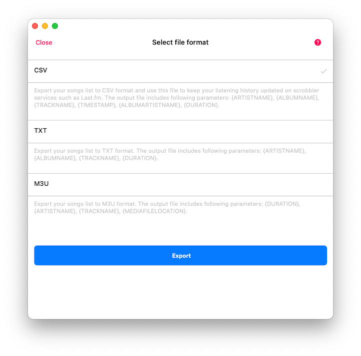

CSV: This stands for Comma-Separated Values, perfect for organizing your data into a neat table format. In the destination file, you'll find parameters like Artist Name, Album Name, Track Name, Timestamp (the time you listened to the tracks), Album Artist Name, and Track Duration.

TXT: Here, we're talking about a plain text file. It's simple and straightforward, with parameters including Artist Name, Album Name, Track Name, and Duration.

M3U: This format is essentially the go-to for creating playlists. It's great because you can export your song list and enjoy your tracks on any device, even if you don't have the original files (provided you select the absolute URL for the media files option). In the output file, you'll find parameters such as Duration, Artist Name, Track Name, and Media File Location.

For our task, selecting CSV is the way to go. We'll be using this file with the free software Last.fm-Scrubbler-WPF to upload our listening history to the [Last.fm](http://Last.fm) service. Simply choose CSV and hit the 'Export' button.

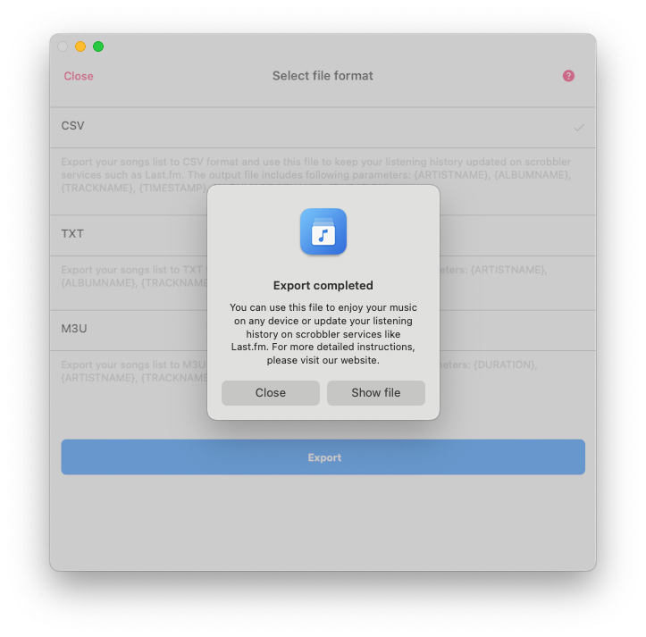

After the export is complete, simply tap the 'Show file' button, and the app will reveal the created file in your documents folder. Then, tap the 'More actions' button next to the file name and select the 'Open in' option from the menu. Our next step is to copy the exported file to your desktop computer. You can easily do this by selecting the 'AirDrop' option from the 'Open in' menu.

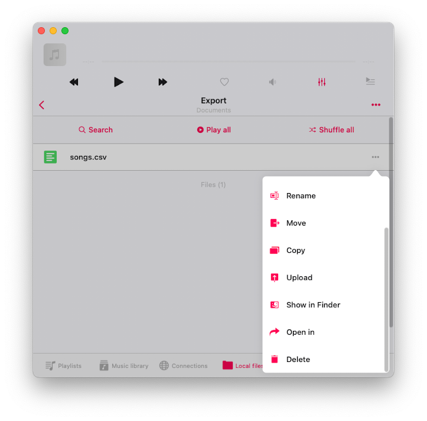

Next up, we'll be using a free open-source [Last.FM](http://Last.FM) client which is available on the Windows platform only. This client allows you to efficiently update your listening history on [Last.FM](http://Last.FM) using the CSV file we just exported.

Now, if you're not currently using a Windows computer, don't worry. You can still access this client by installing VirtualBox on your Mac and using the official Windows development environment image file.

Here's what you need to do:

- Install VirtualBox from the following link: [VirtualBox Download](https://www.virtualbox.org/wiki/Downloads)

- Download and install the Windows development environment from this link: [Windows Development Environment](https://developer.microsoft.com/en-us/windows/downloads/virtual-machines/)

On your Windows computer (or VirtualBox app with Windows Development image) download and install [Last.fm-Scrubbler-WPF](https://github.com/SHOEGAZEssb/Last.fm-Scrubbler-WPF) - free open-source software available on GitHub. We tested on version 1.28 which you can download here: [https://github.com/SHOEGAZEssb/Last.fm-Scrubbler-WPF/releases/tag/B1.28](https://github.com/SHOEGAZEssb/Last.fm-Scrubbler-WPF/releases/tag/B1.28)

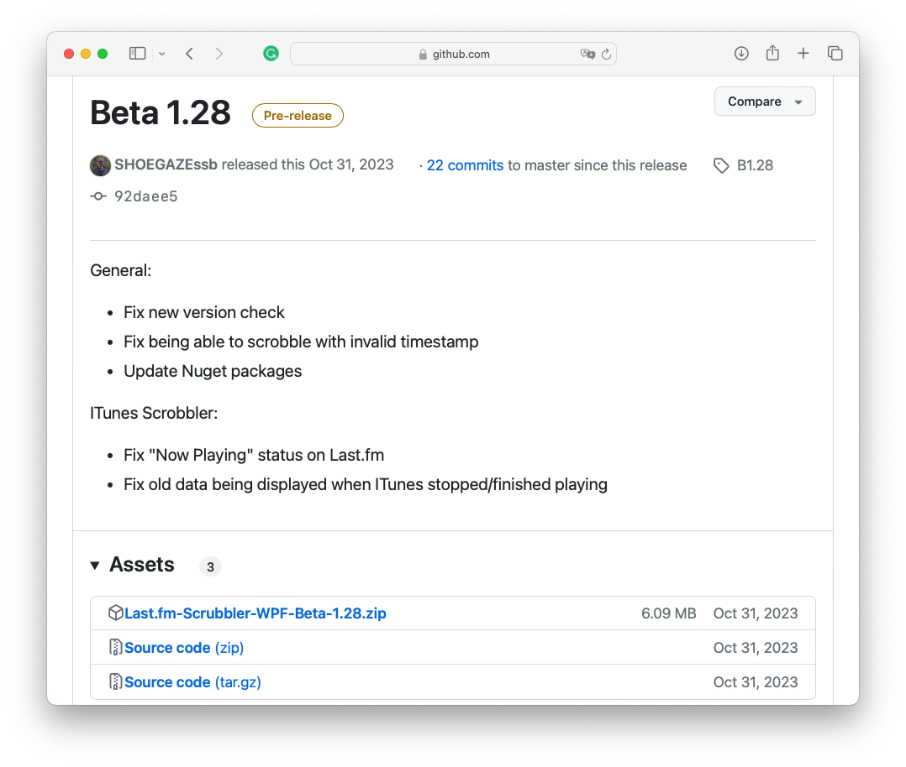

Under the 'Assets' section tap on [Last.fm-Scrubbler-WPF-Beta-1.28.zip](http://Last.fm-Scrubbler-WPF-Beta-1.28.zip) to download the installation archive. Unarchive the downloaded file and open the unarchived folder.

- IMPORTANT

This app is still in beta. The app creators did not get a lot of testing. They recommend trying to scrobble to a test account first and see if the things you want to scrobble do so correctly. Especially if you scrobble a lot of tracks at once. Please be careful with your accounts.

Run Last.fm-Scrubbler-WPF.exe

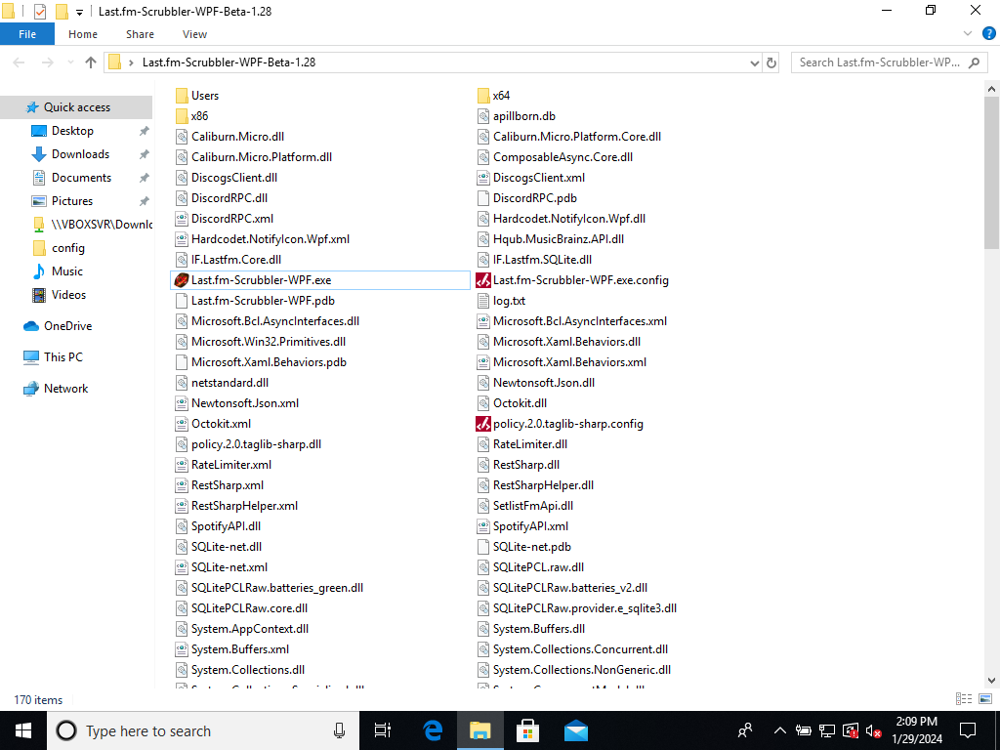

On the main screen of the application, simply tap on 'Not logged in,' located in the bottom left corner, to activate the 'Add account' screen.

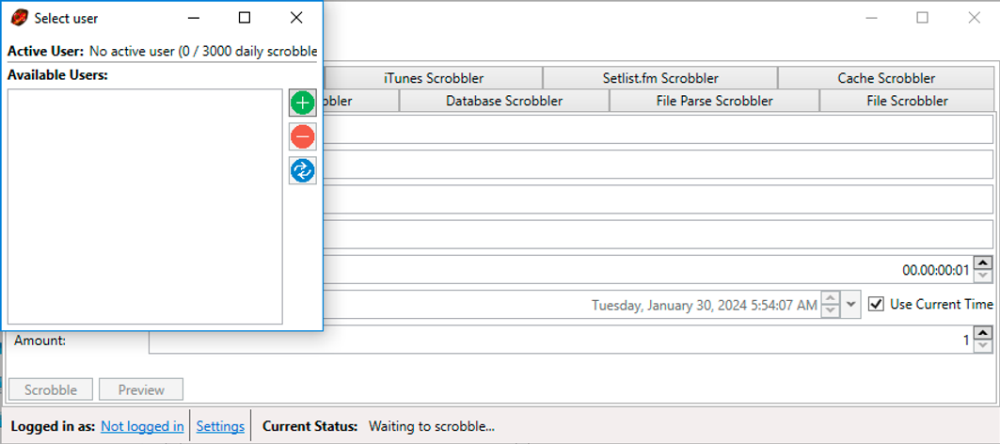

Enter your login credentials.

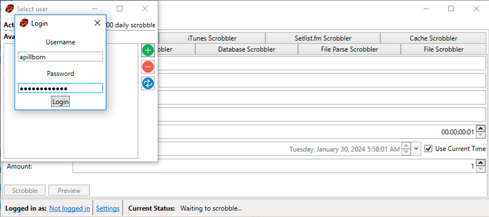

Tap the 'Login' button to add your account.

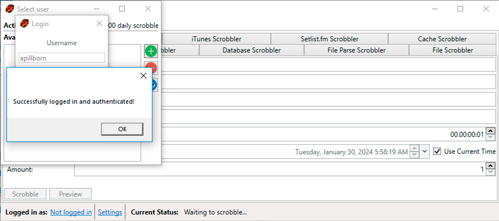

Open the 'File Parse Scrobbler' tab to start importing CSV file from the Evermusic app.

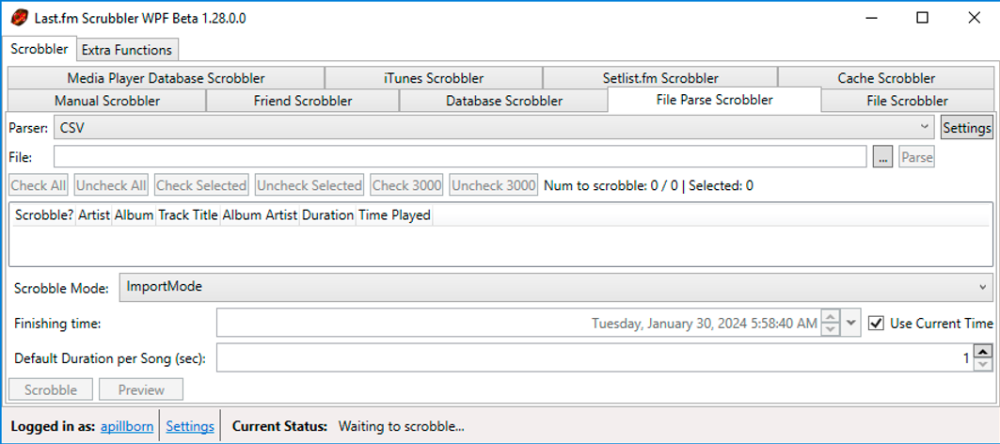

Choose 'Parser: CSV' and tap the 'Settings' button.

On the next screen, you can choose the order of the parameters on your CSV file.

Individual fields can be enclosed by quotes and NEED to be enclosed by quotes if the field contains any of the set delimiters. For example:

"ArtistWith, CommaInTheName", Album, Track, 06/13/2016 19:54, AlbumArtist, 00:02:33

So leave all settings by default the only thing you need to change is to enable the checkbox in the 'Has Fields Enclosed In Quotes' field.

Tap 'Save & Close' to apply changes.

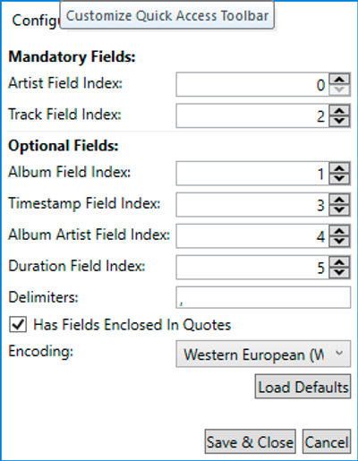

File parse scrobbling has two modes. They can be changed with the "Scrobbling Mode" ComboBox.

Normal Mode: In this mode, the tracks will be scrobbled with the timestamp from the parsed scrobble. Only scrobbles newer than 14 days can be scrobbled.

Import Mode: In this mode, the tracks will be scrobbled with the timestamp calculated from the "Finish Time" and the selected duration between each track. This allows the scrobbling of the tracks even if the timestamp of the parsed scrobble is older than 14 days. Therefore the first (upmost) track in the csv file will be scrobbled with the "Finish Time".

Choose a previously generated CSV file from the Evermusic app in 'File:' field and tap 'Parse'. In some cases, you may see an error alert saying that some scrobbles could not be parsed. It's ok if you have some tracks without complete metadata like Artist Name.

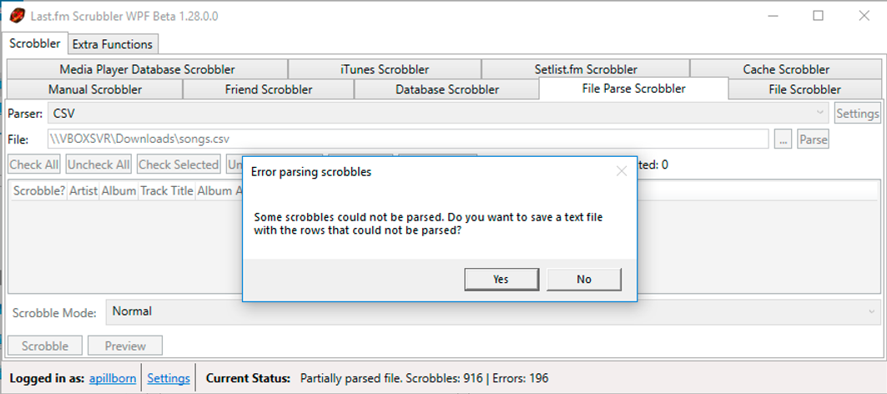

Tap the 'Check All' button to select all parsed tracks.

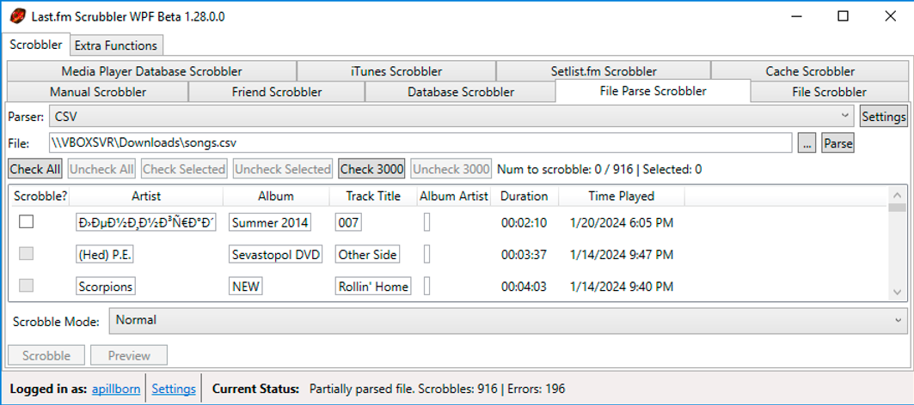

Tap the 'Preview' button to check all changes that will be posted to the server.

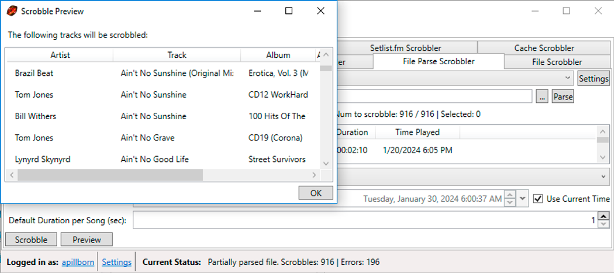

Tap the 'Scrobble' button to upload all changes to the server.

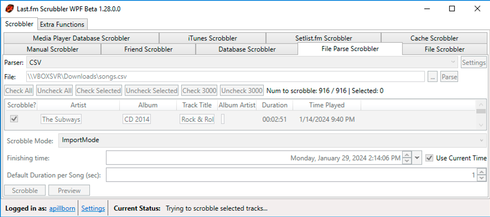

Previously the Last.fm-Scrubbler-WPF did not have a scrobbles per day limit. This has now changed since some people used the Scrubbler to scrobble so many tracks, that it caused problems for the Last.fm page. The scrobble limit is currently 2800 scrobbles per day. When you try to scrobble more than that you will get an error message. There are plans to add a "scrobble queue", so if you need to scrobble more than 2800 tracks, they get added to a queue and are automatically scrobbled after some time. You can check how many scrobbles you have left in the user selection view.

Once all records are successfully uploaded to the server, you'll see a message at the bottom of the app window confirming: 'Successfully scrobbled selected tracks.'

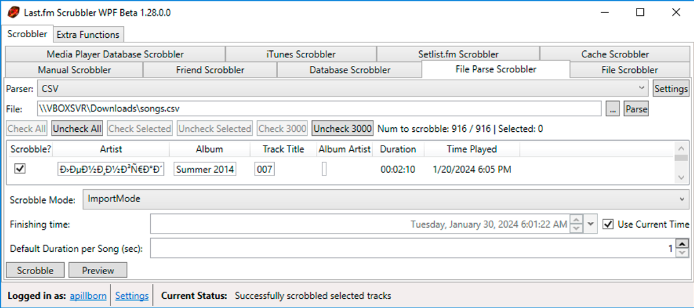

Now you can open your profile on the [Last.fm](http://Last.fm) page and check all the changes.

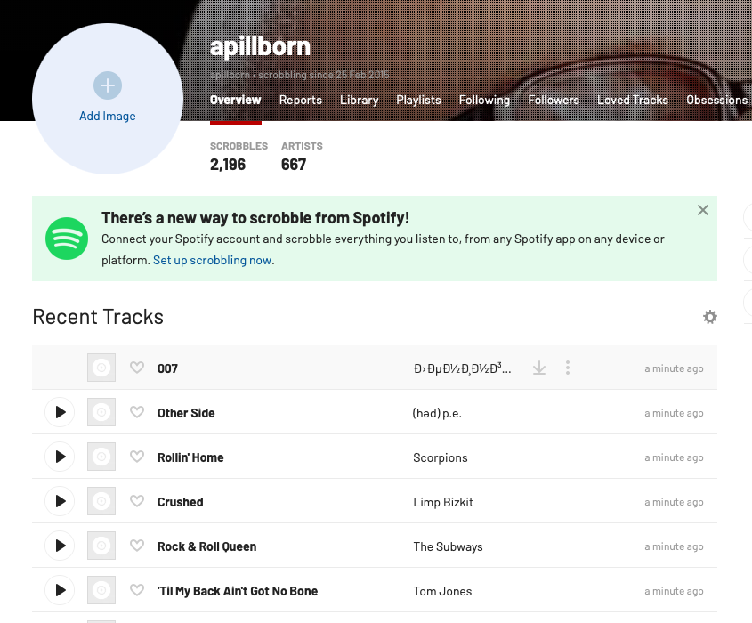

