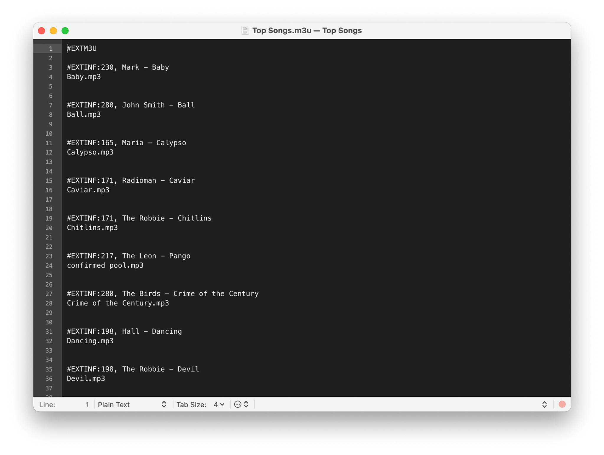

This comprehensive guide will walk you through the process of archiving (ZIP) playlists, albums, artists, and genres in **Evermusic** and **Flacbox** and transferring them to another device.

## Step-by-Step Instructions

### 1. Archiving a Playlist

**1. Open the Playlists Section:** Launch the app and navigate to the playlists section.

**2. Select a Playlist:** Choose the playlist you want to archive.

**3. Access More Actions:** Tap the **More Actions** button (three dots) to reveal all available options.

**4. Choose "Add to Archive"** action.

- The app will:
  - Download all cloud files associated with the playlist.
  - Copy all local files from the playlist to a local folder in the **Export** directory.
  - Save the playlist’s album artwork as a separate file.
  - Save the playlist structure in an M3U file.
  - Compress the folder into a ZIP archive.

### 2. Monitoring the Archiving Progress

- Open the **Local Files** section and go to **File transfers** to track playlist files download progress.

- Once archiving is complete, an **Info Alert** will appear.  
  You can:
  - Dismiss the alert.
  - Select **Show file** to locate the archive in the app.

### 3. Viewing the Created Archive

- The app will open the **Local Documents > Export** folder containing the newly created archive.
- Tap the archive to:
  - Unarchive it to the current directory.
  - View its contents, including all playlist tracks and the M3U file.

### 4. Using the Created Archive

- Tap **More Actions** on the archive for options like:
  - **Upload / Copy:** Transfer the archive to another device or cloud storage. You can also use Wi-Fi Drive feature as described here [https://www.everappz.com/post/how-to-transfer-files-wirelessly-from-a-computer-to-an-iphone-using-wifi-drive](https://www.everappz.com/post/how-to-transfer-files-wirelessly-from-a-computer-to-an-iphone-using-wifi-drive)
  - **Show in Finder:** Locate the archive on your Mac (Mac users only).

By tapping on the generated M3U file, you can view all playlist tracks along with their relative paths, ensuring easy navigation and seamless playlist restoration.

### 5. Transferring and Importing the Archive on a New Device

1. Move or upload the archive to the new device.
2. Open the app on the new device and locate the archive in the local directory.
3. Tap the archive to unarchive its contents.
4. Navigate to the **Playlists** section:
   - Tap **More Actions** and select **Import Playlist from File**.

- Choose **Files in This Application.**

- Navigate to the unarchived folder.
- Select the M3U file.

### 6. Rebuilding the Playlist

- The app will parse the M3U file and rebuild the playlist, restoring all tracks and maintaining the original structure.

### 7. Conclusion

By following this guide, you can efficiently archive and transfer your playlists, albums, artists, or genres between devices using Evermusic or Flacbox. This method ensures your playlists remain intact and accessible wherever you go.
