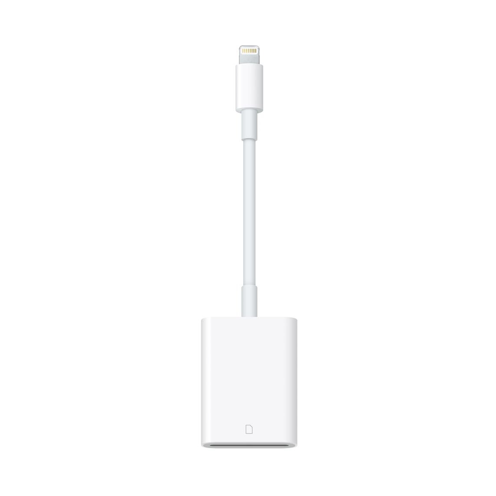
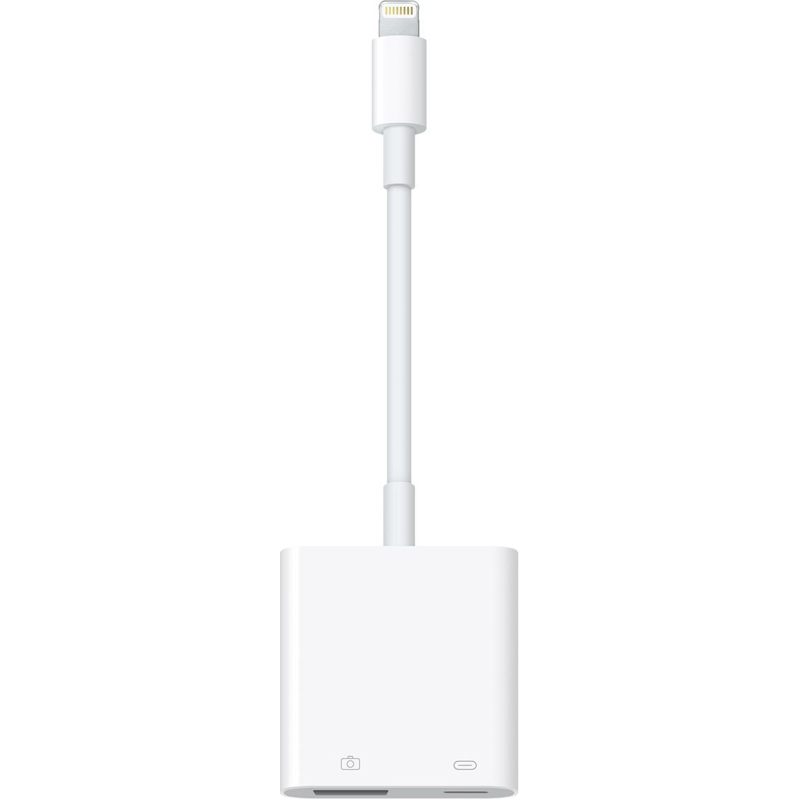
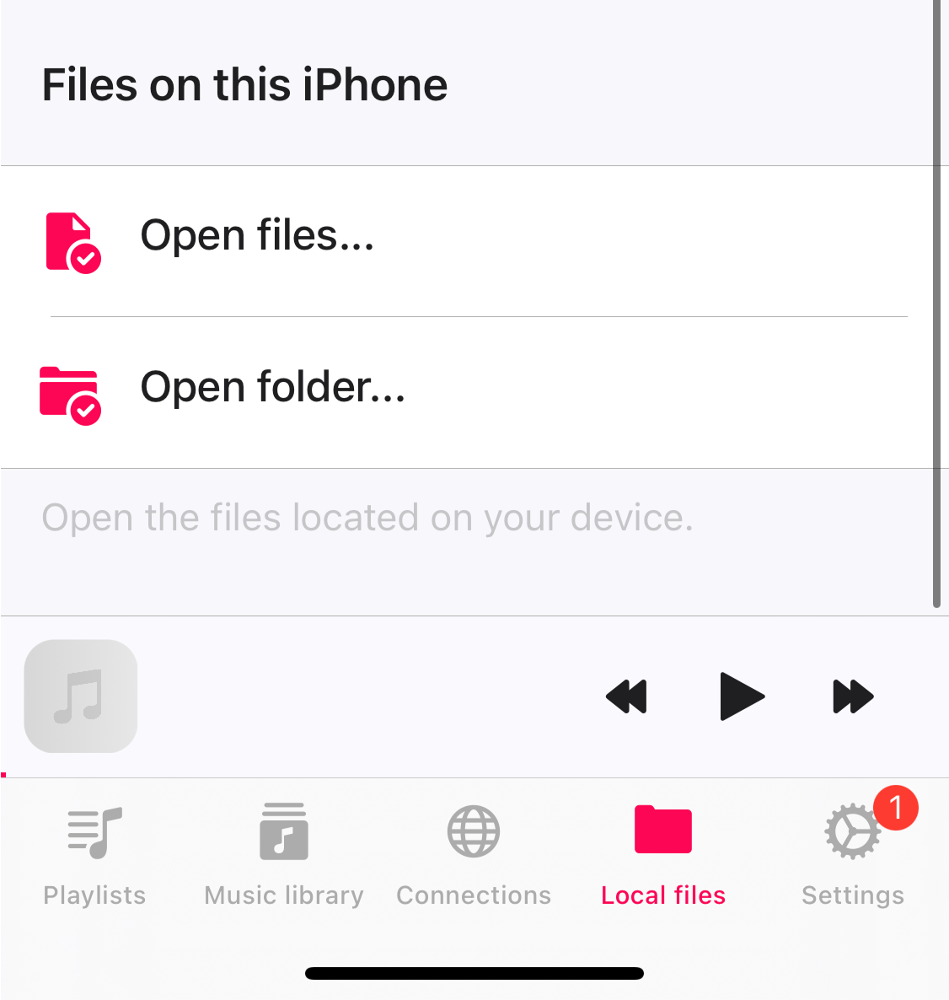
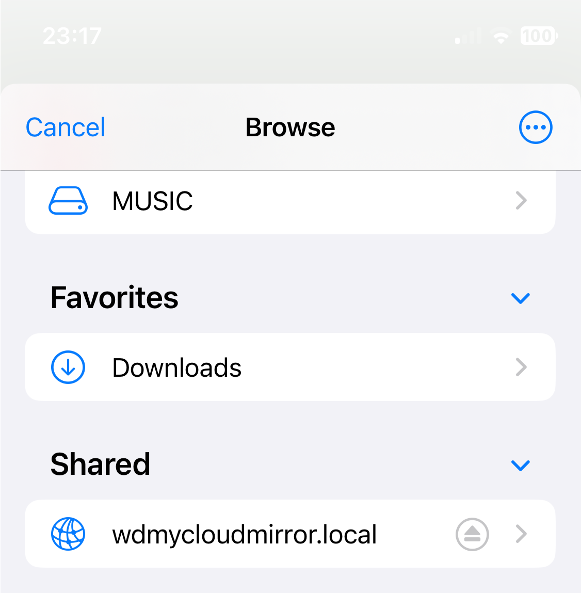
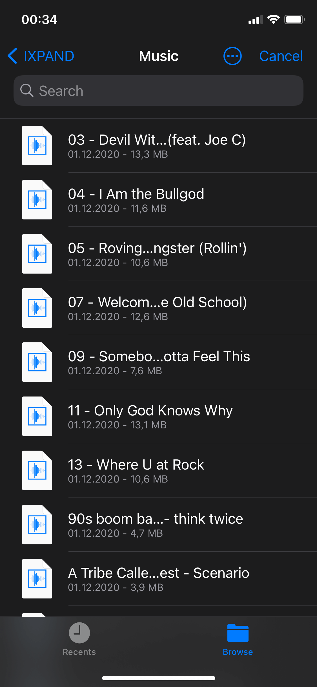
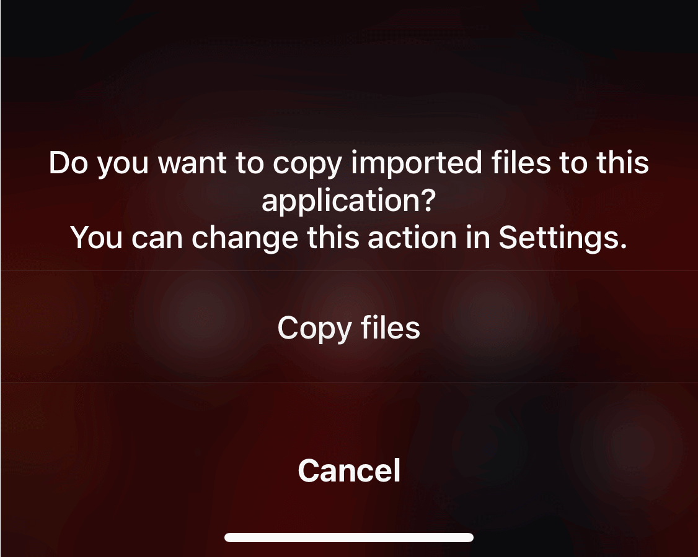
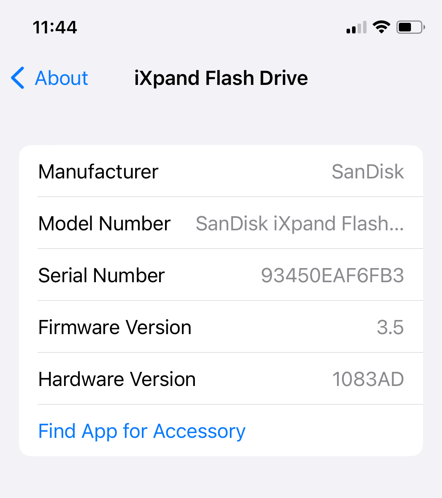
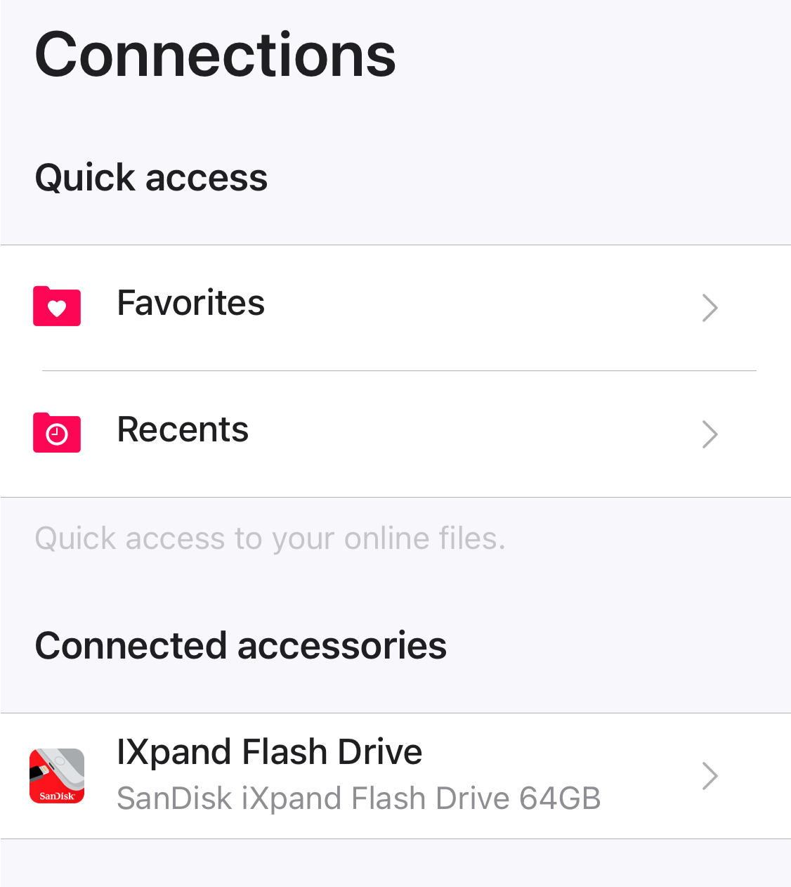
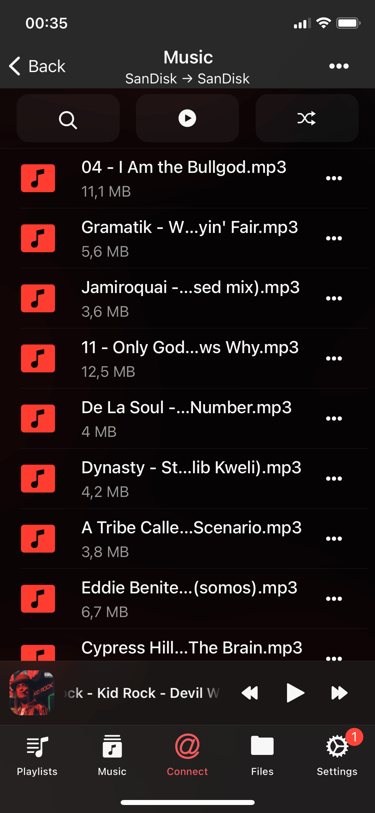

There are several ways to connect a USB flash or SD card to the iPhone and listen to music located on it. You can also manage your files with a built-in file manager in our apps Evermusic, Flacbox, Evertag.

The first way is to connect your USB flashcard using standard Lightning to SD Card Camera Reader [https://www.apple.com/shop/product/MJYT2AM/A/lightning-to-sd-card-camera-reader](https://www.apple.com/shop/product/MJYT2AM/A/lightning-to-sd-card-camera-reader)

or connect your USB flashcard using Apple Lightning to USB 3 Camera Adapter [https://www.apple.com/shop/product/MK0W2AM/A/lightning-to-usb-3-camera-adapter](https://www.apple.com/shop/product/MK0W2AM/A/lightning-to-usb-3-camera-adapter)

In this case open the Evermusic, Flacbox, Evertag app and navigate to the "Local Files" tab. Scroll down to the "Files on this iPhone" section and tap "Open files..." to activate the "External Files Picker".

On the "External Files Picker" screen move to the root screen and scroll down the "Location" section to find a connected USB device.

Open the device and select the files you want to import to the app.

Imported files located on your USB device and if you want to copy them to the app answer "Copy files" on the confirmation message.

But there is also another option available cause our apps support SanDisk iXpand Flash Drives natively.

You can buy SanDisk here: [https://www.westerndigital.com/c/usb-flash-drives.connectorList-lightning](https://www.westerndigital.com/c/usb-flash-drives.connectorList-lightning)

Currently, the app supports SanDisk Flash Drives with protocols iXpand V1, iXpand V2, iXpand V3, iXpand V6, iXpand V7. You can check if your iXpand Flash Drive is supported using the following steps:

- **Connect** the drive to the iOS device
- Open **Settings**
- Tap **General**
- Tap **About**
- Look for **iXpand Flash Drive**
- Tap **Find App for Accessory**
- The app should be listed there

Once you find the supported iXpand Flash Drive, for example: [iXpand Mini Flash Drive](https://www.westerndigital.com/en-ap/products/usb-flash-drives/sandisk-ixpand-mini-usb-3-0?sku=SDIX40N-016G-GN6NN), insert it into the lightning port and open the application. You will see the "Device connected" message and device information.

Just open the "Connections" screen and scroll to the "Connected accessories" section.

Tap on the connected accessory icon to open it and get the list of files and folders located on the USB device. In some cases other apps may use your drive and set busy state. In this case, you will see a warning message. Nothing serious - just close all other apps that use your flash drive or unplug it and plug again.

Once you open any folder with music you will see all available audio files. Just tap any file to start playback. You can enable an equalizer on the player screen or stream audio content to AirPlay (Sonos, Apple TV) or Google Chromecast device.

You can use a built-in file manager to COPY, MOVE, RENAME, DELETE your files. You can also add audio files to the music library in Evermusic or Flacbox apps. And of course you can copy audio files from flash drive to your iPhone memory.

Enjoy the freedom to access and manage your music effortlessly with these simple steps, and say goodbye to storage limitations!
