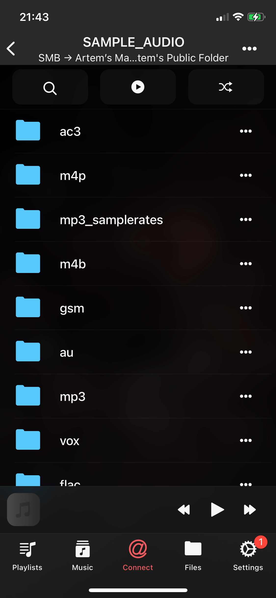

Bluesound VAULT has an internal hard drive and acts as a Network Attached Storage (NAS). Accessing the VAULT’s internal hard drive allows you to add/delete files, edit metadata tags from our apps Evermusic, Flacbox, Evertag.

**Following are the steps to access your VAULT’s internal hard drive:**

1. In the BluOS App, select **Help > Diagnostics**.

2. From the **Diagnostics** page, obtain the **IP Address** of the VAULT. This **IP Address** will be used in next steps.

3. Open Evermusic, Flacbox or Evertag.

   

4. Open the "Connections" screen and select the "Connect a cloud service" menu item.

   

5. Select "SMB" cloud service.

   

6. On the "SMB Configuration screen" enter URL in the following format:

   ```
   SMB://<<VAULT-IP>>
   ```

   Replace `<<VAULT-IP>>` with the **IP Address** obtained in Step 2.

   **Note:** Leave Login and Password fields blank because VAULT Storage supports GUEST mode.

   

7. Tap the "Sign in" button to save the configuration.

8. Open connected cloud storage and navigate inside the folder with audio files and tap any file to start the audio player.

   

9. You can also edit files using the built-in file manager.

   

With these straightforward steps, you can effortlessly access your Bluesound VAULT's internal hard drive and take control of your music library using Evermusic, Flacbox, or Evertag.