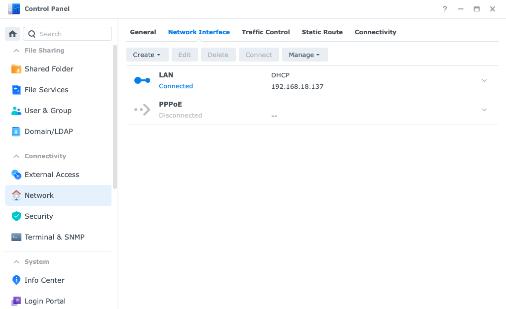
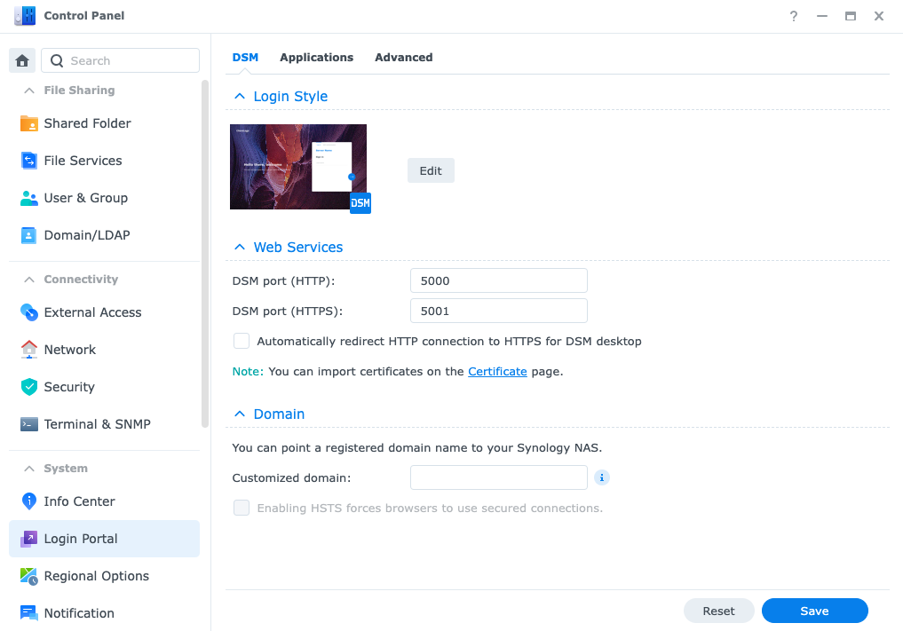
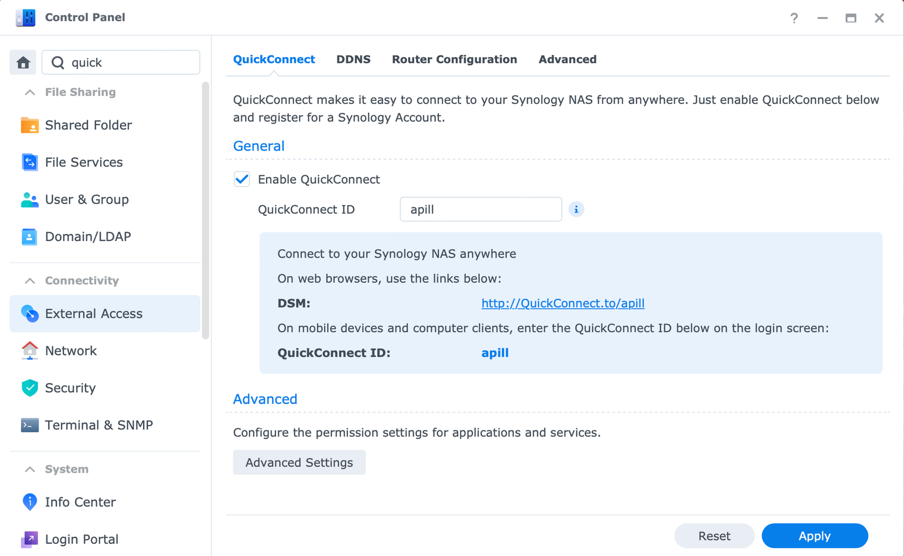
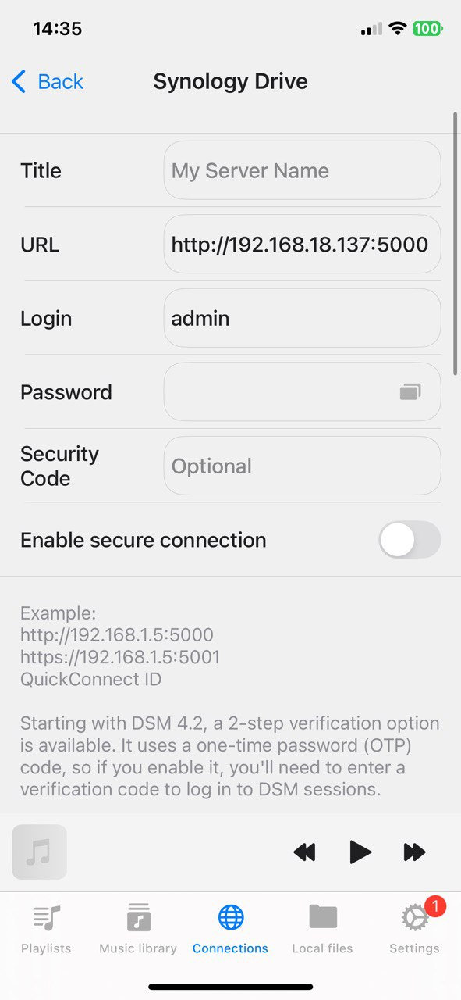
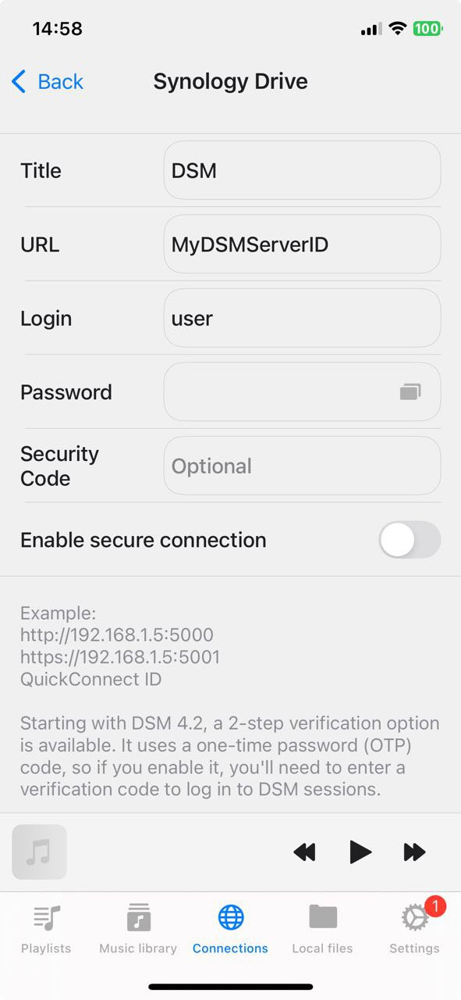
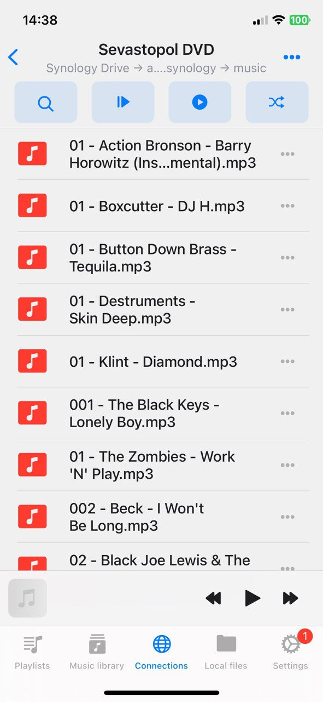

# How to Connect Synology NAS and Listen to Music on Your iPhone or Mac

**Writer:** admin  
**Date:** Sep 19, 2024  
**Updated:** Dec 5, 2024  
**Reading Time:** 4 min read

If you're looking for a seamless way to connect your Synology NAS and enjoy your music library on your iPhone or Mac, the Evermusic and Flacbox apps are the perfect solutions. These apps support a wide range of audio formats, including FLAC, MP3, and WAV, making it easy to stream and listen to high-quality music directly from your Synology NAS.

In this guide, we will show you how to connect your Synology NAS to the Evermusic or Flacbox app using Synology's native API and QuickConnect feature. By leveraging Synology's direct API, you can securely access your music library outside your home network without needing complicated configurations like WebDAV, SMB, DLNA. With QuickConnect, you'll be able to stream and manage your music from anywhere, using your iPhone or Mac.

## Step 1: Configure Shared Folder Permissions (Optionally)

1. Open the **Control Panel** and go to the **Shared Folder** section.

2. Select the **Music** folder and click **Edit**.

3. In the **Permissions** tab, configure the permissions. Enable guest access with Read-only if you just need to listen to music, or Read/Write if you need to modify files. Save the changes.

## Step 2: Find Synology NAS IP Address

1. Open the **Control Panel** and go to the **Network Interface** tab.

2. Or use your web browser to visit [find.synology.com](http://find.synology.com).

3. Note the IP address of your Synology NAS (e.g., 192.168.18.137).

## Step 3: Find Synology NAS Network Ports

You can find the official Synology documentation for DSM default network ports at this [Synology Knowledge Center article](https://kb.synology.com/en-global/DSM/tutorial/What_network_ports_are_used_by_Synology_services).

Synology DSM uses the following default ports:
- **HTTP (Web Access):** Port **5000**
- **HTTPS (Secure Web Access):** Port **5001**

These are the default ports for accessing the DSM interface.

## Step 4: Enable QuickConnect ID feature

A Synology QuickConnect ID is a unique identifier that allows you to access your Synology NAS remotely over the internet without needing to configure complicated network settings like port forwarding. QuickConnect simplifies remote access by using Synology's servers to establish a connection between your NAS and your device, such as your smartphone or computer, through the QuickConnect ID.

**How to Find or Set Up Your QuickConnect ID:**

1. **Log in to DSM.**
2. Go to **Control Panel > External Access > QuickConnect**.
3. **Enable QuickConnect** and either create or view your unique QuickConnect ID.

## Step 5: Connect to Synology NAS on your iPhone/Mac using Evermusic or Flacbox

[Evermusic](https://apps.apple.com/us/app/evermusic-cloud-music-player/id885367198) and [Flacbox](https://apps.apple.com/us/app/flacbox-hi-res-music-player/id1097564256) are both music player apps designed for iOS and MacOS devices, each offering unique features and capabilities for managing and enjoying your music library.

1. Open the Evermusic or Flacbox app and go to the **Connections** tab.

2. Choose **Connect a cloud service** and select **Synology Drive**.

You have two connection options: **manual** using the server’s IP address and port, or **automatic** via QuickConnect ID.

### Manual Connection

For the manual method, you’ll need the direct IP address and port number that you retrieved in previous steps.

1. Enter the server URL you obtained in step 2, using the following format: PROTOCOL://IP_ADDRESS:PORT_NUMBER
   - Use **port 5000** for HTTP and **port 5001** for HTTPS connections.

   For example:
   - HTTP: [http://192.168.18.137:5000](http://192.168.18.137:5000)
   - HTTPS: [https://192.168.18.137:5001](https://192.168.18.137:5001)

2. The actual port number can be confirmed in step 3 of your setup.
3. Enter your **login** and **password** for the Synology NAS.
4. Tap **Sign In** to establish the connection.

### Automatic Connection

For the automatic connection, you’ll use the **QuickConnect ID** from step 4. Instead of manually entering the IP address and port number for your Synology NAS, simply input the **QuickConnect ID**. The app will automatically retrieve the necessary connection information.

This method allows you to access your NAS remotely, even outside your home network, so you can manage your files from the internet without needing to configure port forwarding or static IP addresses.

## Two-Factor Authentication

Starting with DSM 4.2, Synology introduced **2-step verification** to enhance security. This feature requires a **one-time password (OTP)** code, generated by an authenticator app, in addition to your regular login credentials. If you have enabled 2-step verification, after entering your username and password, you’ll also need to input the OTP to log in to your DSM session.

Please note, once your session expires, the app will need to be manually reauthorized. To reauthorize:

1. Go to the **Connections** tab in the app.
2. Tap the **More Actions** button next to the server name.
3. Select **Settings** from the menu to enter the new authentication code and complete the reauthorization process.

This ensures that even if you're accessing your NAS from an untrusted network, your data remains secure.

## Step 6: Navigate and Play Music

1. Once connected, the device will appear in the **Connected Devices** list.

2. Navigate to the **Music** folder and tap any audio file to start playback.

## Step 7: Add Connected Cloud Folder to Music Library

1. Open the **Music Library** section in the app.
2. Choose **Add Music** and select **Connections**.
3. Choose your connected NAS server and select the **Music** folder. Tap **Done**.
4. The app will scan the music folder and add supported audio files to the music library. Metadata will be loaded, and your tracks will be grouped by album, artist, and genre.

By following these steps, you can easily set up a connection on your Synology NAS and stream your entire music library to your iPhone or Mac using Evermusic or Flacbox. Whether you're at home or on the go, enjoy seamless, high-quality access to your favorite tracks from anywhere using QuickConnect. Take advantage of the flexibility and convenience that these apps offer, and start managing your music collection with ease across all your devices.

With secure remote access through QuickConnect and support for a wide range of audio formats, you'll never be far from your music. Now, your NAS-stored files are just a tap away!

---

**Tags:** [music](https://www.everappz.com/blog/tags/music), [streaming](https://www.everappz.com/blog/tags/streaming), [nas](https://www.everappz.com/blog/tags/nas), [synology](https://www.everappz.com/blog/tags/synology), [quickconnect](https://www.everappz.com/blog/tags/quickconnect)  
**Category:** [How To](https://www.everappz.com/blog/categories/how-to)