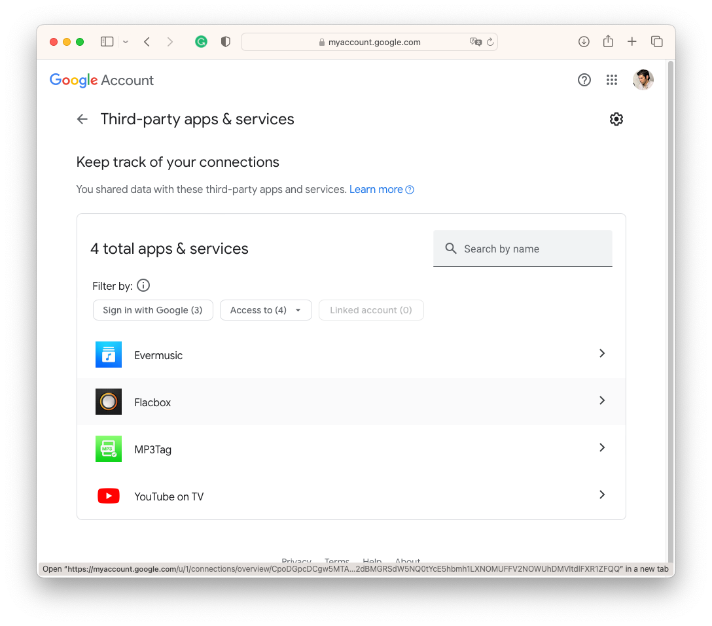
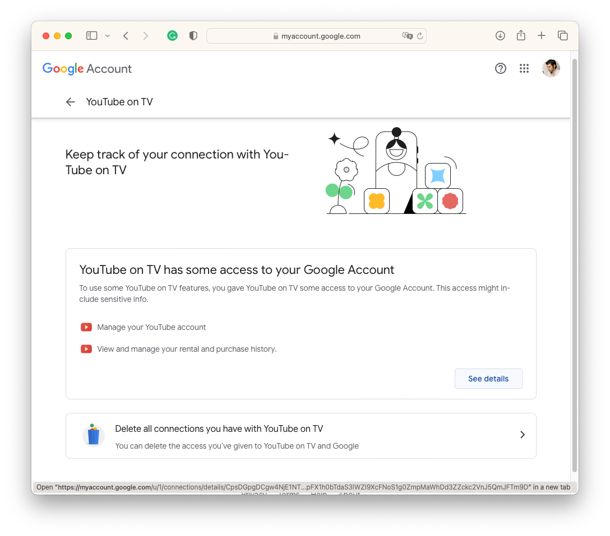
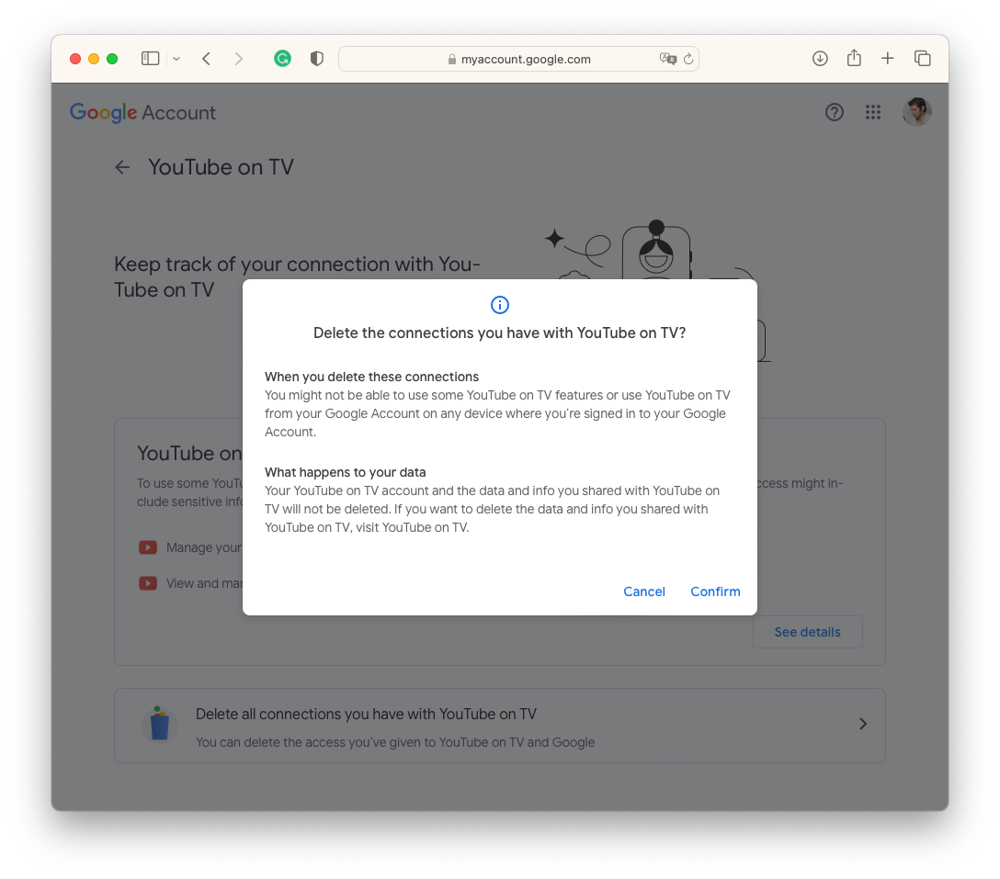
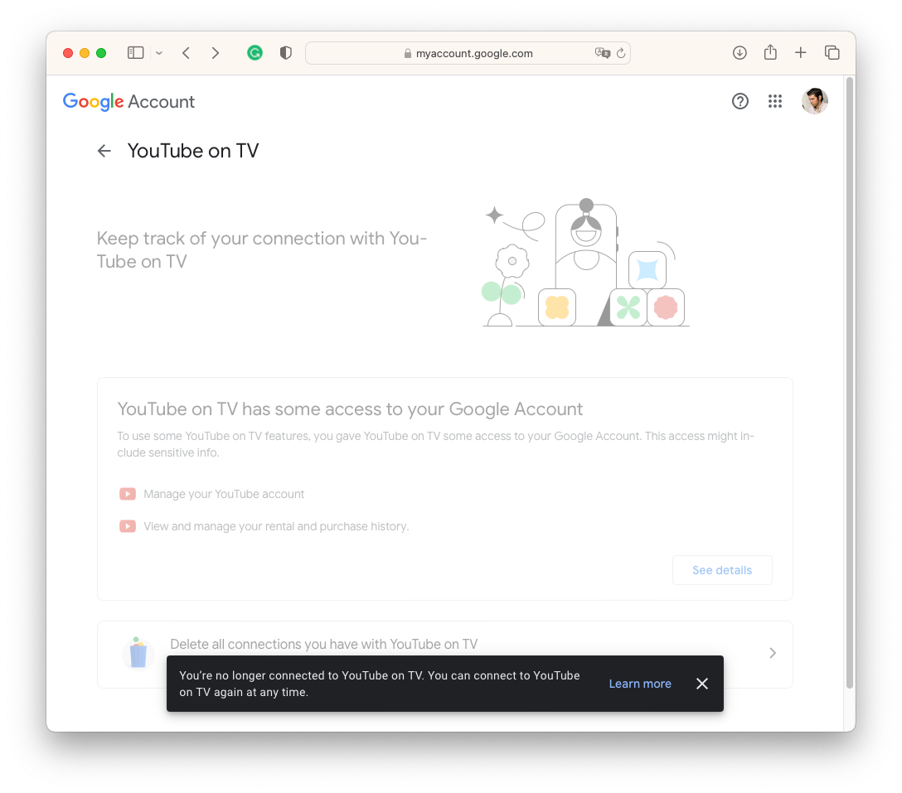
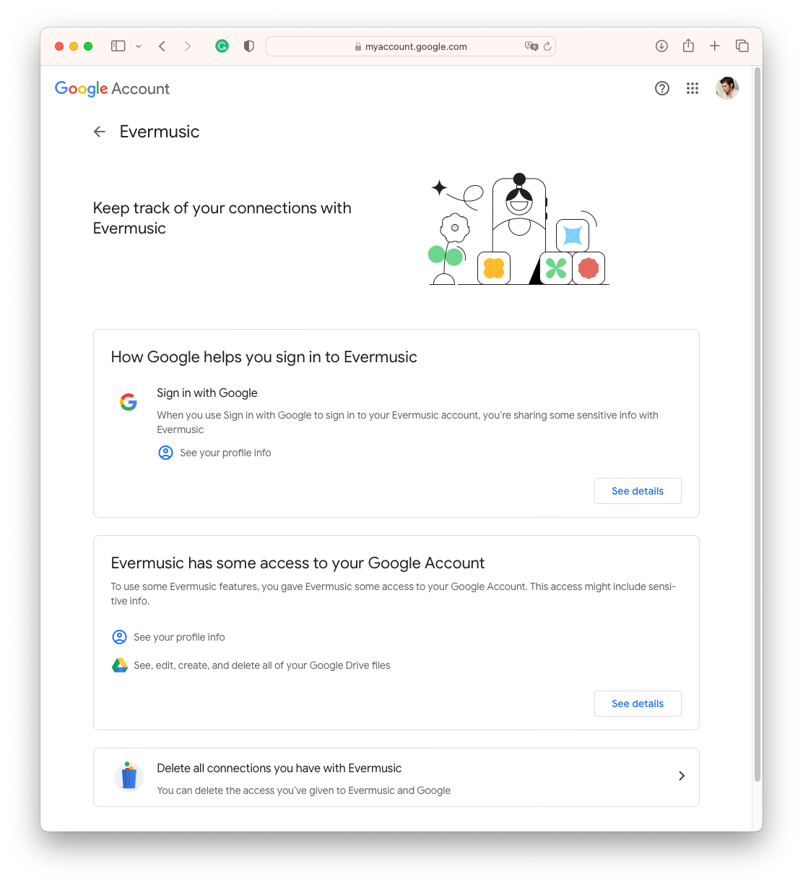

# How to disconnect third-party app from your Google account

**Writer:** admin  
**Date:** Mar 2, 2020  
**Updated:** Dec 6, 2024  
**Reading Time:** 2 min read

In today's digital age, we often link our Google accounts to various third-party apps and services for added convenience. While this can make life easier, it's essential to maintain control and security over your Google account. Sometimes, you may want to disconnect a third-party app that you no longer use or trust. In this article, we'll guide you through the process of disconnecting a third-party app from your Google account, helping you ensure your online security.

## Why Disconnect a Third-Party App?

There are several reasons why you might want to disconnect a third-party app from your Google account:

**1. Security Concerns:**  
If you suspect that a third-party app might compromise your account's security or access more information than necessary, it's best to sever the connection.

**2. Unused Apps:**  
Over time, you may have connected various apps that you no longer use. Disconnecting them reduces clutter and helps you maintain better control over your account.

**3. Privacy:**  
Disconnecting apps can help protect your privacy by limiting the data shared with these services.

Now, let's dive into the steps to disconnect a third-party app from your Google account.

## Steps to Disconnect a Third-Party App:

**1. Access Your Google Account Settings:**  
Open a web browser and go to [myaccount.google.com](https://myaccount.google.com/).

**2. Sign In:**  
If you're not already signed in, enter your Google account credentials to access your account settings.

**3. Security:**  
In the left-hand menu, select "Security." This section allows you to manage the security settings of your Google account.

**4. Third-party Apps with Account Access:**  
Scroll down to the section titled "Third-party apps & services" and click on it. Here, you'll find a list of apps that have access to your Google account.

**5. Review Third-party Apps:**  
Carefully review the list of connected apps. These apps have varying levels of access to your Google account data.

**6. Remove Access:**  
To disconnect an app, click on it. A window will pop up with details about the app's access. Here, you'll find the option to "Remove Access", "Disconnect" or "Delete all connections".

**7. Confirm Removal:**  
Confirm your decision to disconnect the app. Google will ask you to confirm this action to ensure you're making an informed choice.

**8. Repeat as Needed:**  
If you have multiple apps you want to disconnect, repeat the process for each one.

After disconnecting the apps, it's a good practice to review and adjust the permissions for apps you decide to keep connected. You can do this by clicking on each app and reviewing the permissions it has.

## Conclusion:

Taking control of your online security and privacy is vital in today's digital landscape. Disconnecting third-party apps that you no longer use or trust is a step in the right direction. By following the simple steps outlined in this guide, you can effectively manage your Google account's access and ensure that your personal information remains secure.

Remember that while third-party apps can enhance your digital experience, it's crucial to be discerning about the apps you connect to your Google account. Regularly reviewing and disconnecting apps you no longer need is a proactive way to protect your online identity and data.