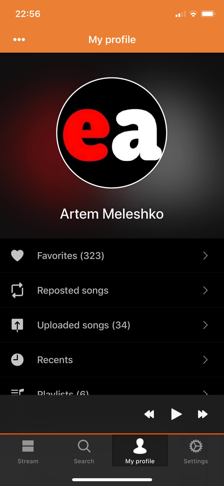
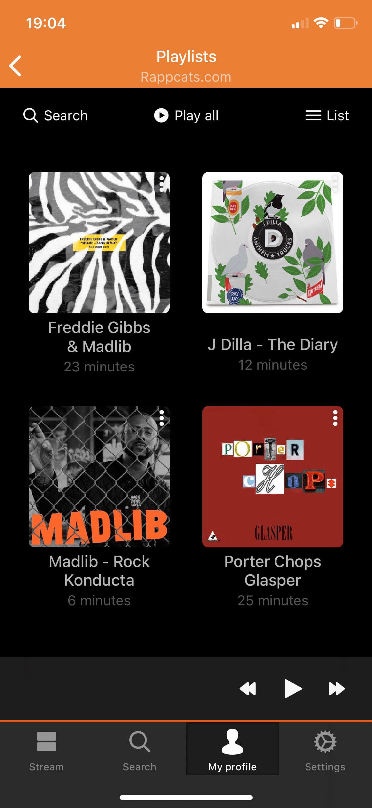
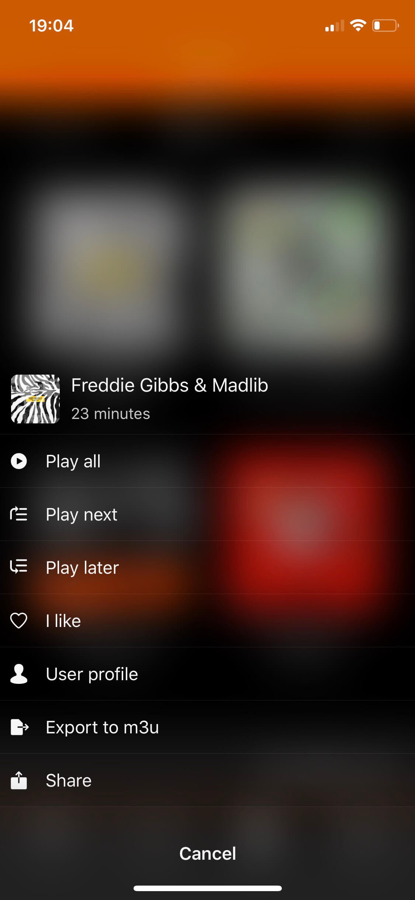
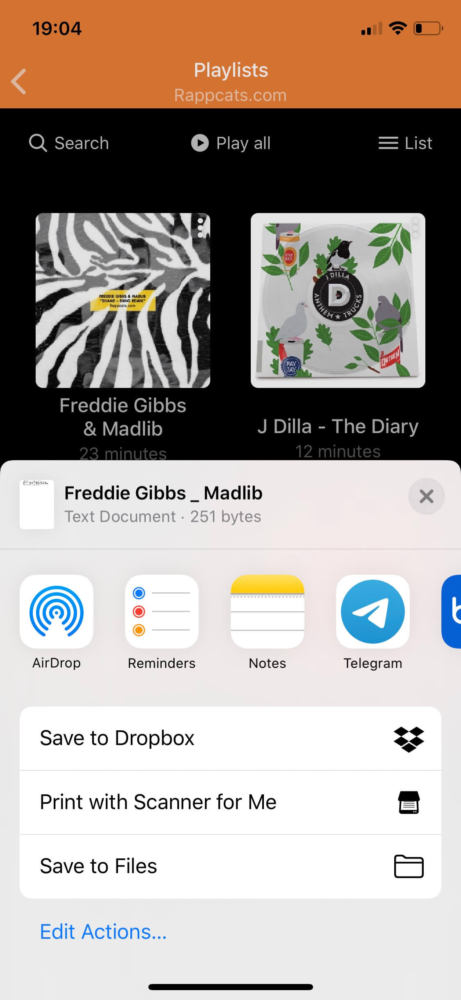
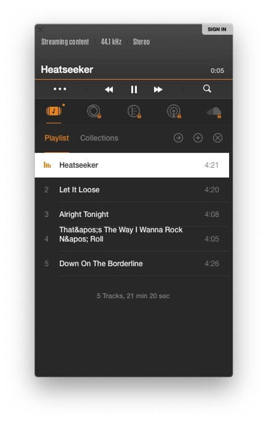
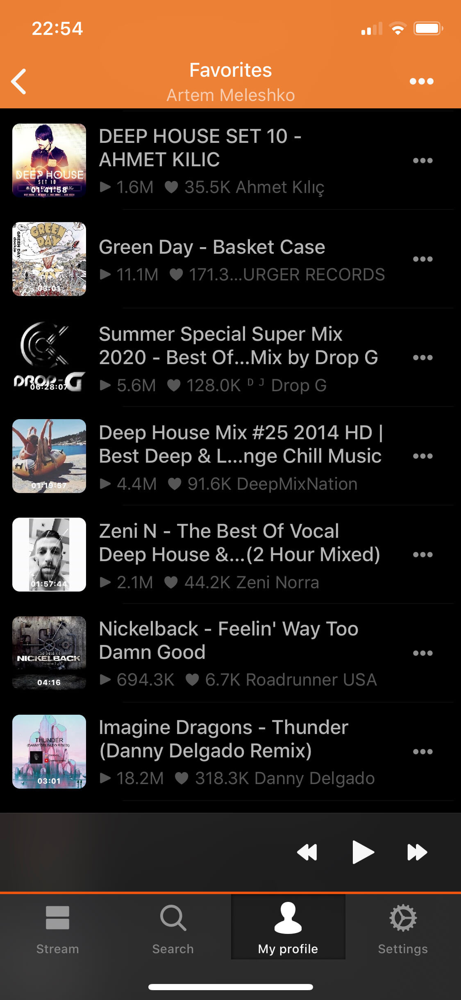

# How To Export SoundCloud Playlists, Favorites, Reposts to M3U

**Writer:** admin  
**Date:** Nov 27, 2019  
**Updated:** Dec 8, 2024  
**Read Time:** 1 min read

## How To export SoundCloud Playlist to M3U format

1. Install [Soundy](http://bit.ly/soundyappstore).
2. Login to your SoundCloud account.

3. Select 'Playlists' in 'My Profile' screen.

4. Tap 'More' button on the playlist you want to export.

5. Select 'Export to m3u' in the drop down menu.

6. Wait several seconds while activity indicator is running.

7. Once export operation completed you will see standard 'Open In' dialog where you can select destination location for generated m3u playlist.

8. You can transfer playlist to Mac using AirDrop.

9. You can open playlist in any program that supports m3u playlists (Vox, WinAmp, Windows Media Player, iTunes).

## How To export SoundCloud Favorites to M3U playlist

You can export not only playlists from SoundCloud in Soundy app but entire list of favorites, uploaded songs from your profile and any public profile. To do this open 'Favorites' and tap 'More' button in the top right corner.

Select 'Export to m3u' action to start export operation.

That's all for this tutorial. You can find more information about Soundy [here](https://www.everappz.com/support-soundy).

---

**Category:** [How To](https://www.everappz.com/blog/categories/how-to)