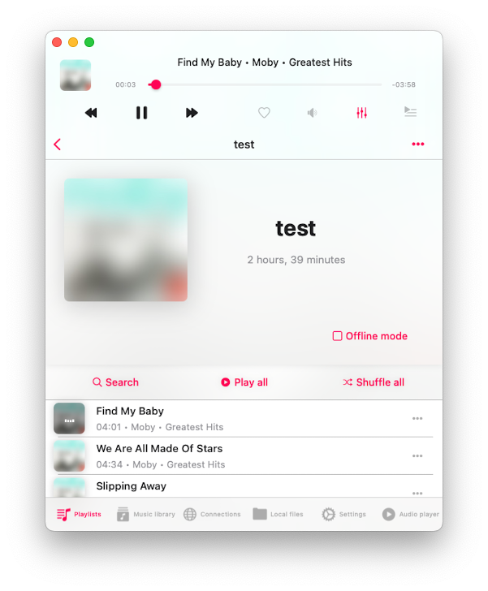

M3U, which stands for MP3 URL or Moving Picture Experts Group Audio Layer 3 Uniform Resource Locator, is a computer file format used for multimedia playlists. One of its primary uses is creating single-entry playlist files that point to streams on the internet. These files offer convenient access to streaming content and are commonly used for downloads, emailing, and listening to Internet radio.

Despite its widespread use, there's no formal specification for the M3U format; it has become a de facto standard. An M3U file is essentially a plain text file that specifies the locations of one or more media files. Depending on the encoding, it's saved with either the "m3u" or "m3u8" filename extension. Each entry in the file specifies a media file's location, which can be an absolute local pathname, a local pathname relative to the M3U file location, or a URL. Entries are separated by line breaks, with some devices requiring line breaks represented as CR LF.

Additionally, M3U files can include comments prefixed by the "#" character. In extended M3U, "#" introduces extended M3U directives, which may support parameters terminated by a colon ":".

In our apps Evermusic and Flacbox, we've implemented M3U file import functionality, eliminating the need for manual playlist creation. This guide will walk you through importing your playlists from cloud storage, local files, or files on your device directly into the app.

First, navigate to the 'Playlists' section. Next, tap the 'More' button located in the top right corner. From the menu that appears, select the 'Import playlist' option.


On the next screen, choose the file location. Supported options include:

- Connected cloud storage;
- Files in the application;
- Files on your device;


Let's select connected cloud storage and open the folder containing the playlist file. Supported playlist file extensions include M3U, M3U8, and CUE. Select the playlist file and tap 'Done' to confirm your selection.


The app will parse the playlist file and create a list of tracks. It will then locate those files on the storage and compile a final playlist that will be imported into the music library. It's crucial that your M3U/CUE file contains the correct paths for media files, and the files should be located at those paths on your storage.



The app supports both relative paths and absolute file URLs.

For example:

Playlist with relative paths:

```plaintext
#EXTM3U

#EXTINF:199, Kenny Rogers & The First Edition
080 - Kenny Rogers & The First Edition.mp3

#EXTINF:205, Kenny Rogers & The Second Edition
../tracks/050 - Kenny Rogers & The Second Edition.mp3

#EXTINF:173, Kenny Rogers & The Third Edition
/music/049 - Kenny Rogers & The Third Edition.mp3
```

Playlist with absolute URLs:

```plaintext
#EXTM3U

#EXTINF:199, Kenny Rogers & The First Edition
http://mywebdavserver.com/music/track1.mp3

#EXTINF:205, Kenny Rogers & The Second Edition
http://mywebdavserver.com/music/track2.mp3

#EXTINF:173, Kenny Rogers & The Third Edition
http://mywebdavserver.com/music/track3.mp3
```

If you import a playlist file located within the app (Local files section), there are no additional steps required.

However, if you want to import a playlist located on your device using the system files picker, there's an important consideration to keep in mind.

Due to security policies, the application can only access the file you select using the system files picker. However, the playlist file may include links to other media files on your device. To import a playlist from your device, you must select a folder containing both the playlist file and all media files linked to it. In this case, the app will scan the selected folder, find the playlist file, build the tracks list, and import it to the music library.

Additionally, you can import multiple playlists at once by tapping the "More Actions" button and selecting "Import Playlists from a Folder." The app will then scan the folder's content, find supported playlist files, and import them into the library.