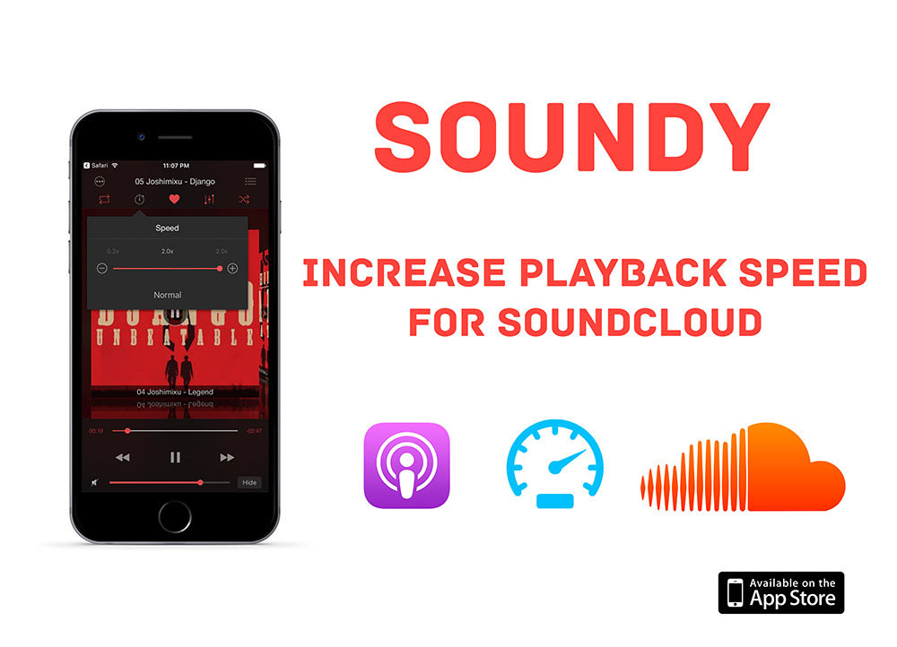
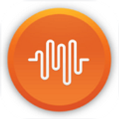
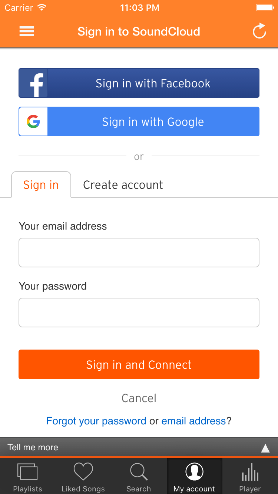
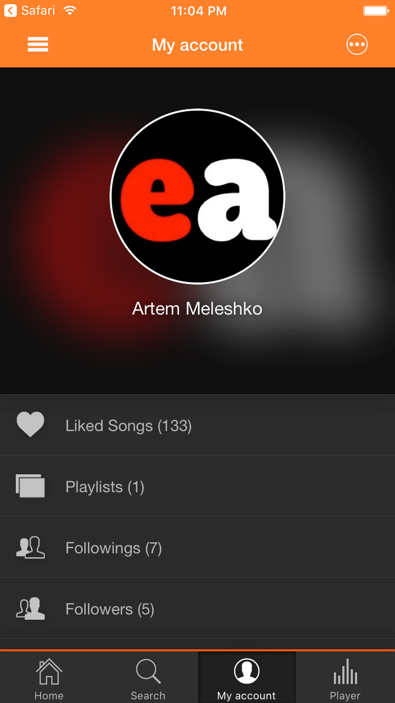
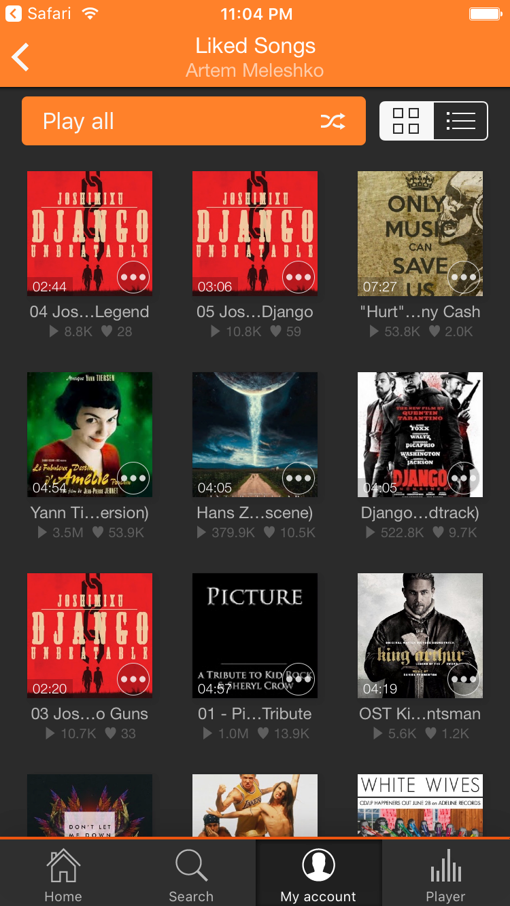
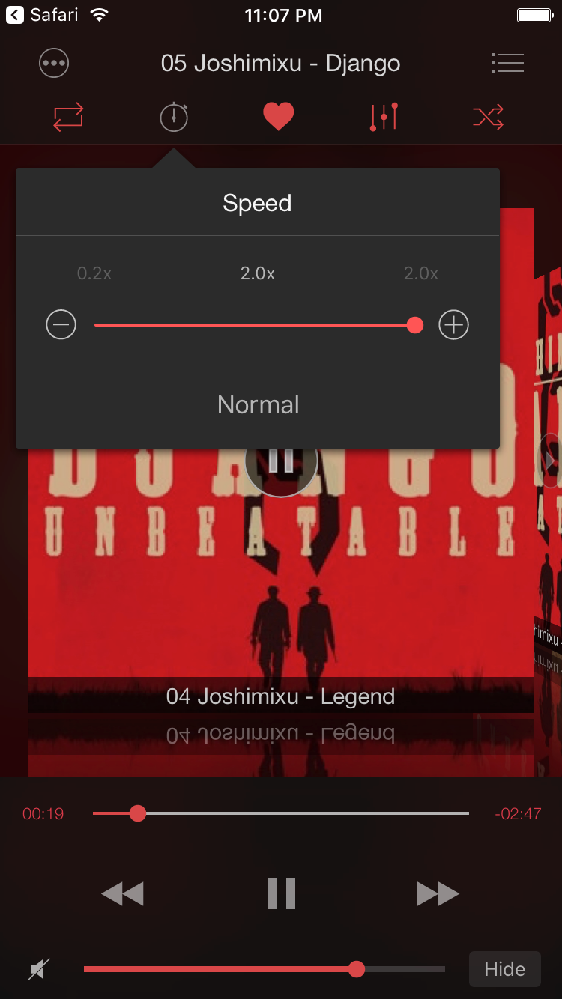

# How to increase playback speed on SoundCloud

Are you an avid SoundCloud user who loves music discovery? SoundCloud is fantastic, but if you're into audiobooks and podcasts, you've probably felt the absence of a key feature in the official iOS client: playback speed control. We hear you! Many SoundCloud users have requested this feature on the SoundCloud Help Community Center, but it hasn't materialized.

Introducing Soundy, your solution to this missing feature. Soundy is the best unofficial SoundCloud player for iOS, and it's absolutely FREE. With a wide range of features like playback speed control, an equalizer, audio bookmarks, and a sleep timer, Soundy takes your SoundCloud experience to the next level.

**Here's how you can start streaming SoundCloud at different speeds in just five simple steps:**

1. First, install Soundy from the App Store: [**Get Soundy**](https://itunes.apple.com/us/app/soundy-music-player-equalizer-for-soundcloud/id1052878966?mt=8)

2. Open the 'My Account' screen and log in using your credentials or simply use the 'Sign in with Google' or 'Sign in with Facebook' options. Rest assured, Soundy uses the official SoundCloud API, so your login credentials remain secure.

Explore your account with access to all your tracks, playlists, albums, likes, and followers on the Account Screen.

3. Find the track, podcast, or audiobook you want to play within your chosen category, then tap to start the player.

4. Open the 'Player' screen and tap on the 'Speed' control. Adjust the speed from 0.2 to 2x with precision using 0.1x increments. This feature is incredibly handy for podcasts when you need to fine-tune the playback speed.

Got questions? Feel free to leave your comments below, and we'll be happy to assist.

**P. S.** Soundy also boasts a real 10-band equalizer with preamp and bass booster. Learn more about our equalizer [here](https://www.everappz.com/single-post/soundy-equalizer-for-soundcloud-on-the-app-store).

Enhance your SoundCloud journey today with Soundy – your gateway to a richer and more customizable listening experience. Download it now!

---

**Tags:** [playback](https://www.everappz.com/blog/tags/playback), [SoundCloud](https://www.everappz.com/blog/tags/soundcloud), [podcasts](https://www.everappz.com/blog/tags/podcasts), [speed](https://www.everappz.com/blog/tags/speed), [audiobooks](https://www.everappz.com/blog/tags/audiobooks)

**Categories:** [How To](https://www.everappz.com/blog/categories/how-to)