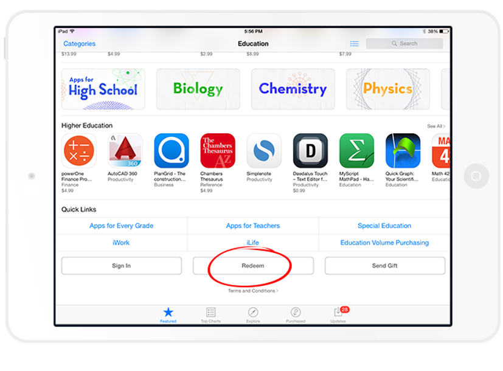
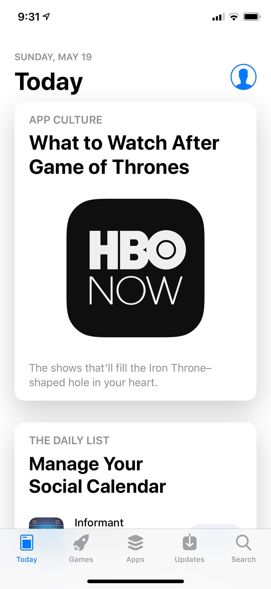
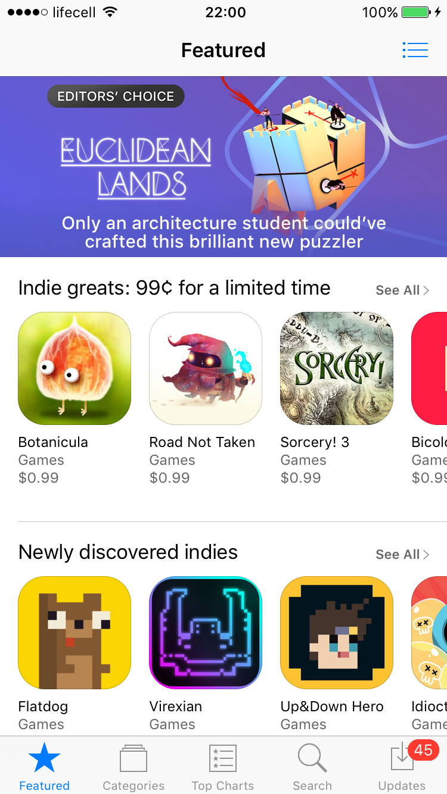
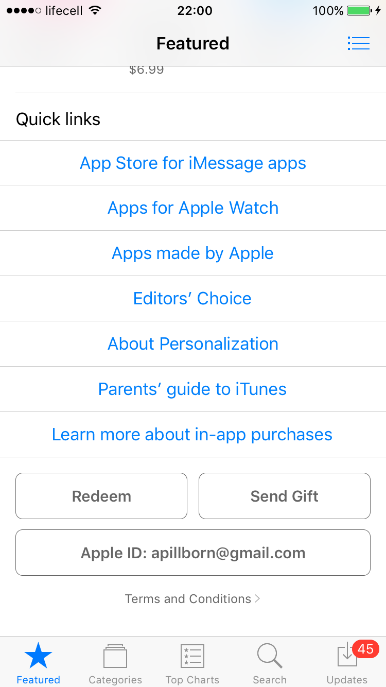
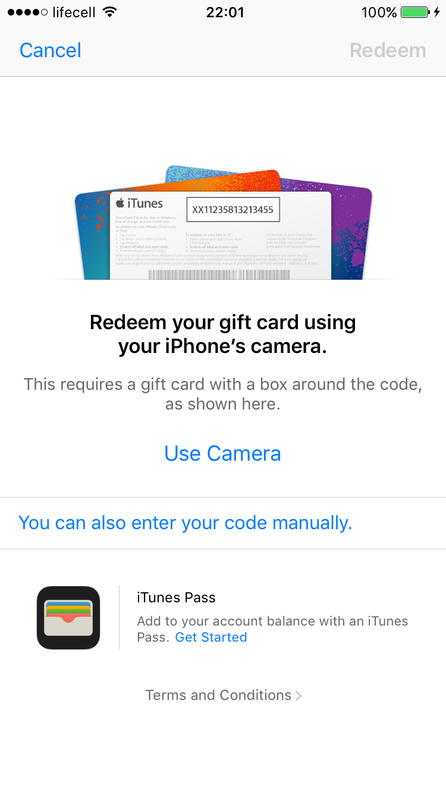
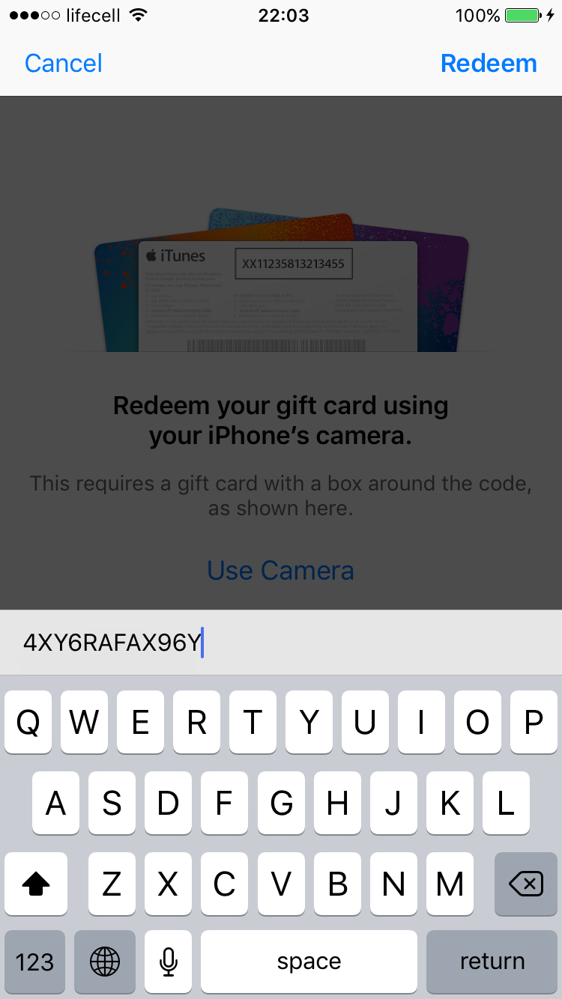
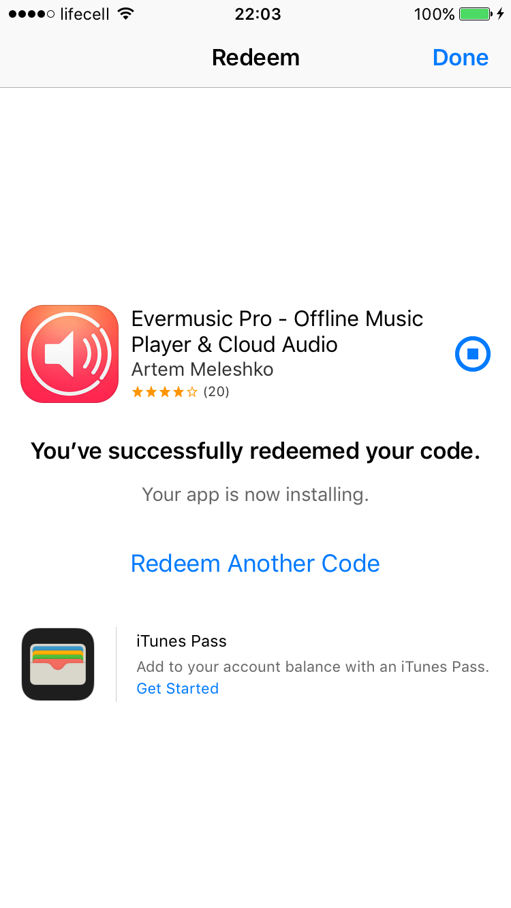
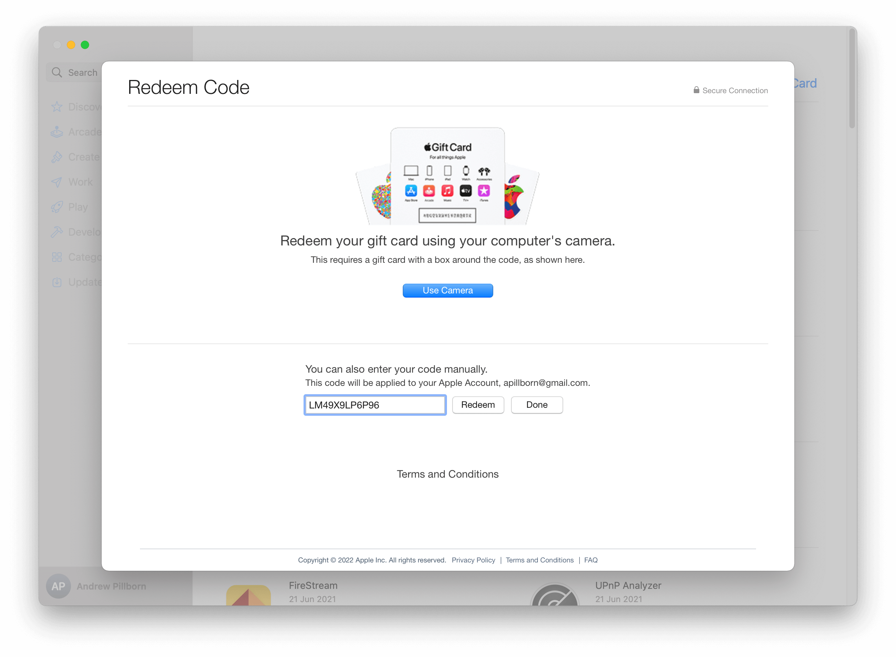

# How to install the app from the App Store or activate in-app purchase using Redeem Promo Code

**Writer:** admin  
**Date:** Jun 6, 2015  
**Updated:** Dec 8, 2024  
**Reading Time:** 2 min read

## What is a Redeem Promo Code?

A Redeem Promo Code is like a golden ticket that lets you install a paid app for free or unlock in-app purchases without spending a dime. To get one, you simply ask the app developer. Here's how to use it:

### If you have iOS 11 or higher:

1. Open the App Store on your iPhone or iPad and tap the "Today" tab at the bottom.

2. In the top right corner, tap the "Account" icon to access your "Account Settings."

3. Select "Redeem Gift Card or Code" from the menu to open the "Redeem Code" screen.

4. Choose "You can also enter your code manually."

5. Enter your redeem code and tap "Done" to start downloading the app or activating in-app purchases.

6. Once the app is installed, it will appear on your "Home" screen. Tap "Open" to enjoy it.

### If you have iOS 10 or lower:

1. Once you have your promo code, open the App Store on your iPhone or iPad and go to the "Featured" tab at the bottom.

2. Scroll down to find the "Other links" section.

3. Tap "Redeem" and enter your Apple ID password when prompted.

4. After entering your password, you'll see the Redeem Screen.

5. Select "You can also enter your code manually" and input your received code.

6. Tap "Redeem" in the top-right corner, and the app installation will begin.

7. Once the app is installed, it will appear on your "Home" screen. Tap "Open" to enjoy it.

8. Enjoy your app :)

If your Redeem Promo Code is for an in-app purchase, the steps are the same. After activating the code, open the app's "Settings" page and tap "Restore purchases" to activate your in-app purchase.

## For Mac Users:

The process is similar to iOS:

- Open the App Store on your Mac.
- Access the "Account" page and click the "Redeem Gift Card" button.

- Enter the code from the developer and click "Redeem" to activate it.

Afterward, you can restore the activated in-app purchase within the app by opening the "Settings" page and tapping "Restore purchases" to unlock the Premium version of the app. Enjoy! 😄

## Tags

- [promo](https://www.everappz.com/blog/tags/promo)
- [appstore](https://www.everappz.com/blog/tags/appstore)
- [install](https://www.everappz.com/blog/tags/install)
- [redeem](https://www.everappz.com/blog/tags/redeem)
- [code](https://www.everappz.com/blog/tags/code)
- [free](https://www.everappz.com/blog/tags/free)

## Categories

- [How To](https://www.everappz.com/blog/categories/how-to)