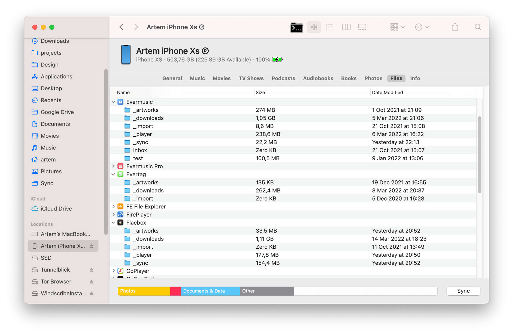
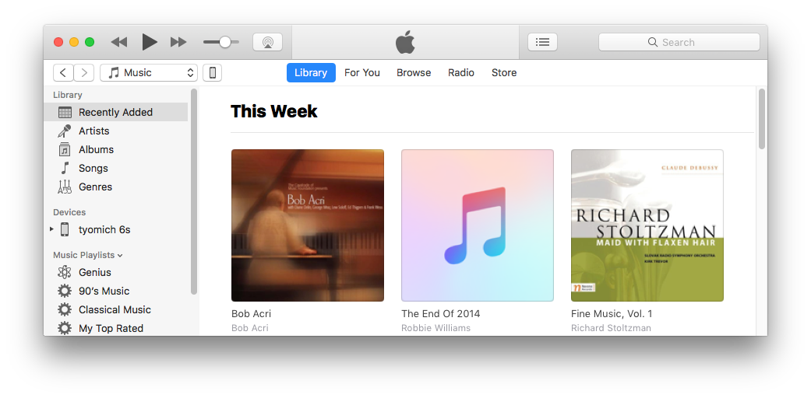
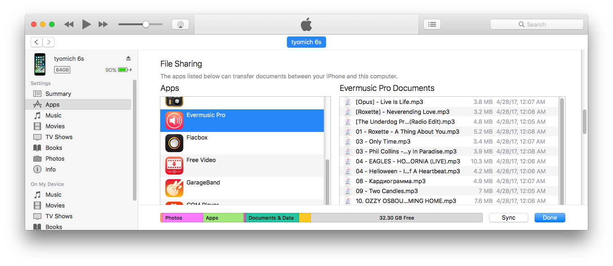
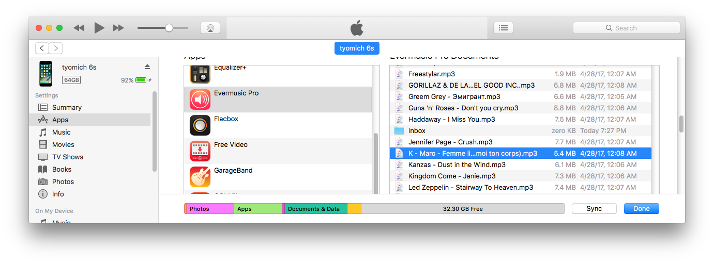
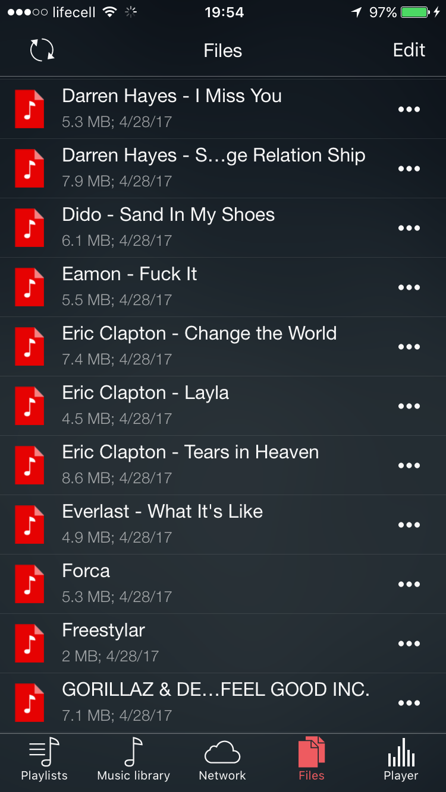
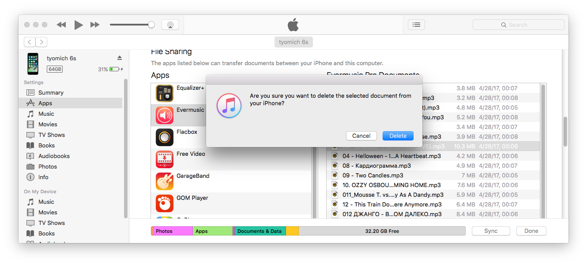
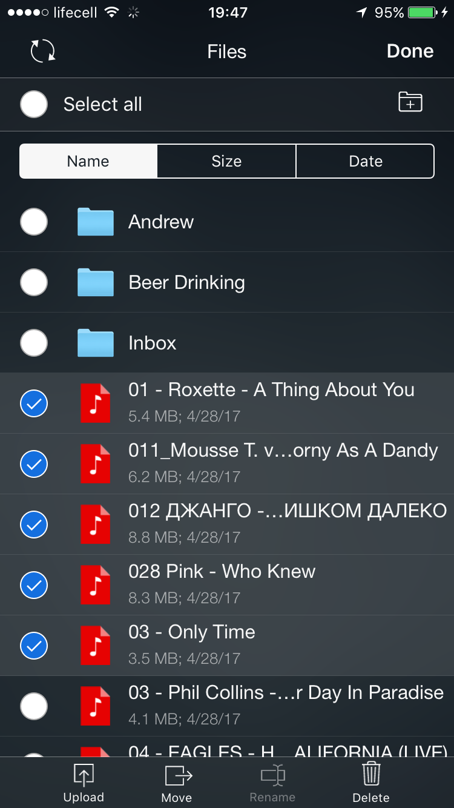

# How to play local files (iTunes files) on my iPhone

**Writer:** admin  
**Date:** Jun 9, 2017  
**Updated:** Jul 16, 2024  
**Reading Time:** 4 min read

Managing your music files between your computer and iOS devices has never been simpler. We've outlined three easy methods – iTunes File Sharing, WiFi Drive, and SMB protocol – to ensure a smooth music transfer and seamless playback.

## Method 1: iTunes File Sharing

iTunes File Sharing empowers you to effortlessly copy audio files between your computer and your iOS apps on your iPhone, iPad, or iPod touch. This approach is perfect for those who want to enjoy their favorite albums, artists, and tracks from their Mac/PC on their iOS device.

### Before You Begin:

- Alternatively, you can use [WiFi Drive](https://www.everappz.com/post/how-to-transfer-music-from-computer-to-iphone-without-itunes) to wirelessly copy or move audio files between your computer and apps like Evermusic and Flacbox. Simply ensure your computer and iOS device are connected to the same WiFi network, and you can easily transfer files between these apps.
- Another technology to consider is [SMB](https://www.everappz.com/post/stream-your-music-from-mac-or-pc-to-iphone-using-smb), allowing you to directly stream music from your home computer to your iOS device, eliminating the need to copy audio files.

## For macOS Catalina or Later

With macOS Catalina or a newer version, you can use the Finder to share files between your iOS and iPadOS devices and your Mac.

### Requirements:

- macOS Catalina or later
- An iPhone, iPad, or iPod touch with the latest iOS or iPadOS version
- An iOS or iPadOS app compatible with File Sharing

### Here's How to Use Finder for File Sharing:

1. Open a Finder window.
2. Connect your iPhone, iPad, or iPod touch to your computer using a USB cable.
3. Select your device in the Finder.
4. Click the "Files" tab to see a list of apps capable of file sharing. If you don't see this section, it means your device doesn't support file-sharing apps.
5. Click the triangle next to an app to view the files available for sharing.

### Copying Files from Your Mac to Your Device:

1. Select the files you want to copy, ensuring they're compatible with the app. Refer to the app's user guide for supported formats.
2. Drag and drop the files onto the app icon on your device. The Finder will take care of copying the files to your device.

### Copying Files from Your Device to Your Mac:

1. Select the files you wish to copy.
2. Drag the files to a folder on your computer, and the Finder will perform the copy operation.

## For macOS Versions Earlier Than Catalina:

If you're using an older macOS version, you can use iTunes for File Sharing.

### Requirements:

- Ensure you have the latest iTunes version.
- Your iPhone, iPad, or iPod touch should be running the latest iOS version.
- If you're using a Windows PC, make sure it's updated to at least Windows 7.

### To Get Started with iTunes File Sharing:

1. Open iTunes on your Mac or PC.
2. Connect your iPhone or iPad to your computer via USB lightning cable.
3. Click on your iOS device in iTunes.
4. Navigate to the "Apps" section in the left sidebar.
5. Scroll down to the "File Sharing" section at the page's bottom.
6. Select the app to see which files are available for sharing on your device.

### Copying Files from Your Computer to the App:

1. Open iTunes and choose the app from the list in the File Sharing section.
2. To copy files to your device, simply drag and drop them from a folder or window onto the Documents list.
3. Alternatively, click "Add" in the Documents list in iTunes, locate the audio files on your computer, and click "Add." iTunes will copy these music files to the Documents directory of your chosen app on your device. Ensure you choose audio files compatible with the app; refer to the user guide for supported formats.

### Copying Audio Files from an iOS App to Your Computer:

1. Select the app from the list in iTunes' File Sharing section.
2. To copy files to your computer, drag them from the Documents list to a folder or window on your computer.
3. Alternatively, select the audio files you want to copy to your computer from the Documents list, click "Save to," and choose the destination folder on your computer.

### Accessing Shared Audio Files:

Once you've successfully copied files from your computer to your iOS device, you can play them with ease.

- Open the app you selected for File Sharing, such as Evermusic or Flacbox.
- Tap on the "Local files" section to view the list of available files.
- Simply tap on any file to start playing.

### Deleting Shared Files from Your iOS Device:

To remove audio files copied from your computer to an iOS app using File Sharing, follow these steps:

#### Using iTunes:

1. Open iTunes on your Mac/PC.
2. Connect your iOS device to your computer using the USB cable.
3. Select your device in iTunes.
4. Click "Apps" in the left sidebar and scroll down to the File Sharing section.
5. Choose the app with the file you want to delete, like Evermusic or Flacbox.
6. Select the audio file you wish to remove from the Documents list, then press the "Delete" key on your keyboard.
7. Confirm the deletion in iTunes.

#### Using the Built-in File Manager:

1. Open the "Local Files" section.
2. Tap the "More actions" button in the top right corner, and select the "Select" menu item.
3. Choose the files you want to delete.
4. Tap the "Delete" action. If this action isn't immediately visible, tap the "More actions" menu.
5. Confirm the deletion in the pop-up message.

### Bonus Tip:

You can also connect your computer using the SMB protocol to directly stream music from your MAC/PC to your iOS device. Find detailed instructions here: "[How To Stream Your Music from MAC or PC to iPhone Using SMB](https://www.everappz.com/post/stream-your-music-from-mac-or-pc-to-iphone-using-smb)."

---

**Tags:** audio, player, computer, files, file, pc, mac, sharing, iPhone, local, usb, transfer, import, FLAC, cable, itunes, move, copy, finder, iTunes, FileSharing, MP3