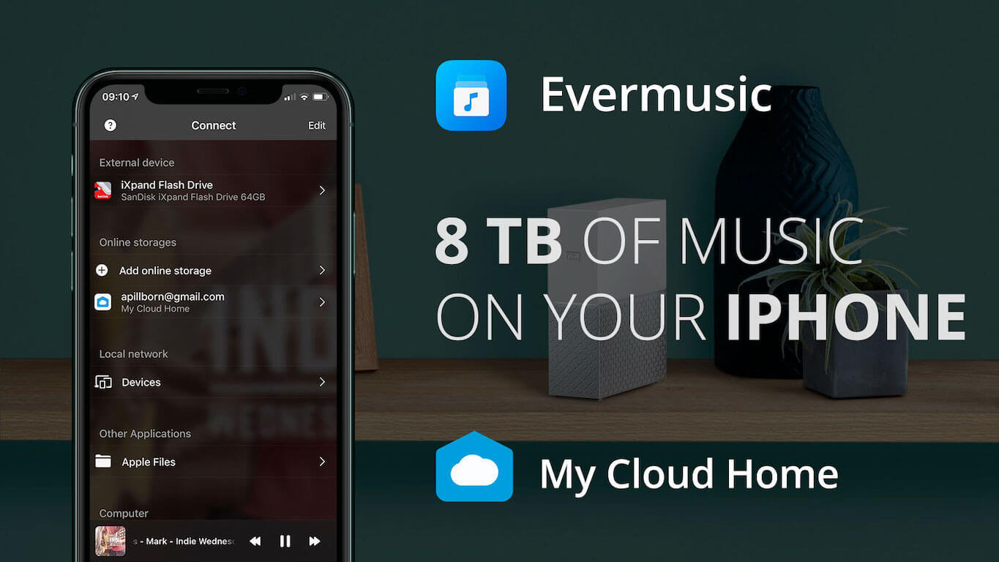
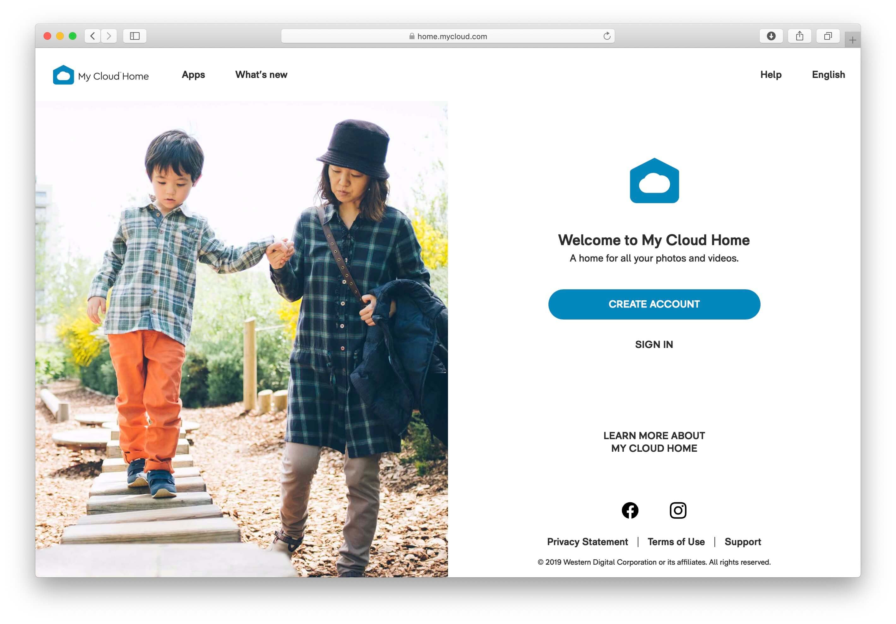
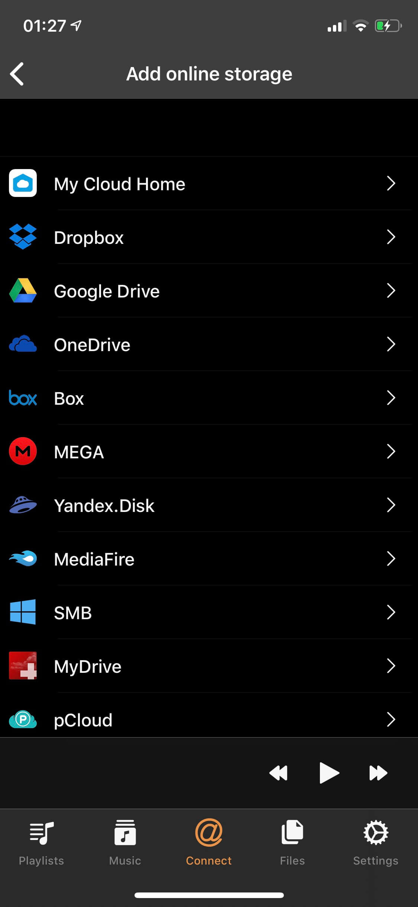
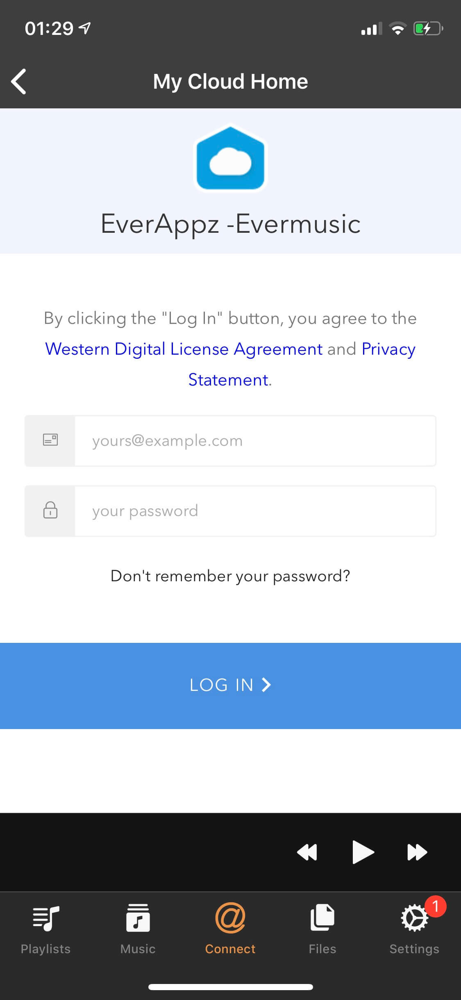
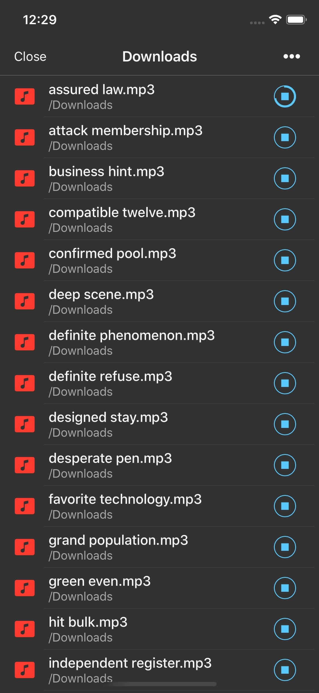
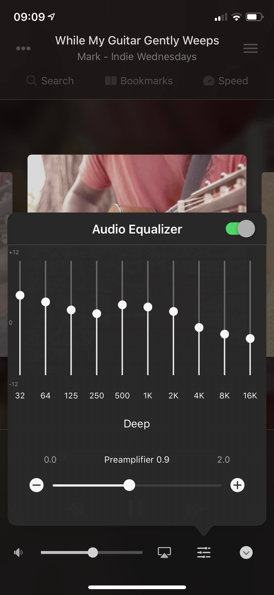

# How to play music on iPhone from WD My Cloud Home

**Writer:** admin  
**Date:** Nov 23, 2019  
**Updated:** Nov 11, 2024  
**Reading Time:** 4 min read  

**8 TB Of Music On Your iPhone?**

Did you ever dream of having a massive 8 TB music library right at your fingertips on your iPhone? Well, it's not only possible but also surprisingly easy with Evermusic and WD My Cloud Home. If you've got your cherished music collection, including favorite albums and exclusive recordings, and you're wondering how to enjoy it seamlessly on your iPhone, just invest 2 minutes of your time to learn how to effortlessly stream music from WD My Cloud Home to your iPhone.

There's an array of personal NAS servers available on the market, each with its own set of advantages and drawbacks. Some may be more complex, while others are user-friendly. Western Digital has introduced one of the simplest personal network-attached storage solutions, the WD My Cloud Home.

The primary objective of this storage device is to make setup and usage as straightforward as possible for all customers, eliminating the need for complicated configurations or setup profiles. Setting up this device takes a mere 3 minutes of your time. You can purchase WD My Cloud Home directly from their website [link](https://shop.westerndigital.com/).

Once you've received it, just plug the device into a power supply and connect a network cable. Visit the home page [link](https://home.mycloud.com/) to create your account. Your device is now connected to the internet, granting you access to all your files from anywhere using your web browser. The next step involves copying your music from your computer, CDs, or DVDs to the My Cloud Home device, which may take some time but is a one-time effort.

Now, you might be wondering, how can all that music be accessible on your iPhone? The answer lies in Evermusic, the default music player for thousands of users who have grown weary of subscription-based services like Apple Music, Spotify, Plex, and others that eat away at your wallet every month, with sound quality not always up to par. Now, it's your turn to decide whether you want to keep shelling out cash for features that you can enjoy for free. With Evermusic, you can build your own limitless music streaming service.

All you need to do now is download the free Evermusic app from the App Store, skip through the introductory pages, and on the last page, select WD My Cloud Home from the list of available cloud services. Then, enter your credentials received during registration.

Evermusic employs a secure connection and the official API developed by Western Digital engineers, ensuring the safety of your data and communication. You can listen to your music online directly from your NAS device at home or download tracks for offline playback when you're without an internet connection.

You'll have full control over your files, the ability to edit tags, change playback speed, and access numerous other features.

One of the standout features is the equalizer with iPod-style presets, and you can even create your custom presets.

**How to play music on iPhone from WD MyCloud EX2 Ultra, WD MyCloud Mirror, or any other WD MyCloud Storage**

When you add a connection in the app through Connections > Connect a Cloud Service > My Cloud Home, it's designed to officially support WD MyCloud Home devices.

However, if you’ve been able to connect your WD MyCloud EX2 Ultra, WD MyCloud Mirror, or any other WD MyCloud Storage, here’s a workaround to help you use it.

To make this work, simply create a folder in the app’s file manager after connecting and upload your music files there. It appears WD’s server only allows access to app-created folders in a “sandbox mode” for these devices, so this folder will only be accessible from the Evermusic app.

Please use Evermusic’s file manager to upload your songs to this folder. Once the files are uploaded, you can delete the local copies from your device and listen directly from your NAS.

Here’s how to remotely access your WD MyCloud EX2 Ultra, WD MyCloud Mirror, or any other WD MyCloud Storage music files:

1. Connect to WD MyCloud Storage: go to Connections > Connect a Cloud Service > My Cloud Home.
2. Create a folder on the connected cloud service (visible only in the app).
3. Upload local media files from your device to this folder.
4. Delete the local files from your device once the upload is complete (if you need to free up space).
5. Start streaming by selecting any uploaded media file in the folder created online.

So, if you’ve ever dreamed of having your entire music library, up to 8 TB, right on your iPhone, now you can make it a reality! With WD My Cloud Home and the Evermusic app, you can stream or download your entire collection effortlessly, without the need for subscriptions or monthly fees. Set up is quick, and once connected, you’ll enjoy high-quality playback, full control over your files, and even custom settings like an equalizer.

Thank you for exploring this guide—now, dive into your personal music collection from anywhere, anytime, with Evermusic and WD My Cloud. Enjoy the freedom of your own music library, hassle-free!

## Tags

- [evermusic](https://www.everappz.com/blog/tags/evermusic)
- [music](https://www.everappz.com/blog/tags/music)
- [cloud](https://www.everappz.com/blog/tags/cloud)
- [iphone](https://www.everappz.com/blog/tags/iphone-1)
- [storage](https://www.everappz.com/blog/tags/storage)
- [nas](https://www.everappz.com/blog/tags/nas)
- [listen](https://www.everappz.com/blog/tags/listen)
- [remote](https://www.everappz.com/blog/tags/remote)
- [home](https://www.everappz.com/blog/tags/home)
- [online](https://www.everappz.com/blog/tags/online)
- [wd](https://www.everappz.com/blog/tags/wd)
- [mycloud](https://www.everappz.com/blog/tags/mycloud)

## Categories

- [How To](https://www.everappz.com/blog/categories/how-to)