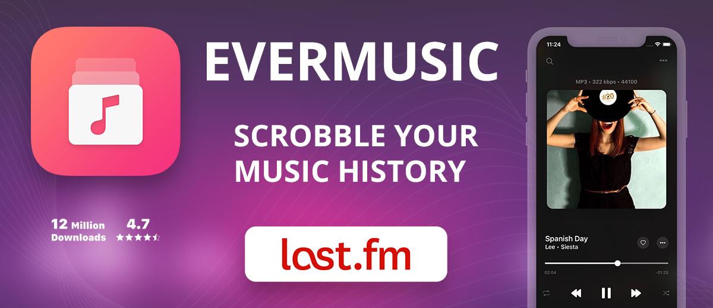
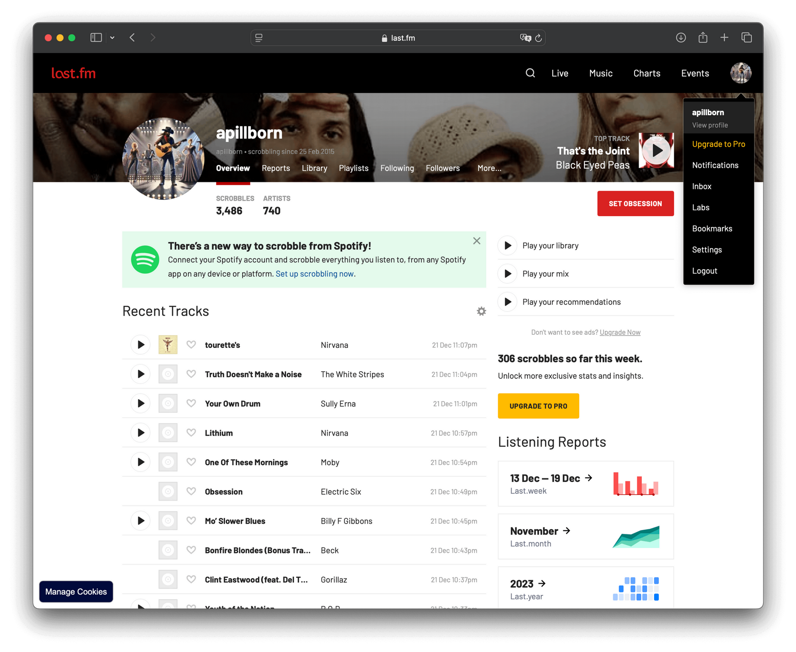
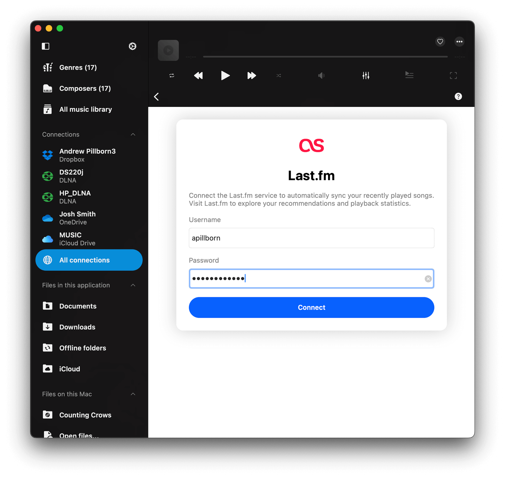
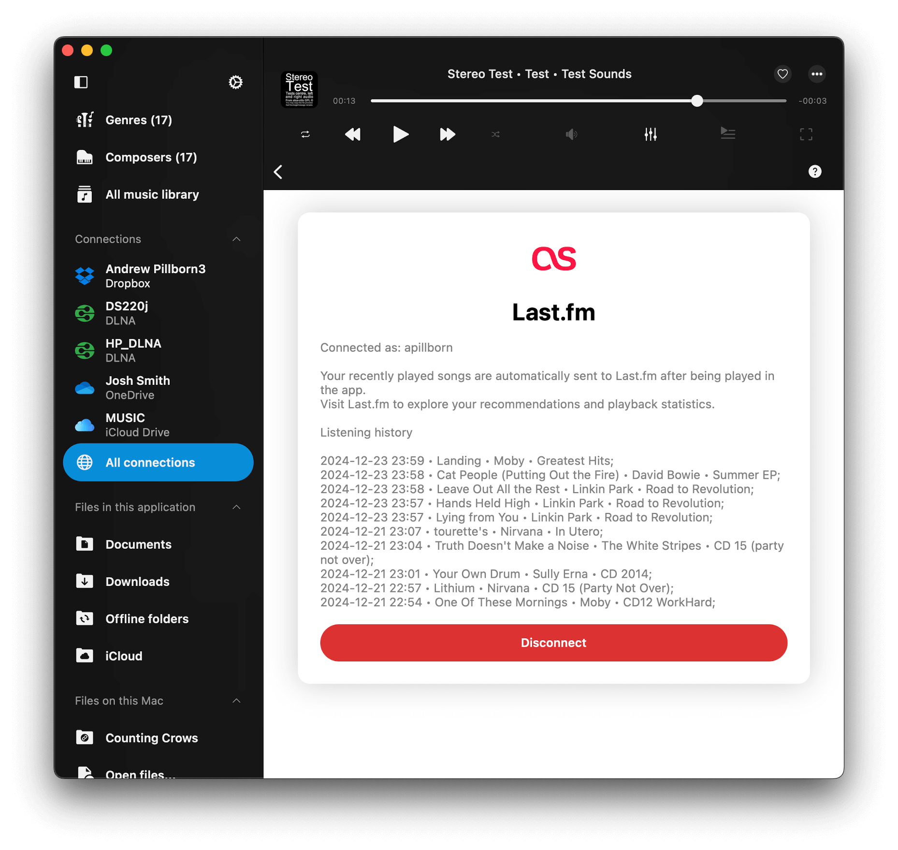
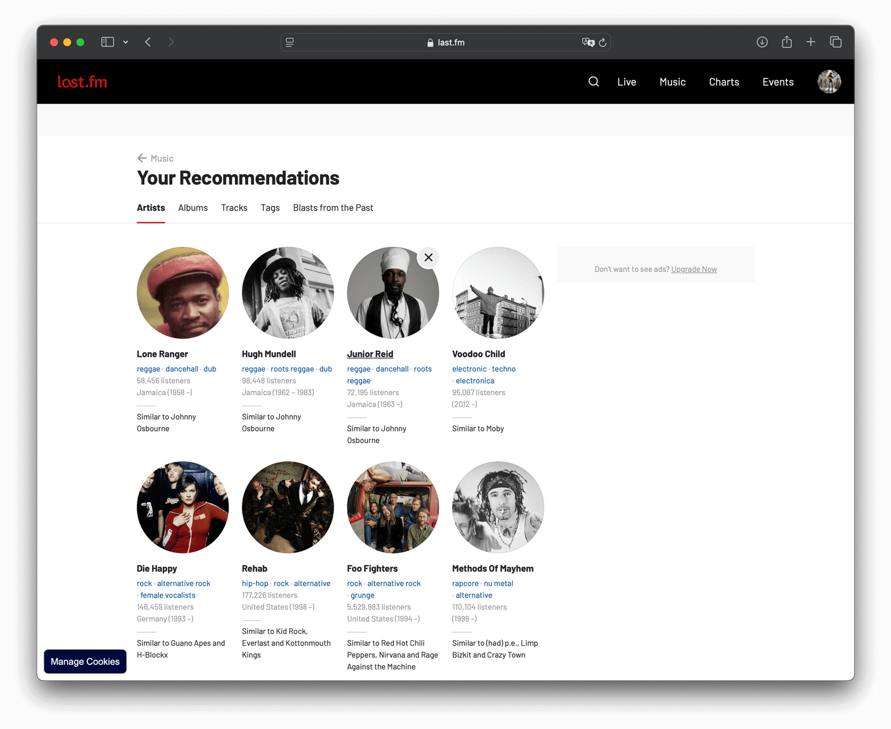
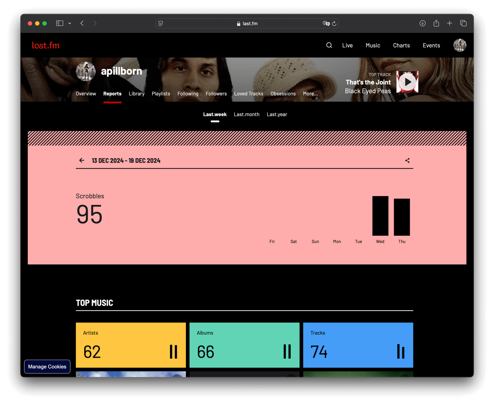

## Introduction

[**Last.fm**](http://Last.fm) is a powerful music tracking and recommendation service. It allows you to keep a detailed history of your listening habits, discover personalized music recommendations, and access playback statistics.

[**Registering is free**](https://www.last.fm/join) and easy — just visit [Last.fm](https://www.last.fm) and create an account to get started.

## How to Enable Last.fm in Evermusic or Flacbox

1. **Launch** Evermusic or Flacbox, open the **Connections** section (on iPhone / iPad) or **All connections** section on Mac.
2. **Scroll** to the **Other Services** section and tap on **Last.fm**.
3. **Enter** your **Last.fm** username and password, then tap **Connect**. Rest assured, the app does not store your username or password; it securely saves an access token in the device keychain. This token is used to update your listening history via the official Last.fm API over a secure connection.

## What Happens After Connection

- Once connected, the app will display the **last 10 tracks scrobbled** from your Last.fm profile.
- Start playing any song, and the app will **automatically update your listening history** on Last.fm.
- **Offline Scrobbling**: If you’re offline, the app stores your playback history locally and uploads it to Last.fm when you're back online.

## How to Disconnect Last.fm

You can disconnect your Last.fm account at any time. This will stop the app from updating your listening history and remove the access token from your device. Just tap **Disconnect** button.

## Enjoy Playback Statistics and Recommendations

After using the app for weeks or months, revisit the Last.fm website to explore your detailed playback statistics and discover new music tailored to your listening preferences.

## Conclusion

Scrobbling your music history from Evermusic or Flacbox to [Last.fm](http://Last.fm) is a simple and effective way to enhance your music experience. With features like playback statistics, personalized recommendations, and offline scrobbling, you can dive deeper into your listening habits and discover music you'll love. Start scrobbling today and take full advantage of what [Last.fm](http://Last.fm) has to offer!

