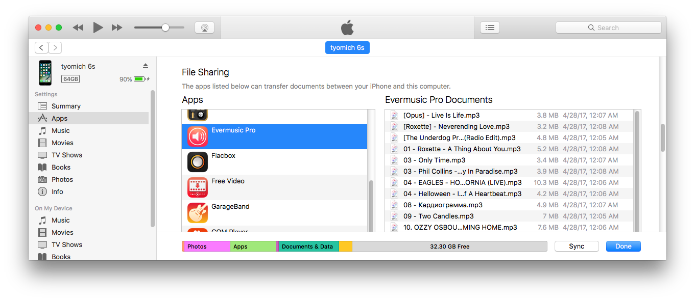
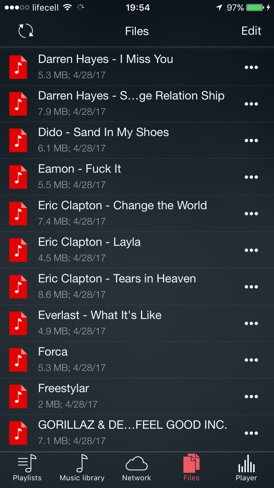
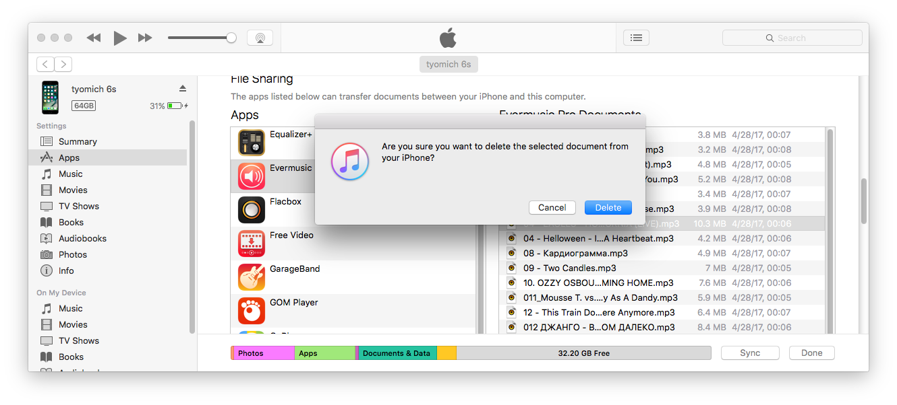
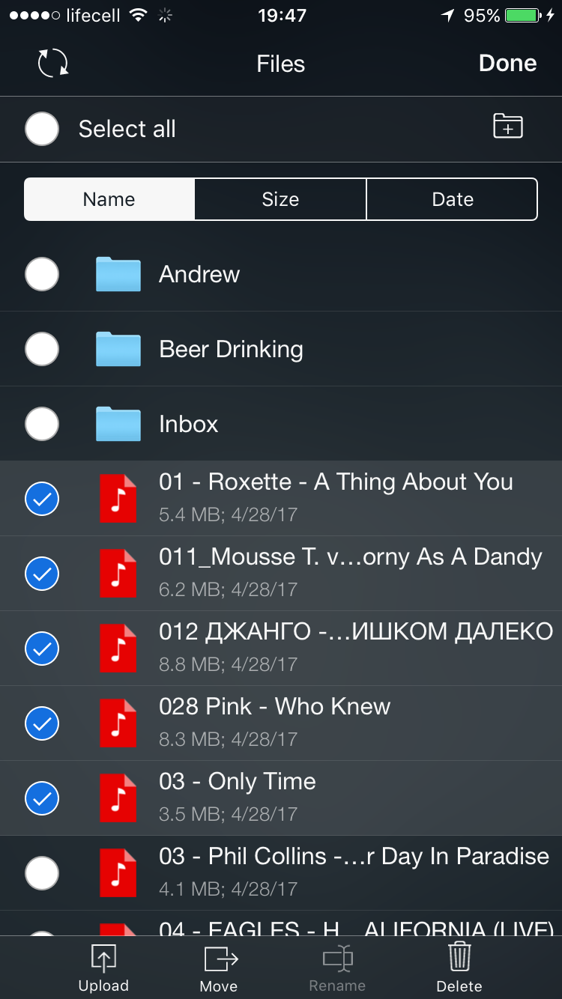

# How to transfer files from my Mac to iPhone or iPad using Finder

**Writer:** admin  
**Date:** Mar 17, 2022  
**Updated:** Dec 6, 2024  
**Read Time:** 3 min read

iTunes File Sharing offers a convenient way to transfer files between your computer and iOS applications on your iPhone, iPad, or iPod touch. Whether you have a collection of favorite albums, artists, or tracks on your Mac or PC, you can easily copy this content to apps like Evermusic, Flacbox, or Evertag.

Here's a step-by-step guide to using iTunes File Sharing:

## For macOS Catalina or Later:

### Prerequisites:
- macOS Catalina or a later version
- An iOS device (iPhone, iPad, or iPod touch) with the latest iOS or iPadOS version
- An iOS app compatible with File Sharing

### Steps:
1. Open a Finder window on your Mac.
2. Connect your iOS device to your computer using a USB cable.
3. Select your device in the Finder.
4. Click the "Files" tab to view a list of apps that support file sharing. If you don't see a "Files" section, it means your device doesn't have any apps that support file sharing.
5. Click the triangle next to an app to reveal the files you can share.

### Copying Files from Your Mac to Your iOS Device:
1. Select the files you want to copy, ensuring they are compatible with the app (refer to the app's user guide for supported formats).
2. Drag and drop the selected files onto the app icon on your iOS device in the Finder. The Finder will copy the files to your device.

### Copying Files from Your iOS Device to Your Mac:
1. Select the files you want to copy from your iOS device.
2. Drag and drop the selected files into a folder or window on your computer. The Finder will copy the files to your computer.

## For macOS Versions Prior to Catalina:

### Prerequisites:
- The latest version of iTunes
- An iOS device with the latest iOS version
- A Windows PC with Windows 7 or later (if using Windows)

### Steps:
1. Open iTunes on your Mac or PC.
2. Connect your iPhone or iPad to your computer using a USB Lightning cable.
3. Select your iOS device in iTunes.

4. Click Apps section, in the left sidebar.
5. Scroll to the File Sharing section at the bottom of the page.
6. Select the app to see which files are available for sharing on your device.

### Copying Files from Your Computer to the App:
1. In the iTunes left sidebar, click the "Apps" section.
2. Scroll down to the "File Sharing" section at the bottom.
3. Select the app to see the available files for sharing on your device.
4. To copy files to your device, drag and drop them from a folder or window onto the "Documents" list in iTunes.
5. Alternatively, click "Add" in the "Documents" list in iTunes, locate the audio files on your computer, and click "Add." iTunes will copy these music files to the app's "Documents" directory on your device.

### Copying Files from an iOS App to Your Computer:
1. In iTunes, select the app from the list in the "File Sharing" section.
2. To copy files to your computer, drag and drop them from the "Documents" list to a folder or window on your computer.
3. You can also select the audio files you want to copy to your computer from the "Documents" list and click "Save to." Locate the folder on your computer where you want to copy the files and click "Save to."

### Opening Shared Files:
To play files copied from your computer to your iOS device, open the app designated for File Sharing (e.g., Evermusic or Flacbox) and tap on the "Local Files" tab and choose "Documents" folder. You'll see a list of available files that you can play.

### Deleting Shared Files from Your iOS Device:

#### With iTunes:
1. Open iTunes on your Mac/PC.
2. Connect your iOS device to the computer via USB.
3. Select your device in iTunes.
4. Click "Apps" in the left sidebar and scroll to the "File Sharing" section.
5. Choose the app containing the file you want to delete.
6. Select the file in the "Documents" list and press the Delete key on your keyboard.
7. Confirm the deletion in iTunes.

#### With the built-in file manager:
1. Open the "Local Files" section.
2. Tap the "More actions" button in the top right corner and choose "Select" from the menu.
3. Select the files you want to delete.
4. Tap the "Delete" action (if it's not visible, tap the "More actions" menu).
5. Confirm the deletion.

With iTunes File Sharing, you can easily manage files between your computer and iOS apps, enhancing your music and file-sharing experience.

### Tags:
- [computer](https://www.everappz.com/blog/tags/computer)
- [files](https://www.everappz.com/blog/tags/files)
- [file](https://www.everappz.com/blog/tags/file)
- [pc](https://www.everappz.com/blog/tags/pc)
- [mac](https://www.everappz.com/blog/tags/mac)
- [sharing](https://www.everappz.com/blog/tags/sharing)
- [usb](https://www.everappz.com/blog/tags/usb)
- [transfer](https://www.everappz.com/blog/tags/transfer)
- [import](https://www.everappz.com/blog/tags/import)
- [cable](https://www.everappz.com/blog/tags/cable)
- [itunes](https://www.everappz.com/blog/tags/itunes-1)
- [move](https://www.everappz.com/blog/tags/move)
- [copy](https://www.everappz.com/blog/tags/copy)
- [finder](https://www.everappz.com/blog/tags/finder)

### Category:
- [How To](https://www.everappz.com/blog/categories/how-to)