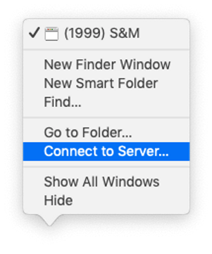

Wi-Fi Drive is the easiest way to transfer your files from the computer to an iPhone or iPad without iTunes. You can easily download or upload multiple files or even folders using a local Wi-Fi connection. Both devices should be connected to the same Wi-Fi network.

You can transfer files wirelessly using a desktop web browser or WebDAV client like Mac Finder or Windows File Explorer.

You can watch a video tutorial from [**TECHGUYPH**](https://www.youtube.com/channel/UCgpf09gGFE_c_3pPTtTpnzg) or read the text version below.
  


## Transfer files from the computer wirelessly with a desktop web browser

1. Open any of our apps like [Evermusic](/products/evermusic), [Flacbox](/products/flacbox), [Evertag](/products/evertag), [Evervideo](/products/evervideo).

2. Launch the app > go to "Connections" > "Computer" > "Connect using Wi-Fi".
   


1. Enter username and password to make the connection more secure but this step is optional.
2. Tap "Start Wi-Fi Drive".



5. Copy web-browser URL.
6. Open a web browser on your desktop (supported browsers: Safari, Google Chrome, Opera, Yandex Browser, FireFox).
7. Enter URL from the step 5 to the address field of your desktop browser.

8. After the connection is established you will see the file manager web app. All common operations are supported. You can Copy, Move, Delete, Upload, and Download your files from the computer to the local storage of your device.  Use the drag & drop or the Upload button to transfer music to your iPhone.  Additionally, if your device is connected to your Mac using a cable, this can speed up file transfers. In this case, your Mac will set up a virtual online server, but the connection will utilize the cable for faster transfer speeds.

1. Tap "Stop Wi-Fi Drive" on the iPhone when you finished.

*Note: please make sure you use the latest version of the desktop browser and JavaScript is not disabled. This will fix any issues if the connection cannot be established.*

## Transfer audio files with Mac Finder or Windows File Explorer

**If you use macOS:**

1. Right-click on the Finder icon and select Connect to Server... menu item.

2. Enter the server URL from the iOS app (server URL located below the text "Enter this URL in WebDAV application").

3. Tap the Connect button.
4. After connection established you will see content of your iPhone in Mac Finder.

5. Use drag & drop, Move, and Rename commands to manage files on your device.

**If you use Windows:**

1. Open File Explorer and right-click on the 'This Computer' menu item on the left sidebar.

2. Select "Map Network Drive" on the drop-down menu.
3. On the "Folder" text field enter the server URL from the iOS app (server URL located below the text "Enter this URL in WebDAV application").
4. Select the Drive letter and click the "Finish" button.

5. If connection is successful you can manage files located on your iOS device on the next window.

## Conclusion

With Wi-Fi Drive, you can easily and wirelessly transfer files between your computer and iOS device, enhancing your file management and sharing capabilities.

No iTunes is required!