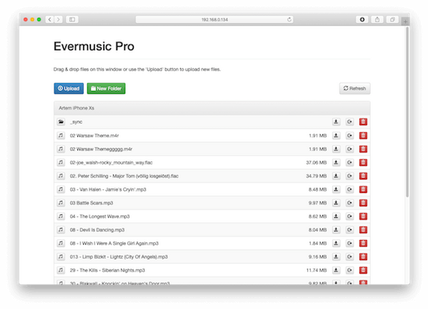
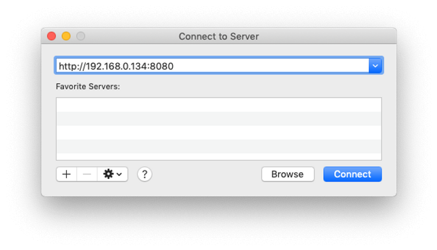

You can watch a video tutorial from [**TECHGUYPH**](https://www.youtube.com/channel/UCgpf09gGFE_c_3pPTtTpnzg) or read the text version below.
  


Wi-Fi Drive is the ultimate solution for seamlessly transferring your music collection from your computer to your iPhone or iPad without the need for iTunes. This hassle-free method allows you to effortlessly download or upload multiple audio files and even entire folders using your local Wi-Fi connection. Both your computer and iOS device should be connected to the same Wi-Fi network for this to work like a charm.

Here are two simple ways to transfer your audio files wirelessly.

## Transfer Audio Files via Desktop Web Browser

1. Launch your preferred app, such as Evermusic, Flacbox, or Evertag on your iOS device.
2. Navigate to "Connections" > "Computer" > "Connect using Wi-Fi" within the app.
3. For added security, you can enter a username and password (optional).
4. Tap "Start Wi-Fi Drive" to initiate the connection.

   

5. Copy the web browser URL generated within the app.
6. On your desktop, open a compatible web browser (Safari, Google Chrome, Opera, Yandex Browser, FireFox).
7. Enter the URL from step 5 into the address field of your desktop browser.

   

8. Once the connection is established, a file manager web app will appear. You'll have the ability to perform common operations like Copy, Move, Delete, Upload, and Download files from your computer to your device's local storage. Use drag & drop or the Upload button to seamlessly transfer music to your iPhone.

   

9. To conclude, tap "Stop Wi-Fi Drive" on your iPhone when you're done.

**Note:** Ensure you're using the latest version of your desktop browser, and that JavaScript is enabled to resolve any connection issues.

## Transfer Audio Files with Mac Finder or Windows File Explorer

### If you're using macOS

1. Right-click on the Finder icon and select "Connect to Server..." from the menu.

   

2. Enter the server URL provided within the iOS app (found below the text "Enter this URL in WebDAV application").

   

3. Tap the "Connect" button.
4. Once the connection is established, you'll see the contents of your iPhone in Mac Finder.

   

5. Utilize drag & drop, Move, Rename commands, and more to manage your files on your iOS device.

### For Windows users

1. Open File Explorer and right-click on "This Computer" in the left sidebar.

   

2. Select "Map Network Drive" from the dropdown menu.
3. In the "Folder" field, enter the server URL provided within the iOS app (located below the text "Enter this URL in WebDAV application").
4. Choose a Drive letter and click the "Finish" button.

   

5. If the connection is successful, you can manage files on your iOS device within the next window.

   

## Conclusion

With Wi-Fi Drive, the days of struggling with iTunes are over. Enjoy a seamless and efficient way to transfer your music collection to your iPhone or iPad, all with the convenience of your local Wi-Fi network. Say goodbye to the hassle and hello to effortless music management!