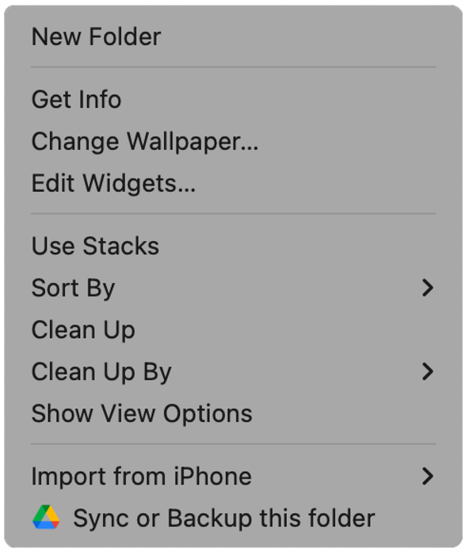
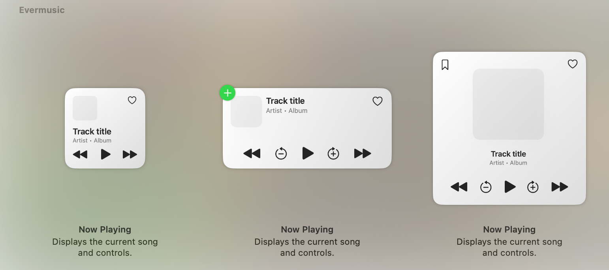
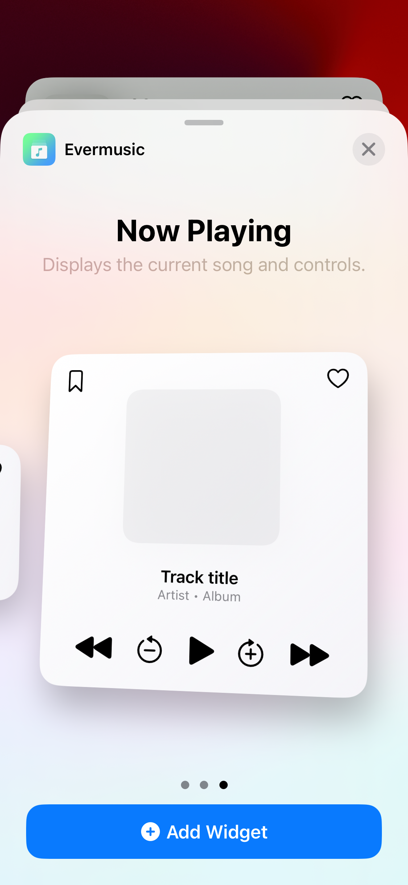
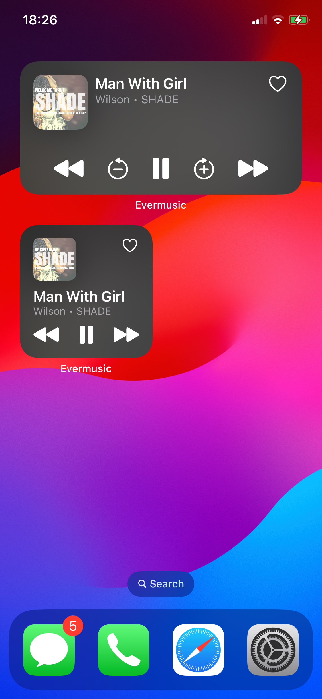
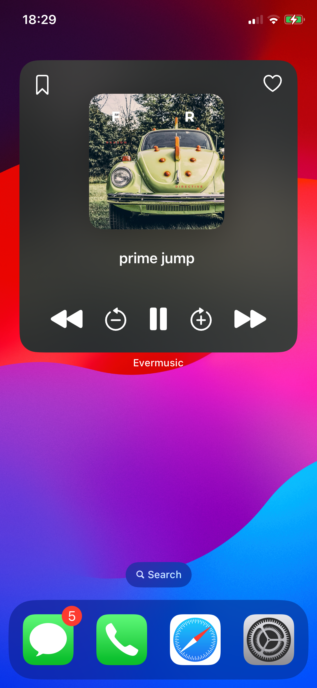
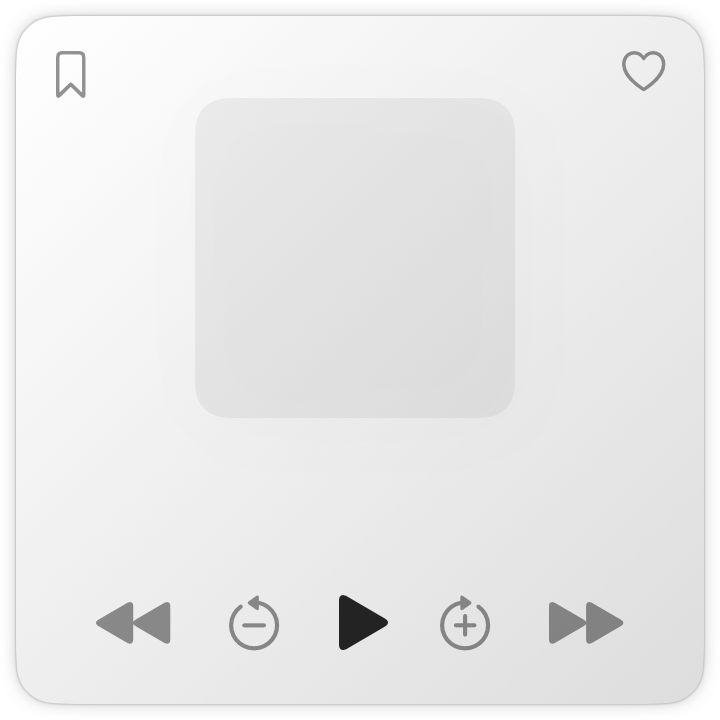

# How to Use Dynamic Now Playing Widgets in Evermusic and Flacbox on Your iPhone and Mac

**Writer:** admin  
**Date:** Nov 14, 2024  
**Updated:** Dec 8, 2024  
**Reading Time:** 2 min read

In the latest update for **Evermusic** and **Flacbox**, we’re excited to introduce **Dynamic Now Playing Widgets** for iOS and Mac. These widgets let you control playback directly from your home screen or desktop, giving you quick access to commands like Play, Pause, Stop, Next Track, Previous Track, Skip Forward, Skip Backward, Add to Favorites, and even Create Audio Bookmarks for specific tracks.

## Requirements for Dynamic Widgets

Dynamic widgets are available on iOS 17.0 or higher and macOS 14 Sonoma or higher. With macOS 14 Sonoma, Apple upgraded widget functionality to allow widgets directly on the desktop, providing real-time interactivity so you can control music playback, create bookmarks, and check off reminders without opening the app.

## Adding Dynamic Widgets on macOS Sonoma

To add the widget on your Mac:

1. Right-click on the desktop and select the **Edit Widgets** menu item.

   

2. Scroll down to find Evermusic or Flacbox and choose your preferred widget size (Small, Medium, Large).

   - **Small**: Basic playback controls and add to favorite action
   - **Medium**: Includes additional skip time buttons
   - **Large**: Includes additional skip time buttons and audio bookmarking action

   

Once added, your widget will appear on the desktop, and you can drag it to any position.

## Adding Dynamic Widgets on iOS

To add the widget on iOS:

1. Tap and hold the home screen, then tap the **plus (+) button** in the top-left corner.
2. Select your music app, Evermusic or Flacbox, and choose the widget size.

After adding it, the widget will display on your home screen, allowing you to control playback without launching the app. You can use the playback controls to manage playback status, tap the **Favorites** button to add tracks to your favorites, or use the **Bookmarks** button (available on the large widget only) to create audio bookmarks.

Each time you tap the **Audio bookmark** button, a new bookmark is created for the current song and timestamp, which you can access later in the app—a feature especially useful for audiobooks or long lectures.

## Continue Playback Functionality

To enable seamless playback continuation:

1. In the app, go to Settings > Audio Player > General and enable **Save Audio Player State**.
2. With this setting enabled, if the app is closed or unloaded, the widget will display an active play button. Tapping this play button will open the app in the background and restore playback from the last saved position.

This feature is perfect for audiobooks and long-form audio content, allowing you to pick up right where you left off.

## Have Widget Ideas?

We’d love to hear your ideas! Reach out to us at [support@everappz.com](mailto:support@everappz.com), and we’ll work to bring your suggestions to life.

Enjoy the update, and happy listening!

---

**Tags:** [widgets](https://www.everappz.com/blog/tags/widgets), [ios17](https://www.everappz.com/blog/tags/ios17), [dynamic](https://www.everappz.com/blog/tags/dynamic), [now playing](https://www.everappz.com/blog/tags/now-playing), [home screen](https://www.everappz.com/blog/tags/home-screen), [sonoma](https://www.everappz.com/blog/tags/sonoma)

**Categories:** [How To](https://www.everappz.com/blog/categories/how-to), [What's New](https://www.everappz.com/blog/categories/what-s-new)