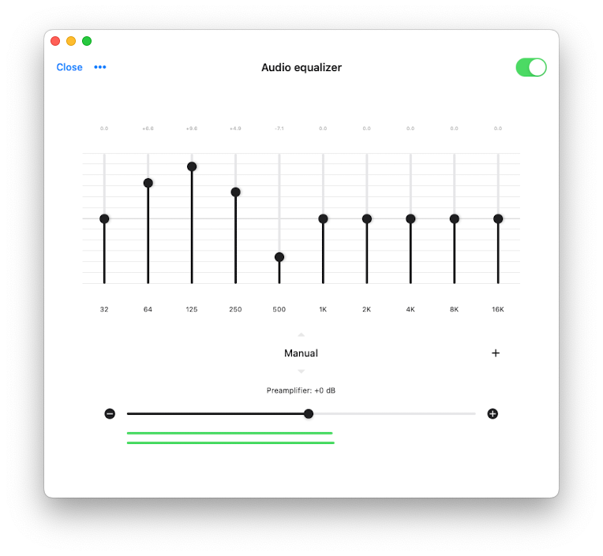
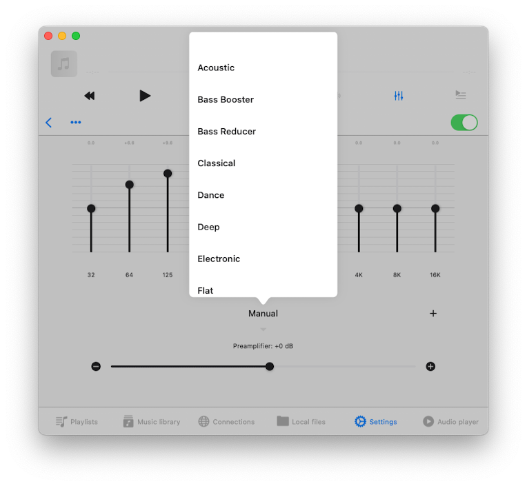
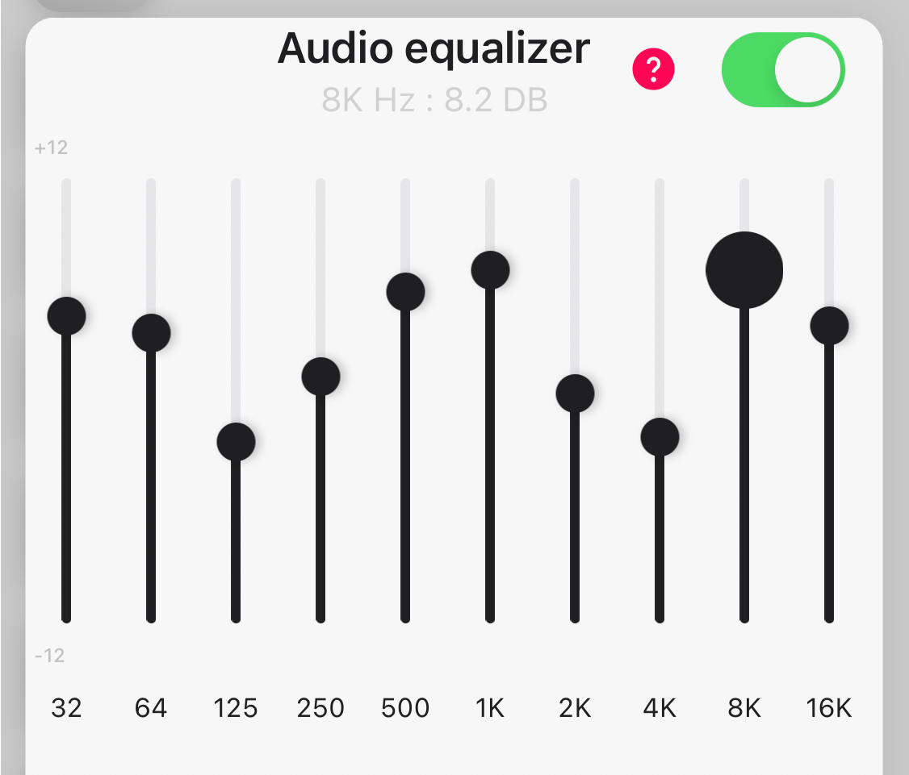
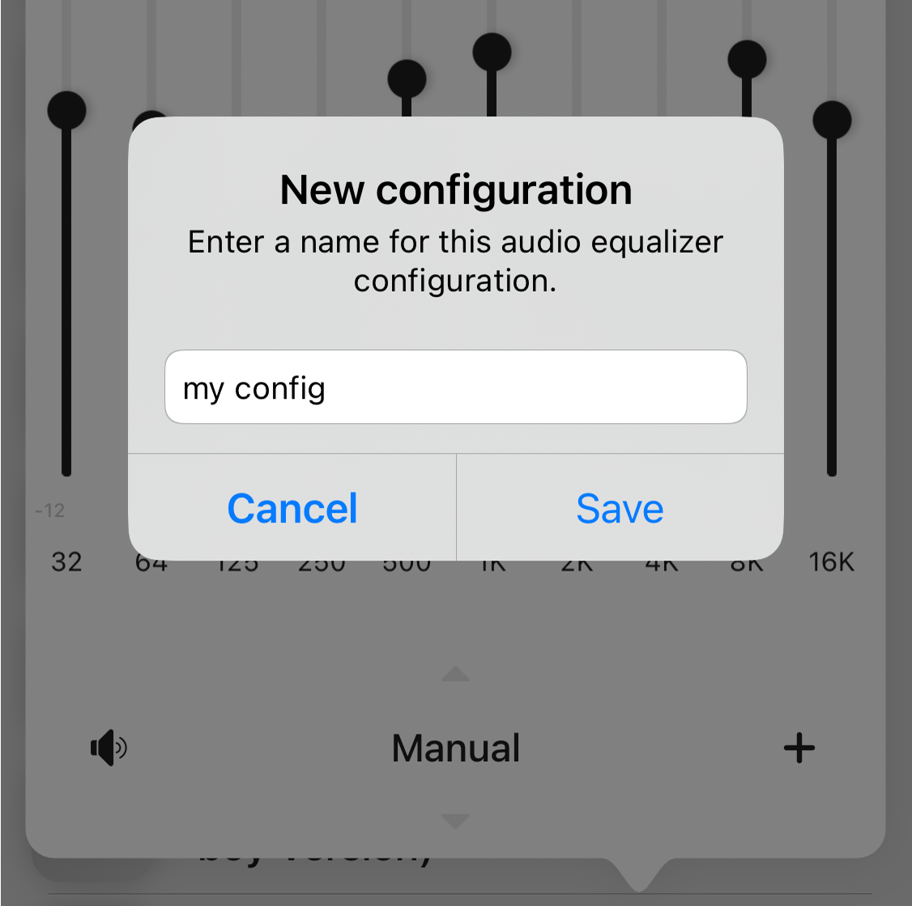
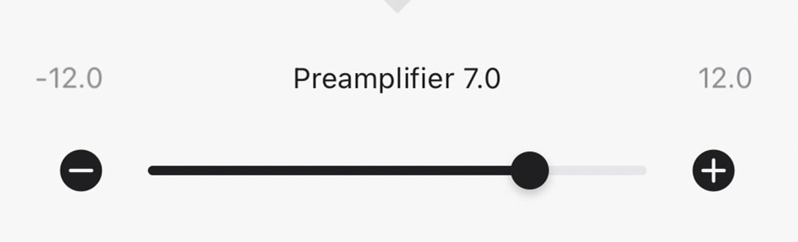
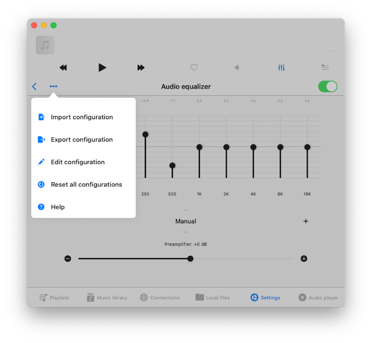

# How to use the audio equalizer on your iPhone, iPad, Mac with Evermusic and Flacbox

**Writer:** admin  
**Date:** Mar 18, 2022  
**Updated:** Dec 6, 2024  
**Reading Time:** 2 min read

---

When it comes to audio players, finding the right equalizer can make all the difference in your music-listening experience. Our audio apps, Evermusic and Flacbox, stand out as full-featured audio players equipped with a professional 10-band equalizer and a range of exciting features. Let's dive into the world of audio enhancement and discover why our equalizer sets us apart.

In a perfect world, where music files and headphones are flawless, an equalizer might seem unnecessary. However, our daily lives often involve less-than-ideal listening environments — commuting, working out, or strolling through noisy city streets. These situations, combined with the limitations of standard headphones, call for the power of EQ adjustments. An equalizer lets you fine-tune frequency balance, compensate for imperfect headphones or speakers, and adapt to background noise. Whether you're boosting bass and treble for a party vibe or fine-tuning sound for a DJ session, our equalizer offers creative audio enhancement to elevate your listening experience.

## How Does the Equalizer in Evermusic and Flacbox Work?

Our apps boast a powerful 10-band equalizer, offering precise control over specific sound frequencies. Here's how it works:

**Frequency Control:** The equalizer spans 10 different frequencies, ranging from 32 Hz to 16 kHz. Adjust the amplifier gain for each frequency using intuitive sliders.

**Presets:** Choose from a variety of predefined equalizer presets, including Acoustic, Bass Booster, Hip-Hop, Rock, and more. Each preset tailors the sound to suit different music genres, listening environments, or speaker setups.

**Create Your Own Presets:** Feeling creative? Craft and save your custom equalizer presets to match your unique preferences or audio equipment.

**Preamplifier Gain:** If your track lacks volume, use the preamplifier slider to boost the output and enjoy a louder, clearer sound.

**Audio Level Indicators:** Once the song is playing, you can check the output level indicators and adjust the preamplifier gain accordingly.

## Activating the Equalizer in Evermusic and Flacbox:

It's a breeze to activate and customize the equalizer in our apps:

1. Open the "Audio Player" screen in Evermusic or Flacbox.
2. Tap on the equalizer icon located at the bottom of the screen.
3. Toggle the switch at the top to activate the equalizer.
   (You can also activate the audio equalizer from the app settings. Open Settings -> Audio Player -> Audio Equalizer)
4. Choose from the array of preset options from the pop-up menu.

5. Fine-tune your sound by dragging the frequency sliders up or down to adjust the volume in decibels.

6. Save your unique equalizer configuration for future listening.

7. For an extra volume boost, utilize the preamplifier slider to crank up the output.

## Manage presets configurations

On the top left corner of the audio equalizer screen, you’ll find the More Actions button. Tap on it to access the additional actions menu. The available actions include:

- **Import Configuration:** Import a previously saved audio equalizer configuration from a file.
- **Export Configuration:** Export your audio equalizer presets to a configuration file.
- **Edit Configuration:** Manage your configurations and change the sort order.
- **Reset All Configurations:** Reset the audio equalizer configurations to the default state and remove all user presets.

## Conclusion

Elevate your music experience, tailor your audio to any scenario, and enjoy the perfect sound with the versatile equalizer in Evermusic and Flacbox.

---

**Tags:** [music](https://www.everappz.com/blog/tags/music), [audio](https://www.everappz.com/blog/tags/audio), [equalizer](https://www.everappz.com/blog/tags/equalizer), [10-band](https://www.everappz.com/blog/tags/10-band), [gain](https://www.everappz.com/blog/tags/gain), [configuration](https://www.everappz.com/blog/tags/configuration), [preamplifier](https://www.everappz.com/blog/tags/preamplifier), [genre](https://www.everappz.com/blog/tags/genre)

**Category:** [How To](https://www.everappz.com/blog/categories/how-to)