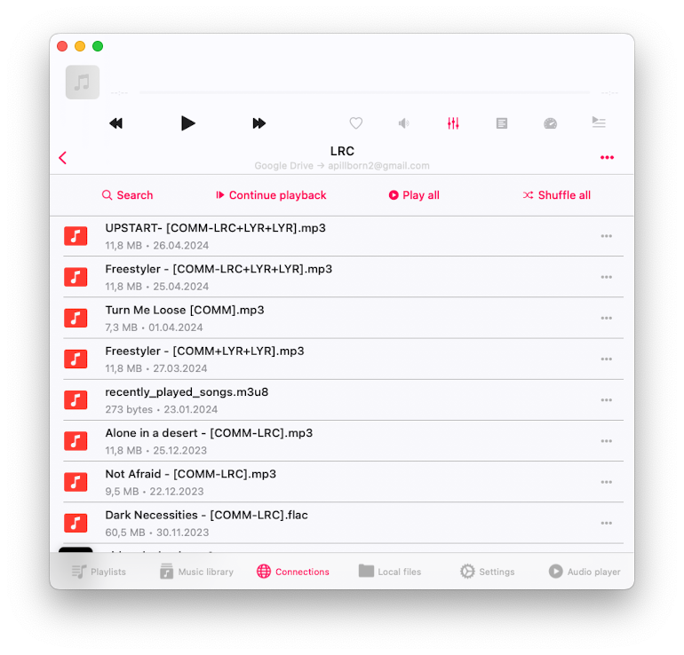
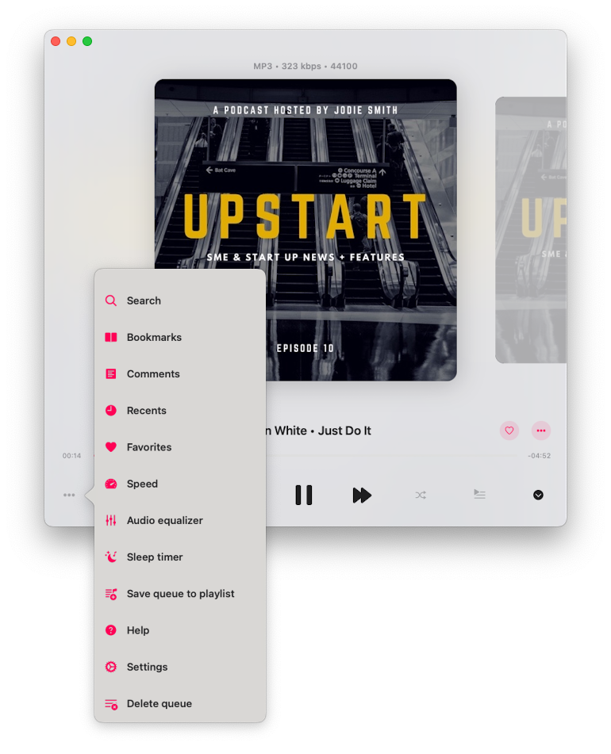
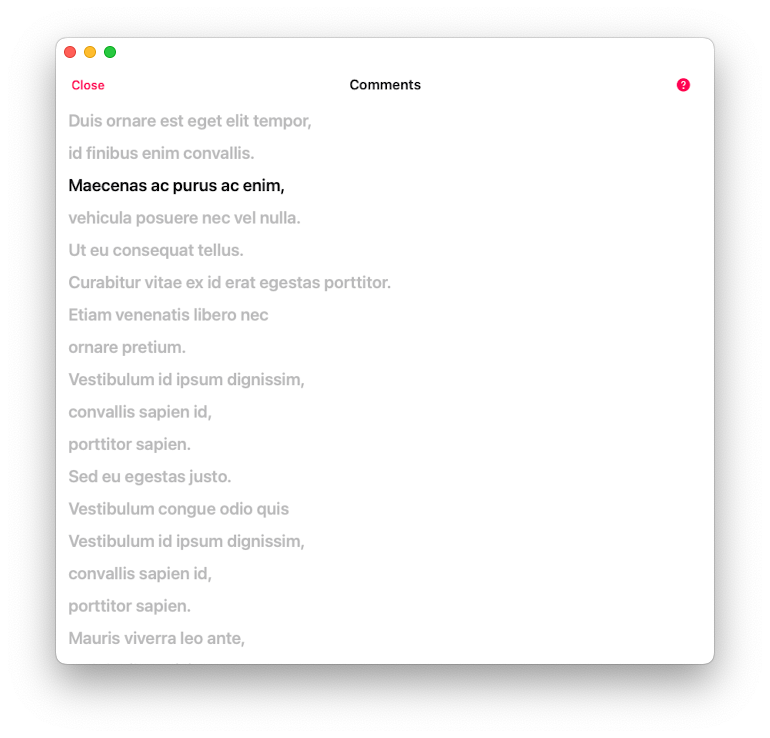
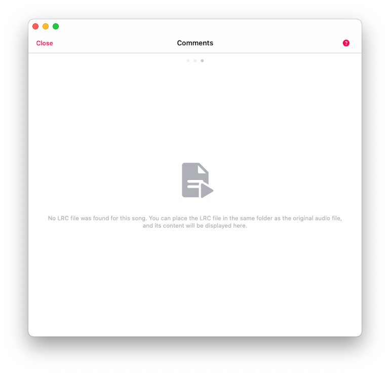
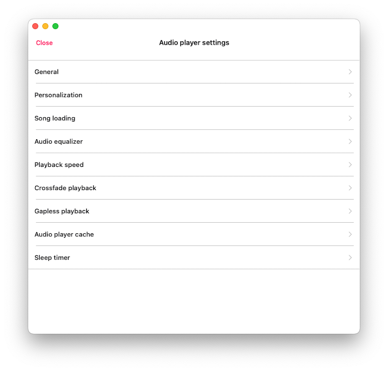
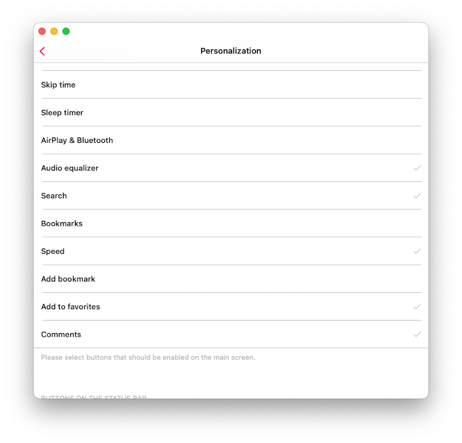
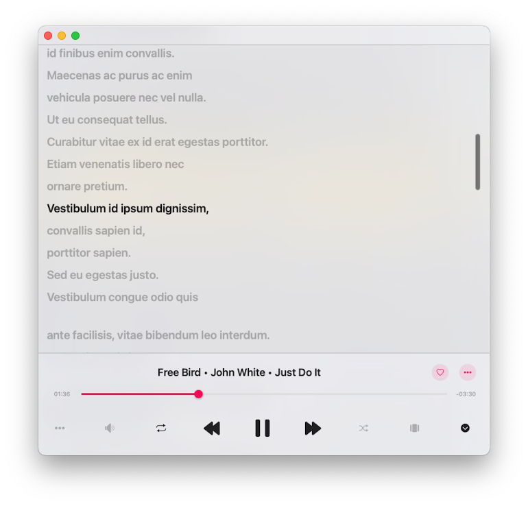

# How to View Embedded Lyrics, Comments, LRC file for Music on Your iPhone or Mac

**Writer: admin**  
**Date: Jul 28, 2024**  
**Updated: Dec 6, 2024**  
**2 min read**

Discover how to easily view embedded lyrics for your music on your iPhone or Mac using the Evermusic app. Whether it's text, lyrics, comments, or LRC files, this guide will show you step-by-step how to access and enjoy your song lyrics seamlessly.

You can view embedded lyrics for tracks in the Evermusic app by following these steps:

1. Start playing an audio file by tapping on it.

   

2. Open the full-screen audio player.

   

3. Tap the "More Actions" button in the top right corner to see the More Actions menu.

   

4. Select the "Comments" menu item.

   

5. On the track comments screen, you have three modes that you can change by scrolling to the right: Comments, Embedded Lyrics, and LRC File.

   

**Modes:**

1. **Comments Mode:** Displays the content from the COMMENT field of your audio file.

2. **Lyrics Mode:** Shows the embedded lyrics from your audio file. If your audio file has lyrics in the tags, they will appear here. This mode also supports timed text in LRC format. To edit the lyrics tag, use an external audio tag editor like Evertag. You can find LRC format lyrics for free on websites like Lyricsify. Copy the needed lyrics to your tags and save them to display later on this screen.

3. **LRC File Mode:** Instead of editing audio files, you can place an LRC file in the same folder as the original audio file. Both files should have the same name but different extensions. When you swipe to the third page on the Comments screen, the app will search for the LRC file in the same directory and display its content.

You can also activate the quick Comments button on the main audio player screen and switch between artwork view, audio player queue view, and comments view by tapping the view mode button at the bottom of the audio player screen.

To activate it, open Settings > Audio Player > Personalization. Scroll down to "Buttons on the Main Screen" and select the "Comments" menu item.

Now, return to the main audio player screen and tap the audio queue button several times to activate the Comments view.

**In conclusion**, viewing embedded lyrics for your music on your iPhone or Mac is simple with the Evermusic app. Whether you need to access text, lyrics, comments, or LRC files, Evermusic provides a user-friendly way to enjoy your song lyrics. By following the detailed steps outlined above, you can easily navigate through the app to find and view your embedded lyrics. Additionally, enabling the quick Comments button on the main audio player screen enhances your experience, allowing you to switch effortlessly between artwork, audio queue, and comments views. Enjoy a seamless and enriched music experience with Evermusic's versatile features.

---

**Tags:**  
[audio](https://www.everappz.com/blog/tags/audio) [iphone](https://www.everappz.com/blog/tags/iphone-1) [mp3](https://www.everappz.com/blog/tags/mp3) [lyrics](https://www.everappz.com/blog/tags/lyrics) [lrc](https://www.everappz.com/blog/tags/lrc) [embedded](https://www.everappz.com/blog/tags/embedded) [view](https://www.everappz.com/blog/tags/view) [display](https://www.everappz.com/blog/tags/display)

**Category:**  
[How To](https://www.everappz.com/blog/categories/how-to)