In a world where music streaming dominates, there's still great value in having your favorite tracks available offline. Evermusic and Flacbox are powerful apps that allow you to download and sync music from your cloud storage directly to your local files, ensuring you have access to your tunes anytime, anywhere. In this guide, we'll walk you through the steps to effortlessly play offline music using Evermusic and Flacbox, making your music library accessible even without an internet connection.

Our music apps offer two primary methods for making music available offline: simple downloading and enabling offline mode for automatic synchronization.

## Downloading Music for Offline Playback

1. **Open the Connections Tab:**
   - Launch Evermusic or Flacbox.
   - Navigate to the “Connections” tab to see all connected cloud services.

   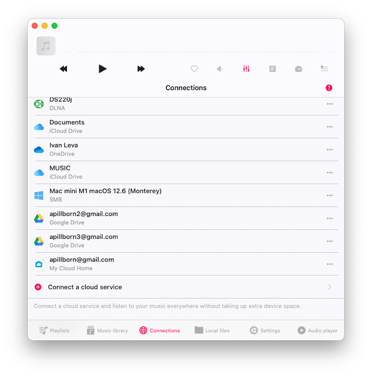

2. **Open Cloud Service:**
   - Tap the icon of the cloud service you want to access.
   - Browse to the folder containing the audio files you want to download.

   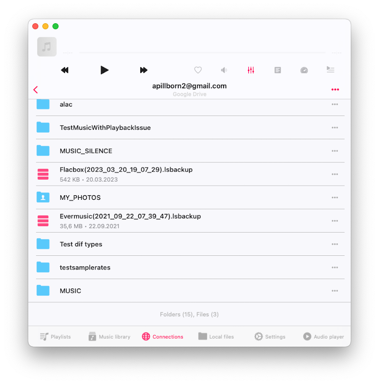

3. **Download Music:**
   - Tap the three dots next to the folder name to open the more actions menu.
   - Select the **Download** option to start downloading the folder for offline playback.

   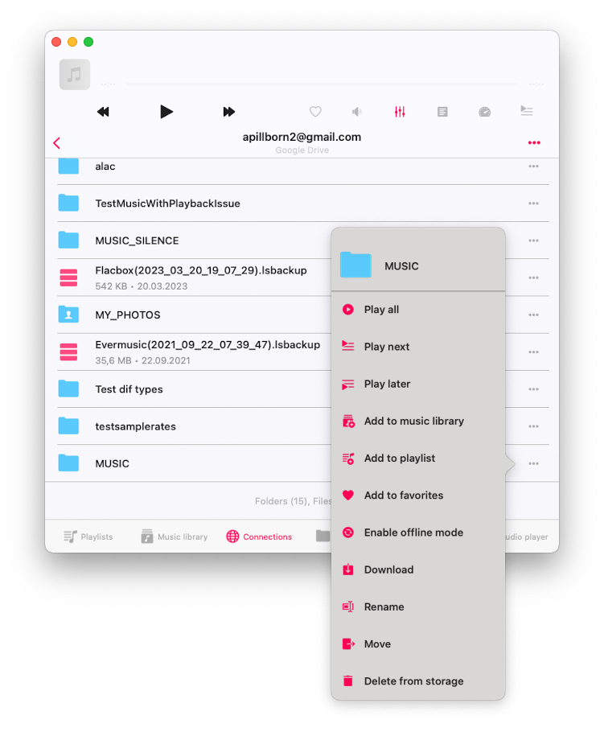

   - The folder will be downloaded to the app’s Documents directory.
   - To check download progress, go to the **File Transfers** screen by tapping the spinning arrows icon in the top left corner of the Local Files screen.

   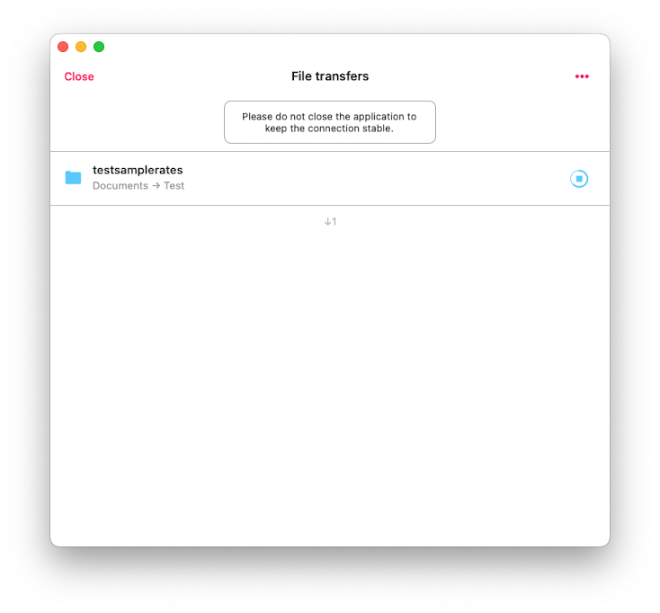

   - You can find all downloaded files in the Documents - Downloads folder or your custom downloads folder if configured in the app settings.

   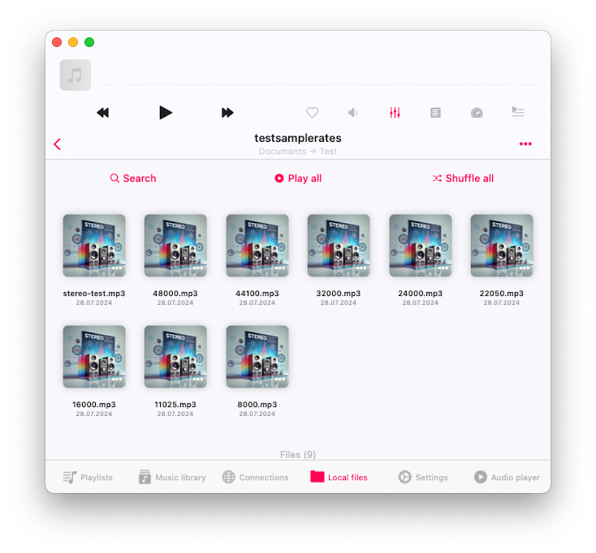

## Enabling Offline Mode for Automatic Sync

1. **Activate Offline Mode:**
   - Instead of just downloading, enable offline mode to automatically update local files when changes occur on the cloud service (e.g., file updates or new files added).

   

   - Offline mode performs a one-way sync, reflecting only cloud service changes in your local copy.

   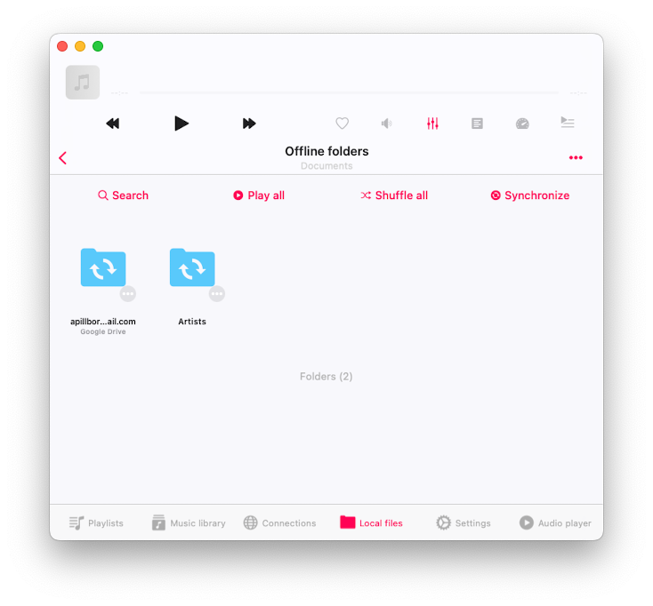

2. **Manual Synchronization:**
   - Manually synchronize your offline folder by selecting the **Synchronize** action from the more actions menu, accessible via the three dots button.

   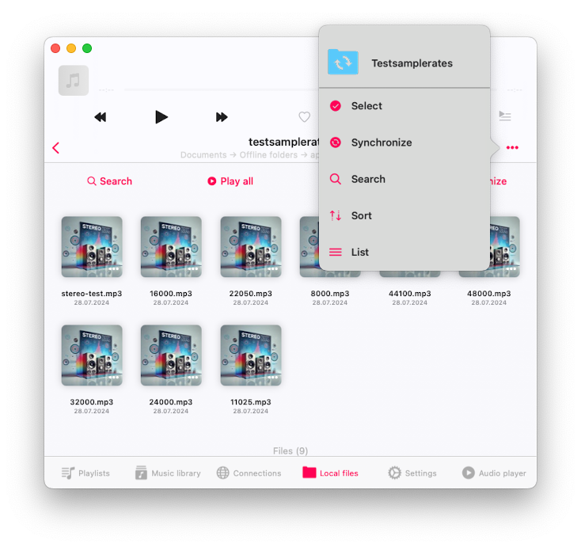

3. **Offline Mode for Playlists/Albums/Artists/Genres:**
   - To enable offline mode for playlists, open the playlist and check the box near the offline mode action.

   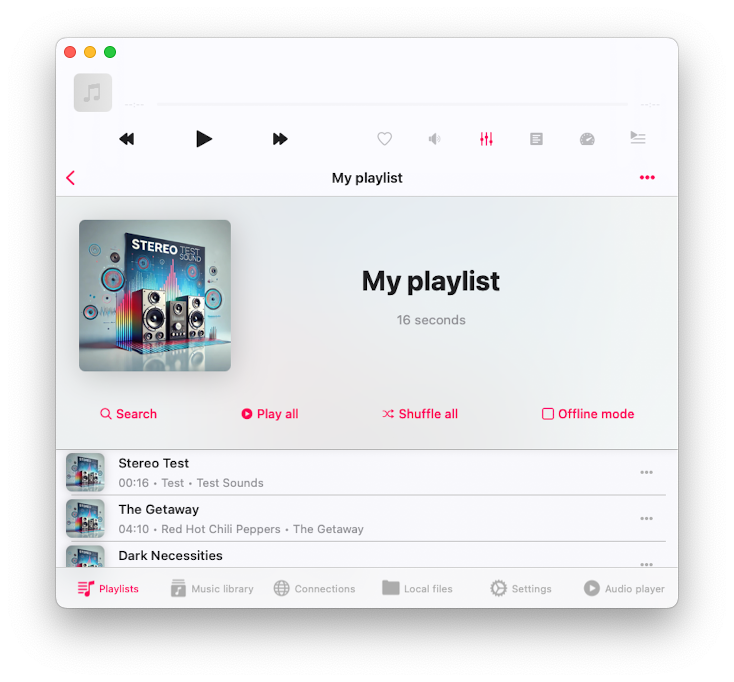

   - The app will scan all tracks in the playlist and download them to Local Files - Offline Folders - Playlists - [Playlist Name] folder.

   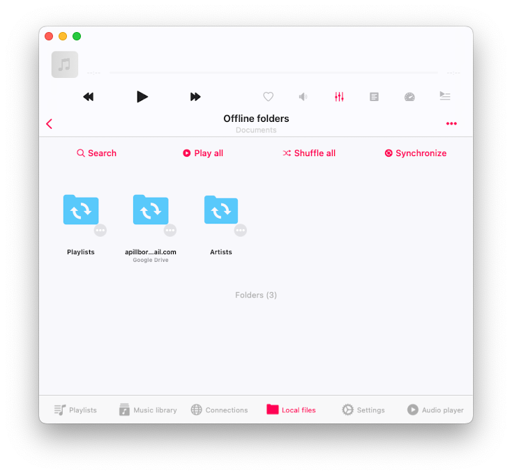

4. **Settings for Downloads:**
   - In the app settings, you can adjust the maximum number of parallel tasks to speed up downloads, enable background transfers, and change the download folder location.

   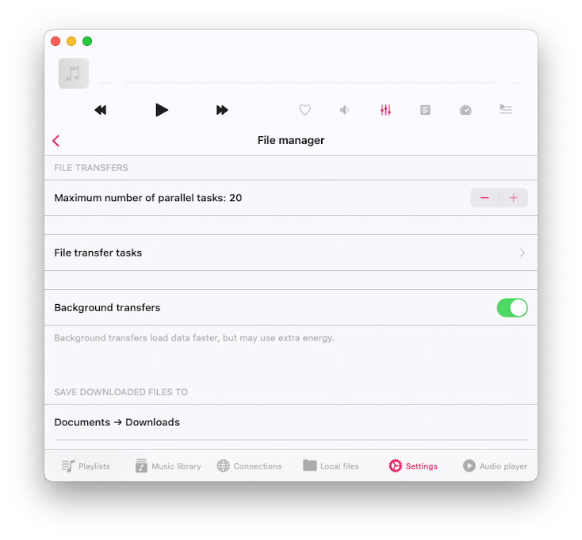

   - Manage offline folders via Settings - File Manager - Synchronized Offline Folders.

   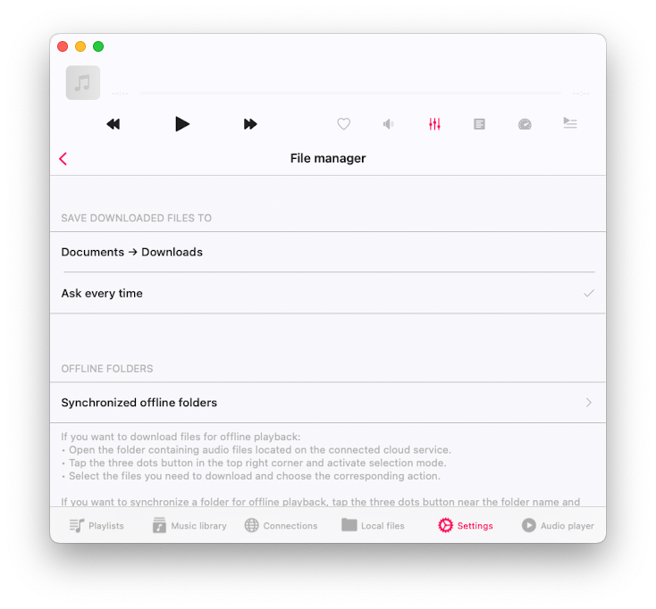

## Managing Synchronized Offline Folders

1. **Folder Management:**
   - In the Synchronized Offline Folders section, you can start and stop sync, show a folder in its enclosing directory, or disable offline mode (which removes local copies of files from your device).

   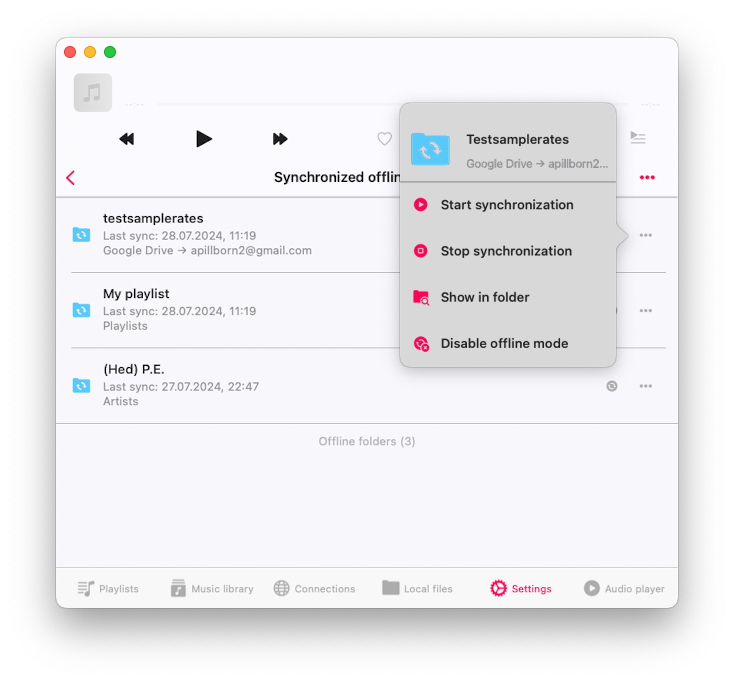

2. **Set Sync Interval:**
   - Configure the sync interval for offline folders (default is 1 day) to automatically check for updates and sync local copies when the app is opened.

   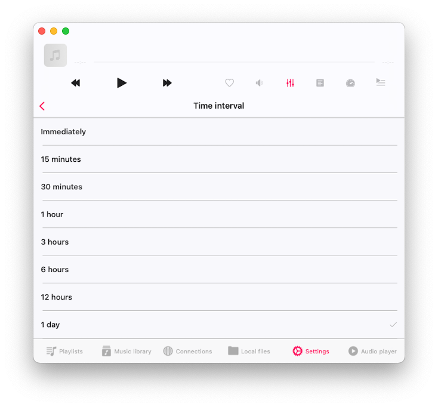

3. **Music Library Integration:**
   - All downloaded files are added to the music library. Manage music library settings by tapping the more actions menu in the top right corner of the Music Library section and selecting **Settings**.

   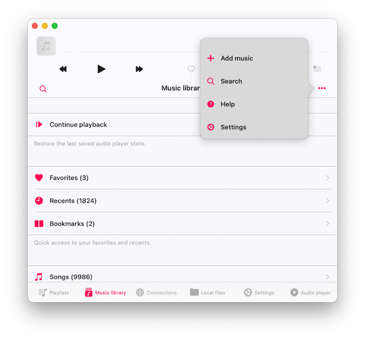

## Using Audio Player Cache

The last option for downloading cloud files is using the audio player cache. Here's how it works: enable the audio player cache in the app settings (Audio Player > Audio Player Cache).

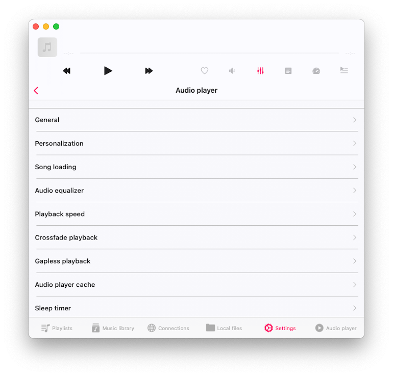

- Set the cache size so old files are automatically removed, and new files are downloaded to the Local Files > Audio Player folder. When you start playing music from the cloud, the app will automatically pre-download the next track in the queue, ensuring smooth transitions between tracks.

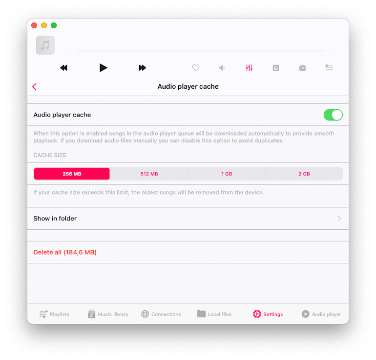

1. **Enable Audio Player Cache:**
   - Go to Settings - Audio Player - Audio Player Cache to enable the cache.
   - Set the cache size so old files are automatically removed and new files are downloaded to Local Files - Audio Player folder.
   - When playing music from the cloud, the app will pre-download the next track to ensure smooth transitions.

2. **Check Cache Location:**
   - Verify the audio player cache location by selecting **Show in Folder** on the settings screen.

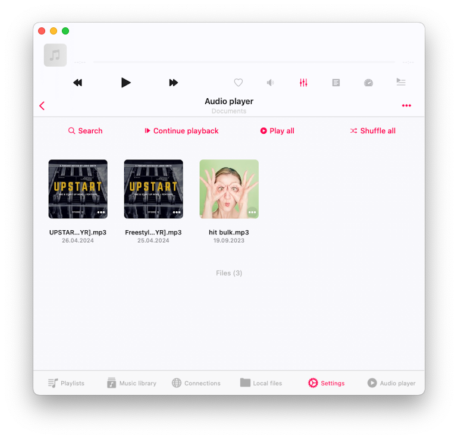

## Avoiding Duplicate Files

The app offers several options for downloading files: Offline Mode, Direct Download, and Audio Player Cache. To avoid duplicates, use only one method. Additionally, if a track is in multiple collections (such as albums or playlists) and you enable Offline Mode for both, the track will be downloaded twice, as Offline Mode functions independently for each collection.

1. **Manage Multiple Copies:**
   - Avoid having multiple copies of the same file by using the **Show in Folder** option to locate files and manage duplicates.

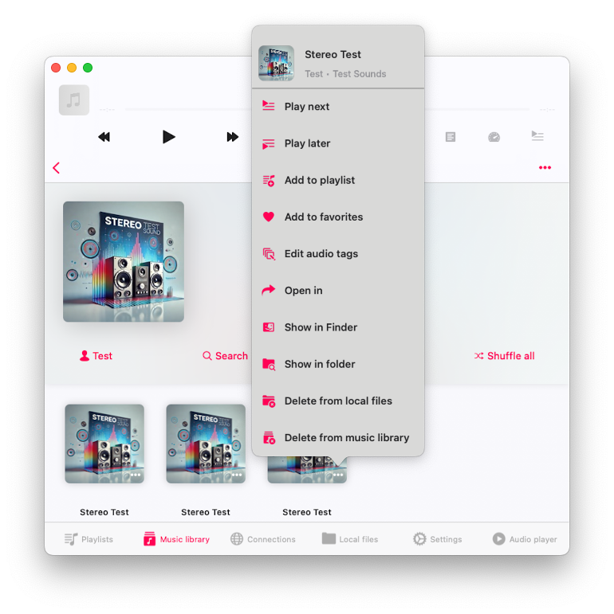

## Troubleshooting and Tips

1. **Multiple Copies of Files:**
   - Be aware that enabling multiple download modes (e.g., audio player cache, folder download, offline mode for cloud folders, playlists, albums, artists) can result in duplicate files. Use **Show in Folder** to locate and manage these files.

2. **Background Transfers:**
   - Ensure background transfers are enabled in settings to keep downloads running even when the app is not active.

3. **Syncing Intervals:**
   - Adjust syncing intervals in settings to ensure your music library is always up to date with the latest changes from your cloud service.

By following these detailed steps, you can seamlessly manage and play your local and cloud-stored music offline using Evermusic and Flacbox. Enjoy uninterrupted access to your music library, organized and ready to play whenever you want.
