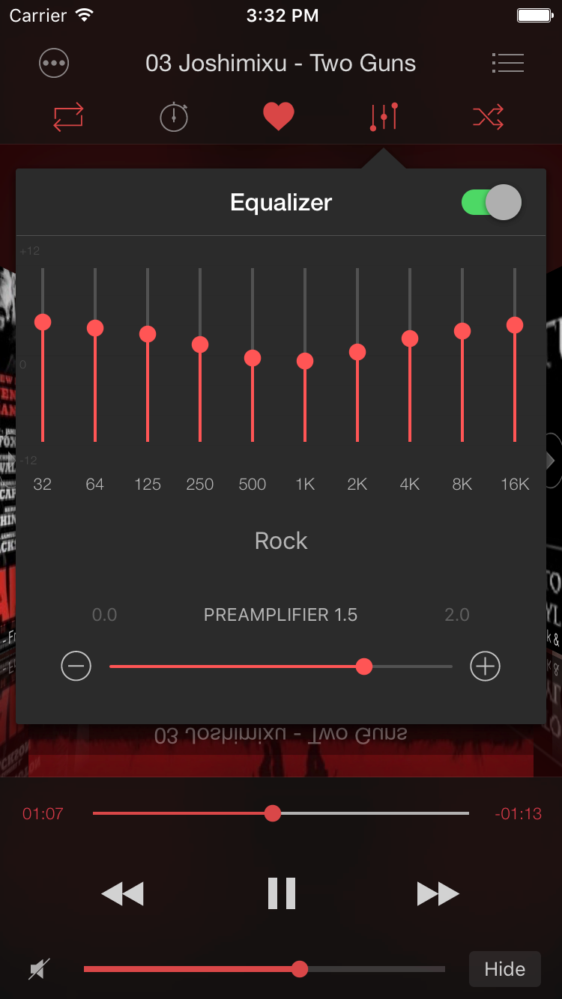
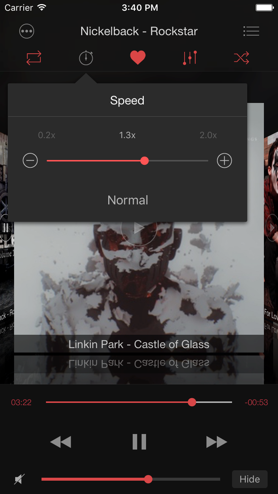

# Soundy: Equalizer for SoundCloud on the App Store

**Writer:** admin  
**Date:** Mar 9, 2017  
**Updated:** Dec 8, 2024  
**Reading Time:** 2 min read

## Soundy: The Ultimate SoundCloud Audio Player with Real 10-Band Equalizer

SoundCloud is renowned for music discovery, but one glaring omission in the official SoundCloud app is an equalizer. While alternative apps like TuneShell offer SoundCloud playback, their equalizer options are often limited. Enter Soundy, the solution you've been waiting for.

Soundy is a feature-packed SoundCloud audio player that boasts a robust 10-band equalizer, reminiscent of iTunes, complete with popular presets such as Electronic, Jazz, Pop, Hip Hop, Rock, Bass Booster, and Bass Reducer. Beyond the equalizer, Soundy offers a plethora of features you'd expect in a top-notch music app, including easy playlist management, shuffle, repeat, audio bookmarks, favorites, sleep timer, and playback speed control.

However, the star attraction of Soundy is undoubtedly its REAL 10-band equalizer. For those unfamiliar, an equalizer enables you to boost or attenuate bass, mids, or treble frequencies to suit your preferences. With a 10-band equalizer, you can make broad bass enhancements or precise adjustments to a narrow frequency range.

So, what makes Soundy's equalizer REAL? Unlike other apps with pseudo-parametric equalizers, Soundy allows you to effortlessly select sound volume and frequency by dragging control knobs.

### With Soundy's 10-band equalizer, you can:

- Fine-tune specific frequencies across the sound spectrum.
- Customize sound for various music genres, room acoustics, or specific speakers.
- Choose from over 20 presets of commonly used equalizer settings or manually tweak the settings.

### Here's how to use Soundy's 10-band equalizer:

1. Go to Player Screen > Equalizer.
2. Select a preset from the pop-up menu OR drag the frequency sliders to adjust volume for specific frequencies (in decibels).

(Note: The equalizer settings apply to all songs until you make changes).

### You can also create your own equalizer presets:

1. Go to Player Screen > Equalizer.
2. Adjust the frequency settings by dragging sliders to your preference.

Soundy doesn't just sound good; it sounds exceptional. Thanks to its proprietary auto-normalizer, Soundy prevents clipping and compression of dynamics. This results in an unparalleled listening experience for SoundCloud tracks.

However, the equalizer isn't Soundy's only standout feature. It also offers:

- Playback speed control for audiobooks.
- Audio bookmarks and resume playback from the last position.
- A sleep timer that fades out your music softly, conserving your device's battery while lulling you to sleep.

This post doesn't cover all of Soundy's features, so we invite you to explore the rest yourself. In summary, Soundy is a visually appealing app, user-friendly, with excellent sound quality, and the ability to equalize SoundCloud songs, making it a must-have for SoundCloud enthusiasts.

Discover the full potential of Soundy and elevate your SoundCloud listening experience.

---

**Tags:** [cloud](https://www.everappz.com/blog/tags/cloud), [player](https://www.everappz.com/blog/tags/player), [equalizer](https://www.everappz.com/blog/tags/equalizer), [iPhone](https://www.everappz.com/blog/tags/iphone), [SoundCloud](https://www.everappz.com/blog/tags/soundcloud), [stream](https://www.everappz.com/blog/tags/stream), [Chromecast](https://www.everappz.com/blog/tags/chromecast)

**Category:** [How To](https://www.everappz.com/blog/categories/how-to)