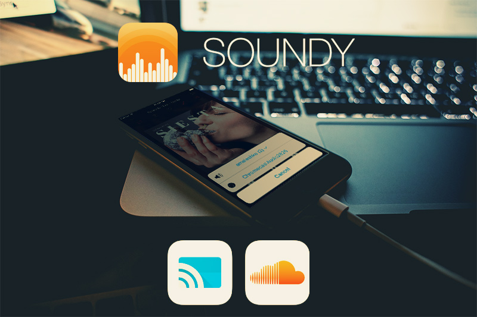
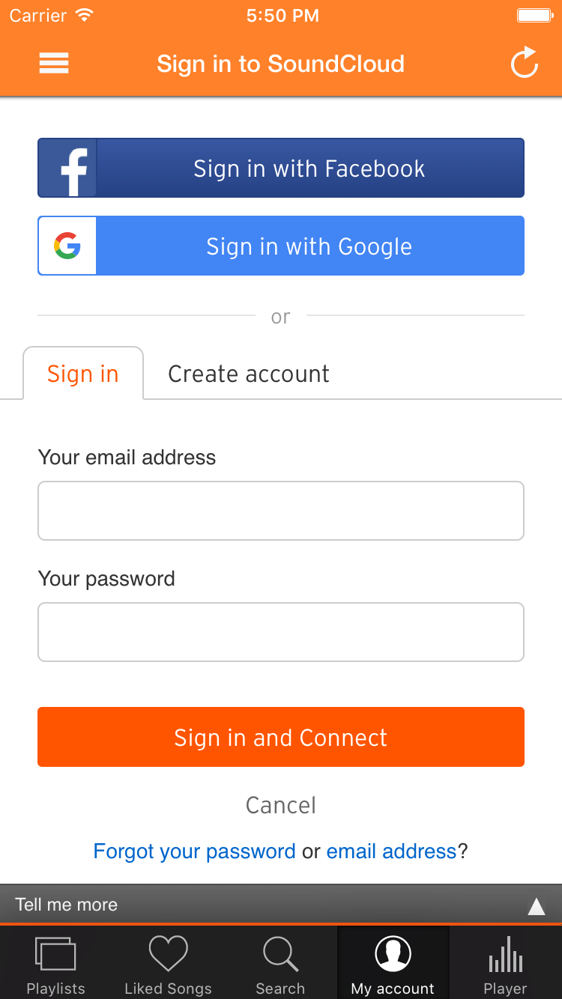
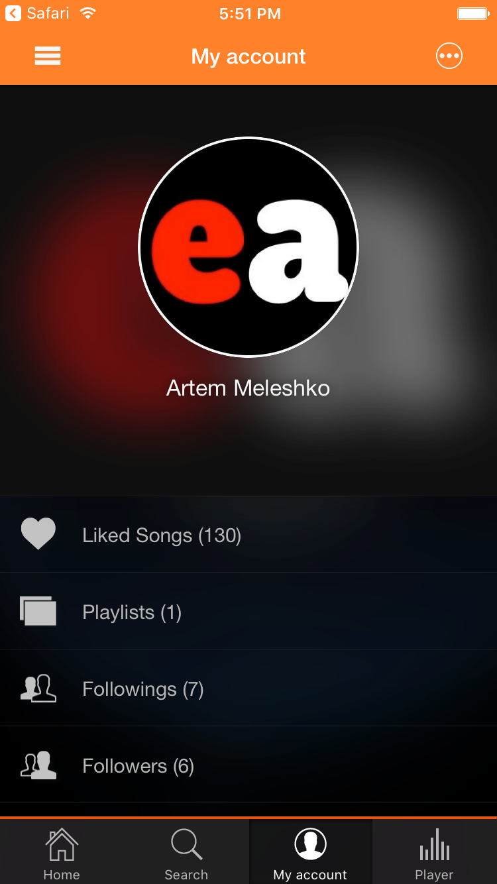
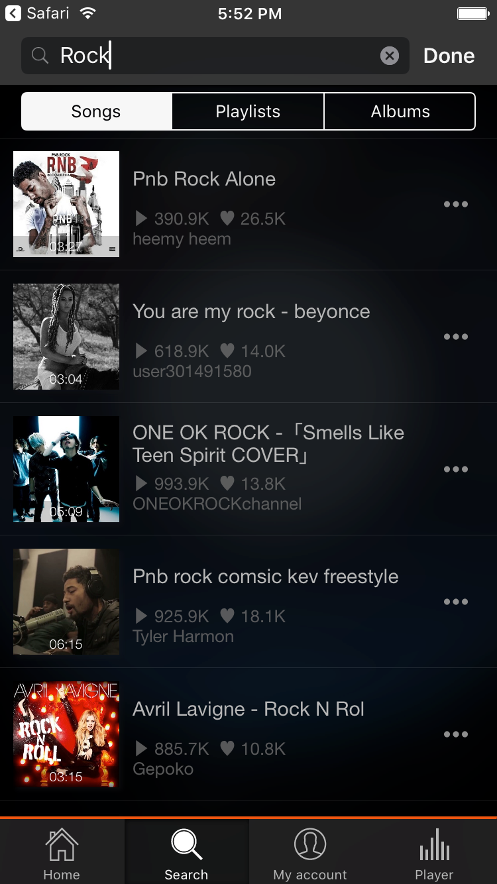
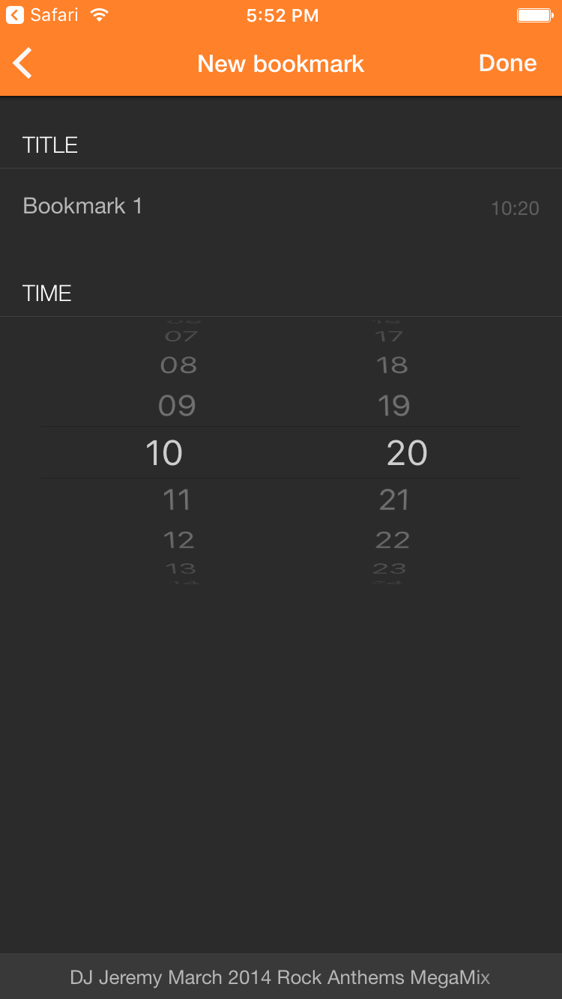
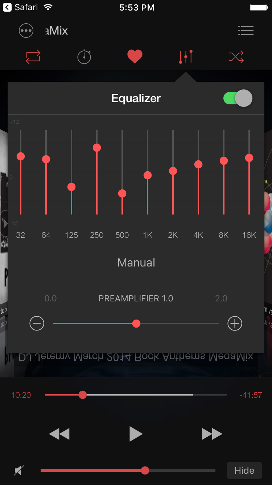
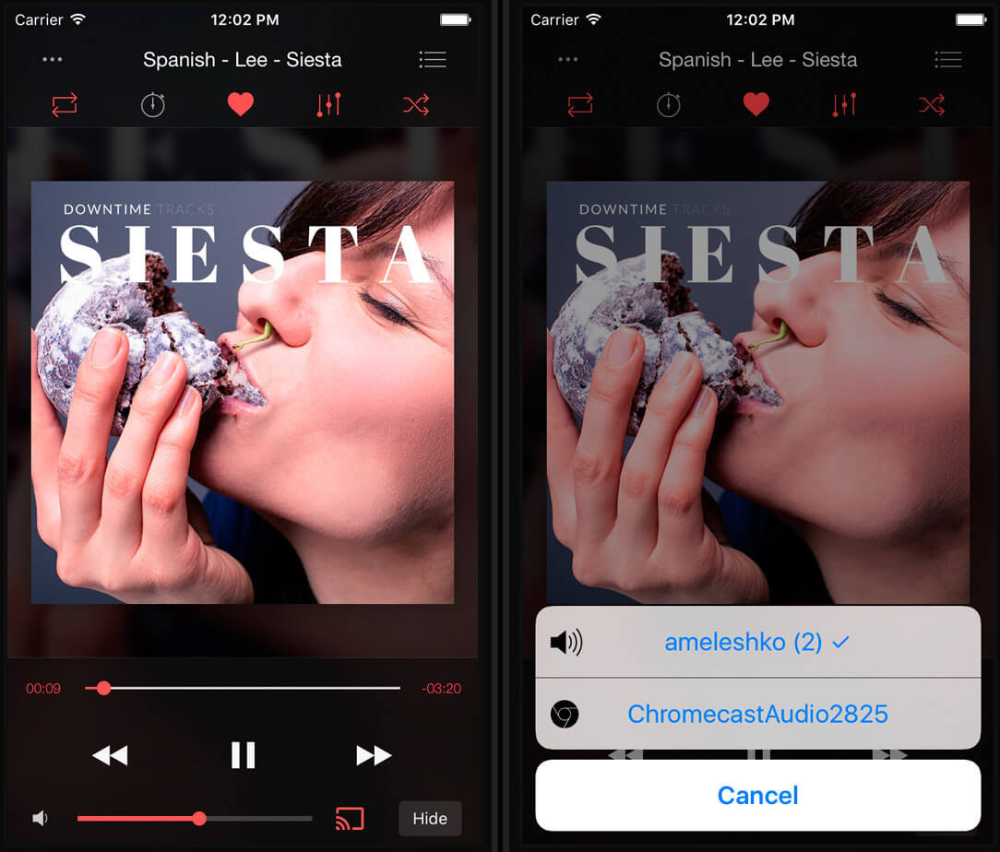
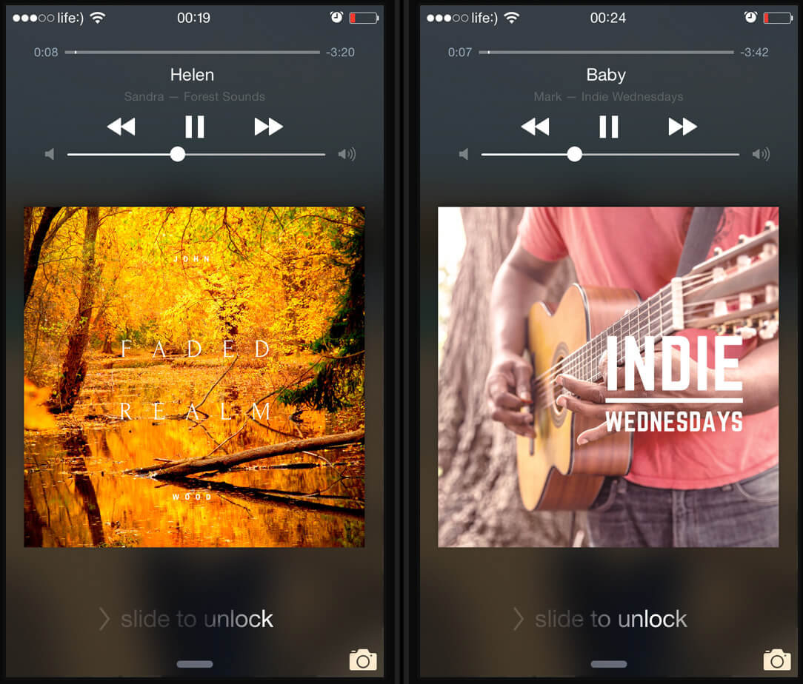

SoundCloud users have been eagerly asking when Chromecast support will be added to the iOS app, but so far, there's been no official update from SoundCloud. Many iPhone users are left unable to stream their favorite SoundCloud tracks to Chromecast.

However, there's a solution! Enter Soundy, a full-featured SoundCloud audio player with built-in Chromecast support. Best of all, it's free and ready to use on your iPhone or iPad. With Soundy, you can seamlessly connect SoundCloud to your TV using Google Chromecast or AirPlay. In this tutorial, we'll introduce you to some of Soundy's fantastic features and guide you through the process of streaming your music from SoundCloud to Google Chromecast using your iOS device.

## Step 1: Install Soundy

You can download Soundy directly from the App Store. It offers a range of useful features, including an equalizer, speed control, audio bookmarks, and a sleep timer. However, its standout feature is undoubtedly Google Chromecast support.

## Step 2: Connect Your SoundCloud Account (Optional)

Once you've installed Soundy, you can choose to connect your SoundCloud account. This allows you to access your SoundCloud music across all your devices.

- In the Account tab, you'll find all your uploaded tracks.
- The Favorites tab displays all your favorite music.
- Playlists tab contains your playlists and those created by other users that you've liked. You can switch between your own and liked playlists using the segment control at the top of the screen.

However, you can still create playlists and manage favorites without a SoundCloud account. All changes will be saved locally within the app.

## Step 3: Manage Playlists and Favorites

With Soundy, you have the freedom to edit your playlists, change the order of songs, and add tracks to your favorites. Sharing music with friends is as easy as tapping the Options button and selecting the Share menu.

## Step 4: Discover New Music

If you already have a particular song or album in mind, you can simply search for it within Soundy. Open the Top Charts tab and use the search field at the top of the screen. You can search for your favorite songs, albums, and playlists. To narrow down your search, select the content type using the segment control and tap the Search button. If you find tracks you like, you can add them to your playlists or favorites or share them with friends via the Options button.

## Step 5: Customize Playback

Soundy offers some nifty playback features, especially for audiobook enthusiasts. You can change playback speed from 0.2x to 2.0x and create audio bookmarks to save your playback position and resume listening from where you left off.

## Step 6: Enjoy an Equalizer

One of Soundy's standout features is its 10-band equalizer with iTunes presets. You can fine-tune your audio experience by adjusting EQ frequency from -12 to +12 decibels. Choose from built-in presets like acoustic, bass booster, jazz, and more.

## Step 7: Stream to Chromecast

Finally, we'll show you how to stream your SoundCloud music to Chromecast.

- First, set up Chromecast by following the instructions [here](https://support.google.com/chromecast/answer/6260600?hl=en).
- Start the player in the Soundy app and open the Player screen.
- Look for the cast button near the volume indicator.
- Tap the cast button and select your available Chromecast device from the list.

Once the connection is established, your music will start playing on the connected Google Cast device. You can control the Chromecast volume using the volume slider on the Player screen, and you can also switch between songs and use the scrubber on the iPhone's lock screen.

Enjoy streaming your favorite SoundCloud tracks to Chromecast hassle-free with Soundy!
