How to Sync Your iCloud Music Library with Flacbox and Evermusic for Smooth Playback. Recently, one of our subscribers reached out to the Everappz Support Team with a common concern:

> "Hello Flacbox Support Team, I’ve recently subscribed to Flacbox for one year, but I’m having significant difficulties syncing my music from iCloud properly. I have about 60 albums of various soundtracks stored in my iCloud, which I would like to integrate into the app. However, it seems that the import process into the Flacbox library isn’t working as smoothly as I’d hoped. It takes an extremely long time for even a single album to load into the app. Yesterday, I spent several hours trying different methods to import the albums efficiently, but I couldn’t find a satisfactory solution. I would appreciate any guidance or a step-by-step guide on how to import iCloud-based music (without it being stored locally on my iPhone) in a way that doesn’t result in excessive loading times."

For many users with extensive music libraries in iCloud, integrating files into Flacbox and Evermusic can sometimes present challenges, particularly around sync speed and efficiency. If you’ve encountered similar issues, this guide will walk you through best practices to streamline the import process, minimize loading times, and enjoy your music with ease. In this guide, we will use iCloud storage, but these steps are also valid for any other cloud service supported by the app. You'll see Mac screenshots in this guide, but on iPhone, the screens and feature locations are the same.

## Import Your iCloud Library

Start by opening [iCloud.com](https://icloud.com) and creating Music folders to organize your library. Using a computer makes it easy, as the site supports drag-and-drop.

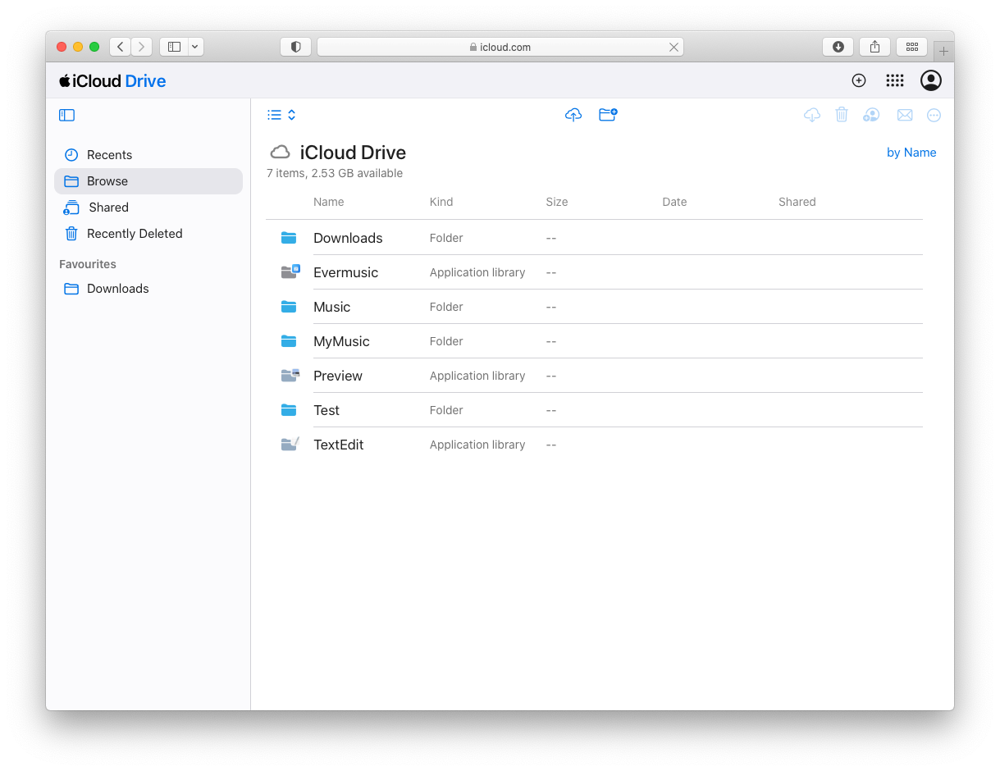

Wait until all files have fully uploaded to iCloud before proceeding.

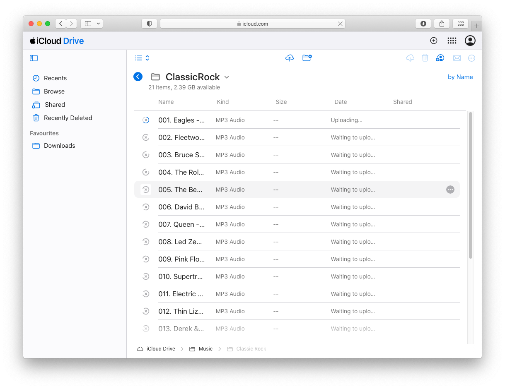

Open the app and navigate to the **Connections** section.

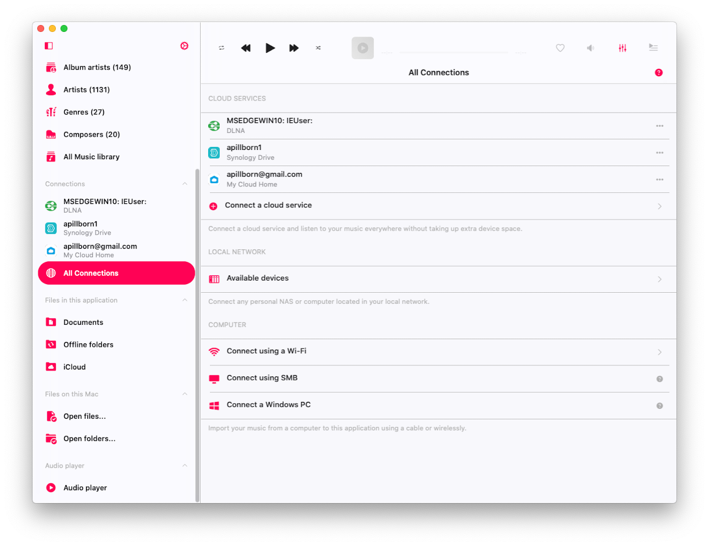

Tap on **Connect a Cloud Service** and select **iCloud Drive** from the list of available cloud servers.

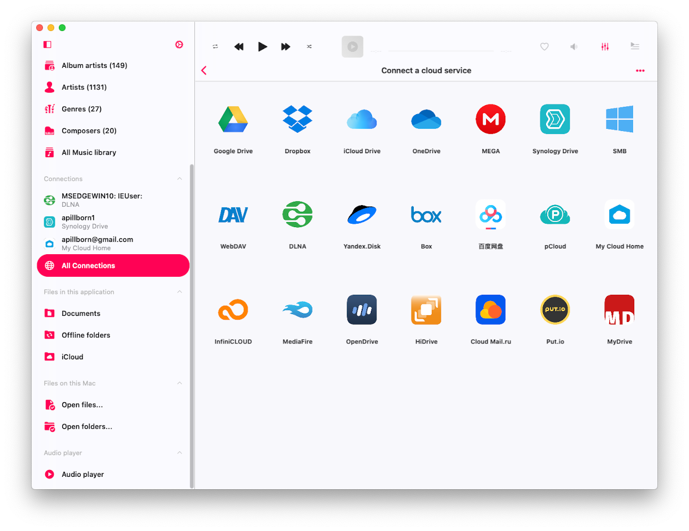

On the next screen tap **Select a folder** to open the system Files picker.

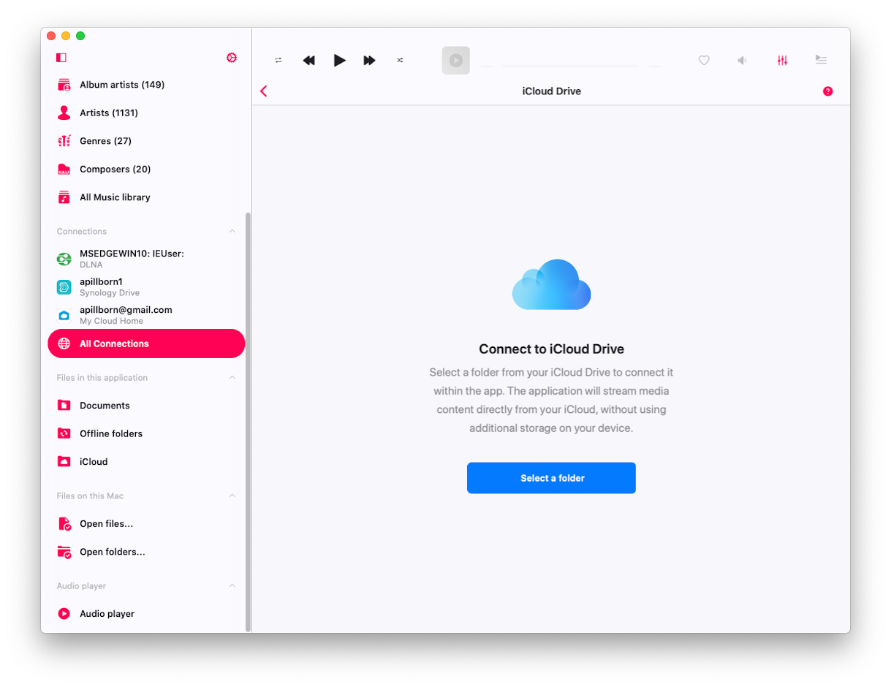

The key step here is to first select **iCloud Drive** on the left panel, then navigate to the Music folder created in the previous step, and tap **Open** to confirm. Note that files in the Music folder show a cloud symbol, indicating they are stored on iCloud servers and not downloaded to your device. This setup allows us to stream music directly from iCloud without downloading it.

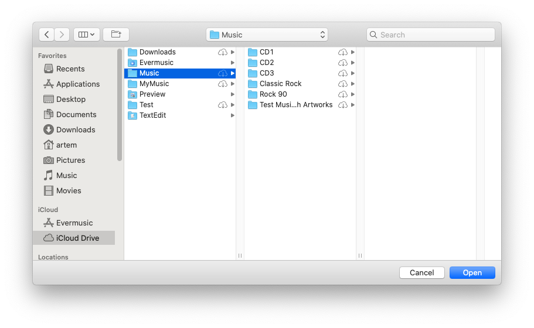

After your cloud folder is added to the app, it will appear in the **Connections** section. Tap on it to view the folder contents and navigate through subfolders and files. Use the options menu to rename, move, or delete files within the connected iCloud Drive folder.

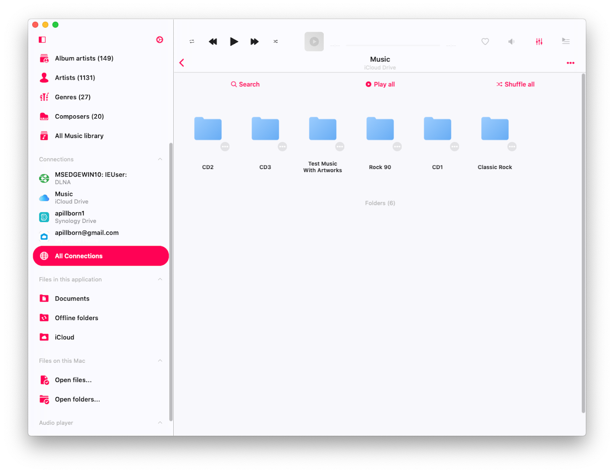

To play audio files stored in the cloud, simply tap on any file in the connected cloud folder to launch the audio player. The app will stream the file without downloading it to your device.

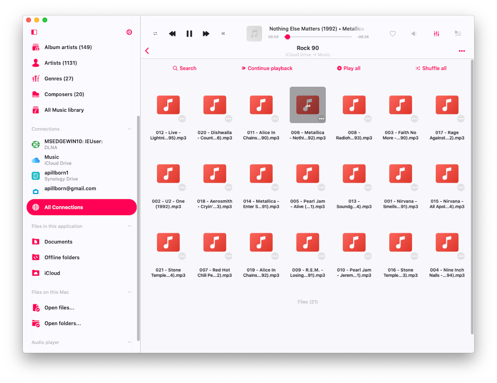

If you want to add files to the Music library and organize tracks by Artist, Album, or Genre tags, open the **Music library** screen. Tap the **More actions** button in the top-right corner and select **Settings** to access the Music library settings.

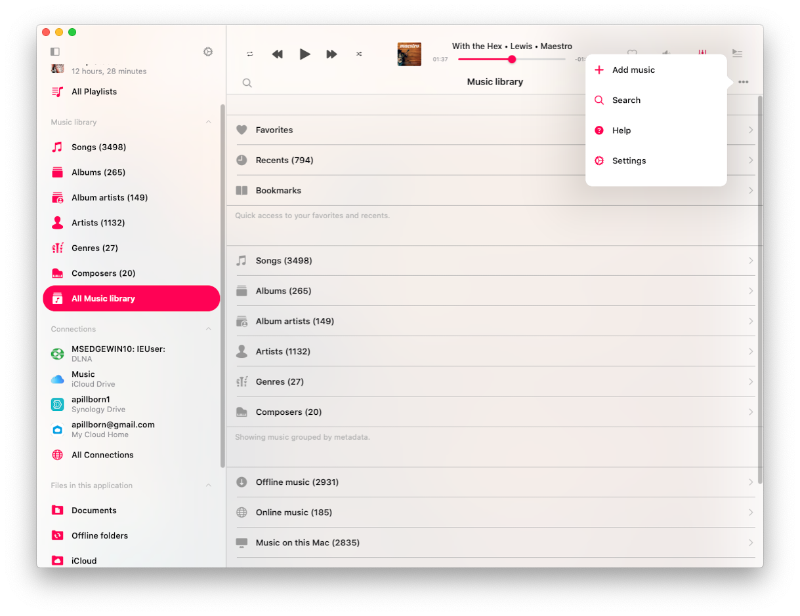

In the Music library settings screen, several options are available. For now, focus on **Online Music Synchronization**.

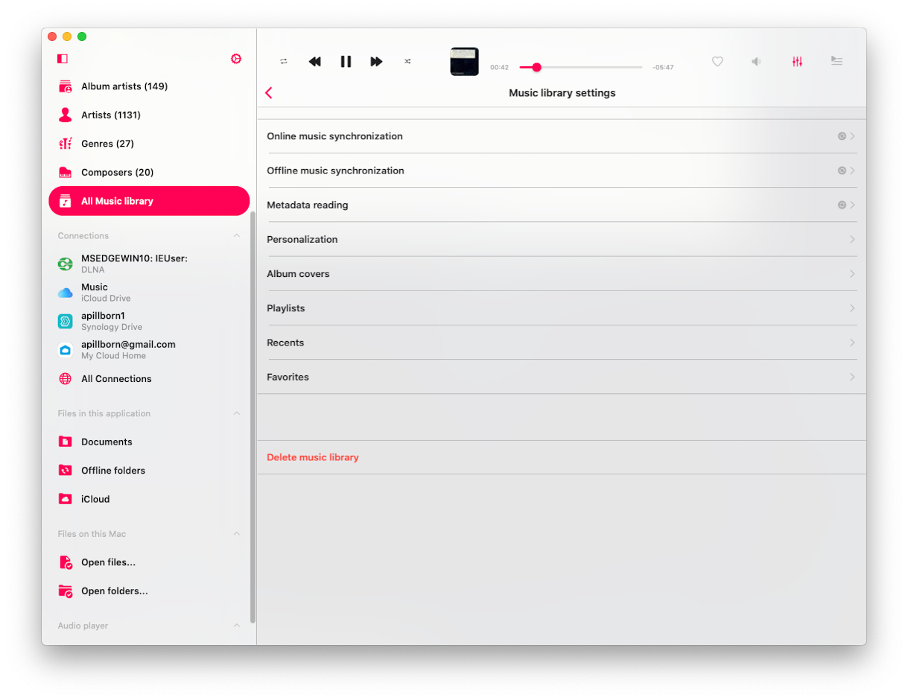

Tap on **Online Music Synchronization** to proceed to the next screen. First, activate this feature. On iPhone, you also have the option to choose the network type for synchronization: **Wi-Fi** only or **Wi-Fi and cellular data**.

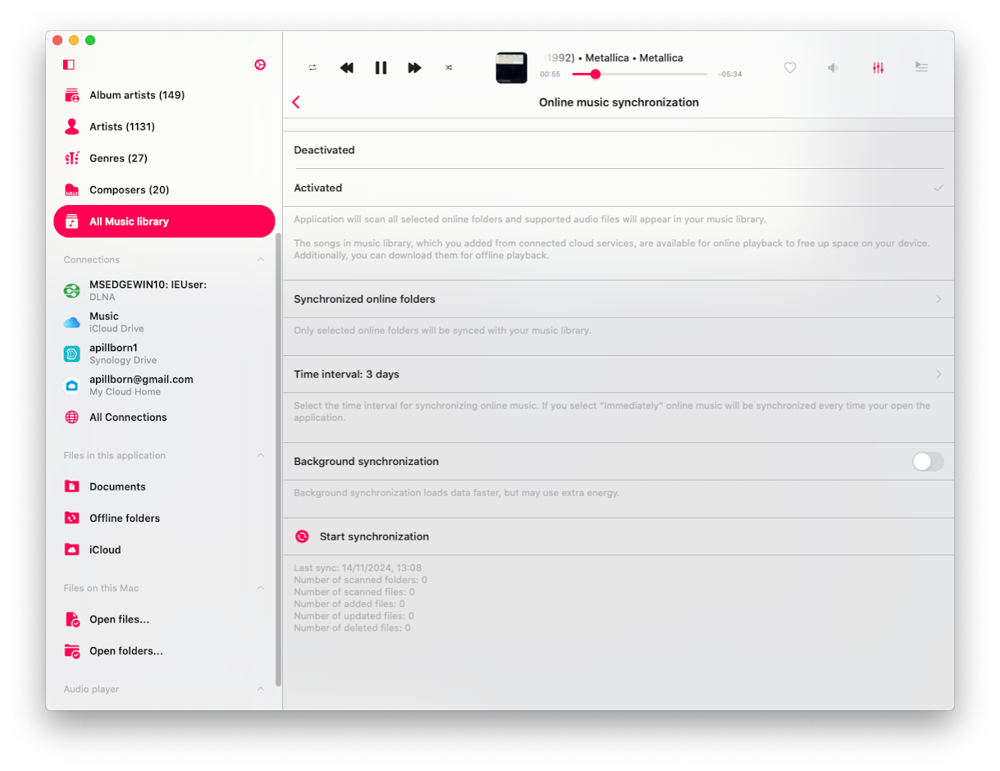

Tap **Synchronized online folders** to start folders selection. When you select a folder, the app will scan the folder content, and all found audio files will appear in the **Music library**. The app creates only links to your media files located on a cloud server.

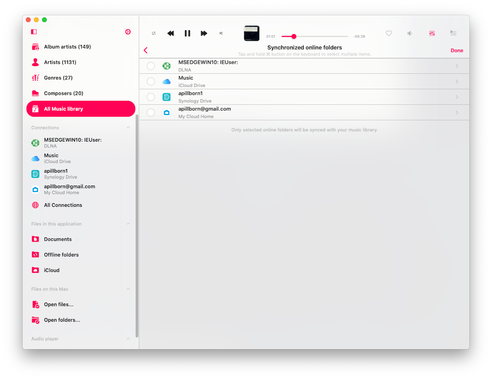

For now, tap on the connected iCloud server and select the music folders. Tap **Done** to confirm your selection.

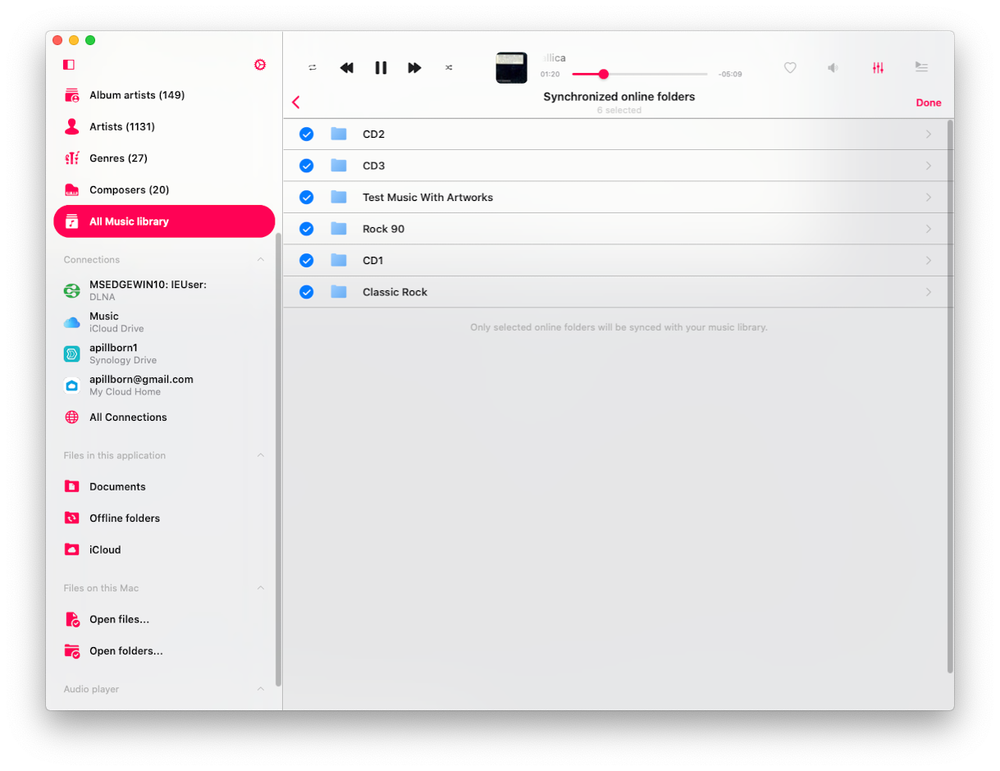

The app will begin scanning your selected folders, and all found files will appear in your music library. You can also set a time interval to control how often the app scans for updates on your cloud server.

With **Background Synchronization enabled**, the app continues scanning even when running in the background. We recommend enabling this feature to speed up the process; however, keep in mind that if the app consumes too much energy in the background, iOS may close it.

For faster scanning, enable Background Synchronization and start audio playback, as playing audio in the background prevents the iOS/macOS system from unloading the app. Alternatively, you can keep the app open during the synchronization process.

Tap **Start Synchronization** to begin and view sync progress at the bottom of this screen.

That's all for online sync; let's move forward.

## Metadata Reading

Another important process is metadata sync. This process loads metadata for tracks added to the music library, allowing the app to group them by artist, album, and genre using data from metadata tags.

To configure this, go to the **Music Library settings** screen and tap **Metadata Reading** to update the settings.

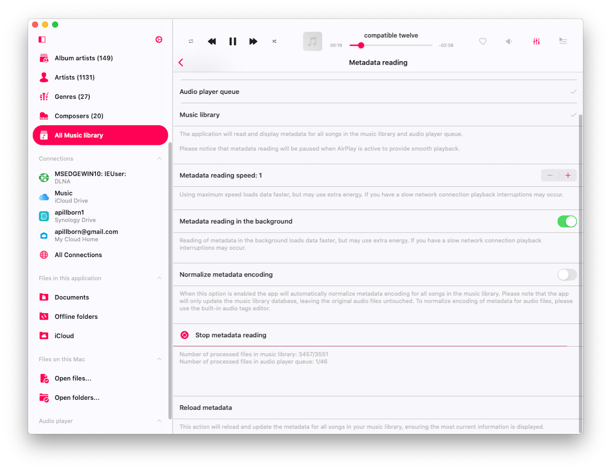

**Available Modes for Metadata Reader:**

- **Deactivated**: The metadata reader will be deactivated, and file names will be shown instead of data from audio tags.
- **Current Song**: The application will read metadata only for the currently playing song. Use this option if you have a slow network connection to prevent the metadata reader from sending many requests to the cloud server, which may cause playback interruptions.
- **Audio Player Queue**: The app will read metadata for all songs in the audio player queue.
- **Music Library**: The app will read metadata for all songs in the music library.

**Metadata reading speed**: You can adjust the speed of metadata reading to load data faster, but be aware that this may use more energy. This option is available on Mac only. If you want to update your music library metadata faster, consider using the Mac version of the app, and then use the data backup/restore feature in app settings to transfer the music library from the desktop version to the iOS version.

**Importantly**, the metadata reader only updates metadata in your music library and does not alter files stored in your cloud account or local storage. If you wish to edit metadata for audio files, you can do so using the built-in tags editor, which can be activated from the corresponding action in the options menu.

When the **Metadata reading in the background** switch is on, the metadata reader works in background mode. However, if the app consumes a lot of energy during audio playback, the iOS system may suspend it. To speed up metadata reading, connect your iOS device to a charger, start audio playback to keep the app active in the background, and enable metadata reading in the background. Or, you can leave the app open and set **Screen Always Active** in the app's Settings - Screen menu (iOS only). This will disable the auto-lock timer, keeping the app active continuously.

**Importantly**, If you have a large music collection, it’s advisable to use the desktop version of the application for metadata synchronization. You can then use the data backup and restore feature to transfer the synchronized music library from the desktop, available in app settings.

When **Normalize metadata encoding** is enabled, the app will automatically normalize metadata encoding for all songs in the music library. This fixes issues with broken encoding (e.g., from editing files on a Windows PC) and prevents incorrect information from displaying while a track is playing or added to the library.

The **Reload metadata** action will flag all files in your music library as having missing metadata, triggering the metadata reader to refresh metadata for every file in your library.

Tap **Start Metadata Reading** to start the metadata reader. Operation progress will be displayed below.

## Offline Music Synchronization

If you decide later to make some albums available offline in the app, you have two options:

1. Use the **Download** action to download the entire folder's content to your device.
2. Use the more advanced **Offline Mode**. With Offline Mode, the app will periodically check the cloud folder for any changes, and if new files are found, it will download the missing ones to your device automatically.

To activate offline mode for a folder tap **More actions** button and choose **Enable offline mode** menu item.

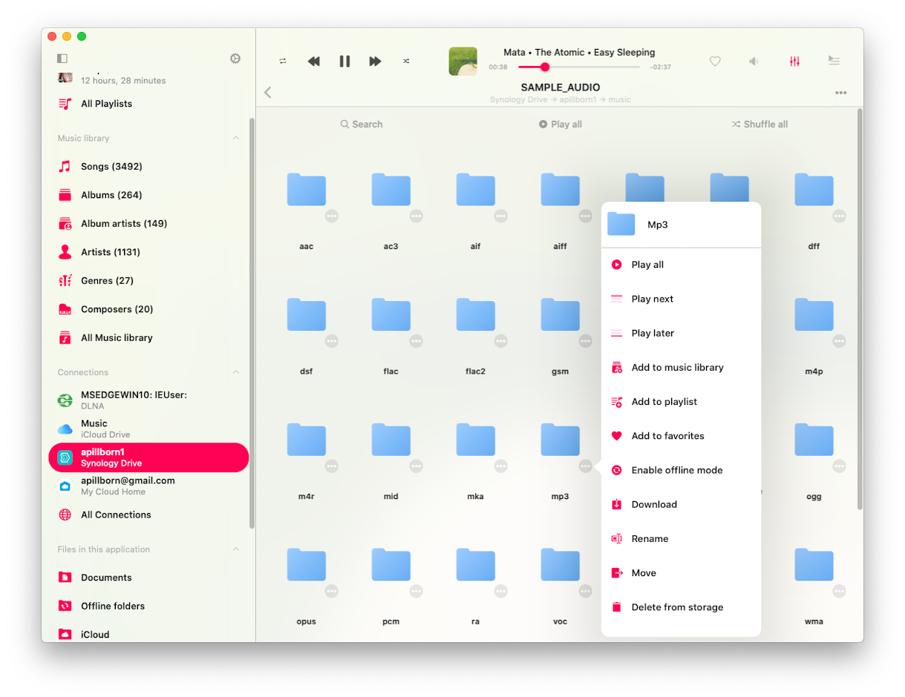

The app will add the selected folder to the transfer queue. You can check the queue in Settings - File manager - Transfer tasks.

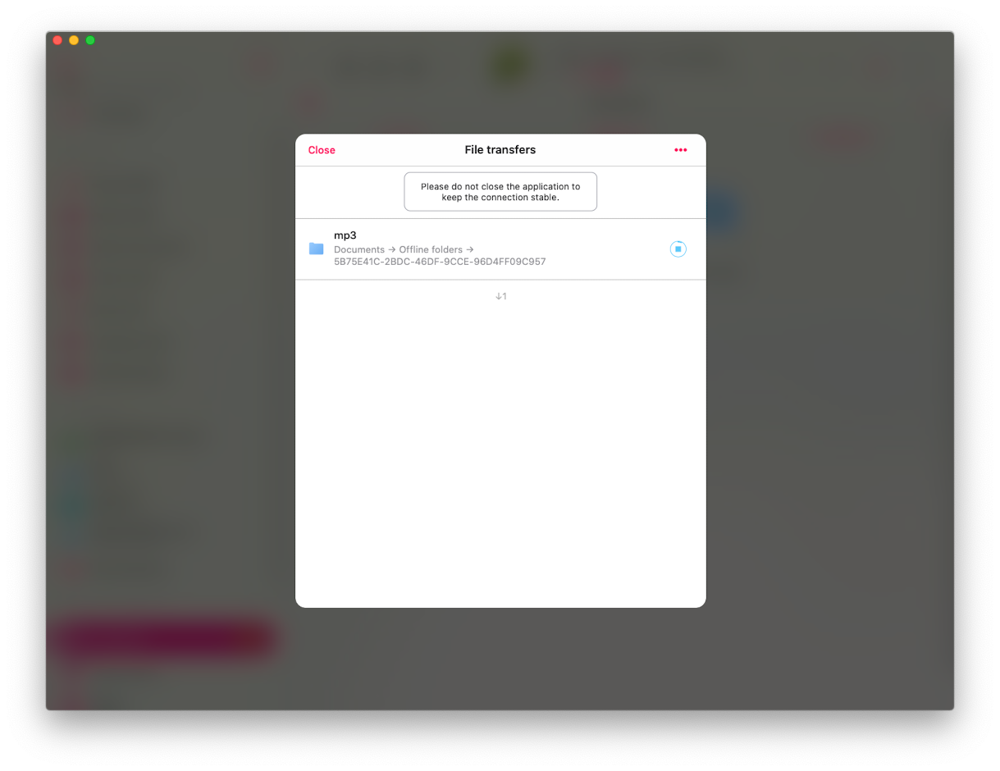

All downloaded files will appear in the **Local Files - Offline Folders** section. When you make changes to the online folder on the cloud server (such as adding, removing, or updating files), the app will check for updates and synchronize the local copy of this folder on your device.

Now, let's go back to the **Music Library settings** and open the **Offline Music Synchronization** screen.

In the **Synchronized Offline Folders section**, you can:

- Manually start offline folder synchronization
- Show the offline folder in its enclosing folder
- Disable offline mode for this folder (which will remove all local copies of the files from your device)

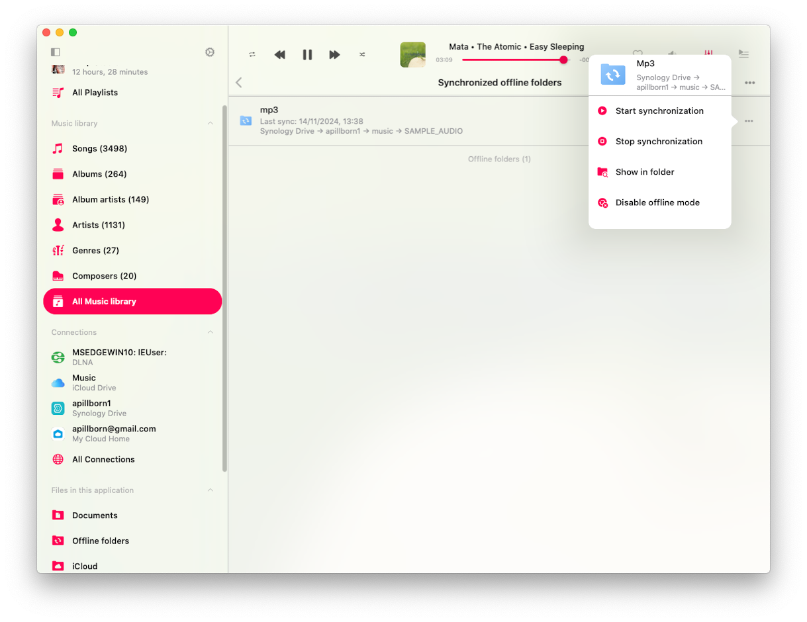

**Time Interval:** You can set the time interval for how often the app should check offline folders for modifications.

**Start Local Folders Scanning:** This option scans all local folders located in the application’s Documents directory to find supported audio files. All these local files are seamlessly added to your music library. Note that local files stored outside this application must be added to the music library manually, as iOS/macOS security restrictions prevent the app from accessing files outside the application’s Documents directory.

**Important:** It is advisable to periodically initiate offline music synchronization to keep your music library updated with your local files.

That's all for today! We hope this guide helps you configure synchronization between your cloud server and device.