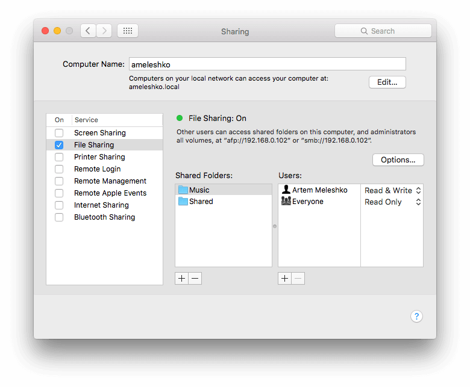
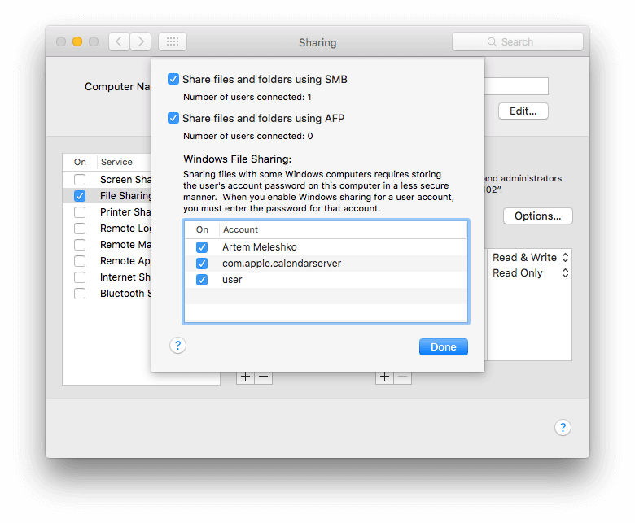
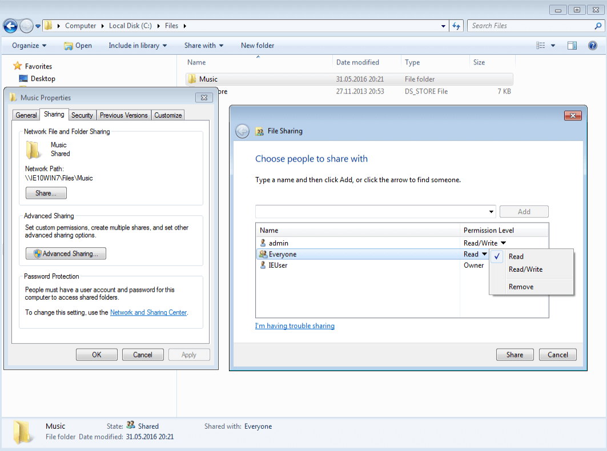

Do you have an extensive collection of large files on your MAC or PC and wish to access them effortlessly from your iPhone or iPad? Our apps provide a simple solution.

Follow these steps to enable seamless access between your computer and iOS device using the SMB protocol:

## Step 1: Enable SMB Protocol on Your Computer

**For MAC:**

1. Open "System Preferences" on your MAC.
2. Click on "Sharing."
3. Enable the "File Sharing" service.
4. Add your music folder to the "Shared Folders" section. Add a user and choose the permission level (Read & Write or Read Only). You can opt for "Everyone: Read Only" for the added music folder.

   

5. Remember the computer URL (smb://192.168.xx.xx), as you will use it in the next steps.
6. Click on "Options" and activate "Share files and folders using SMB."

   

7. Enable "Windows File Sharing" for available accounts.

   

**For Windows PC:**

1. Right-click on your music folder.
2. Select "Properties."
3. Navigate to the "Sharing" tab.
4. Click on "Share..."
5. Choose the individuals with whom you want to share the folder and specify the permission level. You can select "Everyone:Read" for the chosen music folder.

   

6. Click "Done."
7. Click "Done" in the "File Sharing" window, and remember the folder path.

   

## Step 2: Connect Your iOS Device

1. Open the app on your iPhone or iPad.
2. Go to the "Connections" Tab.

   

*If Your Computer Appears in "Available Devices" Section:*

If your computer is visible in the "Available devices" section and you selected "Anyone:Read Only" in the previous step, simply tap on your computer, and it will connect automatically.

*If Your Computer Doesn't Appear Automatically:*

1. Tap "Connect a cloud service."
2. Select "SMB" in the "Connect a cloud service" screen.

   


3. In the "SMB Connect" screen, enter the server URL with the shared folder path. You may use the server name or server IP:

   ```
   smb://ameleshko.local/Music/ 
   smb://192.168.0.102/Music/ 
   smb://192.168.0.102/
   ```

4. Enter your Login and Password or leave these fields blank if you selected "Anyone:Read Only" in the previous step.
5. The "WORKGROUP" field is optional and should be used if you have an Active Directory Domain.

  

6. Once you've connected your computer using the SMB protocol, it will appear in the "Cloud services" section of the "Connections" screen.
7. Open the connected service and navigate to the desired folder.

  

8. You can utilize the built-in file manager to edit your files as needed.

  

## Step 3: SMB2 Folders with Special Characters Workaround

Sometimes you may encounter issues with folders containing special characters when using the SMB2 protocol. Here are some steps you can take to resolve this issue:

1. **Enable SMB 1:**  
   • As a temporary solution, try enabling SMB 1 on your server and in the app settings. This can help bypass the issues related to special characters in folder names.

2. **Use System File Open Menu:**  
   • Navigate to “Local files”.  
   • Scroll down to the “Files on this device” section.  
   • Tap “Open files…” or “Open folders…”.  
   • Locate your server and select the files or folders you need.  
   • Tap “Open” to confirm your selection.

3. **Alternative Protocols:**  
   • If the problem persists, consider connecting to your NAS using WebDAV or DLNA protocols if your NAS supports these options. These protocols might handle special characters more gracefully.

By following these steps, you can mitigate the issues with special characters in folder names when using the SMB2 protocol.

## Conclusion

With these steps, you can effortlessly access your vast collection of files from your MAC or PC on your iPhone or iPad using our apps.